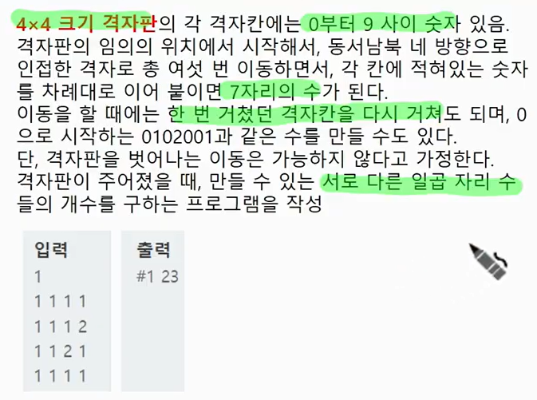
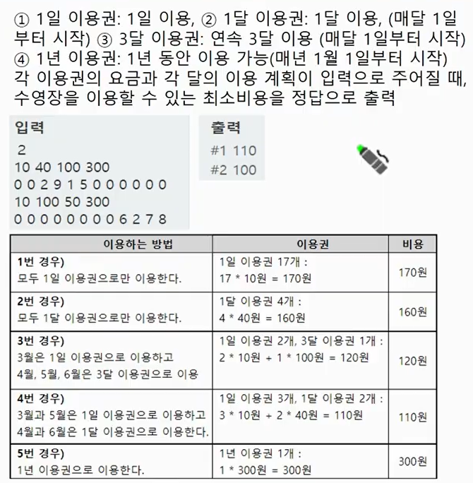
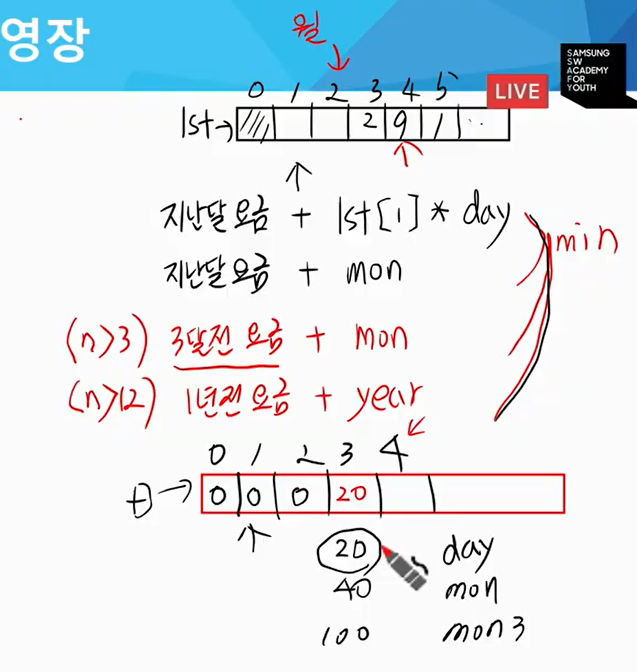
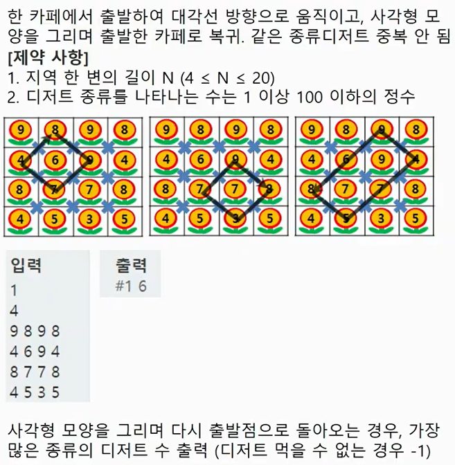
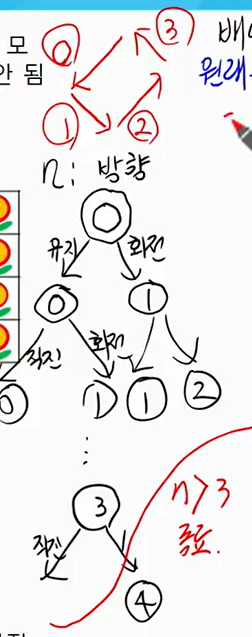
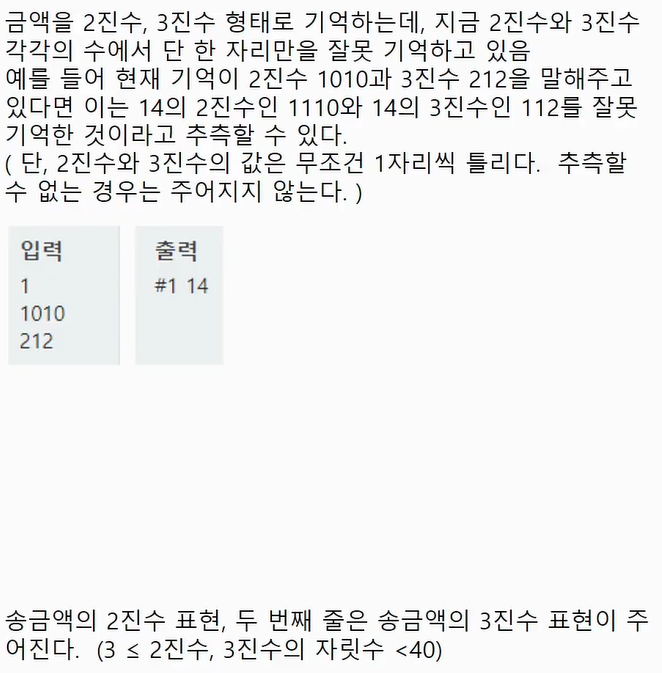
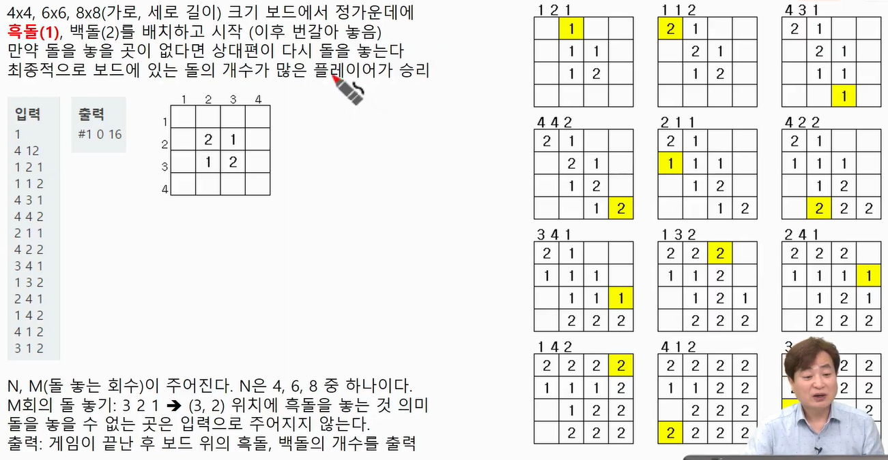
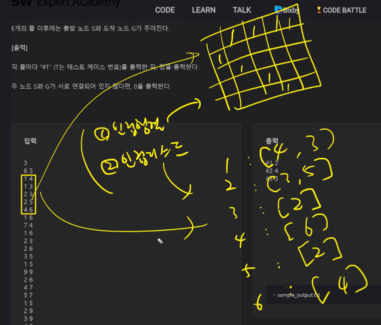

# DFS / 백트래킹 템플릿

[TOC]

## :zero: DFS 기본구조

* DFS: 가능한 모든 경우를 처리해서 답을 찾는 문제

  * 가능한 모든 경우를 표현하는 효율적인 방법: Tree(상태공간 트리 설계)
  * 무조건 정답을 구할 수 있으나, 시간 내에 가능한지 사전검토
  * 복잡도를 판단하여, 이진 트리 형태의 상태 공간 트리로 설계
    * 해당 선택이 가능한지 visited[]/조건문/함수구현을 통해 판단하는 경우도 있음
  * 가능한 모든 경우를 설계하여 정답 도출 후, 가지치기를 고려한다.
  * DFS로 접근하면 안되는 경우: n의 크기가 클 경우

  

* N개의 숫자를 원소로 가진 집합 A의 부분 집합 중, 원소의 합이 K인 부분집합의 개수 출력(없는 경우 0을 출력). N=4, 원소는 {1, 4, 3, 2}이고, K=5인 경우 :arrow_right: 2가지 존재

```python
def DFS(n, 설계하면서 필요인자 추가):
    # 가지치기 선택 (마지막에 고려)
    # 1. 종료조건(기본적으로 n관련)
    if n >= N:
        # 2. 정답 처리
        return
    # 3. 하부함수 호출
    DFS(n+1, ...)
    DFS(n+1, ...)
```


## :one: 2819. 격자판의 숫자 이어 붙이기

### 1. 문제




### 2. 설계

* 격제 전체를 순회하면서 시작지점을 기준으로 가능한 모든 방향으로 6번 이동(7자리 숫자)

* 중복을 제거하기 위해서는 set를 사용

* n이 6보다 클 때, n == 7일 때 종료

* **PSEUDO CODE**

  ```python
  def DFS(n, ci, cj, num):
      # 1. 종료조건
      if n == 7:
          sset.add(num)
          return
      # 2. 함수호출(4방향)
      	DFS(n+1, num*10+arr[ni][nj]        
  ```

​	:question: `num*10+arr[ni][nj]` 에서 num*10 해주는 이유가 뭐지?


### 3. 코드

```python
import sys
sys.stdin = open("input.txt", "r")


def DFS(n, ci, cj, num):
    # 종료조건
    if n == 7: 
        sset.add(num)
        return
    # 4방향호출 # 상하좌우
    for di, dj in ((-1,1),(1,0),(0,-1),(0,1)):
        # 다음 좌표 계산
        ni, nj = ci + di, cj + dj
        # 범위 설정
        if 0 <= ni < 4 and 0 <= nj < 4:
            DFS(n+1, ni, nj, num*10+arr[ni][nj])
        
        
    
T = int(input())
for tc in range(1, T+1):
    arr = [list(map(int, input().split())) for _ in range(4)]
    sset = set()
    
    for i in range(4):
        for j in range(4):
            DFS(0, i, j, 0)
    print(f'#{tc} {len(sset)}')
    
```

```
# 입력
1
1 1 1 1 
1 1 1 2
1 1 2 1 
1 1 1 1

# 출력
#1 23
```


## :two: 1952. 수영장 [모의역량테스트]

### 1. 문제




### 2. 설계

* 가능한 모든 경우를 헤아린다.

  * 1일권 x 30일(1월): 2월달거 결정해야 :arrow_right: 1일권, 1달권, 3달권, 1년권.....

  * 1달권: 1월 + 1 ... 2월달거 결정 :arrow_right: 1일권, 1달권, 3달권, 1년권.....
  * 3달권: 1월 + 3 ... 4월달거 결정 :arrow_right: 1일권, 1달권, 3달권, 1년권.....
  * 1년권: 1월 + 12 ... 내년 1월달거 결정 :arrow_right: 1일권, 1달권, 3달권, 1년권.....
  * 종료조건: n > 12 이면 종료

* lst는 n + 1의 길이로 생성한다. index 1 == 1월, index 2 == 2월, index 3 == 3월....  

* 어떤 파라미터가 필요한지 확인

  * 해당 달에 

* **PSEUDO CODE**

  ```python
  # n == 시작점
  # ssum == 가격의 합
  def DFS(n, ssum):
      # 1. 종료조건
      if n > 12:
          if ans > ssum:
              ans <- ssum
          return
      # 2. 함수호출(4개 이용권)
      	# (1) 일일권 # lst[n] == 날짜수 
      	DFS(n+1, ssum + lst[n]*day
          # (2) 한달권
          DFS(n+1, ssum + month)
          # (3) 분기권
          DFS(n+3, ssum + month*3)
          # (4) 연간권
          DFS(n+12, ssum + yaer)
  ```


### 3. 코드

```python
import sys
sys.stdin = open("input.txt", "r")

def DFS(n, ssum):
    global ans
    # 종료조건
    if n > 12:
        # 단, 종료하기 전에 정답보다 찾은 비용이 더 작다면, 정답을 갱신해준다
        if ans > ssum:
            ans = ssum
        return 
    # 일일권
    DFS(n+1, ssum+lst[n]*day)
    # 월권
    DFS(n+1, ssum+mon)
    # 분기권
    DFS(n+3, ssum+mon3)
    # 연간권
    DFS(n+12, ssum+year)

T = int(input())
for tc in range(1, T+1):
    day, mon, mon3, year = map(int, input().split())
    lst = [0] + list(map(int, input().split()))
    ans = 12345678 # 최솟값 찾는거니 가장 큰 값 써준다
    
    DFS(1, 0) # 제일 위의 노드(1월), 그 전에는 선택 안하니까(0)
    print(f'#{tc} {ans}')
```

```
# 입력
2
10 40 100 300
0 0 2 9 1 5 0 0 0 0 0 0
10 100 50 300
0 0 0 0 0 0 0 0 6 2 7 8 

#출력
#1 110
#2 100
```


### 4. 그리디적인 접근

* 설계

  

* 코드

  ```python
  import sys
  sys.stdin = open("input.txt", "r")
  
  T = int(input())
  for tc in range(1, T+1):
      day, mon, mon3, year = map(int, input().split())
      lst = [0] + list(map(int, input().split()))
      
      D = [0]*13
      for i in range(1, 13):
          mmin = D[i-1] + lst[i]*day
          mmin = min(mmin, D[i-1]+mon)
          if i >= 3:
              mmin = min(mmin, D[i-3] + mon3)
          if i >= 12:
              mmin = min(mmin, D[i-12] + year)
          D[i] = mmin
      print(f'#{tc} {D[12]}')
  ```

  


## :three: 2105. 디저트 카페 [모의역량테스트]

### 1. 문제



### 2. 설계

* 대각선 방향으로만 움직이고, 사각형 모양을 그리며 복귀, 중복 디저트 못 먹음

  * 사각형: 원래 위치에서부터(si, sj) 4 방향. 배열을 순회하면서 사각형 모향으로 중복X
  * 종료조건: n > 3이면 종료

* 가능한 모든 경우를 트리로 만듦

  

  * n: 방향(유지 혹은 회전 중에 선택 가능)
    * 유지 :arrow_right: 직진 or 회전...
    * 회전 :arrow_right: 직진 or 회전...
  * 

* **PSEUDO CODE**

  ```python
  # 배열 순회, 사각형, 중복 X
  # 원래위치 복귀(si, sj)
  # 정답처리 => n == 3, 시작지점 복귀
  
  # n = 방향, ci cj = 현재지점, v = 중복방문방지를 위한 visited, cnt = 몇 개의 디저트 먹었는지
  def DFS(n, ci, cj, v, cnt):
      # 1. 종료조건
      if n > 3:
          # 1-2. 정답처리 (si = 시작좌표)
          if n == 3 and ci == si and cj == sj and ans < cnt:
              ans <- cnt # 조건 만족시 정답 갱신
          # n을 유지하면서 직진 or 방향 전환
          for k (n, n + 2)
          	ni, nj #다음좌표계산
              # 함수호출
              DFS(k, ni, nj, v+[arr[ni][nj]], cnt+1)
  ```


### 3. 코드

```python
import sys
sys.stdin = open("input.txt", "r")

def DFS(n, ci, cj, v, cnt):
    global si, sj, ans 
    if n > 3: # 종료조건
        return
    if n == 3 and ci == si and cj == sj and ans < cnt: # 정답갱신
        ans = cnt
        return
    
    # 현재 방향 n부터 n+1까지
    for k in range(n, n+2):
        ni, nj = ci+di[k], cj+dj[k]
        if 0 <= ni < N and 0 <= nj < N and arr[ni][nj] not in v:
            DFS(k, ni, nj, v+arr[ni][nj], cnt+1)
        
# 다음 좌표 찾기 위해 방향 설정해준다
# 2는 아무런 의미 없음(0을 넣든.. 3을넣든..) - IndexError 막기위해서 dummy 값을 주는 것
di, dj = (1, 1, -1, -1, 2),(-1, 1, 1, -1, 2)    

T = int(input())
for tc in rage(1, T+1):
    N = int(input())
    arr = [list(map(int, input().split())) for _ in range(N)]
    ans = -1 # 하나도 못 먹는 경우, 즉 cnt = 0 이면 -1을 출력해야 하므로 미리 설정
    
    # N*N 배열을 순회
    for si in range(N):
        for sj in range(N):
            # 0 = 최초 방향, (i, j) = 최초 시작점, [] = 아직 방문 안 함, 0 = 아직 아무것도 못 먹음
            DFS(0, si, sj, [], 0)
    print(f'#{tc} {ans}')
            
```

```
# 입력
1
4
9 8 9 8
4 6 9 4
8 7 7 8
4 5 3 5

# 출력
#1 6
```


### 4. 코드 refactoring: 가지치기(가장 마지막에 개선)

```python
import sys
sys.stdin = open("input.txt", "r")

def DFS(n, ci, cj, v, cnt):
    global si, sj, ans 
    
    ##########################################################
    ####################### REFACTORING ######################
    ##########################################################
    # 만약 방향이 2로 시작하는 경우, 여태까지의 솔루션보다 같거나 작으면 갱신을 못한다. 가지치기
    if n == 2 and ans >= cnt*2:
    	return
    
    if n > 3: # 종료조건
        return
    
    ##########################################################
    ####################### REFACTORING ######################
    ##########################################################
    # 최대한 필터링이 많이 되는 조건을 첫번째에 놓는다.
    if ci == si and n == 3 and cj == sj and ans < cnt: # 정답갱신
        ans = cnt
        return
    
    ##########################################################
    ####################### REFACTORING ######################
    ##########################################################
    # 현재 방향 n부터 n+1까지
    for k in range(n, n+2):
        ni, nj = ci+di[k], cj+dj[k]
        if 0 <= ni < N and 0 <= nj < N and arr[ni][nj] not in v:
            v.append(arr[ni][nj])
            DFS(k, ni, nj, v, cnt+1)
        	v.pop()
            
# 다음 좌표 찾기 위해 방향 설정해준다
# 2는 아무런 의미 없음(0을 넣든.. 3을넣든..) - IndexError 막기위해서 dummy 값을 주는 것
di, dj = (1, 1, -1, -1, 2),(-1, 1, 1, -1, 2)    

T = int(input())
for tc in rage(1, T+1):
    N = int(input())
    arr = [list(map(int, input().split())) for _ in range(N)]
    ans = -1 # 하나도 못 먹는 경우, 즉 cnt = 0 이면 -1을 출력해야 하므로 미리 설정
    
    ##########################################################
    ####################### REFACTORING ######################
    ##########################################################
    # N*N 배열을 순회... 필요한 범위만 돌아보자
    for si in range(0, N-2):
        for sj in range(1, N-1):
            # 0 = 최초 방향, (i, j) = 최초 시작점, [] = 아직 방문 안 함, 0 = 아직 아무것도 못 먹음
            DFS(0, si, sj, [], 0)
    print(f'#{tc} {ans}')
            
```


## :four: 4366. 정식이의 은행업무

### 1. 문제



### 2. 설계

* 2진수와 3진수 입력을 받음
  * 2진수를 한 자리씩 바꿔가면서 3진수와 비교 -> 10진 -> 3진
  * lst3과 비교해서 1자리가 다르다면 정답
* 2진수 10진수로
  * 1010인 경우, `num*2+새로운값`
* 3진수
  * 3으로 %를 구해서 나머지 구해서 3으로 나눈다

* **PSEUDO CODE**

  ```python
  for i (len(lst2)):
  	lst[i] = (lst[i]+1) % 2
      	10진수 => 3진수
          
  
  def DFS(n, num):
      # 1. 종료조건
      if n == 7:
          sset.add(num)
          return
      # 2. 함수호출(4방향)
      	DFS(n+1, num*10+arr[ni][nj]        
  ```


### 3. 코드

```python
import sys
sys.stdin = open("input.txt", "r")

def solve(lst3):
    # 1. 2진수 입력을 하나씩 바꾸면서 10진수로 만들어보자(1비트 값만 바꿔서)
    for i in range(len(lst2)): # 2 진수의 길이만큼 돌려준다
        lst2[i] = (lst2[i]+1)%2 # 1 비트 값을 바꾼다 # 원상복구

        # 10진수로 변환 # decimal
        dec = 0
        for idx in range(len(lst2)):
            dec = dec*2 + lst2[idx]
            
        # 3진수로 변환
        s = []
        ret = dec
        while dec > 0:
            s.append(dec % 3) # 낮은 자리부터 비교해야하니까, 낮은자리부터가 앞에 오도록 append
            dec //= 3
        lst3 = lst3[::-1] # 0의 자리부터 뒤집혀 있는 형태로 준비(낮은 자리부터 비교)
        
        cnt = 0
        # 둘 중에 짧은것 까지 보는 것 # 한쪽이 길고 한쪽이 짧으면 비교해아하는 값이 없을 수도 있으므로 Error
        for idx in range(min(len(s), len(lst3))): 
            # 서로 다르다면 cnt에 1을 증가시켜준다
            if s[idx] != lst3[idx]:
                cnt += 1
        # 진법이 달라진다면 길이가 달라질수도 있음
        # count에다가 둘의 길의 차이도 더해준다
        cnt += abs(len(s) - len(lst3))
        
        if cnt == 1: # 만약 딱 1비트만 다르다면
            return ret
        
       	# 1비트 바뀐 2진수 원상복구
    	lst2[i] = (lst2[i]+1) % 2

T = int(input())
for tc in rage(1, T+1):
    lst1 = list(map(int, input().split())) # 2진수 입력
    lst3 = list(map(int, input().split())) # 3진수 입력
    ans = solve(lst3)
    print(f'#{tc} {ans}')
```

```
# 입력
1
1010
212

# 출력
#1 14
```


## :five: 4615. 재미있는 오셀로 게임

### 1. 문제



### 2. 설계

* 원하는 방향에 먼저 돌을 놓는다(input) :arrow_right: 그리고 8방향 확인(1~N 뻗어감)

* 범위 내 계속 돌리고

  * 만약 8방향 모두 0 이면 

* 범위 밖이면 break

* **PSEUDO CODE**

  ```python
  def DFS(n, num):
      # 1. 종료조건
      if n == 7:
          sset.add(num)
          return
      # 2. 함수호출(4방향)
      	DFS(n+1, num*10+arr[ni][nj]        
  ```


### 3. 코드

```python
import sys
sys.stdin = open("input.txt", "r")

T = int(input())
for tc in rage(1, T+1):
    arr = [list(map(int, input().split())) for _ in range(4)]
```

```
# 입력
1
4 12
1 2 1
1 1 2
4 3 1
4 4 2
2 1 1 
4 2 2 
3 4 1 
1 3 2 
2 4 1 
1 4 2 
4 1 2
3 1 2

# 출력
#1 0 16
```


## :six: 2382. 미생물 격리 [모의역량테스트]

### 1. 문제


### 2. 설계

* 격제 전체를 순회하면서 시작지점을 기준으로 가능한 모든 방향으로 6번 이동(7자리 숫자)

* 중복을 제거하기 위해서는 set를 사용

* n이 6보다 클 때, n == 7일 때 종료

* **PSEUDO CODE**

  ```python
  def DFS(n, num):
      # 1. 종료조건
      if n == 7:
          sset.add(num)
          return
      # 2. 함수호출(4방향)
      	DFS(n+1, num*10+arr[ni][nj]        
  ```


### 3. 코드

```python
import sys
sys.stdin = open("input.txt", "r")

T = int(input())
for tc in rage(1, T+1):
    arr = [list(map(int, input().split())) for _ in range(4)]
```

```
# 입력

# 출력
```


## :seven: 2117. 홈 방범 서비스 [모의역량테스트]

### 1. 문제


### 2. 설계

* 격제 전체를 순회하면서 시작지점을 기준으로 가능한 모든 방향으로 6번 이동(7자리 숫자)

* 중복을 제거하기 위해서는 set를 사용

* n이 6보다 클 때, n == 7일 때 종료

* **PSEUDO CODE**

  ```python
  def DFS(n, num):
      # 1. 종료조건
      if n == 7:
          sset.add(num)
          return
      # 2. 함수호출(4방향)
      	DFS(n+1, num*10+arr[ni][nj]        
  ```


### 3. 코드

```python
import sys
sys.stdin = open("input.txt", "r")

T = int(input())
for tc in rage(1, T+1):
    arr = [list(map(int, input().split())) for _ in range(4)]
```

```
# 입력

# 출력
```


빅오계산하는거 잘 보면 된다.

탐색 나오고 

배열 잘 쓸 수 있니


APS기본 ~ APS응용


# 노드의 거리




* 인접 행렬
* 인접 리스트
* 만약 행렬로 했는데, 메모리가 터진다면 리스트로 바꿔준다.