# Algorithm Start

[TOC]


## :one: SW 문제 해결


## :two: :star: 복잡도 분석

### 1. 

### 2.

### Big-Oh 표기

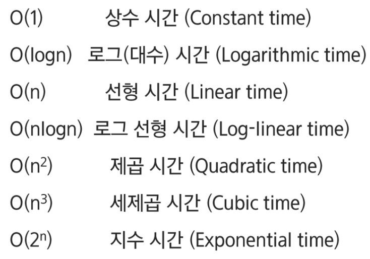

* 복잡도의 점근적 상한을 나타냄

### Big-Omega 표기


* 복잡도의 점근적 하한을 나타냄
* 최소 이만한 시간은 걸린다


## :three: 표준 입출력 방법

### 1. Python3 표준입출력

#### 1) 입력

* Raw 값의 입력: input()
  * 문자열로 취급
* Evaluated 값 입력: eval(input())
  * 데이터 형으로 취급(잘 안씀: :x:)


#### 2) 출력

* print()
  * 표준. 개행 문자 출력
* print('text', end='')
  * 마지막에 개행문자 제외
* print('%d' % number)
  * formatting된 출력
* print(f'{a:.3f}')
  * formatting된 출력


#### 3) 파일의 내용을 표준 입력으로 읽어오는 방법

```python
import sys
sys.stdin = open('input.txt', 'r')
sys.stout = open('output.txt', 'w')

text = input()
print(text)
```

`sys.stdout = open('output.txt', 'w')`


## :four: 비트연산

### 1. 비트 연산자

*  `&`: and

  * 비트 검사
  * 비트 클리어: 특정 비트를 0으로 만든다

*  `|`: or

  * 비트 셋: 특정 비트를 1로 만든다

* `^`: xor

  * 특정 비트가 같은지 검사

  * 비트 토글: 같으면 0 다르면 1

    ```python
    # 00010101을 반전시키고 싶다면
    if a = 0:
        a = 1
    else:
        a = 0
    ```

    ```python
    a ^= 1
    ```

* `~`: not

  * 비트 반전 

* `<<`: shift

  * 왼쪽으로 이동

    * 특정 비트가 1인 값

    * 예) 3번 비트가 1인 값 만들기 -> 만들고 싶다면 

      ```python
      a |= 1<<3
      ```

    * 1번, 4번, 5번 비트가 1인 값

      ```python
      a |= 1<<1|1<<4|1<<5
      ```

    * a의 3번 비트를 클리어 하고 싶다면

    

    

    ```python
    ```

    

* `>>` : shift

  * 오른쪽으로 이동

### 2.

### 3.


## :five: 진수 

### 1. 진수

* 2진수
* 8진수
* 10진수
* 16진수


### 2. 자릿값

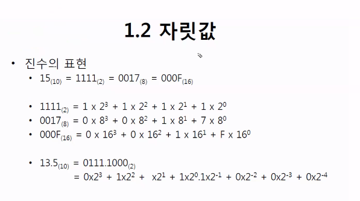

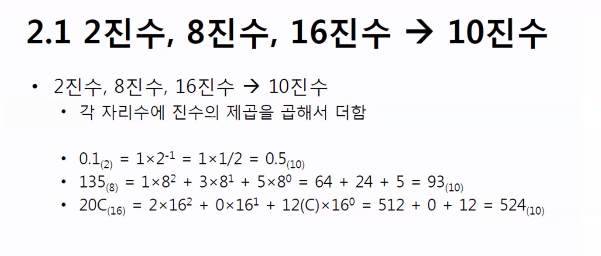

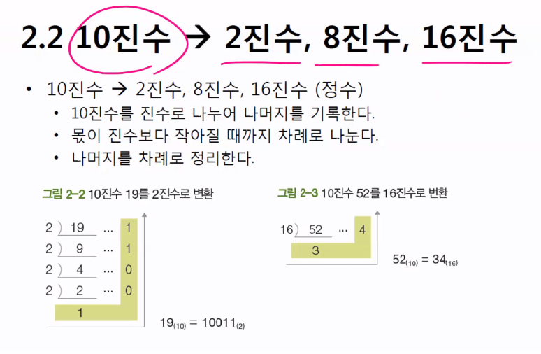

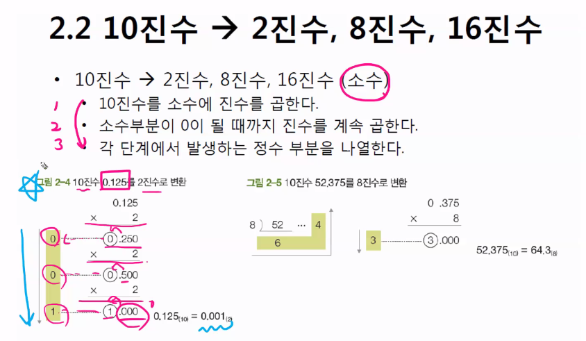

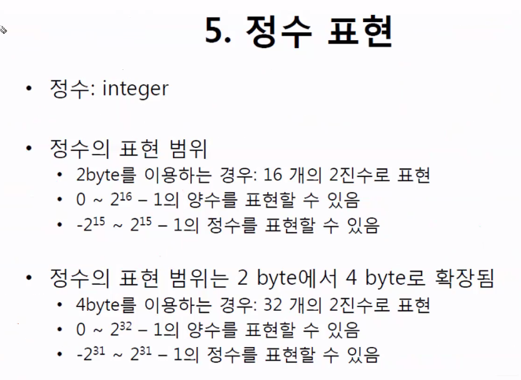

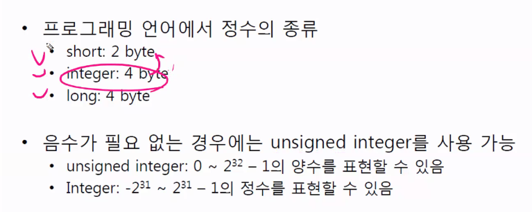

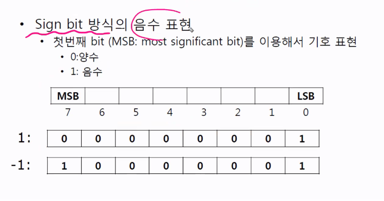

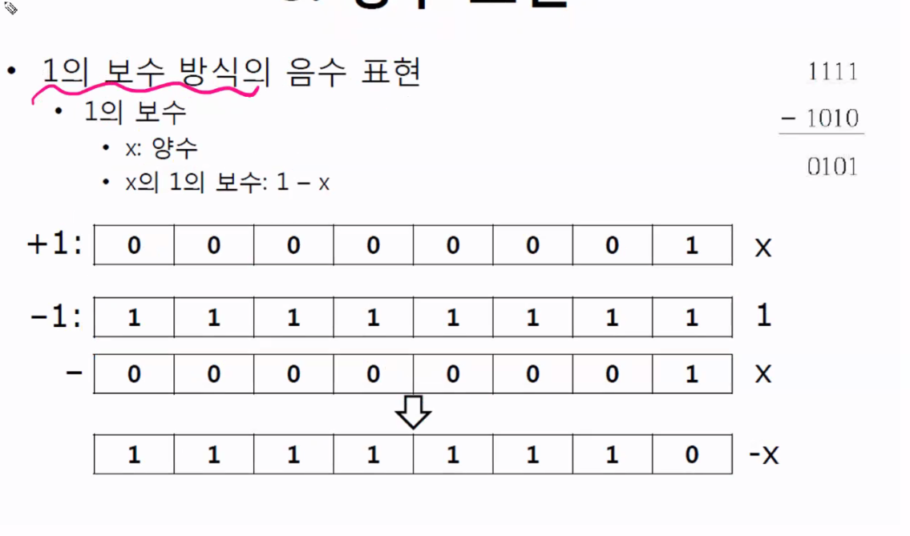

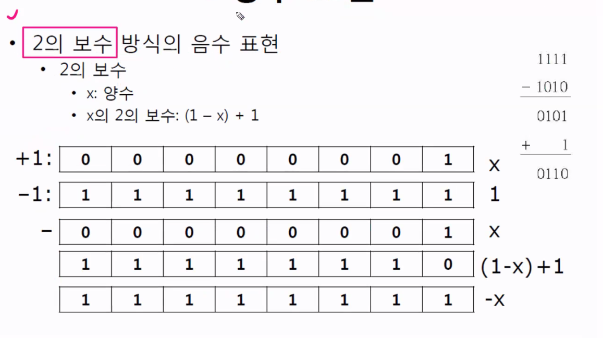

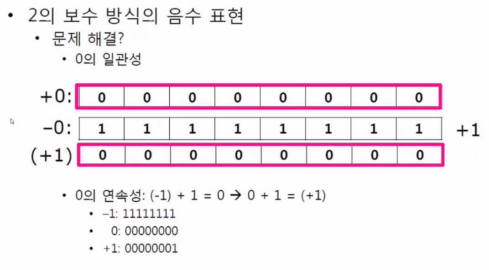


## :six: 실수

### 1. 부동소수점 표현(floating point)

* 소수점의 위치가 변함

* 부호, 지수, 가수로 구성됨

* 反) 고정소수점(fixed point)

  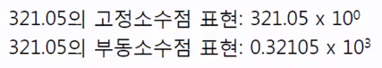


### 2. 부동소수점의 구조

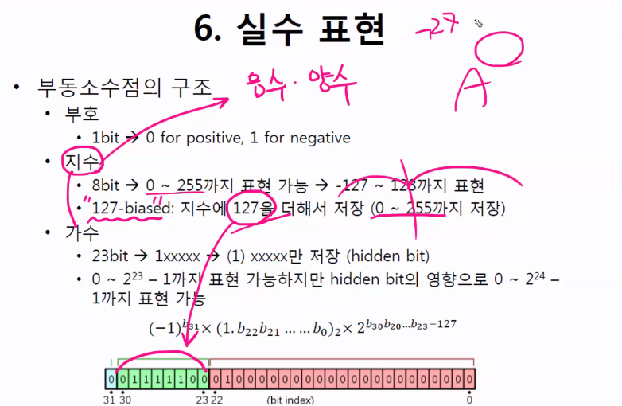


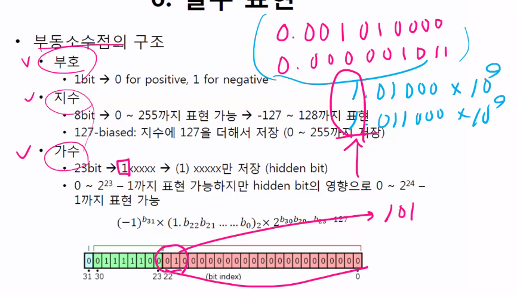


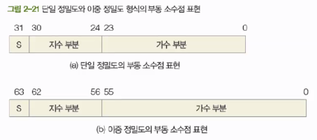

* 부호, 지수, 가수로 구성됨

* s x m x r^e (s:부호, m:가수, r:밑, e:지수)

  

* 단일 정밀도(single precision): 4 byte 표현

  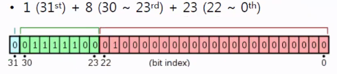

* 이중 정밀도(double precision): 8 byte 표현

  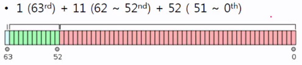


* 부동소수점의 변환 과정

  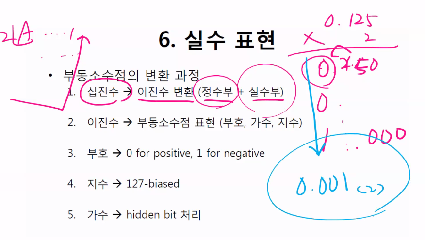

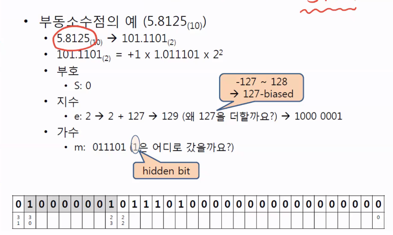


## :seven: 정보의 표현

* 디지털 컴퓨터는 2진법을 사용

* 컴퓨터에서 정보를 처리하는 단위

  * bit
    * 이진수(0, 1)
    * N비트로 표현할 수 있는 정보는 2^N개
  * byte (=8bit)
    * 문자를 나타내는 최소 단위로 영문자나 숫자
  * word

* 컴퓨터에서 정보를 표현하는 방식

  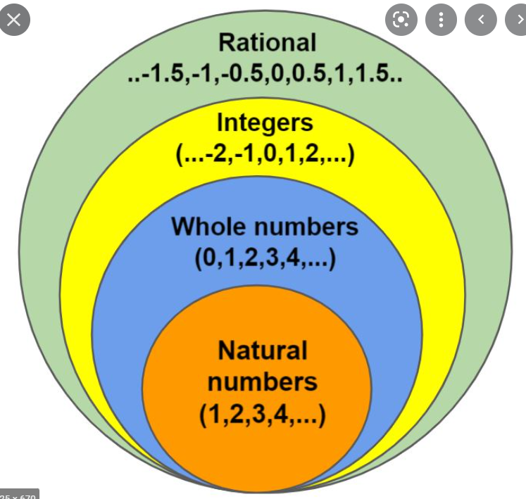

  * 문자(string)
  * 정수(integer)
  * 실수(rational number)

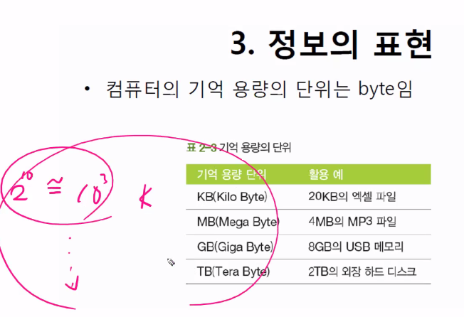

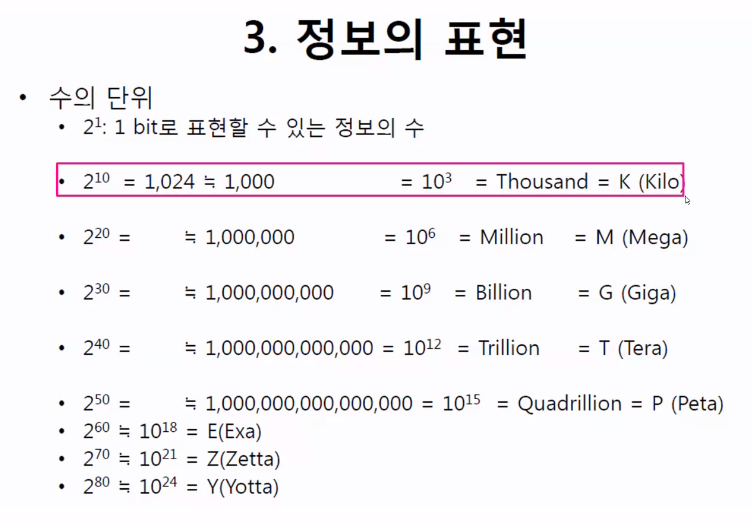


## :eight: HWS

```python
import sys

sys.stdin = open('input.txt')

# 0 ~ 9까지의 수와 대응하는 이진 코드
P = {
    '0001101': 0,
    '0011001': 1,
    '0010011': 2,
    '0111101': 3,
    '0100011': 4,
    '0110001': 5,
    '0101111': 6,
    '0111011': 7,
    '0110111': 8,
    '0001011': 9,
}

T = int(input())

for tc in range(1, T + 1):
    n, m = map(int, input().split())
    arr = [list(map(int, input())) for _ in range(n)]
    my_code = []
    # print(arr)
    # 한 행의 끝에서 부터 1이 있는지 찾기!
    for i in range(n):
        for j in range(m - 1, -1, -1):
            if arr[i][j] == 1:  # 너 1이야?
                for k in range(j, j - 56, -7):  # 그럼 뒤에서부터 7개씩 끊어서 넣어!
                    # '000100'이런식으로 넣어줘야 하니까 str로 변환하고 숫자 붙여주기
                    my_code.insert(0, ''.join(map(str, arr[i][k - 6: k + 1])))
                break  # 넣어줬으니까 멈춰!
            else:  # 그게 아니라면
                continue  # 그냥 넘어가~

        if my_code:  # 코드가 들어가 있으면(어차피 똑같은 암호들이 반복하니까)
            break  # 멈춰!
    # print(my_code)

    # 딕셔너리 값으로 치환해주기
    for i in range(len(my_code)):
        my_code[i] = P[my_code[i]]  # 딕셔너리는 key로 접근해

    # 검증코드 계산해주기
    confirm_code = 0
    for i in range(1, len(my_code) + 1):
        if i % 2:  # 2로 나눴을 때 나머지가 있다면 -> 홀수
            confirm_code += my_code[i - 1] * 3
        else:
            confirm_code += my_code[i - 1]

    # 정상코드/비정상코드 확인하기
    if confirm_code % 10: # 10의 배수가 아니라면
        print(f'#{tc} {0}')
    else:
        print(f'#{tc} {sum(my_code)}')
```

```python
import sys


sys.stdin = open('input.txt')

# 0 ~ 9까지의 수와 대응하는 이진 코드
P = {
    '0001101': 0,
    '0011001': 1,
    '0010011': 2,
    '0111101': 3,
    '0100011': 4,
    '0110001': 5,
    '0101111': 6,
    '0111011': 7,
    '0110111': 8,
    '0001011': 9,
}

T = int(input())

for tc in range(1, T + 1):
    # N: 세로, M: 가로
    N, M = map(int, input().split())
    arr = [input() for _ in range(N)]

    def scanner():
        for i in range(N):
            # 끝에서부터(마지막은 1로 고정이니 M-1번부터) 0번째까지
            for j in range(M - 1, -1, -1):
                # 0이면 넘어가고
                if arr[i][j] == '0':
                    continue

                # 1이면 대응하는 숫자를 담을 리스트 준비
                pwd = []

                # 7개 영역에서
                for pos in range(j - 56 + 1, j, 7):
                    # i번 row의 pos~pos+7(-1) 범위의 col에 대응하는 이진코드를 찾아 대응하는 숫자를 넣자
                    pwd.append(P[arr[i][pos : pos + 7]])

                # 홀수 & 짝수 자리 합
                odd_digit_sum = pwd[0] + pwd[2] + pwd[4] + pwd[6]
                even_digit_sum = pwd[1] + pwd[3] + pwd[5] + pwd[7]

                """
                [검증 포인트]
                ((홀수 자리 합) * 3 + 짝수 자리 합) % 10 == 0 -> 10의 배수
                """
                if ((odd_digit_sum * 3 + even_digit_sum) % 10) == 0:
                    return odd_digit_sum + even_digit_sum
                # 검증코드가 틀린 경우 0 return
                else:
                    return 0

    result = scanner()
    print(f'#{tc} {result}')
```


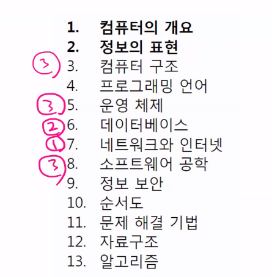

