[TOC]


# Django HTTP/MediaFiles

## :one: Handling HTTP requests

### 1. Django shortcuts functions

* `django.shortcuts` 패키지는 개발에 도움될 수 있는 여러 함수와 클래스 제공

  `views.py`

  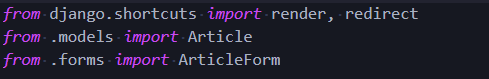

* shortcuts function 종류

  * **render()**

    * render가 없었다면,

      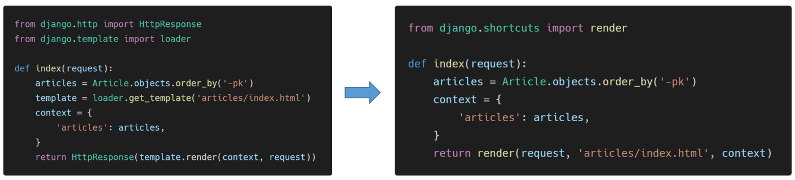

  * **redirect()**

  * **get_object_or_404()**

  * **get_list_or_404()**

    * API로서 서버를 쓸 때 사용
    * object는 단위 형태, list는 복수 형태(queryset 형태)
    * 현재 pjt와는 적합하지 않음 - 제일 처음 아무것도 작성되지 않은 빈 페이지 일 때도 404 에러를 반환하게 되므로
    * ex) 영화 페이지가 아닌, 영화 '목록'이 없을 때 사용


### 2. get_object_or_404()

* 모델 manager인 objects에서 get()을 호출하지만, 해당 객체가 없을 경우, DoesNotExist 예외(즉 500) 대신 Http 404를 raise

* get()의 경우, 조건에 맞는 데이터가 없을 경우에 예외를 발생시킴

  * 코드 실행 단계에서 발생한 예외 및 에러에 대해서 브라우저는 http status code 500으로 인식

    * 참고: [http status code](https://developer.mozilla.org/en-US/docs/Web/HTTP/Status)

      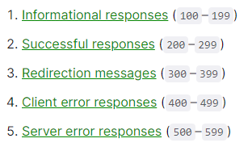

      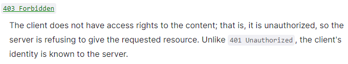

      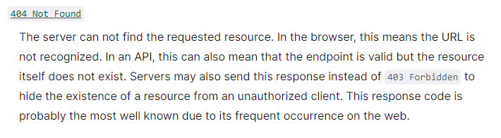

      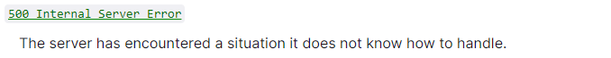

      * 500 에러 메시지를 받으면 뭐가 잘못된 건지 정확히 유추하기가 어렵다
      * get을 통해 특정 데이터를 조회하려고 하는데 없을 때는 404가 뜨는게 맞음

* **상황에 따라 적절한 예외처리**를 하고, 클라이언트에게 **올바른 에러 상황을 전달**하는 것 또한 개발의 중요한 요소 중 하나

* 만약 내가 만든 웹에서 내가 아직 작성하지 않은 100번째 게시물을 조회하고자하면

  * DoesNotExit at /articles/100/ 에러 메시지가 뜸

    

    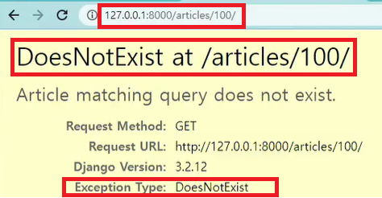

  * 이는 get을 통해 100을 조회하려고 하지만, 100을 *찾지 못한 것*이므로 404 not found가 뜨는 것이 맞음

  * 장고는 코드가 실행되는 중간에 이러한 error을 발견하는 것이므로, 500으로 판단하게 되는데

    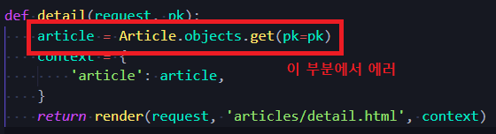

  * 이를 고쳐주는 것이 `get_object_or_404()` 

    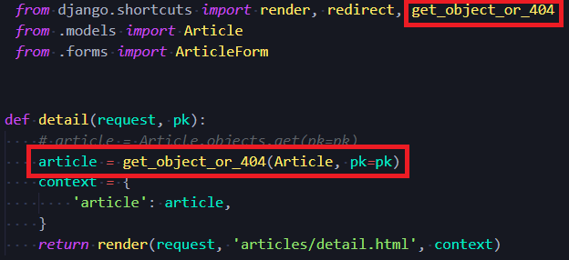

    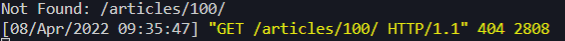

    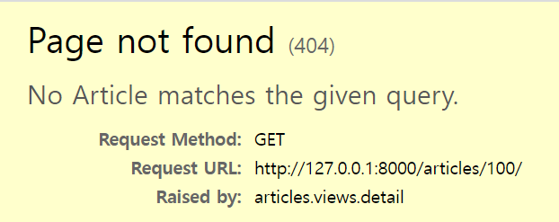

    * 고쳐준다면, client에게 정확한 에러 이유를 전달해 줄 수 있게 된다
    * `detail`, `update`, `delete` 함수들에 각각 추가(:question: GET method 쓰는 애들?)

* [참고]만약 get_object_or_404()를 사용하지 않으려고 한다면 예외처리 해주면 같은 결과를 낼 수 있다

  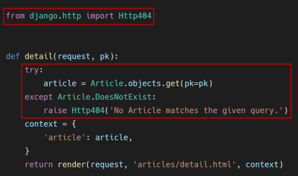

  

  


 

### 2. Django View decorators 

#### 1) 개념

* django는 다양한 HTTP 기능들을 지원하기 위해 view 함수에 적용할 수 있는 decorator를 제공

* 데코레이터

  * 어떤 함수에 기능을 추가하고 싶을 때, 해당 함수를 수정하지 않고 기능을 연장해주는 함수

  * 즉, 원본 함수를 수정하지 않으면서 추가 기능만을 구현할 때 사용

  * 참고: [python decorator]()

    

* Allowed HTTP methods

  * 요청 메서드에 따라 view 함수에 대한 액세스를 제한
  * 요청이 조건을 충족시키지 못하면 `HttpResponseNotAllowed`를 return(405 Method Not Allowed)
    * delete() 할 때, POST method를 활용 - 그런데 GET method를 사용해서 delete 요청을 보낸다면  HTTP status 405 error를 raise 해서 client에게 어떤 에러를 범했는지 알려줄 수 있음
    * 현재 pjt에서는 이미 if else구문으로 따로 처리를 해줬음(대신 사용자는 redirected 된 페이지만 볼 수 있을 뿐, 어떤 에러를 본인이 범했는지는 알 수 없음)
  * `require_http_methods()`, `require_POST()`, `require_safe()`, ~~require_GET()~~

#### 2) decorator 종류

* 참고: [View decorators](https://docs.djangoproject.com/en/4.0/topics/http/decorators/)

  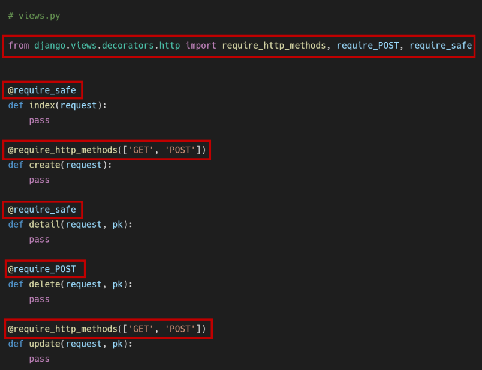

* **`require_http_methods()`**

  * 데코레이터 종류를 나열할 수 있음

  * view 함수가 특정한 method 요청에 대해서만 허용하도록 하는 데코레이터

    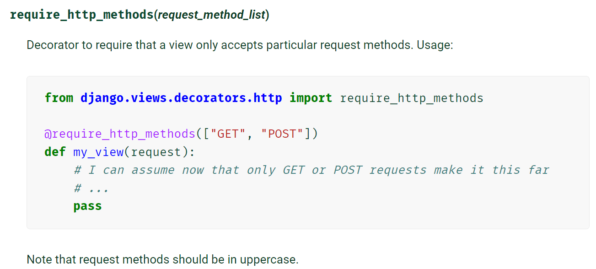

  * 달라지는 점

    * decorator에서 허용하는 메서드가 아닐 때 405 page raise
    * else문의 의미 달라짐

    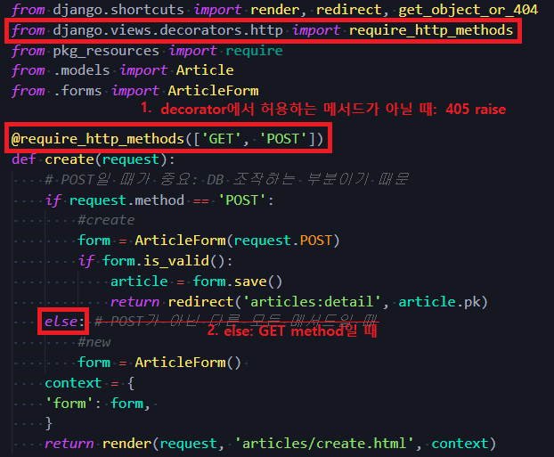

  * `update`, `create` 함수에 적용가능

* **`require_POST()`**

  * view 함수가 POST method 요청만 승인하도록 하는 데코레이터

  * `delete` 함수에 적용가능

    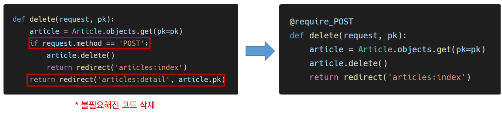

    * decorator를 통과했다면, POST라는 뜻일 것이므로 해당 if else 구문이 필요 없어진다

    * url로 delete 요청(즉, GET으로 요청)한다면 405 가 raise됨

      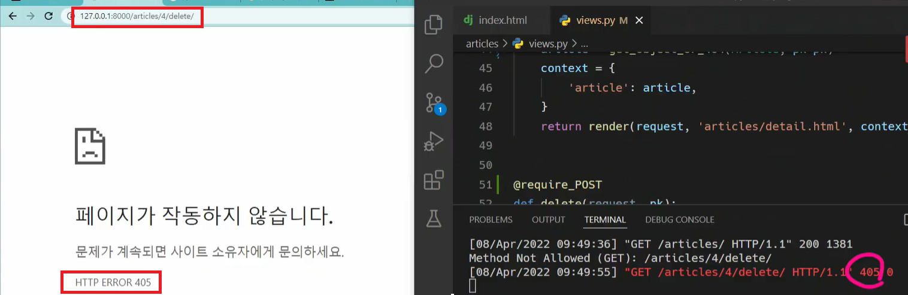

* **`require_safe()`**

  * view  함수가 GET 및 HEAD method만 허용하도록 요구하는 데코레이터

  * django는 require_GET 대신 require_safe를 사용하는 것을 권장 (이유는 별로 안중요)

  * GET만 허용해야 하는 view 함수에 쓸 수 있을 것(`index`, `detail`)

    * 만약 POST로 요청을 보낸다면(postman이라는 프로그램 사용 가능)

      * 네이버: *200 OK*

      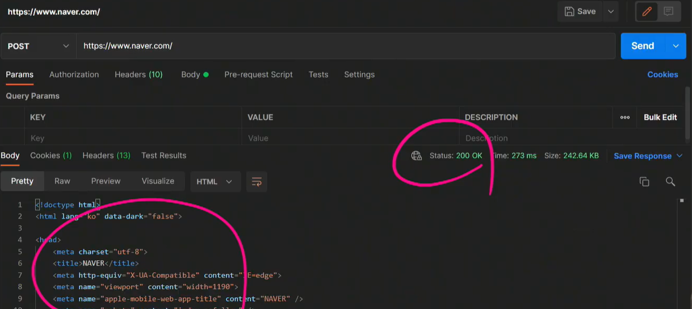

      * 구글: *405 Method Not Allowed*
        * *@require_GET*

      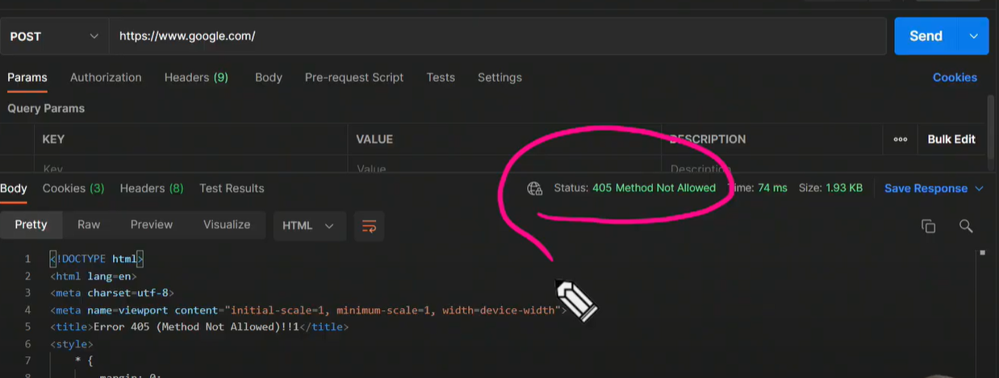

      * 현재 우리 pjt 웹사이트: *403 Forbidden*

        * *@require_safe*

        

  * `index`,`detail` 함수에 적용가능


## :two: Media files( 이미지 업로드)

### 1. Media file

* 미디어 파일
* 사용자가 웹에서 업로드하는 정적 파일(user-uploaded)
* 유조가 업로드한 모든 정적 파일


### 2. Model field

#### 1) `ImageField()` & `FileField()`

*  `ImageField()`

  * 이미지 업로드에 사용하는 모델 필드

  * `FileField`를 상속받는 서브 클래스이기 때문에  `FileField`의 모든 속성 및 메서드를 사용 가능하며, 더해서 사용자에 의해 업로드 된 객체가 유효한 이미지인지 검사함

  * `ImageField` 인스턴스는 최대 길이가 100자인 문자열로 DB에 생성되며, max_length 인자를 사용하여 최대 길이 변경이 가능

  * 주의: 사용하려면 반드시 Pillow 라이브러리가 필요
  * `upload_to='images/'`
    * 실제 이미지가 저장되는 경로를 지정
  * blank=True
    * 이미지 필드에 빈 값(빈 문자열)이 허용되도록 설정(이미지를 선택적으로 업로드 할 수 있도록
    * 이미지 파일을 업로드 하는 것이 필수가 아닌 경우가 많음

* `FileField()`

  * 파일 업로드에 사용하는 모델 필드

  * 2개의 선택 인자를 가지고 있음
    * `upload_to` : 저장되는경로를 작성
      * ~~`storage`~~

  

  

#### 2) Model field option

[참고] [Model Field Options](https://docs.djangoproject.com/en/4.0/ref/models/fields/)

* "blank"

  * 기본 값: False
  * True인 경우, 필드를 비워 둘 수 있음
    * DB에는 ''(빈 문자열이 적용됨)
  * 유효성 검사에 사용됨(`is_valid`)
    * 모델 필드에는 blank=True를 작성하면 form 유효성 검사에서 빈 값을 입력할 수 있음

* "null"

  * 기본 값: False

    * python에서도 '' != None ( 빈 값과 값이 없음은 다른 것 )

  * True인 경우, django는 **빈 값**에 대해 DB에 **NULL**로 저장

  * 주의사항

    * `CharField`, `TextField`와 같은 **문자열 기반 필드에는 사용하는 것을 피해야 함**

      * 주의: `ImageField`도 문자열 기반 필드임

    * 문자열 기반 필드에 True로 설정 시, '데이터 없음(no data)'에 "빈 문자열(1)"과 "NULL(2)"의 2가지 가능한 값이 있음을 의미하게 됨

    * 대부분의 경우, "데이터 없음"에 대해 두 개의 가능한 값을 갖는 것은 중복되는 것이며, Django는 **NULL이 아닌 빈 문자열을 사용하는 것이 규칙**

    * 따라서, 문자열 기반 필드가 아닌 필드에서만 사용하는 것이 바람직하다

      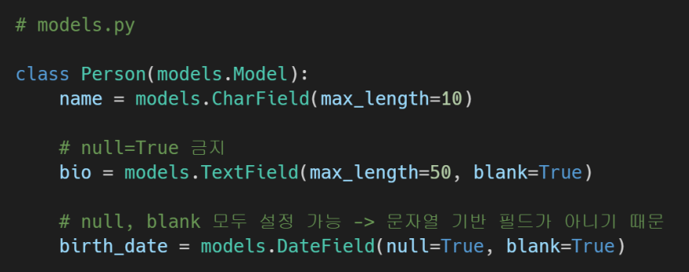

      * 예를 들어, `DateField`에 Data가 없다는 것은 NULL만 의미하기 때문
      * `TextField`의 경우, Data가 없다는 것이 의미하는 것이 1. '' (빈 문자열), 2. NULL 두 가지가 됨 

* blank & null 비교

  * blank
    * 동작위치: Validation-related(유효성검사 레벨에서 사용)
  * null
    * 동작위치: Database-related(DB 레벨에서 사용)
  * :question: 문자열 기반 및 비문자열 기반 필드 모두에 대해 null option은 DB에만 영향을 미치므로, form에서 빈 값을 허용하려면 blank=True를 설정해야 함
    * :question:NULL=True를 했다고 해서 빈 값이 허용되지는 않는다
    * :question:왜냐면 유효성 검사에 관여하는 부분이 아니라, 실제 데이터베이스에 NULL이 저장되느냐 마느냐를 결정하기 때문


#### 3) `ImageField` 작성

* `Upload_to` argument

  * 업로드 디렉토리와 파일 이름을 설정하는 2가지 방법을 제공
    * 문자열 값이나 경로 지정 방식
    * 함수 호출 방식

* :star: **문자열 경로 지정 방식** (`Upload_to` argument)

  

  * 파이썬의 `strftime()`형식이 포함될 수 있으며, 이는 파일 업로드 날짜/시간으로 대체가능

    * [참고] time 모듈의 `strftime()`

      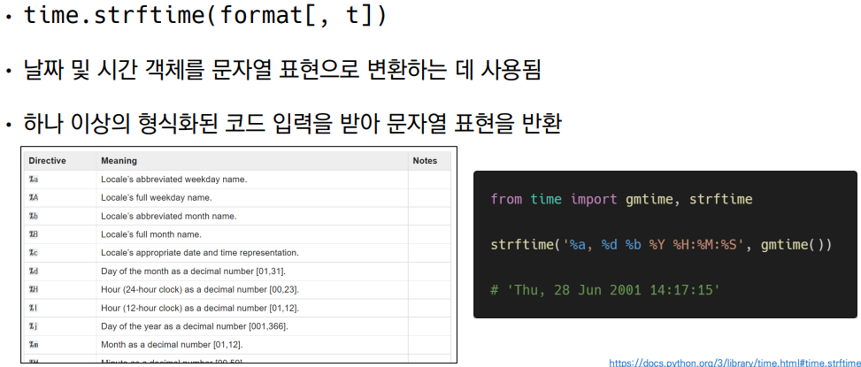

    * 

* **함수 호출 방식** (`Upload_to` argument)

  * 이미지 업로드에 대해 좀 더 체계적으로 폴더 관리하고싶을 때 사용

  * 반드시 2개의 인자(instance, filename)을 사용

    * instance
      * FileField가 정의된 모델의 인스턴스
      * 대부분 이 객체는 아직 데이터베이스에 저장되지 않았으므로  PK 값이 아직 없을 수 있음
    * filename
      * 기존 파일에 제공된 파일 이름

    


#### 4) ImageField(or FileField)를 사용하기 위한 몇 가지 단계

* 참고: [How to Manage Static Files](https://docs.djangoproject.com/en/4.0/howto/static-files/)

* `settings.py`에 `MEDIA_ROOT`, `MEDIA_URL` 설정

  * `STATIC_ROOT`, `STATIC URL` 과 유사

* `upload_to` 속성을 정의하여 업로드 된 파일에 사용할 `MEDIA_ROOT`의 하위 경로를 지정

  * `upload_to` 속성을 내 `ImageField`에 써야 함
  * 이 경로가 `MEDIA_ROOT` 이후의 경로

* 업로드 된 파일의 경로는 django가 제공하는 `url` 속성을 통해 얻을 수 있음

  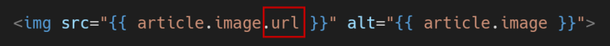

  

* MEDIA_ROOT

  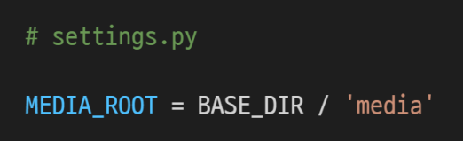

  * 사용자가 업로드 한 파일(미디어 파일)들을 보관할 디렉토리의 절대 경로
  * django는 성능을 위해 업로드 파일은 데이터베이스에 저장하지 않음
    * 실제 데이터베이스에 저장되는 것은 파일의 **경로**

  * 주의: `MEDIA_ROOT`는 `STATIC_ROOT`와 반드시 다른 경로로 지정해야 함

* MEDIA_URL

  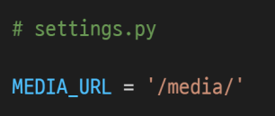

  * `MEDIA_ROOT`에서 제공되는 미디어를 처리하는 URL
  * 업로드 된 파일의 주소(URL)를 만들어 주는 역할
    * 웹 서버 사용자가 사용하는 public URL
  * 비어 있지 않은 값으로 설정한다면, 반드시 slash(/)로 끝나야 함
  * 주의: `MEDIA_URL`은 `STATIC_URL`과 반드시 다른 경로로 지정해야 함


#### 5) 문자열 경로 지정 방식을 통한 `ImageField` 작성

1. `models.py`에 문자열 경로 지정 방식으로 `ImageField`작성

   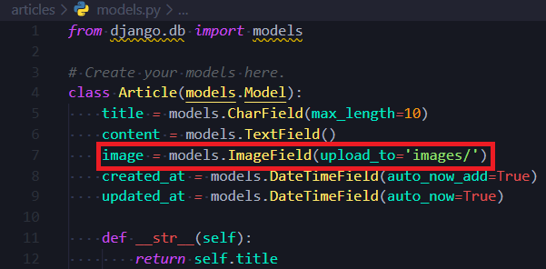

2. `settings.py` 에 MEDIA_ROOT, MEDIA_URL 작성해주기

   * 주의: `STATIC_URL`이나 `STATIC_ROOT`와 다른 경로로 작성

   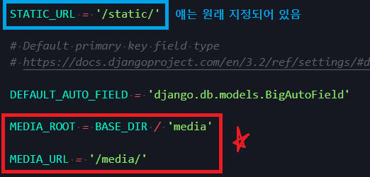

3. `url.py`의 `URLPATTERNS = []`에 작성

   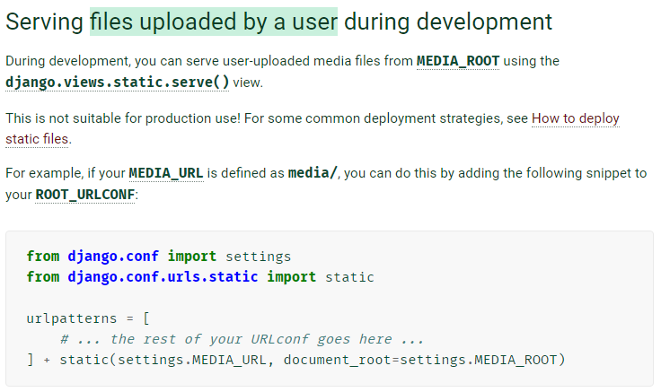

   * `url.py`

     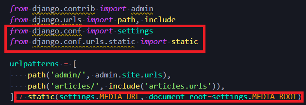

4. `Pillow` 라이브러리 설치

   ````bash
   $ pip install Pillow
   ````

   * 미설치시 error남(`ImageField`에 Pillow 라이브러리가 필수적이기 때문)

     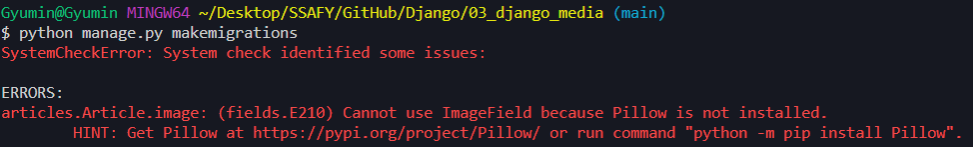

5. migration 실행

   ```bash
   $ python manage.py makemigrations
   $ python manage.py migrate
   $ pip freeze > requirements.txt
   ```

   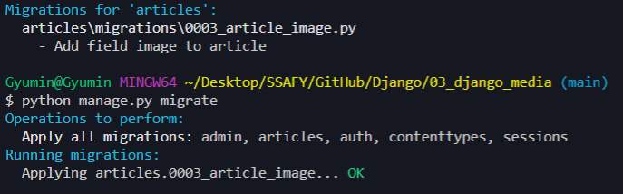

6. Image 파일이 들어간 것 확인

   * 문자열 100자 max 인것도 확인 가능

   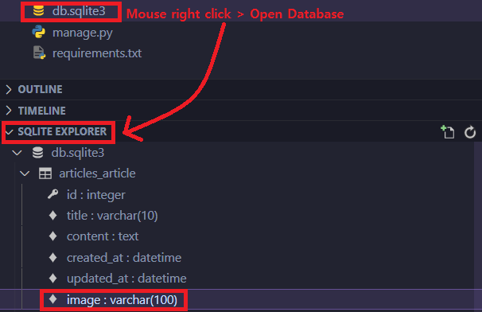

   * (중요한건 아님)`models.py`에 적어준 순서와는 상관없이, 마지막에 들어간다

     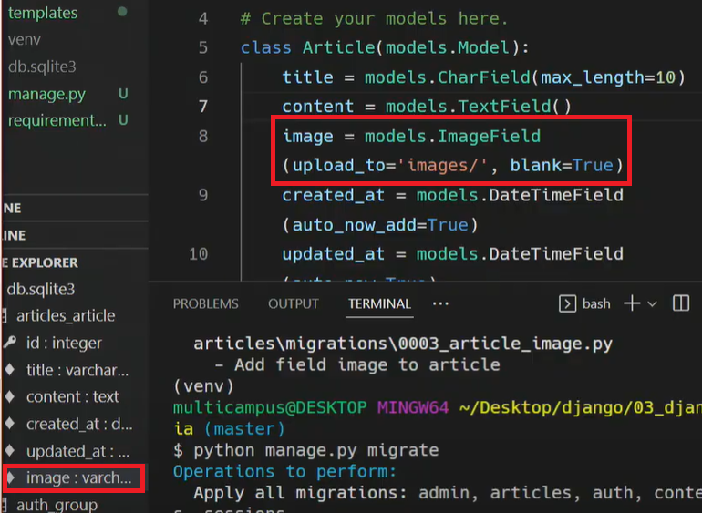


### 2. Image Upload(CREATE)

#### 1) form 태그 - enctype(인코딩) 속성

* `multipart/form-data`
  * 파일/이미지 업로드 시 반드시 사용해야 함(전송되는 데이터의 형식을 지정)
  * <input type="file">을 사용할 경우에 사용
* ~~`application/x-www-form-urlencoded`~~
  * (기본값) 모든 문자 인코딩
* ~~`text/plain`~~
  * 인코딩을 하지 않은 문자 상태로 전송
  * 공백은 '+' 기호로 변환하지만, 특수 문자는 인코딩하지 않음


#### 2) input 요소 - accept 속성

* 입력 허용할 파일 유형을 나타내는 문자열
* 쉼표로 구분된 '고유 파일 유형 지정자(unique file type specifiers)'
* 파일을 검증하는 것은 아님(accept 속성 값을 image라 하더라도, 비디오나 오디오 및 다른 형식 파일을 제출할 수 있음)
  * 카테고리를 필터링 해주는 역할
  * 있어도 그만 없어도 그만
* 고유 파일 유형 지정자
  * <input type="file">에서 선택할 수 있는 파일의 종류를 설명하는 문자열


#### 3) 업로드(CREATE) 순서

1. `create.html`에 enctype 속성 지정

   * 웹 페이지에 image: 파일 선택 버튼이 보이고
   * 파일 선택시 '이미지 파일'이 먼저 선택되도록 초기 설정이 되어 있을 것(`accept="image/"`)

   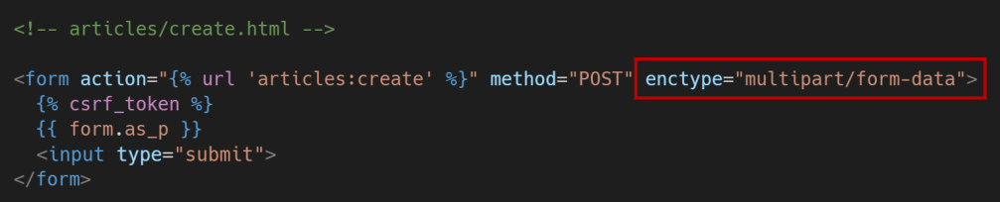

   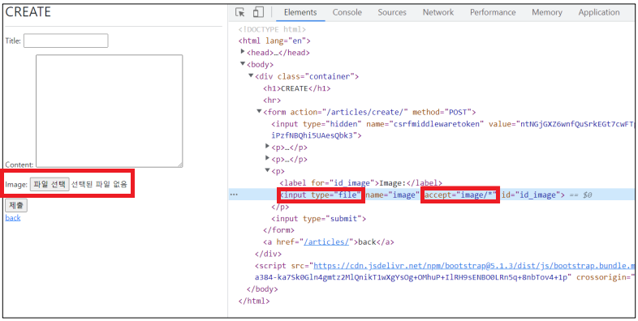

   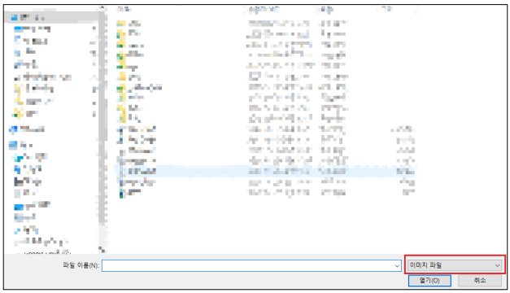

   

2. `views.py` 수정

   * title, content는 request 객체의 POST method: `request.POST`
   * 이와 같이, **파일**에 관한 것은 **`request.FILES`**로 받아준다.

   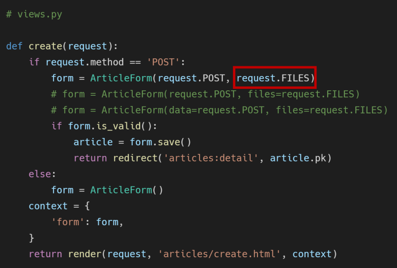

   

3. DB 및 파일 트리 확인

   * 실제 파일 위치 `MEDIA_ROOT/images/`

     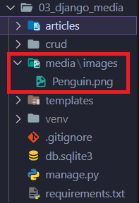

     * `MEDIA_ROOT/images/` 안에 들어 있는 이유는  `settings.py`에서 설정해 준대로 들어갔기 때문

       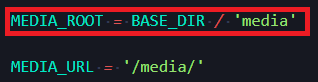

   * DB에 저장되는 것은 이미지 파일 자체가 아닌 파일의 경로

     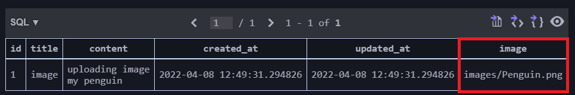


### 3. Image Upload(READ)

* `detail.html`의  태그 수정

  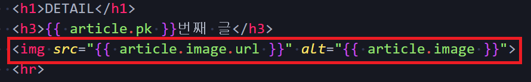

* 이미지 출력

  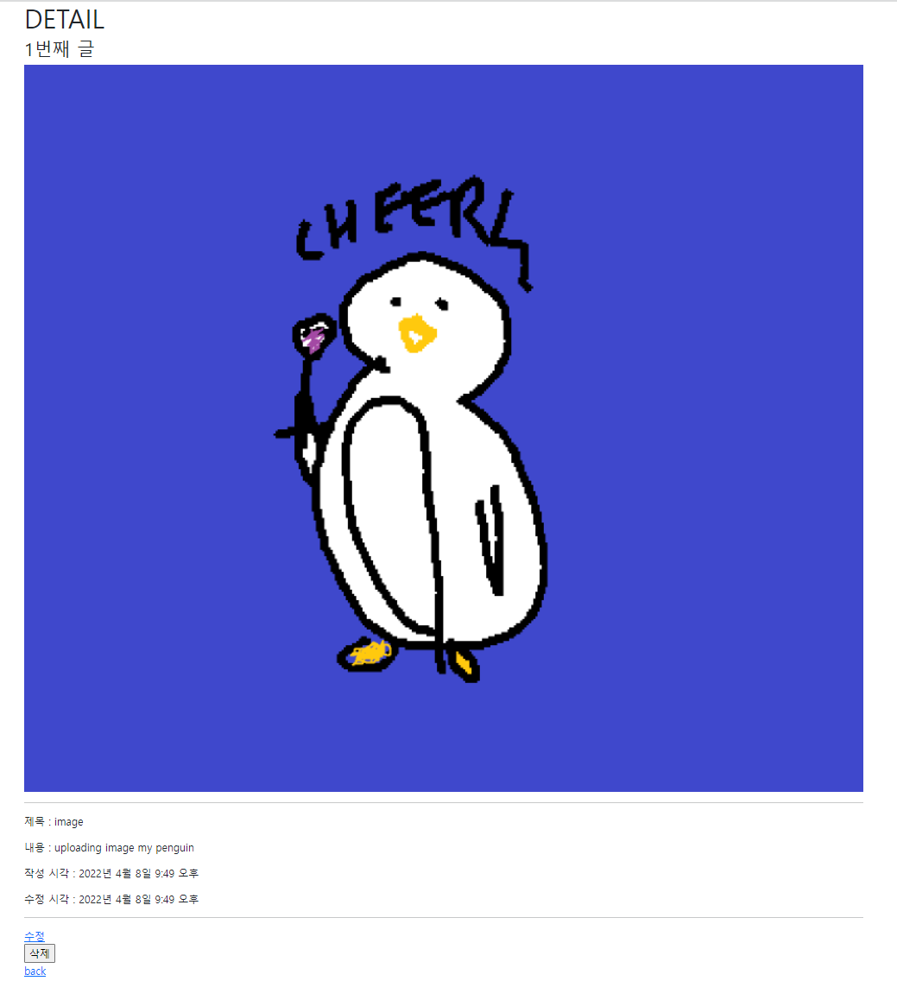

* MEDIA_URL 값 확인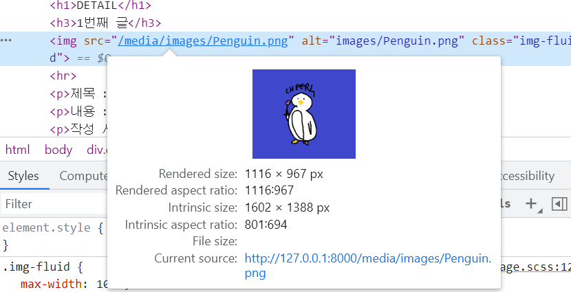

* static, media 파일 모두 서버에 요청해서 조회하는 것

  * 서버에 요청하기 위해서는 url이 필요

    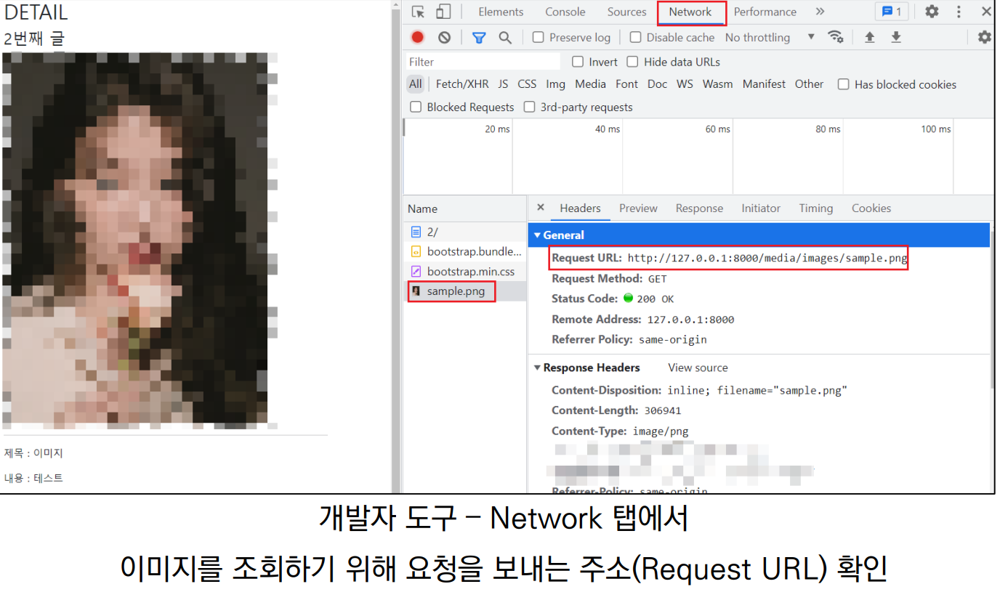

    * 근데 난 못찾겠었음


### 4. Image Upload(UPDATE)

#### 1) 이미지 수정하기

* 이미지는 바이너리 데이터(하나의 덩어리)이기 때문에 텍스트처럼 일부만 수정하는 것은 불가능
* 때문에 새로운 사진으로 덮어 씌우는 방식을 사용


#### 2) 순서

* `update.html` 수정

  * `enctype="multipart/form-data"` 추가

  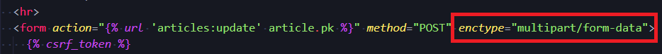

* `views.py` 수정

  * update 함수에 `request.FILES` 를 `instance` 인자 앞에 넣어준다.

  

* 이미지 변경

  * 이미지를 완전히 갈아끼우는 것 - 일부만 수정되는 것은 불가능하다

  

  * 이미지 경로

    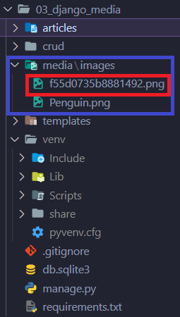

* 만약 동일한 이미지를 새로운 글에다가 쓴다면?

  * 업로드는 잘 됨

  * `media/images/` 폴더 내에 `원래파일이름_임의의문자열값.png`해서 새로운 파일이 저장됨 

    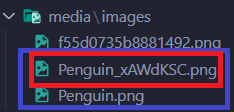

    * 따라서 같은 이름이 업로드돼도 상관이 없다

* 이미지가 없는 게시글은 표시되지 않는 에러 (ValueError) 해결하기

  * `detail.html` 수정 : 조건문 사용!

    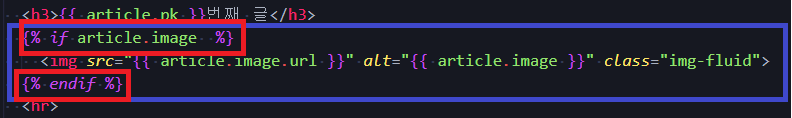

    * 이미지가 있는 게시글일 때만 이미지 출력
    * 아니면, 이미지가 없는 게시글에는 대체 이미지 올라가게 설정해 줄 수도 있음(메신저 기본 프로필 처럼) - 정적 파일 이용

    


## :three: Image Resizing

### 1. 이미지 크기 변경하기

* 실제 원본 이미지를 서버에 그대로 업로드 하는 것은 서버의 부담이 큰 직업

*  태그에서 직접 사이즈를 조정할 수도 있지만(width와 height 속성 사용), **업로드 될 때** 이미지 자체를 resizing 하는 것을 고려하기

* [django-imagekit](https://github.com/matthewwithanm/django-imagekit/) 라이브러리 활용

  

  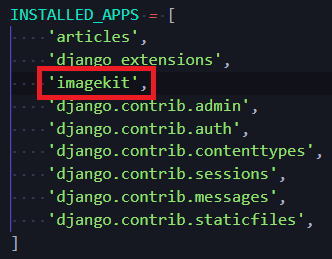


### 2. 원본 이미지를 재가공하여 저장

#### 1) 원본 X, 썸네일 O

* `models.py`

  * django-imagekit 라이브러리에서 복사해서 `model.py`에 추가

  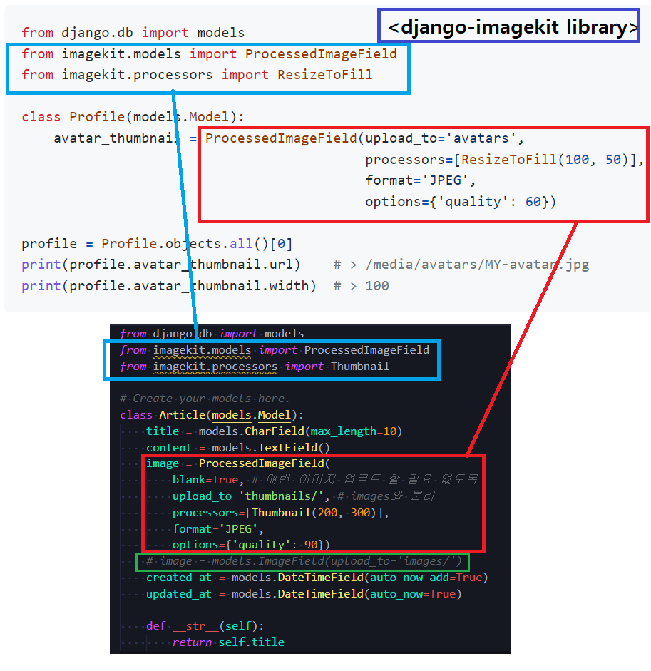

* `models.py`에 변경 가했으니 `makemigrations`, `migrate` 해주기

* 이미지 출력

  * 확실히 작아짐

  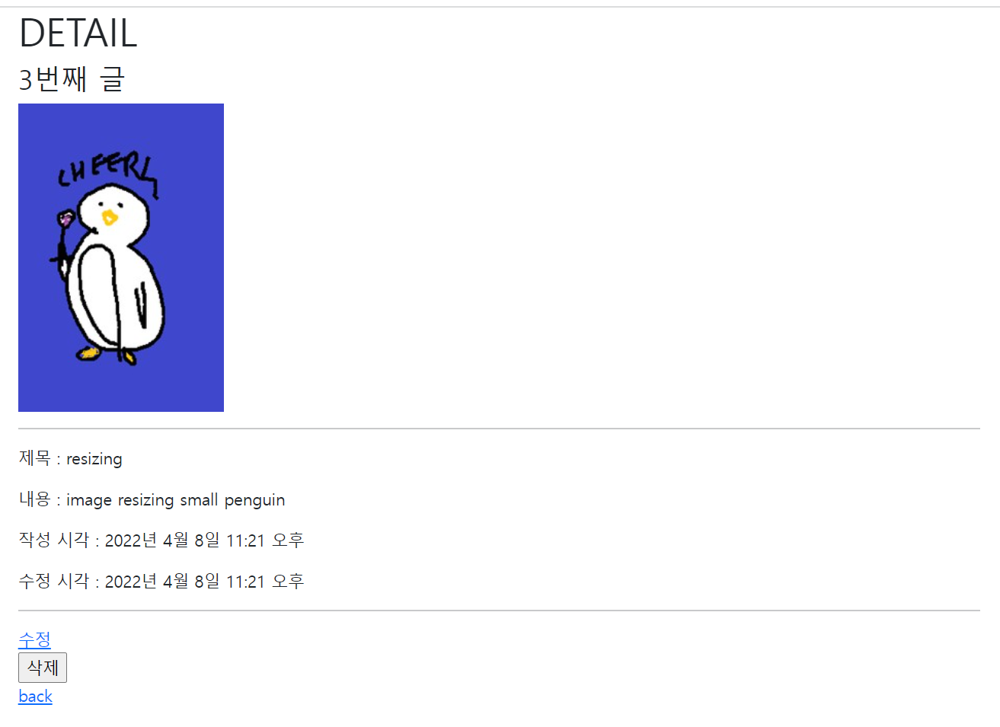

  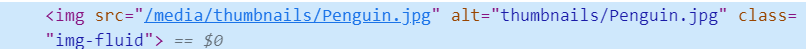

* 이미지 저장 경로: `media/thumbnails/`

  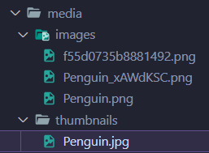


#### 2) 원본 O, 썸네일 O ( 이건 좀 대충 넘어감 )

* 공식문서 참조!

* `model.py` 수정

  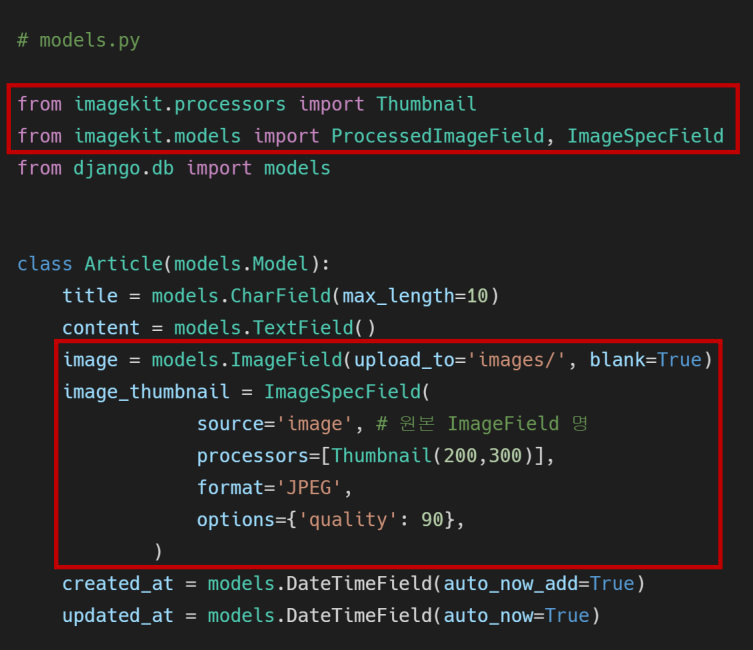

  * 수정 후 `makemigrations`, `migrate`

* `detail.html` 수정

  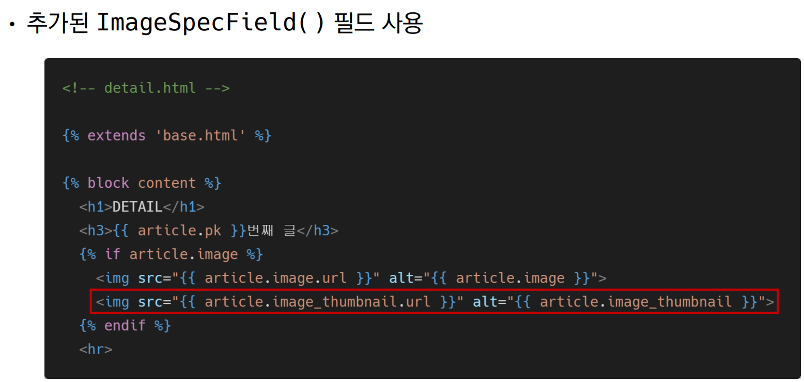

* 이미지 출력

  