# Django REST API MtoM


## :one: REST API - M:N

### 1. REST API 문서화

* drf-yasg 라이브러리

  * Yet another Swagger generator
    * Swagger: 개발자가 REST 웹 서비스를 설계, 빌드, 문서화, 소비하는 일을 도와주는 대형 도구 생태계의 지원을 받는 오픈 소스 소프트웨어 프레임워크
  * API를 설계하고 문서화 하는데 도움주는 라이브러리
  * Swagger & OpenAPI 2.0 문서를 제공

* 설치하기 [DRF-YASG 여기서 확인](http://127.0.0.1:8000/api/v1/swagger/)

  * pip install

    ```
    $ pip install -U drf-yasg
    ```

  * `settings.py` INSTALL_APPS 에 등록

    * 가장 아래쪽에 넣어주기

      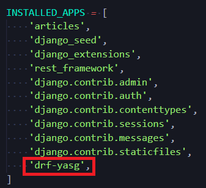

  * `urls.py` 

    * [drf-yasg official documentation 확인](https://drf-yasg.readthedocs.io/en/stable/readme.html#id12)

    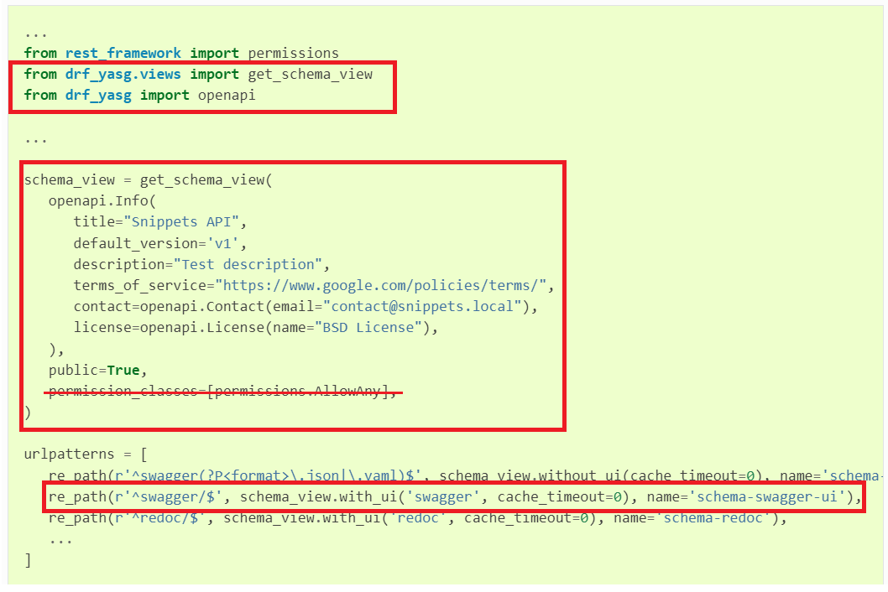

    ```python
    # 나중에 복사하기 편하라고 
    
    ...
    from drf_yasg.views import get_schema_view
    from drf_yasg import openapi
    ...
    
    
    schema_view = get_schema_view(
       openapi.Info(
          title="Snippets API",
          default_version='v1',
           
           # 여기 아래부터는 선택
          description="Test description",
          terms_of_service="https://www.google.com/policies/terms/",
          contact=openapi.Contact(email="contact@snippets.local"),
          license=openapi.License(name="BSD License"),
       ),
       public=True,
    )
    
    
    urlpatterns = [
       re_path(r'^swagger/$', schema_view.with_ui('swagger', cache_timeout=0), name='schema-swagger-ui'),
    ]
    ```

    ```python
    # urlpatterns
    
    urlpatterns = [
        ...
        path('swagger/', schema_view.with_ui('swagger')),
    ]
    ```

  * 출력 [확인](http://127.0.0.1:8000/api/v1/swagger/ )

    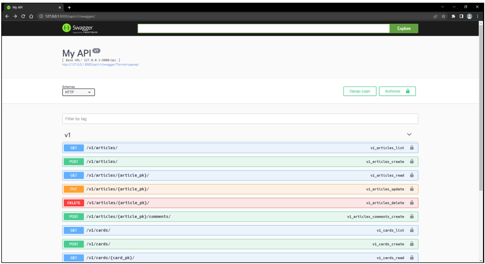

    

## :two: Fixtures

### 1. How to provide initial datao for models

* 앱을 처음 설정할 때 미리 준비된 데이터로 데이터베이스를 미리 채우는 것이 필요한 상황이 있음
* 마이그레이션 또는 fixtures와 함께 초기 데이터를 제공


### 2. fixtures :star: 여기서부터!!!

* 데이터베이스의 serialized된 내용을 포함하는 파일의 모음
* django가 fixtures파일을 찾는 경로
  * `app/fixtures/`


### 3. dumpdata

* 응용 프로그램과 관련된 데이터베이스의 모든 데이터를 표준 출력으로 출력

  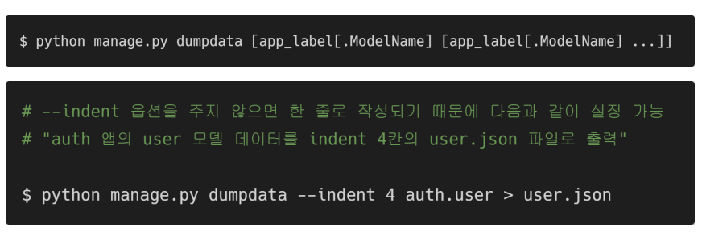


### 4. loaddata

* fixture의 내용을 검색하여 데이터베이스로 로드

  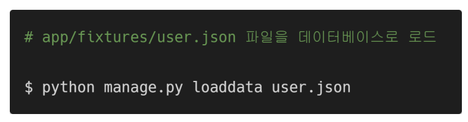

### 5. 실습

#### 1) 기본 설정

* 99_fixtures 프로젝트 준비
* 가상환경 생성 및 활성화
* 패키지 설치 및 migrate


### 2)


## :three: Improve query

### 1. 쿼리셋 이해하기

### 2. 필요하지도 않은 것을 검색하지 않기

### 3. 한 번에 모든 것을 검색하기


## :four: Many to Many 실습

### 1. 기본 설정

1. `models.py` 에 Card 라는 class 를 정의해준다

   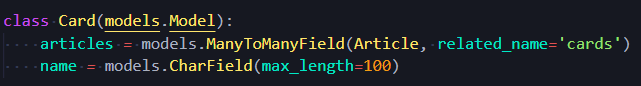

   * Article에 여러 Card가 나타날 수 있고, 하나의 Card에도 여러 개의 Article이 나타날 수 있다(Many to Many)
   * Many to Many 관계를 형성하는 두 모델 중에서, `ManytoManyField`는 어디에 작성해도 상관없다
   * related_name을 바로 설정해줬다.

2. `serializers.py` 작성

   * 참고: serializer가 많아지니까,클래스의 작성되는 순서도 그렇고 정리가 필요함

     * 각각의 모델에서 사용하는 ModelSerializer끼리 분리해준다

     * `serializers/`라는 폴더를 만들어서 관리

     * 폴더 내에는 `article.py`, `card.py`, `comment.py`가 존재

       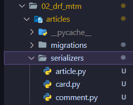

     * 각각의 py 파일에는 맞는 serializer를 따로 넣어서 관리해준다 

       * 주의! 폴더를 하나 만들어줬으므로 import 할 때 `from ..models` 처럼 점('.')을 하나 더 추가해준다
       *  필요한 것들은 import 해줄것

3. `urls.py` 작성

   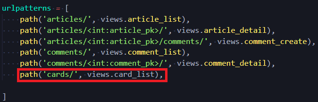

4. `views.py` 작성 및 import 부분 수정 (card 추가)

   * 폴더 안의 각각 py 파일에서 불러와야 하므로 import 경로 수정이 필요함

     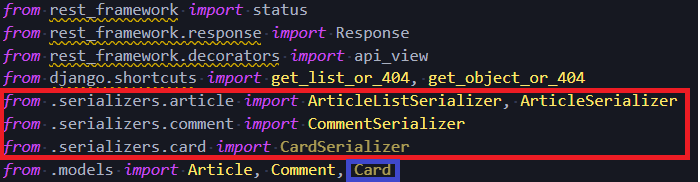

   * `views.py` 에 `card`함수 작성

     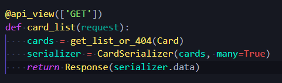

   * 이렇게 되면, Article Detail 화면에 card관련 정보가 없다 - card를 역참조하여  serializer에 별도로 추가하는것이 필요

5. `seriralizers/article.py`

   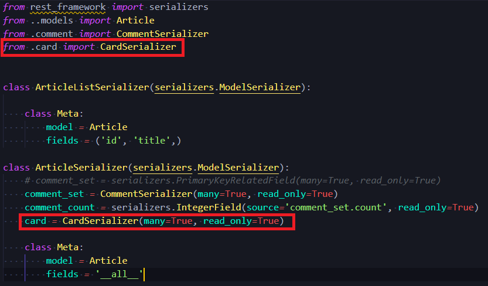

6. 출력 확인

   * 해당 Article은 3번 카드를 참조하고 있는것을 알 수 있음

   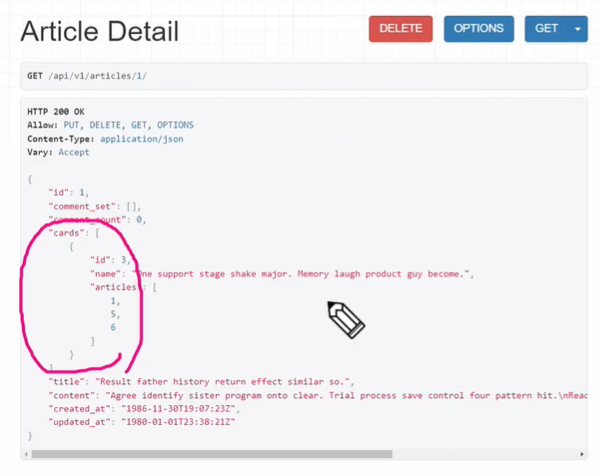

7. 중개 테이블에 데이터를 추가하려면 POST 요청이 필요함

   * 카드 디테일 생성

     * `urls.py`작성

     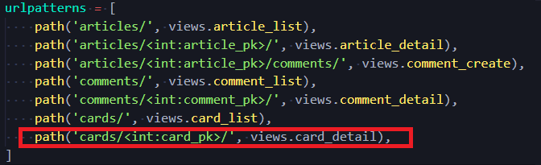

     * `views.py` 작성

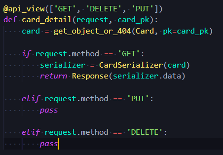

8. Many to Many 관계 설정: (add: 관계 추가,  remove:관계 삭제) 

   * 이러한 로직을 진행하는 POST 역할을 할 수 있는 view함수 작성

   * 해당 view 함수는 `article_pk`, `card_pk` 둘 다 필요하기 때문에 원래 있는 view함수로는 진행이 불가능

   * `urls.py`

     ```python
     urlpatterns = [
         path('<int:card_pk>/register/<int:article_pk>/', views.register),
     ]
     ```

   * `views.py`

     * card가 article에 등록된 카드 목록에 포함에 되어 있는 카드라면 삭제, 아니면 추가
     * (ex 내가 게시글을 좋아요 하는 목록 안에 포함이 되어 있다면 좋아요 취소, 아니면 좋아요)

     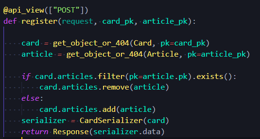

   * 출력 확인

     * 첫번째로 POST 요청시 add 되는 것 볼 수 있음

     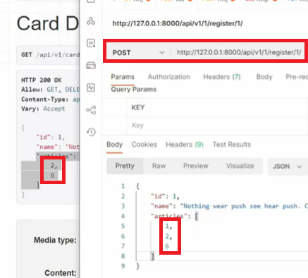

     * 두번째로 POST 요청시, remove된다

       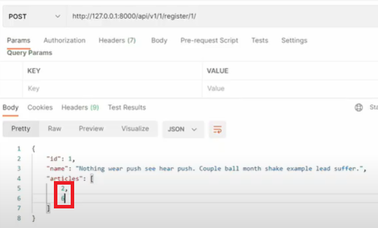

     

### 2. 카드 조회하기


### 3. 카드와 Article을 이용해서 중개 테이블 작성


