# JavaScript AJAX

[TOC]


## :one: AJAX

### 1. AJAX란?

* Asynchronous JavaScript And XML(비동기식 JavaScript와 XML)

  * XML, Json 둘 다 데이터를 표현하는 방식

    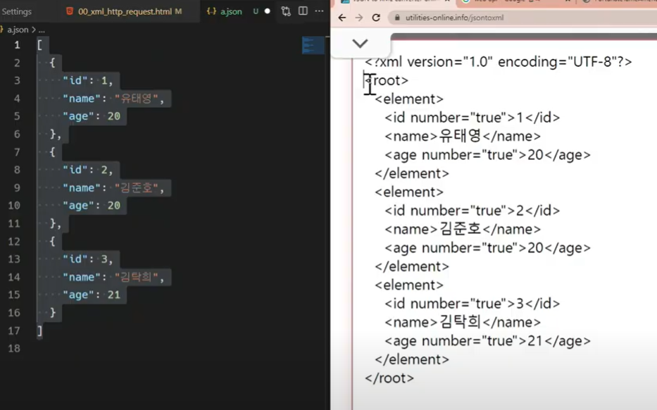

    * XML (eXtended Markup Langauge)
    * json (JavaScript Object Notation): byte 수가 XML보다 적다 - 따라서 JSON 선호!

* 서버와 통신하기 위해 `XMLHttpRequest` 객체를 활용
* JSON, XML, HTML 그리고 일반 텍스트 형식 등을 포함한 다양한 포맷을 주고 받을 수 있음
  * 참고) AJAX의 X가 XML을 의미하긴 하지만, 요즘은 **더 가벼운 용량과 JavaScript의 일부라는 장점 때문에 JSON 을 더 많이 사용함**
* 비동기 통신을 하는 방법 중 하나


### 2. AJAX 특징

* 페이지 전체를 reload(새로 고침)를 하지 않고서도 수행되는 '**비동기성**'

  * 서버의 응답에 따라 전체 페이지가 아닌 **일부분**만을 업데이트 할 수 있음

* AJAX의 주요 두가지 특징은 아래의 작업을 할 수 있게 해줌

  * 페이지 새로 고침 없이 서버에 요청 
  * 서버로부터 데이터를 받고 작업을 수행

* 예) 구글 자동완성

  * Log XMLHttpRequests를 누르면 한 글자 input 들어갈 때마다 생성됨

  * 이처럼 화면 새로고침 없이 특정 서버에서 데이터를 받아올 수 있는 것이 비동기성!

    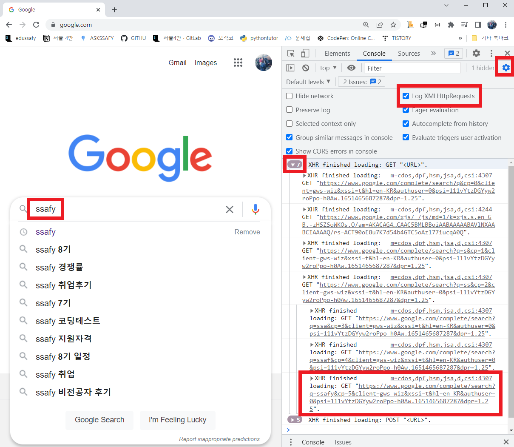

    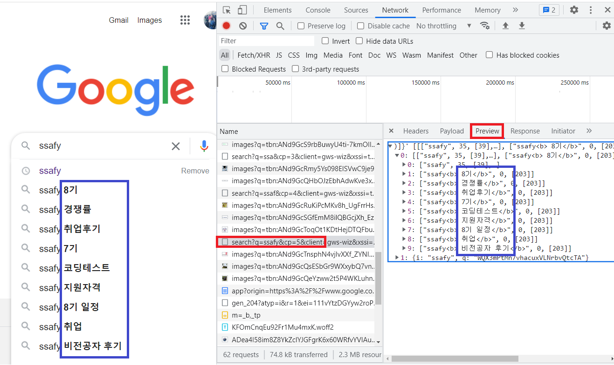

    

    

### 3. AJAX 배경

* 2005년 Google Maps & Gmail등에 활용되는 기술을 설명하기 위해 AJAX라는 용어를 최초로 사용
* AJAX는 특정 기술이 아닌 기존의 여러 기술을 사용하는 새로운 접근법을 설명하는 용어
  * 기존 기술을 잘 활용할 수 있는 방식으로 구성 및 재조합한 새로운 접근법
* Google 사용 예시
  * Gmail
    * 메일 전송 요청이 모두 처리 되기 전 다른 페이지로 넘어가더라도 메일은 전송 됨
  * Google Maps
    * 스크롤 행위 하나하나가 모두 요청이지만 페이지는 갱신되지 않음
    * 지도 움직일때마다 갱신되면 느려지고 불편


### 4. `XMLHttpRequest`객체 ( 역사와 전통의 객체이므로 몰라도 됨 )

#### 1) `XMLHttpRequest` 객체 개념

* 서버와 상호작용하기 위해 사용되며 전체 페이지의 새로 고침 없이 데이터를 받아올 수 있음
* 사용자의 작업을 방해하지 않으면서 페이지 일부를 업데이트 할 수 있음
* 주로 AJAX 프로그래밍에 사용
* 이름과 달리 XML 뿐만 아니라 모든 종류의 데이터를 받아올 수 있음
* 생성자
  * `XMLHttpRequest()`
    * 객체를 생성하는 함수
    * 생성자 함수


#### 2) `XMLHttpRequest` 예시


* [Free fake API for testing and prototyping](https://jsonplaceholder.typicode.com/)

* 해석

  * URL에 요청을 보내면 dummy data를 가져다 줄 것
  * GET 요청 > send로 보낸다
  * 해당 request를 todo 에 넣어주고
  * 이를 출력한다 -> todo가 출력되지 않음!

* console에 todo 데이터가 출력되지 않는 이유?

  * 데이터 응답을 기다리지 않고 console.log()를 먼저 실행했기 때문

  * 따라서 응답을 기다려줘야함 - 해당 응답을 받은 이후 console.log를 찍으면 todo가 제대로 출력됨

    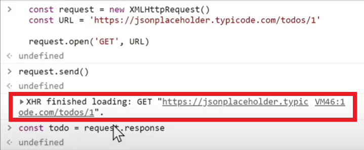

    

    

## :two: Asynchronous JavaScript

### 1. 동기식(Synchronous)

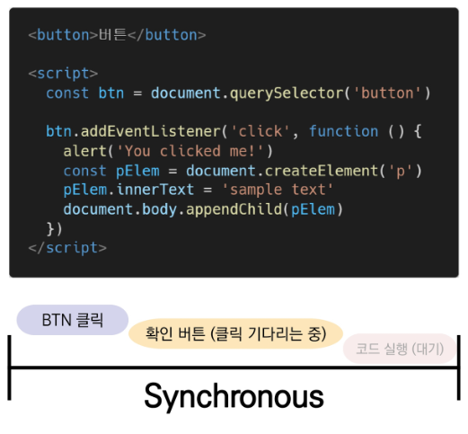

* **순차적**, 직렬적 Task 수행
* 요청을 보낸 후 **응답을 받아야만** 다음 동작이 이루어짐(blocking)
  * block 과 synchronous는 유사한 의미지만, 같은 의미는 아님 
  * [참고](https://musma.github.io/2019/04/17/blocking-and-synchronous.html)
* 버튼 클릭 후 alert 메시지의 확인 버튼을 누를 때까지 문장이 만들어지지 않음
* 즉, alert이후의 코드는 alert의 처리가 끝날 때까지 실행되지 않음
* 왜 이런 현상이 발생할까?
  * JavaScript는 single threaded


### 2. 비동기식(Asynchronous)

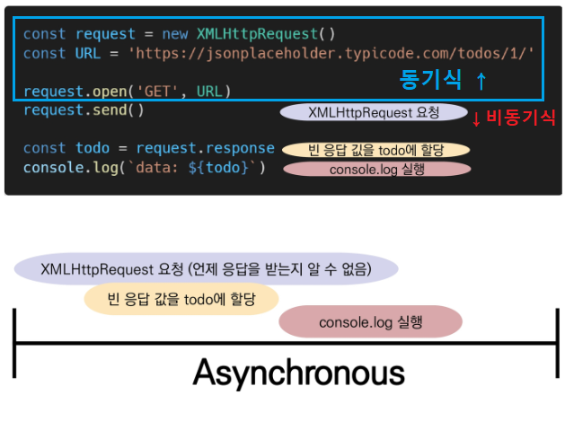

* 병렬적 Task 수행 (멀티 X )
  * 쭉 작업을 하다가, 오래걸리는건 뒤에 미뤄두고 빠른거 먼저 처리 후 느린것 처리하는것
  * 느린 것:  `request.send()`
* 요청을 보낸 후 응답을 기다리지 않고 다음 동작이 이루어짐(non-blocking)
  * non-block 과 Asynchronous는 유사한 의미지만, 같은 의미는 아님. 
* 요청을 보내고 **응답을 기다리지 않고** 다음 코드가 실행됨
* 결과적으로 변수 todo에는 응답 데이터가 할당되지 않고 빈 문자열이 출력
* 그렇다면 JS는 왜 기다려주지 않는 방식으로 동작하는가?
  * JavaScript는 single threaded
  * 일하는 사람이 한 명 뿐인 것


### 3. 왜 비동기(Asynchronous)를 사용하는가?

* **"사용자 경험"**
  * 매우 큰 데이터를 동반하는 앱이 있다고 가정
  * 동기식 코드라면 데이터를 모두 불러온 뒤 앱이 실행됨
    * 즉, 데이터를 모두 불러올 때까지는 앱이 모두 멈춘 것처럼 보임
    * 코드 실행을 차단하여 화면이 멈추고 응답하지 않는 것 같은 사용자 경험을 제공
  * 비동기식 코드라면 데이터를 요청하고 응답 받는 동안, 앱 실행을 함께 진행함
    * :star: **데이터를 불러오는 동안 지속적으로 응답하는 화면을 보여줌으로써 쾌적한 사용자 경험을 제공**
  * 때문에 많은 웹 API 기능은 현재 비동기 코드를 사용하여 실행됨

* "human-centered design with UX"

  * 인간 중심으로 설계된 사용자 경험

  * 실제 Ajax라는 용어를 처음 논문에서 사용한 *Jesse James Garrett*이 Ajax를 소개하며 강조한 한 마디

    "Ajax isn't a technology. It's really several technologies, each flourishing in its own right, coming together in powerful new ways"


### 4. JavaScript는 single threaded이다

#### 1) [참고] Threads

* thread = 작업할 수 있는 손
* core = 작업할 수 있는 사람
* 프로그램이 작업을 완료하기 위해 사용할 수 있는 단일 프로세스
  * 프로세스와 thread도 구분되는 개념이지만 혼용하는 추세
* 각 thread(스레드)는 한 번에 하나의 작업만 수행할 수 있음
  * 하나의 탭당 하나의 작업만 수행 가능
* 예시) Task A > Task B > Task C
  * 다음 작업을 시작하려면 반드시 앞의 작업이 완료되어야 함
  * 컴퓨터 CPU는 여러 코어를 가지고 있기 때문에 한 번에 여러 가지 일을 처리할 수 있음


#### 2) JS는 single threaded

* 컴퓨터가 여러개의 CPU를 가지고 있어도, main thread라 불리는 단일 스레드에서만 작업 수행
* 즉 이벤트를 처리하는 **Call Stack** 이 하나인 언어라는 의미 - 한 명이 일하는 형태
* 이 문제를 해결하기 위해 JS는:
  1. 즉시 처리하지 못하는 이벤트들을 다른 곳(**Web API**)으로 보내서 처리하도록 하고, 
     * Web API: 브라우저 내부의 고마운 친구들(?)
  2. 처리된 이벤트들은 처리된 순서대로 대기실(**Task queue**)에 줄을 세워 놓고
  3. Call Stack이 비면 담당자(**Event Loop**)가 대기 줄에서 가장 오래된(제일 앞의)이벤트를 Call Stack으로 보냄


### 5. Blocking vs. Non-Blocking

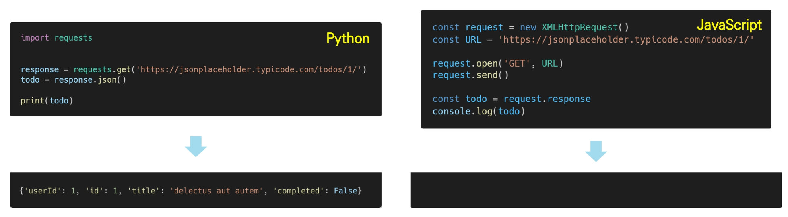

* Python 

  * `sleep(3)`이 python 의 코드 진행을 block하기 때문임

  ```python
  # 1. sleep 
  from time import sleep
  
  print('hi') 	# hi 나오고 
  sleep(3)		# 3초 후에
  print('bye')	# bye 나옴
  
  # 2. requests
  import requests
  
  URL = 'https://jsonplaceholder.typicode.com/todos/1'
  res = requests.get(URL).json()
  print('end', res) # res코드가 실행되기 전까지는 print문이 실행되지 않음
  ```

* JavaScript

  * `request.send()`와 같은 몇몇 메서드를 마주치는 경우 비동기화를 생각해야 함

  ```javascript
  <body>
  	<script>
      const request = new XMLHttpRequest()
  	const URL = 'https://jsonplaceholder.typicode.com/todos/1'
      
      request.open('GET', URL)
  	console.log('start')
  	request.send()	//  non-blocking 
  	const todo = request.response
      console.log(todo)
      console.log('end')
      </script>
  </body>
  ```

  ```javascript
  // 출력
  start
  end
  	// todo 는 안나옴
  ```

  

### 6. Concurrency model

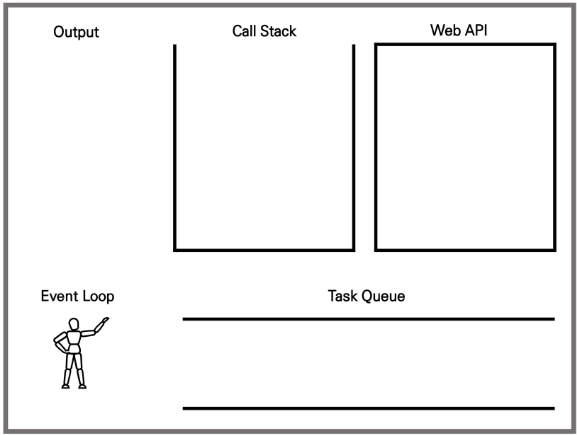

#### 1) 종류

* Event loop을 기반으로 하는 동시성 모델(concurrency model)

* Call Stack
* Web API(Browser API)
* Task Queue (Event Queue, Message Queue)
* Event Loop


#### 2) Call Stack

* 요청이 들어올 때마다 해당 요청을 순차적으로 처리하는 Stack(LIFO)형태의 자료구조


#### 3) Web API(Browser API)

* JavaScript 엔진이 아닌 브라우저 영역에서 제공하는 API

* `setTimeout()`, DOM events 그리고 **AJAX**로 데이터를 가져오는 **시간이 소요**되는 일들을 처리

  * 비동기 동작
  * web에서 처리
  * 언제 끝날지 모름
  * 시간 관련 일들 예시
    * `setTimeout()`
    * `setInterval()`
    * `XMLHttpRequest`

* `setTimeout()`예시: Runtime

  ```javascript
  console.log('start')
  
  setTimeout(콜백함수, 시간) // 3초 = 3000 (ms)
  ```

  ```javascript
  console.log('start')
  
  function after3Seconds() {
      console.log('3초가 지났나보군...')
  }
  
  setTimeout(after3Seconds, 3000)
  
  console.log('end')
  
  // 기대하는 출력 결과값
  // start
  // 3초가 지났나보군
  // end
  
  // 실제 출력값
  // start
  // end
  // 3초가 지났나보군
  ```

  ```javascript
  console.log('start')
  
  setTimeout(function after3Seconds() {
      console.log('3초가 지났나보군... ')
  }, 3000)
  
  console.log('end')
  
  // start
  // end 
  // 3초가 지났나보군...
  
  // 왜냐면 web API로 보낸 'setTimeout'부분이 Queue로 갔다가, print되기 때문  
  ```


#### 4) Task Queue

* 비동기 처리된 callback 함수가 대기하는 Queue(FIFO) 형태의 자료구조
* main thread가 끝난 후 실행되어 후속 JavaScript 코드가 차단되는 것을 방지


#### 5) Event Loop

* [JS Event Loop visualizer](http://latentflip.com)
  * python tutor랑 비슷한 것

* Call Stack 이 비어 있는지 확인
* 비어 있는 경우, Task Queue에서 실행 대기 중인 callback 함수가 있는지 확인
* Task Queue에 대기 중인 callback 함수가 있다면, 가장 앞에 있는 callback 함수를 Call Stack으로 push


### 7. Zero delays

* 실제로 0ms 후에 callback 함수가 시작된다는 의미가 아님

  * call stack 이 빌 때까지 task queue에 남아있기 때문

  ```javascript
  console.log('start')
  
  setTimeout(function after0Seconds() {
      console.log('바로 끝남!')
  }, 0)
  
  console.log('end')
  // start
  // end
  // 바로끝남
  ```

* 실행은 Task Queue에 대기 중인 작업 수에 따라 다르며, 해당 예시에는 callback 함수의 메시지가 처리되기 전에 'Hi'와 'Bye'가 먼저 출력됨

* 왜냐하면 delay(지연)은  JavaScript가 요청을 처리하는데 필요한 최소 시간이기 때문(보장된 시간이 아님)

* 기본적으로 `setTimeout`함수에 특정 시간제한을 설정했더라도, 대기 중인 메시지의 모든 코드가 완료될때까지 대기해야 함

  * 우선순위를 따름
    1. setTimeout
    2. setTimeout 안의 콜백함수
  * 따라서 콜스택이 비는지 확인하는게 우선됨

  ```javascript
  console.log('start')
  
  function after3Seconds() {
      console.log('바로 끝남!')
  }
  
  setTimeout(after3Seconds, 3000)
  
  for (let i = 0; i < 1000000000; i++) {}
  console.log('end')
  
  // 아무리 end 마무리가 늦게 끝나서, 바로 끝남이 끝난 한참 이후에 끝난다고 해도
  // start
  // end
  // 바로 끝남!
  ```

  

### 8. 순차적인 비동기 처리하기

* Web API로 들어오는 순서는 중요하지 않고, 어떤 이벤트가 먼저 처리되느냐가 중요(즉, 실행 순서 불명확)
* 이를 해결하기 위해 순차적인 비동기 처리를 위한 2가지 작성 방식
  * **Async callbacks**
    * 백그라운드에서 실행을 시작할 함수를 호출할 때 인자로 지정된 함수
    * 콜백 함수를 한번 더 넣어서 작성
    * 예시) addEventListener()의 두 번째 인자
  * **:star: promise-style**
    * Modern  Web APIs에서의 새로운 코드 스타일
    * XMLHttpRequest 객체를 사용하는 구조보다 조금 더 현대적인 버전


## :three: Callback function

### 1. Callback Function

#### 1) 개념

* 다른 함수에 인자로 전달된 함수
* 외부 함수 내에서 호출되어 일종의 루틴 또는 작업을 완료함
* 동기식, 비동기식 모두 사용됨
  * 그러나 비동기 작업이 완료된 후 코드 실행을 계속하는 데 주로 사용됨
* 비동기 작업이 완료된 후 코드 실행을 계속하는데 사용되는 경우를 비동기 콜백이라고 함(asynchronous callback)이라고 함


#### 2) JS의 함수는 일급객체(First Class Object)

* 일급 객체(일급 함수)
  * 다른 객체들에 적용할 수 있는 연산을 모두 지원하는 객체(함수)
* 일급 객체의 조건
  * 인자로 넘길 수 있어야 함
  * 함수의 반환 값으로 사용할 수 있어야 함
  * 변수에 할당할 수 있어야 함


 #### 3) Callback function 사용예시(JavaScript, Python, Django)


### 2. Async callbacks

* 백그라운드에서 코드 실행을 시작할 함수를 호출할 때 인자로 지정된 함수
* 백그라운드 코드 실행이 끝나면 callback 함수를 호출하여 작업이 완료되었음을 알리거나, 다음 작업을 실행하게 할 수 있음
  * 사용 예시: `addEventListener()`의 두 번째 매개변수
* callback 함수를 다른 함수의 인수로 전달할 때, 함수의 참조를 인수로 전달할 뿐이지 **즉시 실행되지 않고**, 함수의 body에서 **"call back"** 됨. 정의된 함수는 때가 되면 callback 함수를 실행하는 역할을 함


### 3. Why use callback?

* callback 함수는 명시적인 호출이 아닌 특정 루틴 혹은 **action에 의해 호출**되는 함수
* Django의 경우 "요청이 들어오면", event의 경우 "특정 이벤트가 발생하면"이라는 조건으로 함수를 호출할 수 있었던 건 "Callback function"개념 때문에 가능
* 비동기 로직을 수행할 때 callback 함수는 필수
  * 명시적인 호출이 아니라 다른 함수의 매개변수로 전달하여 해당 함수 내에서 특정 시점에 호출


### 3. :star:  Callback Hell

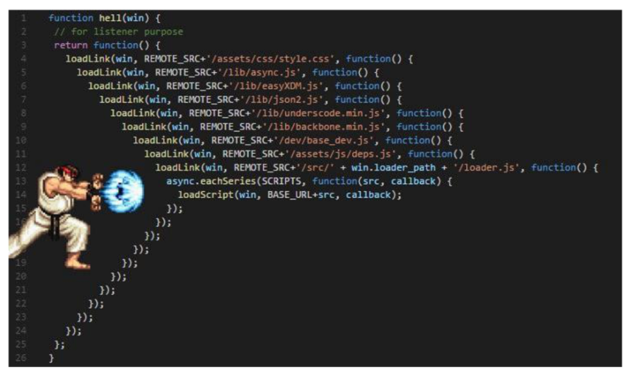

#### 1) 개념

* **순차적**인 연쇄 비동기 작업을 처리하기 위해 " callback 함수를 호출하고, 그 다음 callback 함수를 호출하고, 또 그 함수의 callback 함수를 호출하고,..." 의 패턴이 지속적으로 반복됨
* 즉, 여러개의 연쇄 비동기 작업을 할 때 마주하는 상황 ... indent가 미쳤어요 
* 이를 callback Hell(콜백지옥) 혹은 pyramid of doom(파멸의 피라미드)이라고 함
* 위와 같은 상황이 벌어질 경우 아래 사항들을 통제하기 어려움
  * 디버깅
  * 코드 가독성


#### 2) callback Hell 해결하기

*  Keep your code shallow(코드의 깊이를 얕게 유지)
* Modularize(모듈화)
* Handle every single error(모든 단일 오류 처리)
* :star: **Promise callbacks**(Promise 콜백 방식 사용)


## :four: promise

### 1. Promise object

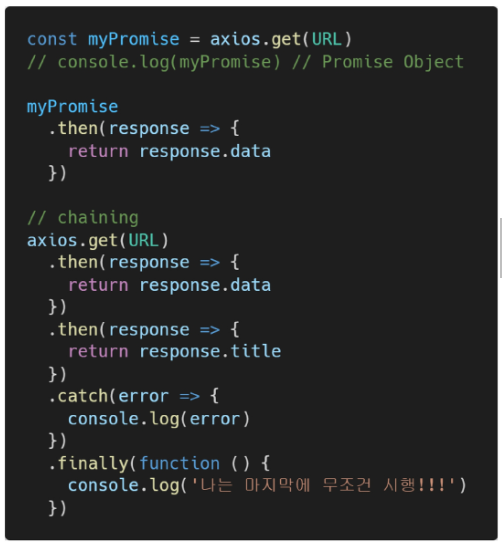

* 비동기 작업의 최종 완료 또는 실패를 나타내는 **객체**
  * 미래의 완료 또는 실패와 그 결과 값을 나타냄
  * 미래의 어떤 상황에 대한 약속(성공 했을때 + 실패 했을 때)
* 성공(이행)에 대한 약속:  성공하면 then 쓸거야
  * `.then()`
  * 콜백: resolve
* 실패(거절)에 대한 약속: 실패하면 catch 쓸거야
  * `.catch()`
  * 콜백: reject
* 장점
  * 가독성 개선
* 상태
  * pending 시작
  * fulfilled 성공 => `.then`에 있는 콜백 실행
  * rejected 실패 => `.catch` 에 있는 콜백 실행


### 2. Promise methods

```javascript
//promise 구조

const promise1 = new Promise((resolve, reject) => {
  resolve('Success!');
});

promise1.then((value) => {
  console.log(value);
  // expected output: "Success!"
});
```

[참조](https://developer.mozilla.org/en-US/docs/Web/JavaScript/Reference/Global_Objects/Promise/then)

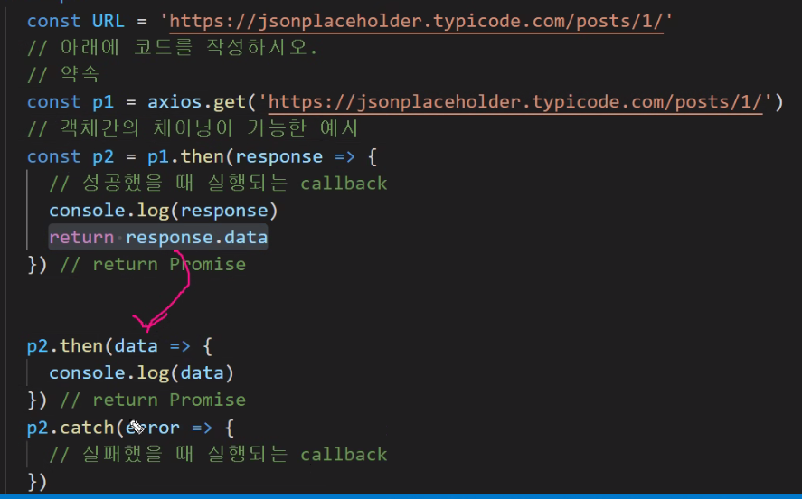

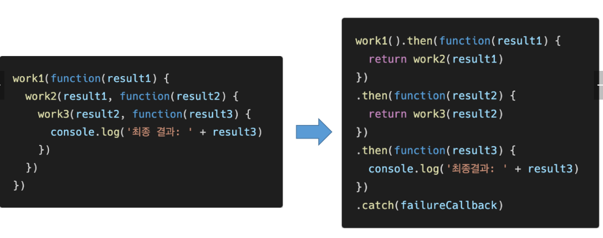

#### 1) `.then(callback)`

* 이전 작업(promise)이 **성공**했을 때(이행했을 때 )수행할 작업을 나타내는 callback 함수

* 그리고 각 callback 함수는 이전 작업의 **성공 결과**를 인자로 전달받음

* 따라서 성공했을때의 코드를 callback 함수 안에 작성

* RETURN 세가지 경우

  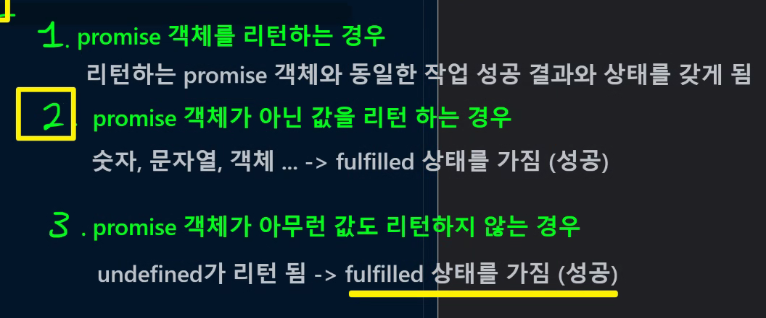

  * promise객체를 return 한다. 
    * 리턴하는 promise 객체와 동일한 작업성공결과와 상태를 가지게 됨

  * promise 객체가 아닌 값을 리턴하는 경우
    * 숫자, 문자열, 객체 ... => fulfilled 상태를 가진다고 인식(성공했다고 인식 -> 따라서 다음 `.then` 으로)

  * promise 객체가 아무런 값도 리턴하지 않는 경우
    * undefined 가 리턴. fulfilled 상태를 가진다고 인식(성공했다고 인식 -> 따라서 다음 `.then` 으로)


#### 2) `.catch(callback)`

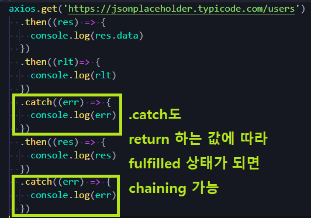

* `.then`이 하나라도 **실패**하면(거부되면) 동작(동기식의 'try-except' 구문과 유사)
* 이전 작업의 실패로 인해 생성된 error 객체는 catch 블록 안에서 사용할 수 있음

* 각각의 `.then()` 블록은 **서로 다른** promise를 반환
  * 즉, `.then()`을 여러 개 사용(chaining)하여 연쇄적인 작업을 수행할 수 있음
  * 결국 여러 비동기 작업을 차례대로 수행할 수 있다는 뜻
* **`.then()`**과 **`.catch()`** 메서드는 모두 **promise를 반환**하기 때문에 **chaining 가능**
* 주의
  * 반환 값이 반드시 있어야 함
  * 없다면 callback 함수가 이전의 promise 결과를 받을 수 없음(undefined가 들어올수는 있음)


#### 3) `.finally(callback)`

* Promise 객체를 반환
* **결과와 상관없이** 무조건 지정된 callback 함수가 실행
* 어떠한 인자도 전달받지 않음
  * Promise가 성공되었는지, 거절되었는지 판단할 수 없기 때문
* 무조건 실행되어야 하는 절에서 활용
  * `.then()`과 `.catch()` 블록에서의 코드 중복을 방지


### 3. Promise가 보장하는 것

* Async callback 작성 스타일과 달리 Promise가 보장하는 특징
  * callback 함수는 JavaScript 의 Event Loop가 현재 실행 중인 Call Stack을 완료하기 이전에는 절대 호출되지 않음
    * promise callback 함수는 Event Queue에 배치되는 **엄격한 순서**로 호출됨
  * 비동기 작업이 성공하거나 실패한 뒤에 `.then()` 메서드를 이용하여 추가한 경우에도 1번과 똑같이 동작
  * `.then()`을 여러 번 사용하여 여러 개의 callback 함수를 추가할 수 있음**(chaining)**
    * 각각의 callback은 주어진 순서대로 하나하나 실행하게 됨
    * **Chaining은 Promise은 가장 뛰어난 장점** :star:
  * 가독성 향상, 유지보수에 유용


## :five: :star: Axios :star:

### 1. 개념

* :star:**Promise based HTTP client for the browser**

* 브라우저를 위한 **Promise** 기반의 클라이언트

* 원래는 'XHR'이라는 브라우저 내장 객체를 활용해 AJAX 요청을 처리하는데, 이보다 편리한 AJAX 요청이 가능하도록 도움을 줌

  * 확장 가능한 인터페이스와 함께 패키지로 사용이 간편한 라이브러리를 제공

    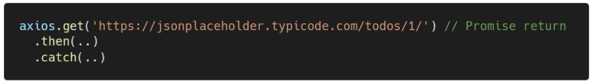

* promise chaining

  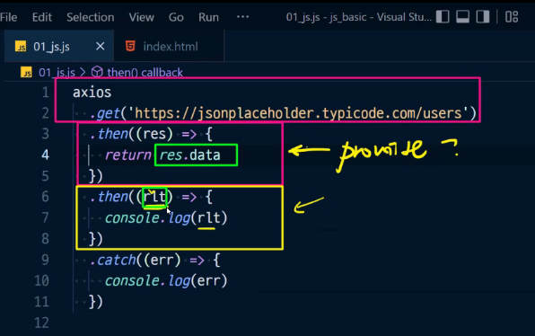

  * return 된 값이 바로 밑의 then method의 rlt 인자가 받는다. 만약 return이 없다면? undefined를 받음
  * 이런식으로 chaining이 되는 것
  * them method는 항상 promise 객체를 return 한다


### 2. Axios를 쓰는 이유

* XMLHttpRequest :arrow_forward: Axios 변경

  * 불러 오기만 하면,  내용이 확연히 줄어든 것을 볼 수 있음

  

  

* 이거를 조금 더 쉽게 쓸 수 있게 만들어 주는 라이브러리

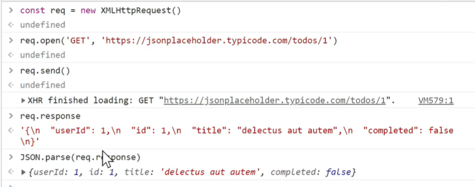


### 3. Axios 쓰는 법

#### 1) CDN 사용하기 : [Official Document](http://axios-http.com/kr/docs/intro)

* 둘 중 아무거나 사용해도 됨

* <body> 태그 바로 밑에 넣어주기 - 자바스크립트 파일 불러온 <script> 위에 위치해야 읽을 수 있음

  * jsDelivr CDN 

    ```html
    <script src="https://cdn.jsdelivr.net/npm/axios/dist/axios.min.js"></script>
    ```

  * unpkg CDN

    ```html
    <script src="https://unpkg.com/axios/dist/axios.min.js"></script>
    ```


#### 2) 예시

1. Axios 사용 예시 1

   ```javascript
   const URL = 'https://jsonplaceholder.typicode.com/todos/1'
   
   const responsePromise = axios.get(URL) // Promise return
   
   responsePromise
   	.then(function (res) { return res.data }) 
   	// 데이터 응답 제대로 받아오면 함수 실행
   	// 이때 리턴값에 파싱도 자동으로 해줌
   	.then(function (todo) ) { return todo.title }) // todo = res.data
   	.then(function (title) ) { console.log(title) })
   ```

2. 사용 예시 2

   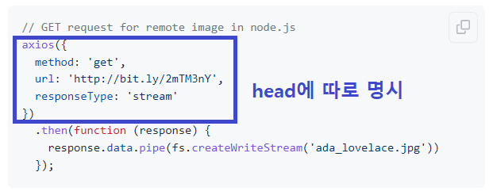

2. 사용 예시 3

   * 키 접근할때마다 chaining 해야 하는 것 아님. 그냥 chaining 보여주려는 예시일 뿐

     ```javascript
     .then(res => console.log(res.data.title)
     // 이런 식으로 chaining 없이 한꺼번에 부를 수도 있음
     ```

   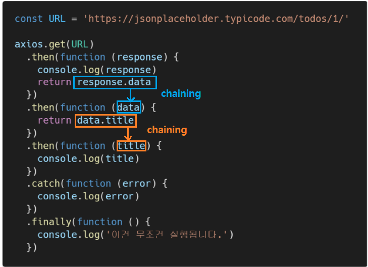

3. 사용 예시 4(화살표 함수)

   ```javascript
   const URL = 'https://jsonplaceholder.typicode.com/todos/1'
   
   const responsePromise = axios.get(URL) // Promise return
   
   responsePromise
   	.then( res => res.data ) 
   	.then( todo => todo.title ) // todo = res.data
   	.then( title => console.log(title))
   ```

   ```javascript
   // 화살표 함수 + catch(실패시) + finally(결과랑 노상관)
   const URL = 'https://jsonplacefolder.typicode.com/todos/1' // 원래 jasonplacaeholder
   const responsePromise = axios.get(URL) 
   
   responsePromise
   	.then( res => res.data ) 
   	.then( todo => todo.title )
   	.then( title => console.log(title))
   	.catch( err => console.log(err)) // error 발생
   	.finally( () => console.log('어쨌든 끝!'))
   ```

   ```javascript
   // 에러 메시지 customizing 하고싶다면
   // 1. 일반
   	.catch( err => {
           if (err.response.status === 404) {
               alert('그딴건 없다.')
           }
       })
   // 2. 삼항연산자
   	.catch( err => alert(err.response.status === 404 ? '없다' : '몰?루'))
   ```

   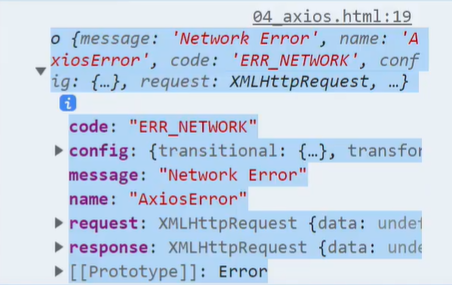

4. 사용 예시5( 특정 정보만 가져오려는 경우)

   ```javascript
   // 전체 중에 10번째 것만 찾아오자 
   
   const URL = 'https://jsonplaceholder.typicode.com/todos/'
   
   axios.get(URL)
   	.then ( res => {
       // todosArray에 전체 데이터를 받아온다
       const todosArray = res.data
       // todo 에 내가 원하는 조건, 즉 id=10인 데이터 하나를 찾은 후
       const todo = res.data.get(todo => todo.id === 10)
       // 찾은 데이터를 가지고 조작
       return axios.get(`${URL}${todo.id}`)
   	})
   	.then(res => console.log(res.data))
       .catch( err => {
              if (err.response.status === 404) {
       			alert('그런건 없다.')
   			}
             })
   ```
   
   


## :six: [부록] async & await

### 1. 개념

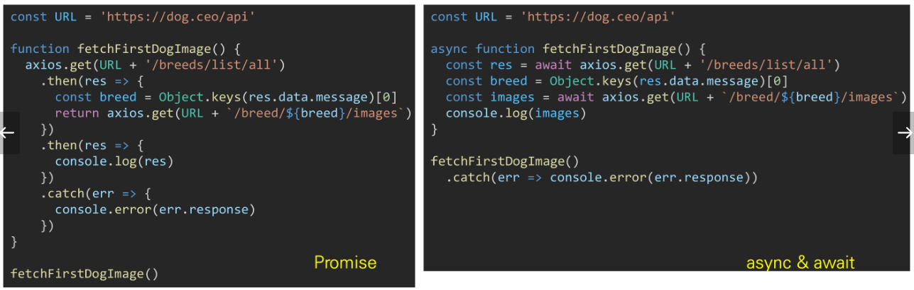

* 비동기 코드를 작성하는 새로운 방법(요즘방법)
* 기존 Promise시스템 위에 구축된 syntactic sugar

  * promise 구조의 then chaining을 제거
  * 비동기 코드를 조금 더 동기 코드처럼 표현가능
  * Syntactic sugar
    * 쉽게 읽고 표현할 수 있도록 설계된 프로그래밍 언어 내의 구문
    * 즉, 문법적 기능은 그대로 유지하되 사용자가 **직관적**으로 코드를 읽게 만듦
* callback function !== promise() == async == await
* Axios가 레거시 코드... 이므로 Axios에 익숙해진 이후에 async & await 을 써보자 


### 2. 예시

1. async & await

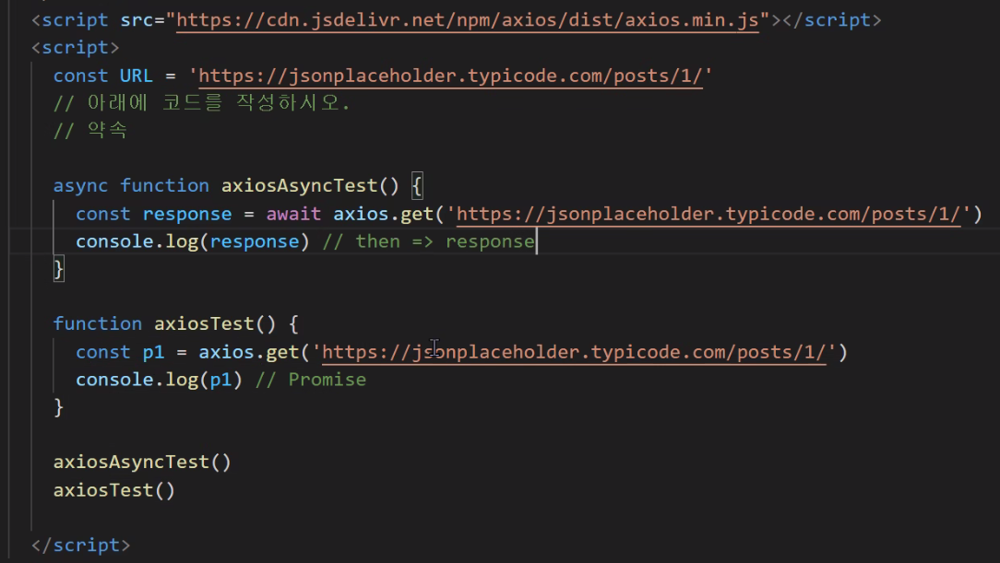

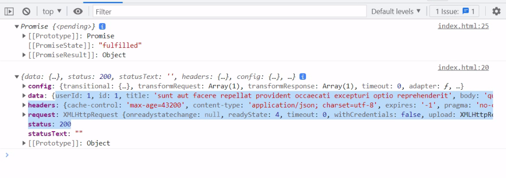

* axios로 똑같이 코딩을 한다면

  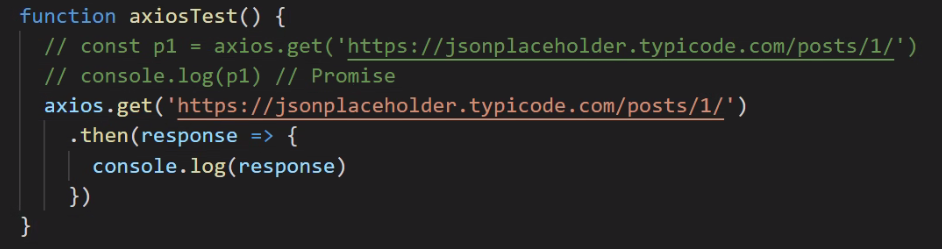

2. 멍멍이들

   ```html
   <script> CDN 가져오기 </script>
   <script>
       const URL = 'https://dog.ceo/api'
       axios.get(URL + '/breeeds/list/all')
       	.then(res => console.log(res.data))
   </script>
   ```

   * data 안에 message가 들어 있는 것을 알 수 있다

   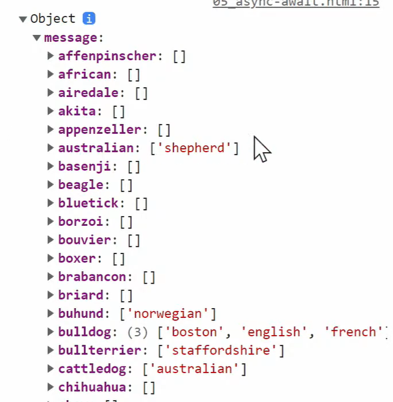

   * 전체 종(breed)을 받아 옴 

     * `'/breeds/all/'`

   * 종(breed) 목록 중에 첫번째 종에 대한 이미지 받아오기

     * `'/breed/images/...'` 

   * 일반 코드

     ```html
     <script> CDN 가져오기 </script>
     <script>
         const URL = 'https://dog.ceo/api'
         
         
         axios.get(URL + '/breeeds/list/all')
         	.then(res => {
             	// 전체 breed를 받아온다
             	const breedObj = res.data.message
                 const breedArray = Object.keys(breedObj)
                 const breed = breedArray[0] // 배열 젤 첨에 있는 affenpinsscher
                 
                 // ending slash 없습니다 
                 return axios.get(URL + `/breed/${breed}/images`)
         	})
         	.then(res => console.log(res))
         	.catch(err => console.error(err))
     </script>
     ```

   * 코드 with async & await

     * async & await 을 쓰려면, 함수로 묶는 작업 필수

     ```html
     <script>
         const URL = 'https://dog.ceo/api'
         
         function fetchDogImages() {
             axios.get(URL + '/breeeds/list/all')
                 .then(res => {
                     // 전체 breed를 받아온다
                     const breedObj = res.data.message
                     const breedArray = Object.keys(breedObj)
                     const breed = breedArray[0] // 배열 젤 첨에 있는 affenpinsscher
     
                     // ending slash 없습니다 
                     return axios.get(URL + `/breed/${breed}/images`)
                 })
                 .then(res => console.log(res))
                 .catch(err => console.error(err))
         }
         
         fetchDogImages()
     </script>
     ```

     * async, await 첨가

     ```html
     <script>
         const URL = 'https://dog.ceo/api'
         
         // 0. async-await를 사용하려면, 함수로 묶어야 한다
         // 1. 함수 블록 내부에 비동기로 동작하는 함수들을 찾아서 앞에 await를 남긴다
         // 이 함수 내부에 async한 작업이 존재한다
         async function fetchDogImages(){
             // 아래에서 순서가 보장되지 않는 함수 앞에 await를 적어준다 
             // 그럼 해당 코드가 끝날때까지 기다렸다가 넘어간다
             const res = await axios.get(URL + '/breeds/list/all')
             const breedObj = res.data.message
             const breedArray = Object.keys(breedObj)
             const breed = breedArray[0]
             // await
             const images = await axios.get(URL + `/breed/${breed}/images`)
             console.log(newRes)
         } 
         fetchDogImages()
         	.catch(err => console.error(err))
     </script>
     ```

     

## :seven: JS 비동기처리 패키지 계보(?)


* XMLHttpResponse() - before
* fetch - ES6
* axios:star: - fetch에 기능 더 넣어서 
* Async/Await - ES8