# JavaScript Basic2

[TOC]


## :one: 함수

### 1. 함수 in JavaScript

* **참조 타입 중 하나**로써 function 타입에 속함

* **:star: 함수는 "값" 이다!**

  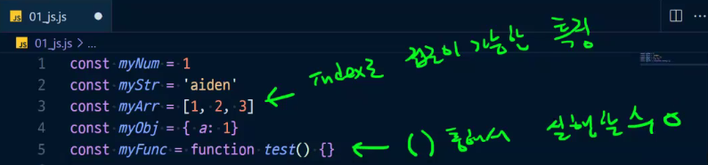

  *  소괄호를 통해 실행할 수 있는 특징이 있음 (리스트 같은 경우 index로 접근이 가능한 특징이 있듯)
  *  너무 자연스럽게 변수에 할당이 가능함
  *  변수에 들어갈 수 있다 = 다른 함수의 인자로 들어갈 수 있다
  *  다른 함수의 return 값이 될 수도 있다

* JavaScript에서 함수를 정의하는 방법은 주로 2가지로 구분

  * 함수 선언식(function declaration)
  * 함수 표현식(function expression)

* 참고) JavaScript의 함수는 일급 객체(First-class citizen)에 해당

  * **일급 객체**: 다음의 조건들을 만족하는 객체를 의미
    * 변수에 할당 가능
    * 함수의 매개변수로 전달 가능
    * 함수의 반환 값으로 사용 가능

* python 의 딕셔너리와 유사

  * 어떤 종류의 값이든 올 수 있다

  * 값에 함수를 넣을수도 있는 것! 

    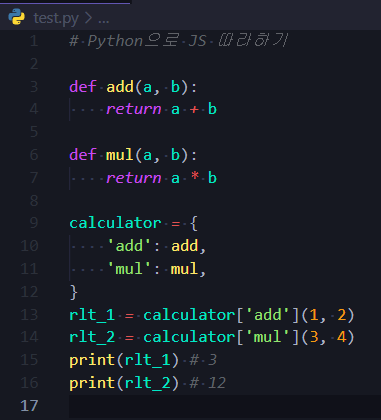

  * 익명 함수(lambda) 사용

    *  이름이 없는 함수 (즉, 불릴 일 없다)
    *  파이썬에서는 제한적인 상황에서 많이 쓴다. 예) 한줄로 쓸 때
    *  그런데 JS에는 한줄제약같은게 없다 - 함수의 인자 10줄 가능

    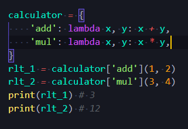


### 2. 함수 선언식 vs 함수 표현식

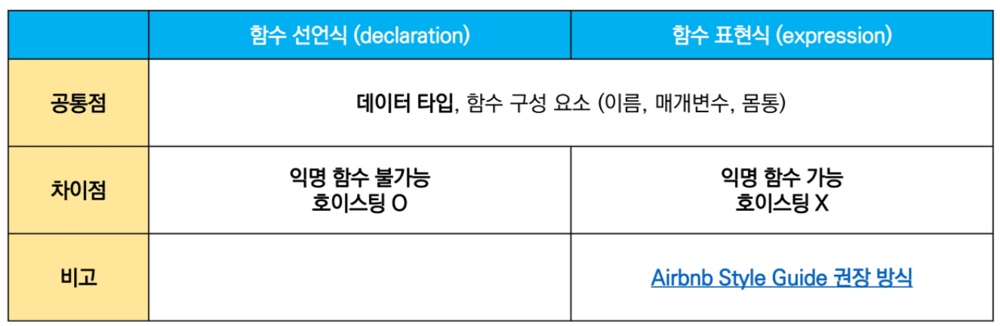

#### 1) 함수 선언식(function statement, declaration)

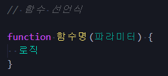

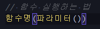

* 함수의 이름과 함께 정의하는 방식
* 3가지 부분으로 구성
  * 함수의 이름(함수명)
  * 매개변수(파라미터)
  * 몸통(중괄호 내부)(로직)


#### 2) 함수 표현식(function expression)

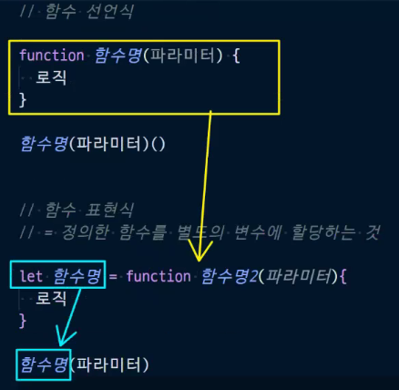

* :star: 정의한 함수를 별도의 변수에 할당하는 것

* 함수를 표현식내에서 정의하는 방식

  * 표현식: 어떤 하나의 값으로 결정되는 코드의 단위

* 함수의 **이름을 생략하고 익명 함수로 정의 가능**

  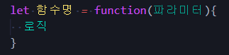

  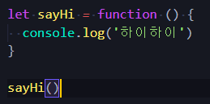

  * 익명 함수(anonymous function): 이름이 없는 함수
  * 익명 함수는 함수 표현식에서만 가능

#### 3) 공통점

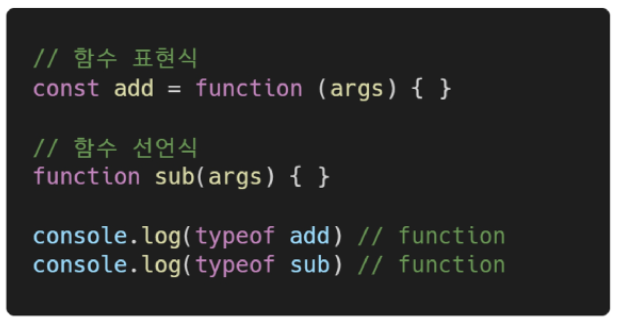

* 선언식 함수와 표현식 함수 모두 타입은 function으로 동일


#### 4) 차이점 - hoisting

* 함수 선언식

  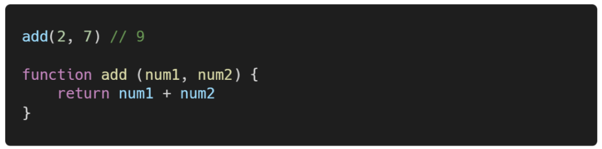

  * **함수 선언식**으로 선언한 함수는 var로 정의한 변수처럼 **hoisting 발생**

  * 함수 호출 이후에 선언해도 동작

* 함수 표현식

  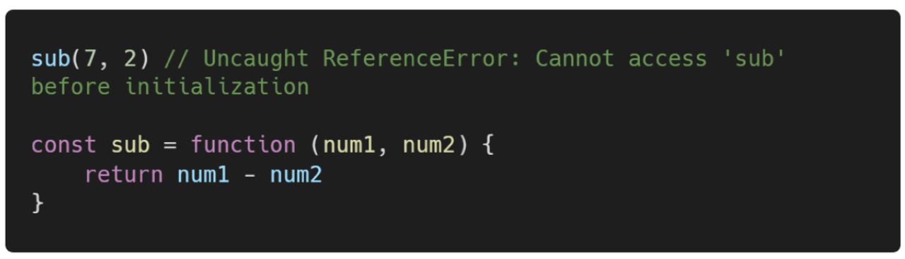

  * 함수 표현식으로 선언한 함수는 함수 정의 전에 호출 시 에러발생

  * 함수 표현식으로 정의된 함수는 **변수로 평가**되어 변수의 scope 규칙을 따름

  * 함수 표현식을 var 키워드로 작성한 경우, 변수가 선언 전 undefined로 초기화 되어 다른 에러가 발생

    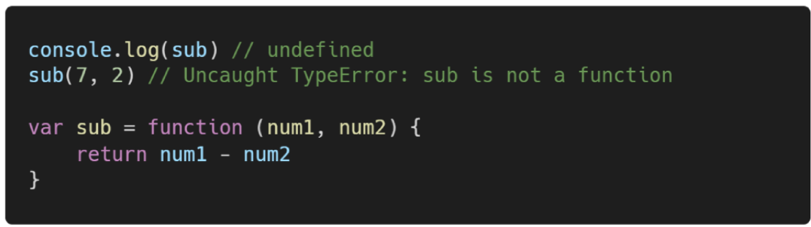

    

### 3. 기본 인자(default arguments)

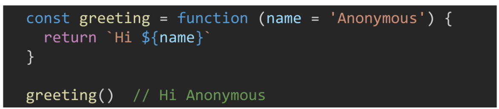

* 인자 작성시 '=' 문자 뒤 기본 인자 선언 가능


### 4. 매개변수가 인자의 갯수 불일치를 허용

* 매개변수보다 인자의 갯수가 많을 경우

  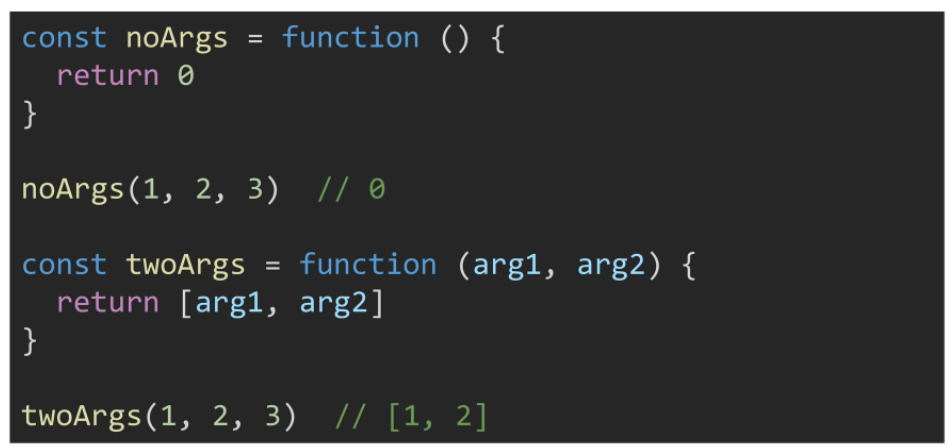

* 매개변수보다 인자의 갯수가 적을 경우

  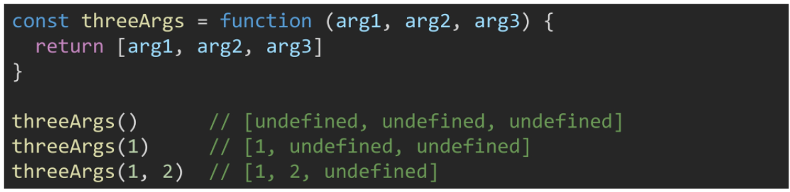

  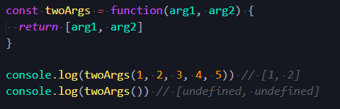


### 5. **REST parameter**

* `rest parameter(...)`를 사용하면 함수가 정해지지 않은 수의 매개변수를 배열로 받음(python의 *args와 유사)
  * 만약 rest parameter로 처리한 매개변수에 인자가 넘어오지 않을 경우에는, 빈 배열로 처리

* 들어오는 매개변수를 배열로 만들어주는 것

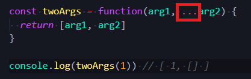

* 예시

  

  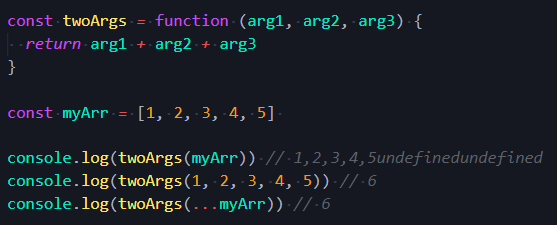

  

### 6. **spread operator**

* `spread operator(...)` 을 사용하면 배열 인자를 전개하여 전달 가능

* 펼쳐주는 것

  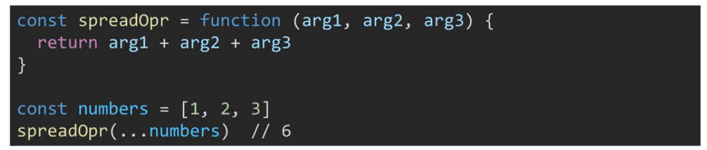

  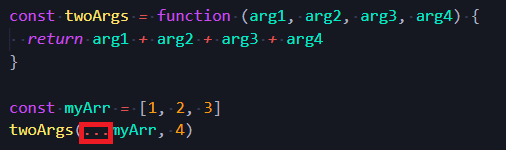


* 3가지 부분으로 구성
  * 함수의 이름(생략 가능)
  * 매개변수(args)
  * 몸통(중괄호 내부)


### 7. 화살표 함수(arrow function)

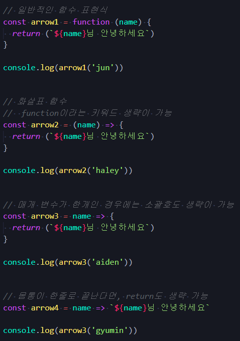


## :two: 문자열

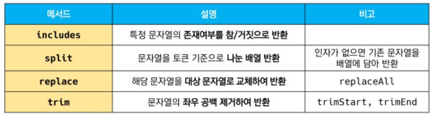

### 1. `includes`

* `string.includes(value)`
  * 문자열에 value가 존재하는지 판별 후 참 또는 거짓 반환

### 2. `split`

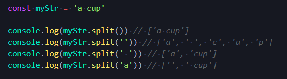

* `string.split(value)`
  * value가 없을 경우, 기존 문자열을 배열에 담아 반환
  * value가 빈 문자열일 경우, 각 문자로 나눈 배열을 반환
  * value가 기타 문자열일 경우, 해당 문자열로 나눈 배열을 반환


### 3. `replace`

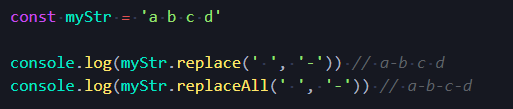


### 4. `trim`

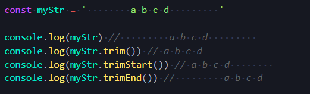


## :three: 배열(Arrays)

### 1. 배열의 정의와 특징


### 2. 배열 관련 주요 메서드 목록: 기본

#### 1) `reverse` 

#### 2) `push & pop`

#### 3) `unshift & shift`

#### 4)


### 3. 배열 관련 주요 메서드 목록: 심화

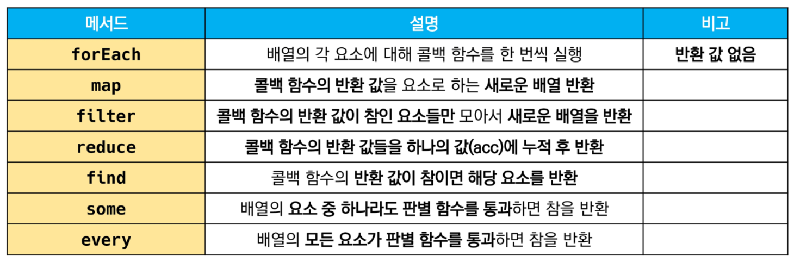

* 배열을 순회하면서 특정 로직을 수행하는 메서드

* 메서드 호출 시 인자로 callback함수를 받는 것이 특징

  * callback함수: 어떤 의 내부에서 실행될 목적으로 인자로 넘겨받는 함수를 말함

  * ```javascript
    myFunc(myFunc2)
    // 여기서 myFunc2가 callback 함수
    ```

  

#### 1) `forEach` 


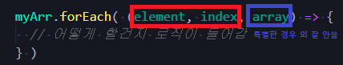

* 예제

  

  * 답

    ```javascript
    const images = [
      {height: 10, width: 30},
      {height: 20, width: 90},
      {height: 54, width: 32},
    ]
    
    const areas = []
    
    images.forEach((elem, idx) => {
      console.log(elem)
      console.log(elem['height'])
      console.log(elem.height) // <<<< 추천 형식
    
      areas.push(elem.height * elem.width)
    })
    
    console.log(areas)
    ```

    

#### 2) `map`

* 배열의 각 요소에 대해 콜백 함수를 한번씩 실행
* 콜백 함수의 반환 값을 요소로 하는 **새로운 배열** 반환
* 기존 배열 전체를 다른 형태로 바꿀 때 유용


#### 3) `filter`

* 배열의 각 요소에 대해 콜백 함수를 한번씩 실행
* 콜백 함수의 **반환 값이 참인 요소**들만 모아서 **새로운 배열** 반환
* 기존 배열 요소들을 필터링할 때 유용


#### 4) `reduce`

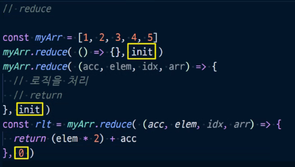

* init: 초기값

* 배열의 각 요소에 대해 콜백 함수를 한 번씩 실행
* 콜백 함수의 반환 값들을 하나의 값 (acc)에 누적 후 반환
* reduce 메서드의 주요 매개변수
  * acc
    * 이전 callback함수의 반환 값이 누적되는 변수
  * initialiValue(optional)
    * 최초 callback 함수 호출 시 acc에 할당하는 값, default 값은 배열의 첫번째 값
* (참고) 빈 배열의 경우 initialValue를 제공하지 않으면 에러 발생

#### 5) `find`

* * 


#### 6) `some`

#### 7) `every`

* 배열의 모든 요소가 주어진 판별 함수를 통과하면 참을 반환
* 하나의 요소라도 통과하지 못하면 거짓 반환
* (참고)

#### 8) 

### 4.

### 5.


## :four: 객체(Objects)

### 1. 객체의 정의와 특징

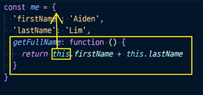

* :star: 어떠한 객체 안에 있는 메서드에서 사용하는 this는 그 객체를 의미한다

* 객체에서 바로쓰는 this는 window를 의미한다.

  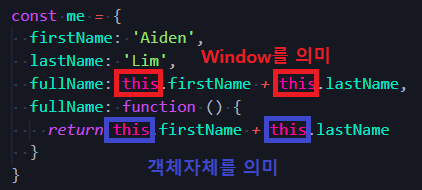

  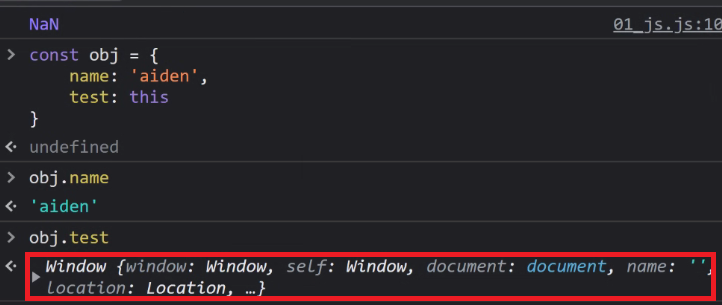

* 객체는 속성(property)의 집합이며, 중괄호 내부에 key와 value의 쌍으로 표현

* **key**는 **문자열 타입만** 가능

  * 참고) key 이름에 띄어쓰기 등의 구분자가 있으면 따옴표로 묶어서 표현

* **value**는 **모든 타입(함수포함)** 가능

* 객체 요소 접근은 점 또는 대괄호로 가능

  * 참고) key 이름에 띄어쓰기 같은 구분자가 있으면 대괄호 접근만 가능

### 2. 객체와 메서드

* 메서드는 어떤 객체의 속성이 참조하는 함수
* `객체.메서드명()` 으로 호출이 가능
* 메서드 내부에서는 this 키워드가 객체를 의미함
  * fullName은 메서드가 아니기 때문에 정상출력되지 않음(NaN)
  * getFullName은 메서드이기 때문에 해다아 객체의 firstName과 lastName을 정상적으로 이어서 반환


### 3. 객체 관련 ES6 문법 익히기

#### 1) 속성명 축약(shorthand)

* 객체를 정의할 때 **key와 할당하는 변수명이 같으면** 줄여쓸 수 있다

* 굉장히 많이 씀

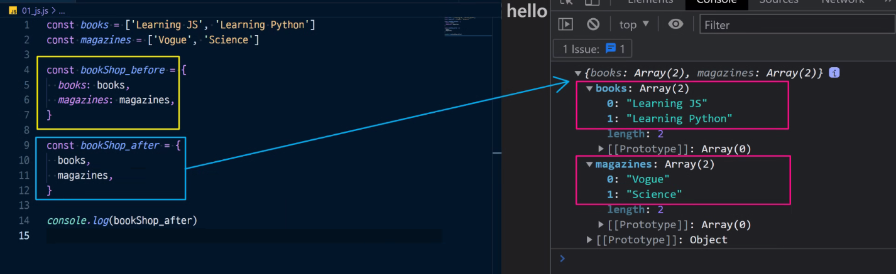

#### 2) 메서드명 축약(shorthand)

* function 

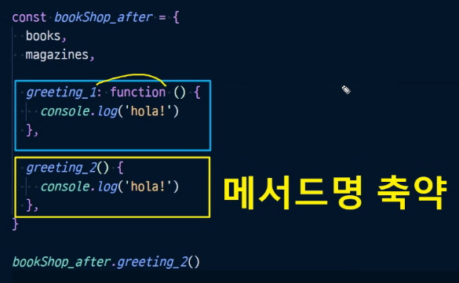

#### 3) 계산된 속성명 사용하기(computed property name)

* 객체를 정의할 때 key의 이름을 표현식을 이용하여 동적으로 생성 가능

* **동적**으로 **key의 이름**을 바꿀 수 있다는 것

  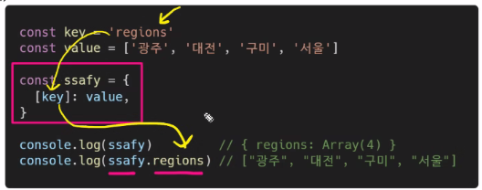

  

#### 4) 구조 분해 할당(destructing assignment)

* 구조 분해 할당은 배열도 가능

* 반복되는 부분을 줄여준다

  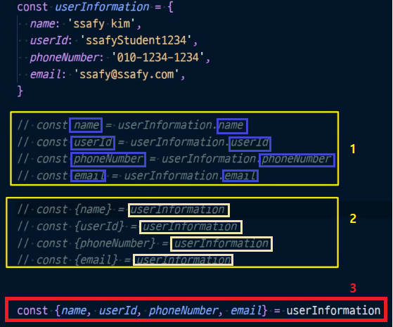

#### 5) 객체 전개 구문(Spread Operator) 

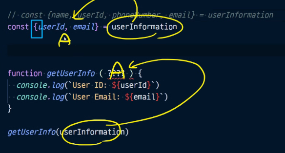

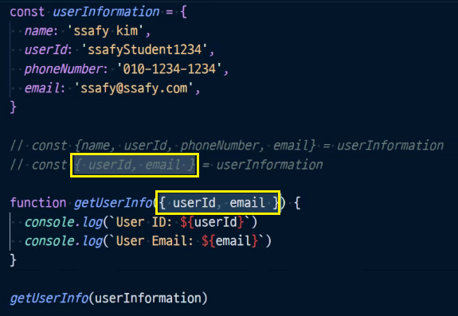


### 4. JSON (JavaScript Object Notation)

#### 1) 개념

*  key-value쌍의 형태로 데이터를 표기하는 언어 독립적 표준 포맷
*  자바스크립트의 객체와 유사하게 생겼으나, 실제로는 **문자열 타입**
   * 따라서, JS의 객체로써 조작하기 위해서는 구문 분석(parsing)이 필수
*  :star: 자바스크립트에서는 JSON을 조작하기 위한 두 가지 내장 메서드를 제공
   * `JSON.parse()`
     * JSON => 자바스크랩트 객체
   * `JSON.stringify()`
     * 자바스크립트 객체 => JSON

#### 2) `JSON.parse()`

* JSON => JavaScript Object

  

#### 3) `JSON.stringify()`

* JavaScript Object => JSON

  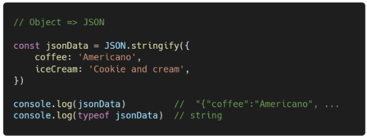

  

### 5. 참고: 배열은 객체다

* 키와 속성들을 담고 있는 참조 타입의 객채(object)

* 배열은 인덱스를 키로 가지면, length 프로퍼티를 갖는 특수한 객체

  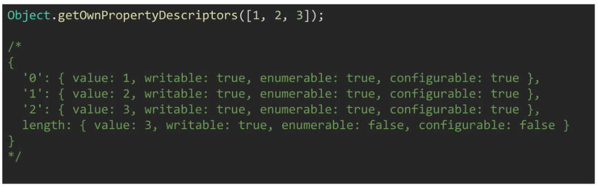


## :five: this 정리

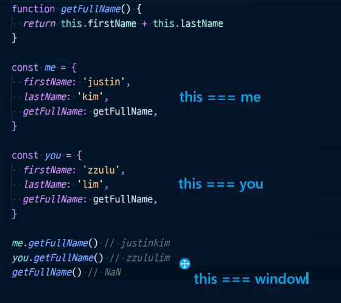

### 1. `this` is `window`?, `object`?


* JS의 `this`는 실행 문맥(execution context)에 따라 다른 대상을 가리킨다
* class 내부의 생성자(constructor)함수
  * `this`는 생성되는 객체를 가리킴(Python의 `self`)
* 메서드(`객체.메서드명()` 으로 호출 가능한 함수)
  * `this`는 해당 메서드가 소속된 객체를 가리킴
* 위의 두가지 경우를 제외하면, 모두 최상위 객체(`window`)를 가리킴


### 2. function 키워드와 화살표 함수 차이 

* `this.radiuses`는 메서드(객체.메서드명()으로 호출 가능) 소속이기 때문에 정상적으로 접근 가능
* `forEach`의 콜백함수의 경우 메서드가 아님(객체.메서드명()으로 호출 불가능)
* 때문에 콜백함수 내부의 `this`는 `window`가 되어 `this.PI`는 정상적으로 접근이 불가능
* 이 콜백함수 내부에서 `this.PI` 에 접근하기 위해 함수객체 `.bind(this)` 메서드를 사용
* 이 번거로운 `bind` 과정을 없앤 것이 화살표 함수

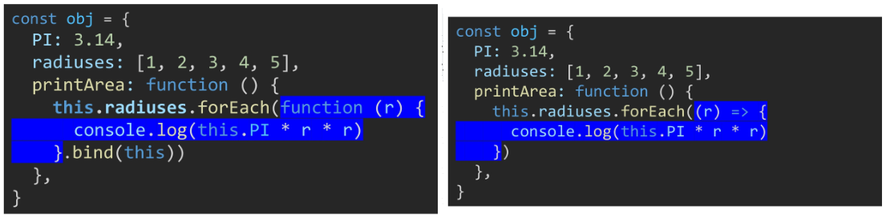

* 함수 내부에 `this` 키워드가 존재할 경우
  * 화살표함수와 function 키워드로 선언한 함수가 다르게 동작
* 함수 내부에 `this` 키워드가 존재하지 않을 경우
  * 완전히 동일하게 동작


## :six: lodash

### 1. A modern JavaScript utility LIBRARY

* 모듈성, 성능 및 추가 기능을 제공하는 JS 유틸리티 :star:**라이브러리!** :star:
* [LODASH official documentation](https://lodash.com/docs/4.17.15)
* array, objects 등 자료구조를 다룰 때 사용하는 유용하고 간편한 유틸리티 함수들을 제공
* 함수 예시
  * `reverse`, `sortBy`, `range`, `random`, `cloneDeep`(딥카피)


### 2. 사용 예시

#### 1) lodash CDN

* `index.html`

  ```html
  <!DOCTYPE html>
  <html lang="en">
  <head>
    ...
    ...
  </head>
  <body>
    ...
    ...
    <script src="https://cdn.jsdelivr.net/npm/lodash@4.17.21/lodash.min.js"></script>
    <script src="01_js.js"></script>
  </body>
  </html>
  ```

  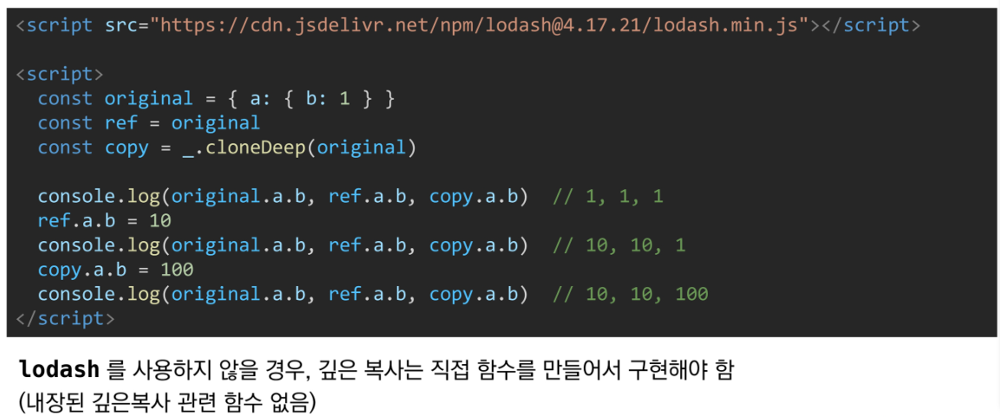

  