# JavaScript Basic Code Practice


* 기본세팅

  1. html 파일 만들기

  1. js파일 만들기

  1. `<script src="01.js"></script>` 로 js파일과 html 파일 연결해주기

  1. Open with Live Server


## :one: BOM

1. html

   ```html
   <body>
     <h1>HELLO</h1>
     <div id="content">
       <h2 id="title-1">내가 좋아하는 기기목록</h2>
       <ul id="list-1">
         <li>갤럭시탭</li>
         <li>MS서피스랩탑</li>
         <li>에어팟</li>
         <li>아이폰</li>
         <li>아이패드갖고싶다</li>
       </ul>
     </div>
     <script src="02_js.js"></script>
   </body>
   </html>
   ```

2. `querySelector`

   ```javascript
   const elem1 = document.querySelector('#title-1')
   console.log(elem1)
   ```

3. `querySelectorAll` - list 여러개 선택

   * 유사배열 반환

   ```javascript
   const elem2 = document.querySelector('li')
   console.dir(elem2)
   ```

   

4. `querySelectorAll` - 단일 객체 선택

   * 리스트로 반환

   ```javascript
   const elemlist = document.querySelectorAll('#list-1')
   ```

   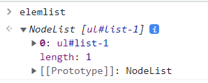

5. InnerHTML

   * 리스트 뿐만 아니라 들여쓰기까지 가져온다

   ```javascript
   const elem1 = document.querySelector('#list-1')
   const myHtml = elem1.innerHTML
   console.log(myHtml)
   ```

   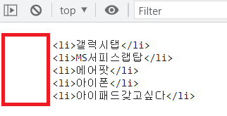

   * 새로운 list 추가해주기

   ```javascript
   const elem1 = document.querySelector('#list-1')
   const myHtml = elem1.innerHTML
   
   elem1.innerHTML += '<li>새로운기기</li>'
   ```

   

6. OuterHTML

   * 들여쓰기 가지고 온다

   ```javascript
   const elem1 = document.querySelector('#list-1')
   const myHtml = elem1.outerHTML
   console.log(myHtml)
   ```

   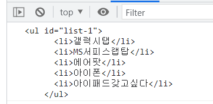

7. 첫번째 선택 선택해서 가져오기

   * `firstElementChild` 첫번째 선택 선택해서 가져오기

   ```javascript
   const elem1 = document.querySelector('#list-1')
   const firstElem = elem1.firstElementChild
   console.log(firstElem)
   ```

   * `children`을 사용해 첫번째 선택 가져오기
     * 유사배열 형태로 가져옴 - 인덱스 접근 가능

   ```javascript
   const elem1 = document.querySelector('#list-1')
   const children = elem1.children
   console.log(children[0])
   ```

   

   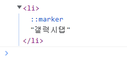

8. 마지막 선택 선택해서 가져오기

   * `lastElementChild`

   ```javascript
   const elem1 = document.querySelector('#list-1')
   const lastElem = elem1.lastElementChild
   console.log(lastElem)
   ```

9. `parent`:내가 선택한 노드의 부모노드 선택하기

   ```javascript
   const elem1 = document.querySelector('#list-1')
   const parent = elem1.parentElement
   console.log(parent)
   ```

   

10. `sibling`: 내가 선택한 노드의 형제노드 선택하기

    * html에 형제 리스트 만들어주기

    ```html
    <body>
      <h1>HELLO</h1>
      <div id="content">
        <h2 id="title-1">내가 좋아하는 기기목록</h2>
        <ul id="list-1">
          <li>갤럭시탭</li>
          <li>MS서피스랩탑</li>
          <li>에어팟</li>
          <li>아이폰</li>
          <li>아이패드갖고싶다</li>
        </ul>
        <ul id="list-2">
          <li>애플워치</li>
          <li>아이폰13</li>
          <li>에어팟프로</li>
        </ul>
      </div>
      <script src="02_js.js"></script>
    </body>
    ```

    * `previousElementSibling`: 앞에 있는 형제목록 가져오기

    ```javascript
    const elem1 = document.querySelector('#list-1')
    const previous = elem1.previousElementSibling
    console.log(previous)
    ```

    * `nextElementSibling`: 뒤에 있는 형제 목록 가져오기

    ```javascript
    const elem1 = document.querySelector('#list-1')
    const next = elem1.nextElementSibling
    console.log(next)
    ```

11. `innerHTML` vs `textContent`

    * TEXT 가져오기
      * 차이 없음

    ```javascript
    const elem1 = document.querySelector('#title-1')
    const myText1 = elem1.innerHTML
    console.log(myText1)
    
    const myText2 = elem1.textContent
    console.log(myText2)
    ```

    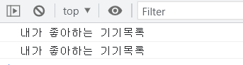

    * 리스트 가져오기

      * `innerHMTL`는 요소 안에 있는 **HTML 자체**를 문자열로 리턴

        `textContent`는 요소 안에 있는 HTML 중에서, **HTML은 제외**하고 리턴

    ```javascript
    const elem2 = document.querySelector('#list-1')
    const myList1 = elem2.innerHTML
    console.log(myList1)
    
    const myList2 = elem2.textContent
    console.log(myList2)
    ```

    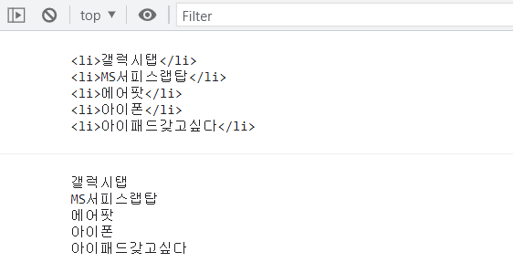

12. `outerHTML`

    * 한번 변경하게 되면 완전히 새로운 요소로 변경됨. 따라서 다시 접근하기 위해서는 querySelector로 다시 잡아주어야 한다.
    * 따라서 주의해야 함

13. `remove()`: 삭제

    ```javascript
    const elem1 = document.querySelector('#list-2')
    elem1.remove()
    ```

14. `append()`: 이동

    * `append()`, `prepend()`, `before`, `after`

    ```javascript
    const elem1 = document.querySelector('#list-1')
    const targetElem = elem1.lastElementChild
    const sourceElem = elem1.children[1]
    targetElem.append(sourceElem)
    ```

    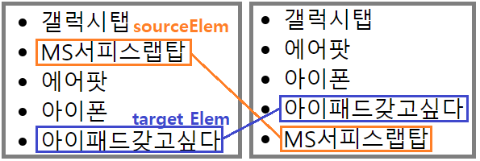

15. `createElement`, `textContent`: 새로운 노드 생성 및 노드 꾸미기

    ```javascript
    // 새로운 노드(태그) 생성
    const newNode = document.createElement('li')
    
    // 노드 꾸미기
    newNode.textContent = '전기모기채'
    
    // 원하는 위치로 이동
    const elem2 = document.querySelector('#list-2').append(newNode)
    ```

    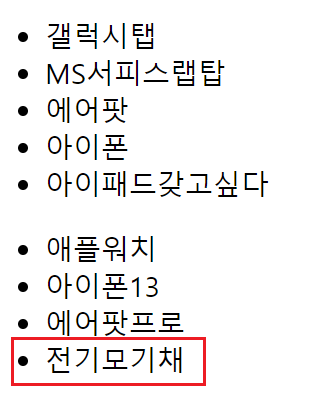

    :question: 왜 이건 안되지?

    ```javascript
    const elem2 = document.querySelector('#list-2').lastElementChild


## :two: HTML 속성 다루기

1. Element.`setAttribute(name, value)`

2. Element.`getAttribute(attributeName)`

3. `style` 

   * 자바스크립트로 배경 색상 바꾸기
     *  단, 이런식으로 JS에서 직접 스타일을 변경하면 스타일 우선순위가 높아져 버리기 때문에 좋지 않고 코드 역시 불필요하게 많이 사용해야 한다는 단점이 있다.
     * 따라서 자바스크립트로 이러한 스타일을 적용하는 것은 지양하자. CSS파일을 에 따로 해놓고 id와 class에 적용

   ```javascript
   const elem1 = document.querySelector('#list-1')
   const elem2 = document.querySelector('#list-2')
   
   elem1.style.backgroundColor = '#dd151d'
   elem2.style.backgroundColor = '#dd151d'
   ```

   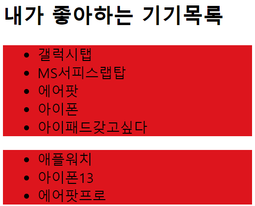

   * CSS 사용: 배경 바꾸기 + 폰트 색상 바꾸기

   ```html
   <!-- html -->
   <head>
   	<link rel="stylesheet" href="style.css">
   </head>
   ```

   ```css
   /* css */
   .RedBG {
     background-color: #dd151d;
   }
   
   .GreenBG {
     background-color: green;
   }
   ```

   ```javascript
   // javascript
   elem1.className = 'GreenBG'
   elem2.className = 'RedBG'
   ```

   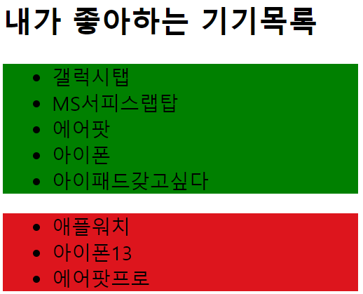

   * `classList` : 클래스 속성 하나씩 다룰때 사용. 여기서는 폰트 색상 바꿀 것
     * `add`, `remove`, `toggle` 이라는 형식을 지원
     * toggle: 있으면 제거하고, 없으면 추가해줌

   ```javascript
   elem1.className = 'GreenBG'
   elem1.classList.add('WhiteFont')
   elem2.className = 'RedBG'
   ```

   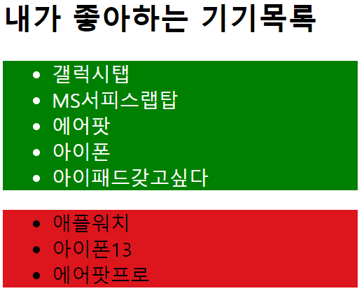

   * toggle 사용 예시

   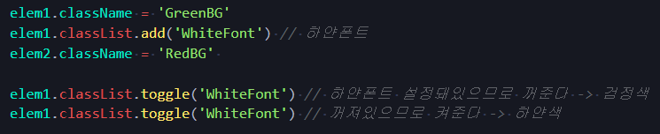


## :three: Event

```javascript
// 일단 적용할 부분 잡아놓기
const elem1 = document.querySelector('#list-1')
const elem2 = document.querySelector('#list-2')
```

1. console 찍게 나오는 함수 만들어보기

   ```javascript
   function myClick() {
     console.log('눌렀냐?')
   }
   ```

2. `addEventListener`

   ```javascript
   elem1.addEventListener('click', myClick)
   ```

3. 삭제가 안되는 함수

   * 이런 경우 remove 사용해도 제거되지 않으므로 이런식으로 쓰는 것을 지양하자

   ```javascript
   elem1.addEventListener('click' function() {
     console.log('새로운 익명함수')
   })
   elem1.removeEventListener('click', function() {
     console.log('새로운 익명함수')
   })
   ```

4. 객체 선택 후 할 수 있는 메서드 목록 보기

   ```javascript
   function myClick(e) {
     console.log(e)
   }
   ```

   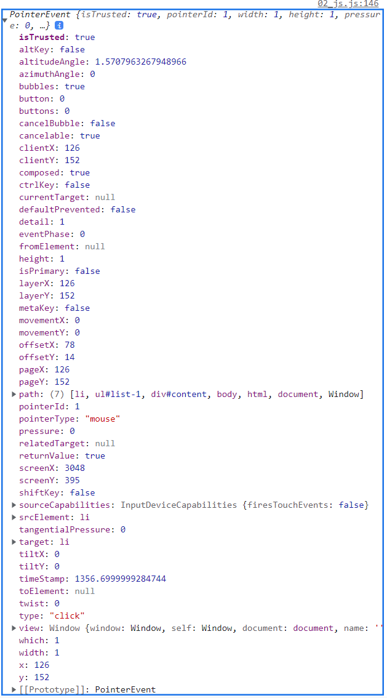

5. `EventBubbling`

   * 같은 이벤트를 가지고 있는 것 끼리만 일어난다

   ```javascript
   const contentElem = document.querySelector('#content')
   const listElem = document.querySelector('#list-1')
   
   function myClick(event) {
     console.log('hello')
   }
   
   contentElem.addEventListener('click', myClick)
   listElem.addEventListener('click', myClick)
   ```

   * 이런식으로 list-1을 누르면 한 번이 아니라 두번 누른걸로 표시가 된다

   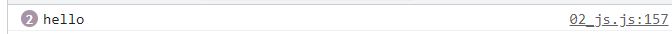

   * 이유는 바로 이것!

   

   * 다른 식으로도 확인해보기
     * list-1의 갤럭시 탭 클릭시

   ```javascript
   function myClick(event) {
     console.log('hello')
     console.log(event.target)
     console.log(event.currentTarget)
   }
   
   
   contentElem.addEventListener('click', myClick)
   listElem.addEventListener('click', myClick)
   ```

   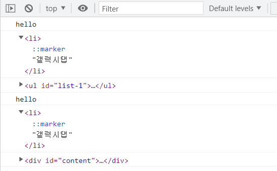

   * 이벤트 버블링은 Document를 만날때까지 계속 일어난다
   * 

6. `stopPropagation()`:event bubbling을 막을 수 있음

   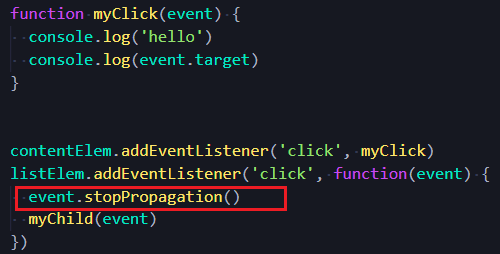

   ```javascript
   
   function myClick(event) {
     console.log('hello')
     console.log(event.target)
   }
   
   
   contentElem.addEventListener('click', myClick)
   listElem.addEventListener('click', function(event) {
     event.stopPropagation()
     myChild(event)
   })
   ```

   

## :four: 형변환

1. `-` 버튼 누르면, -1, `+` 버튼 누르면 +1 해주는 버튼 만들기

   *  `html`

   ```html
   <body>
     <h1 id="number">0</h1>
     <button id="minusBtn">-</button>
     <button id="plusBtn">+</button>
     
     <script src="jsprac_0428.js"></script>
   </body>
   </html>
   ```

   * `js`

   ```javascript
   const minusBtn = document.querySelector('#minusBtn')
   const plusBtn = document.querySelector('#plusBtn')
   const number = document.querySelector('#number')
   
   minusBtn.addEventListener('click', function(event) {
     number.innerText --
   })
   
   plusBtn.addEventListener('click', function(event) {
     number.innerText ++
   })
   ```

   * Airbnb 스타일가이드 따르려면 형변환해야됨 

   ```javascript
   minusBtn.addEventListener('click', function(event) {
     number.innerText -= 1
   })
   
   plusBtn.addEventListener('click', function(event) {
     number.innerText += 1
   })
   ```

   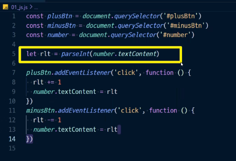

2. innertext 와 text content  차이

   * mdn에 innertext, textcontet 두시고 한번씩 들어가서 읽어보시면 한번에 이해가 되실 거예요그리고 콘솔로그로 한번씩 찍어봇에ㅕㅁ


## :five: