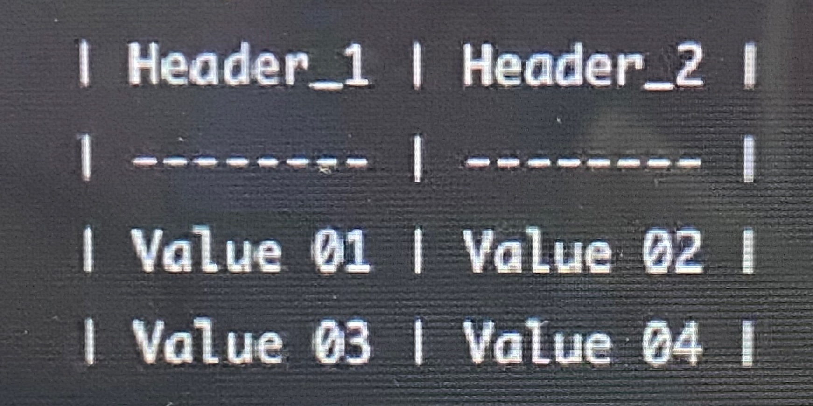

# MARKDOWN


**Markup** : Tag 이용, 문서의 구조를 나타내는것

- md: markdown 확장자

- markdown만 전문적으로 취급하는 Notepad: Jupyter Note, Notion, Typora
- Typora: 특히 이미지, 표 삽입시 매우 편리


**"#" (heading)**

- #의 개수에 따라 제목의 수준을 구별(h1~h6), 글씨 키우기 위해 사용하면 안됨
- 숫자가 커질수록 작아짐.


**List** 

- 목록을 표시하기 위해 사용
- 순서가 있는 리스트(1, 2, 3)와 순서가 없는 리스트로 나누어진다
- 순서가 있는 리스트 사용시: 1) 2) 3) or 1. 2. 3.
- 순서가 없는 리스트: "-" or "*" (bulletpoint)
- shift + tab 은 들여쓰기가 된 것을 취소할 수 있음


**"``" (Code Block)**

- 코드를 적는 블럭 모양. 일반 텍스트와 다르게 코드를 이쁘게 출력한다.

- 특정 언어를 명시하면 구문 강조(syntax highlighting)를 지원
- inline code block(`) 은 구문강조를 지원하지 않음. 일반 문장에서 코드만 강조하기 위해 사용.
- code block은 block안에 코드를 작성할 때 사용 이 사이에 적힌 문자들은 모두 코드로 인식. 언어별 highlighting이 가능하게 해 줌

- ex) "출력을 하는 파이썬 문법은 `print()`를 이용한다."

- ```
  * "```"" #세개를 쓰면 블럭이 생기고, 요 안에다가 코드를 쓸 수 있음. 
  * 박스 클릭시 "select a language"가 뜨는데, 여기서 언어를 골라서 사용할 수 있음.
  * "```"다음에 언어를 바로 쓰고 엔터 치면 굳이 select하지 않아도 ok
  ```

- ```python
  def test():
  	print("git")
  ```


**Link**

- [string은 보여주는 부분],  (url은 연결되는 웹 주소)
- [google](https://www.google.com)
- [마크다운총정리문서](http://heropy.blog/2017/09/30/markdown/)
- url부분에 파일의 경로(path)를 넣어 다운로드 가능한 링크로 만들 수도 있음


**Image**

- !, [string],(img_url)
- 이미지의 너비(width)와 높이(height)는 조절할 수 없음
- 하지만 굳이 Typora내 조절하려면 마우스 우클릭 > Zoom image > 배율설정 
- 조절이 필요하다면 html을 사용해야합니다.
- 


**Text highlight**

- "** **Bold**

- "*" *Italic*

- "~~"

  \~~Strikeout~~

- *를 _로 대체할 수 있다.


**Horizontal line**

- "---" 이나 "___", "***"은 단락 나눌 때 쓰인다 (3개씩 반복)

---


**Blockquotes**

- 인용을 위한 단락을 생성 ">"
- 인용문 안에 하위 인용문 생성도 가능 ">>"

> "인용문"
>
> > 인용의 인용
> >
> > > reddit 같군


**Table**

- 표 형식으로 작성해야 함: |Header_1|Header_2|
- 
- 귀찮으므로 그냥 본문 > 표 > 열, 행 

| Header_1 | Header_2 |
| -------- | -------- |
|          |          |


**Escape**

* \\을 앞에 사용하면 효과를 적용시키지 않고 메모가 가능하다


**Notion Tip:**

- "/" 쓰면 드롭다운 메뉴에 기능이 이것저것 나옴