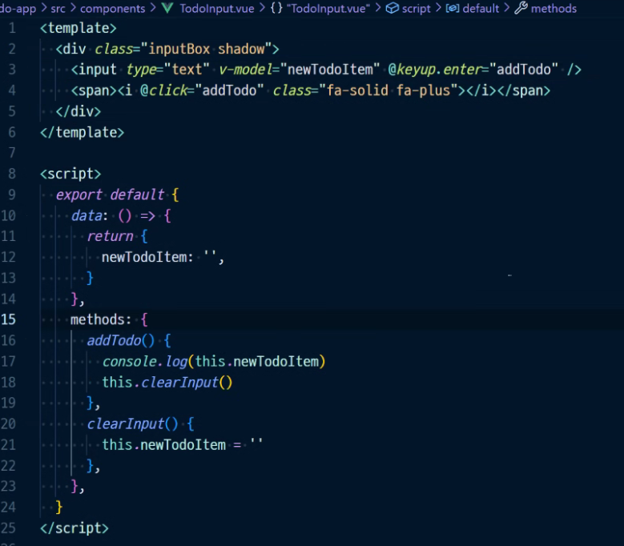
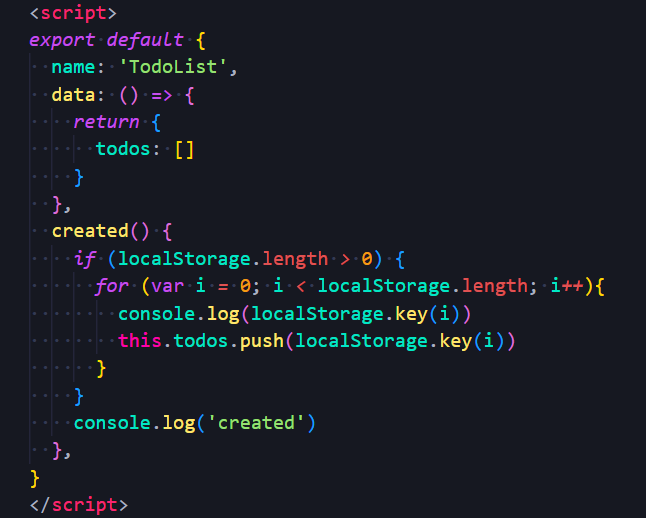
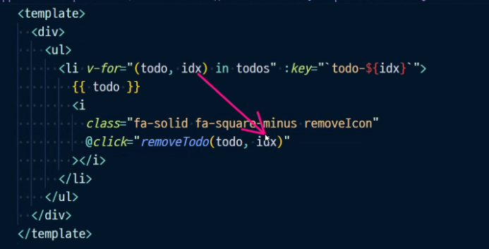
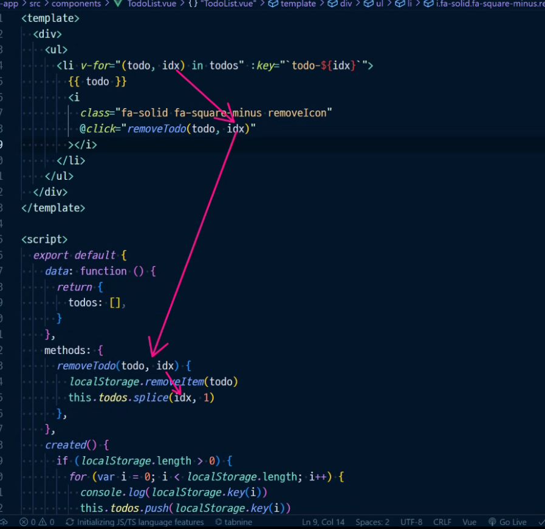
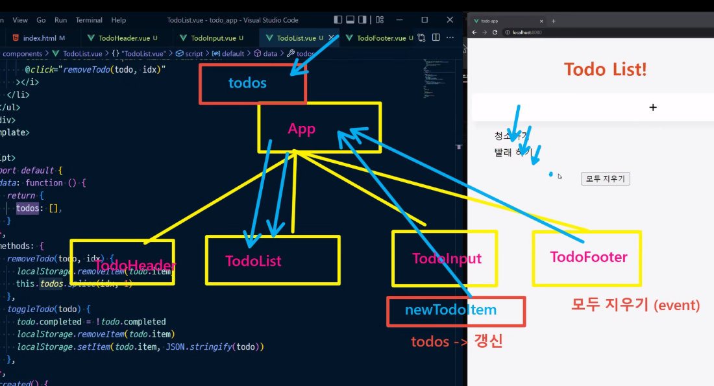
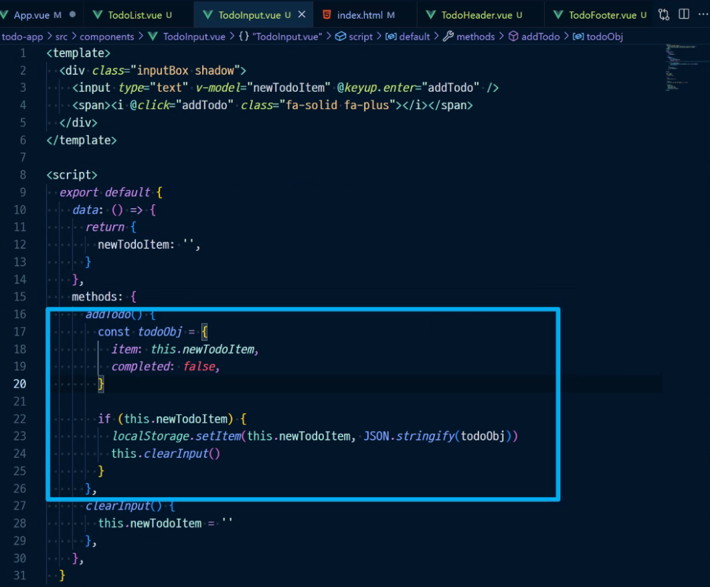
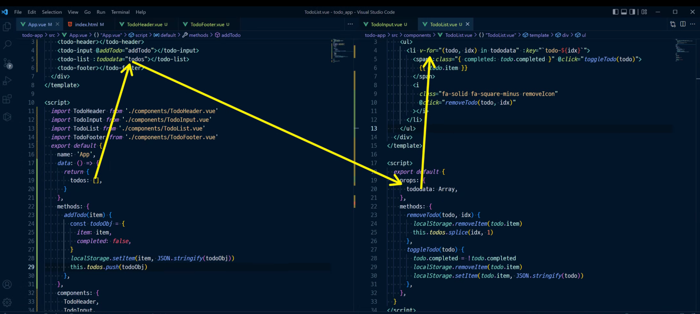

# Todo App


# 1. 기본 세팅

1. vue start

```bash
$ npm create todo-app
$ cd todo-app
$ npm run serve
```

2. component create

* TodoHeader.vue
* TodoInput.vue
* TodoList.vue
* TodoFooter.vue
* App.vue





# TodoList.vue

* Local Storage

  * django 연결하기 전까지는 local storage 쓴다
  * otherwise 새로고침할 때마다 데이터 리셋됨

  

* 


*template



Scriptts











???????

