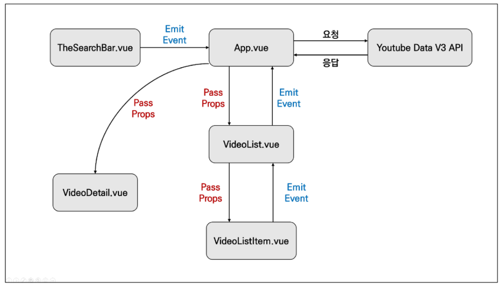
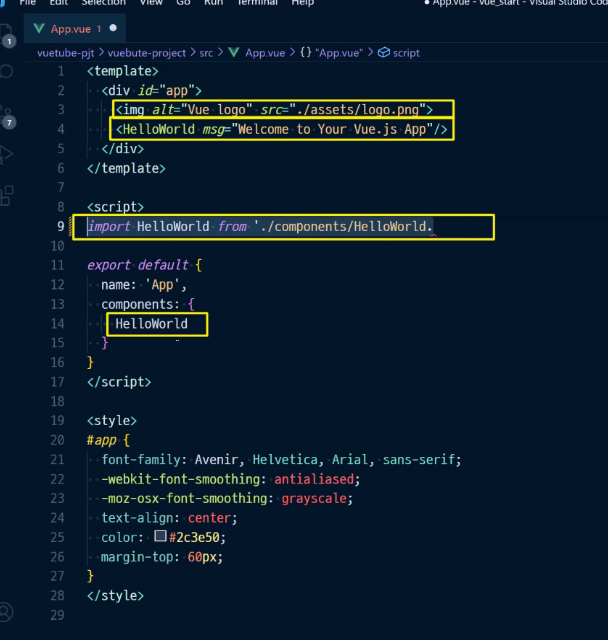
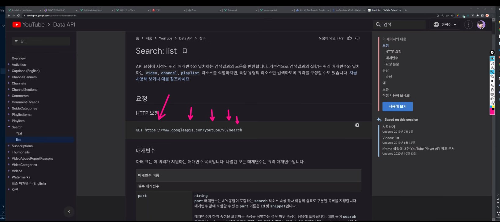
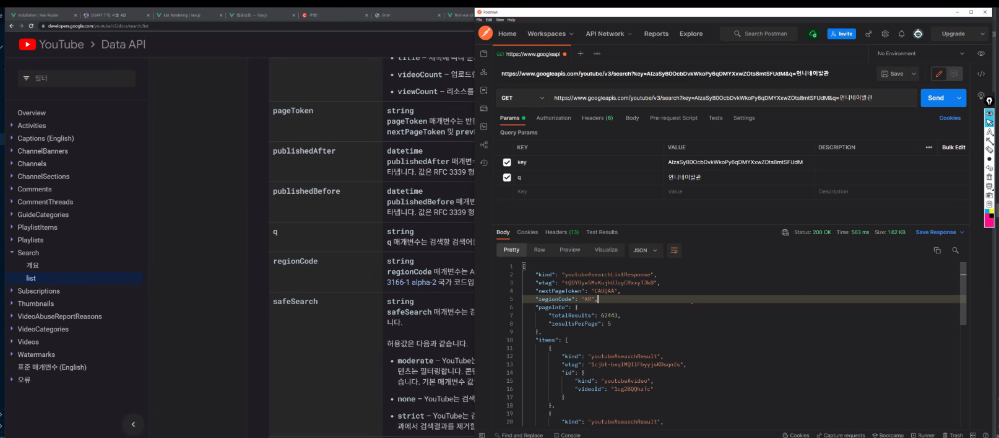
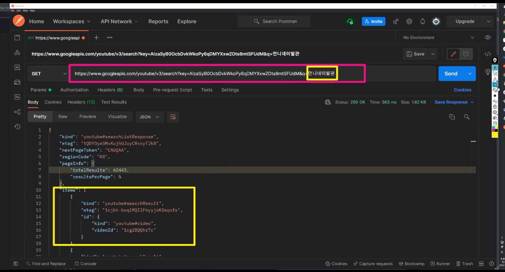
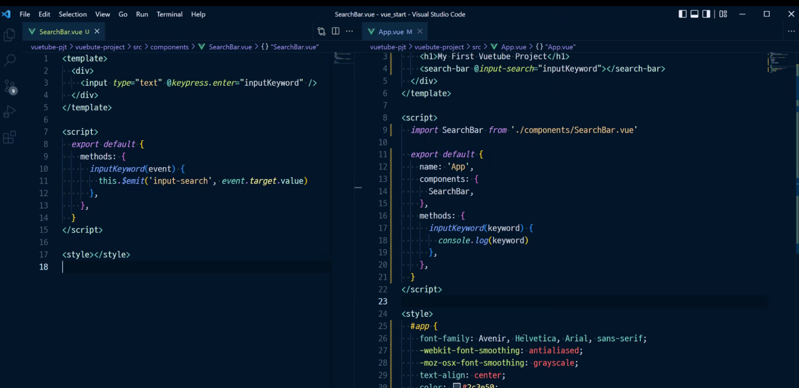
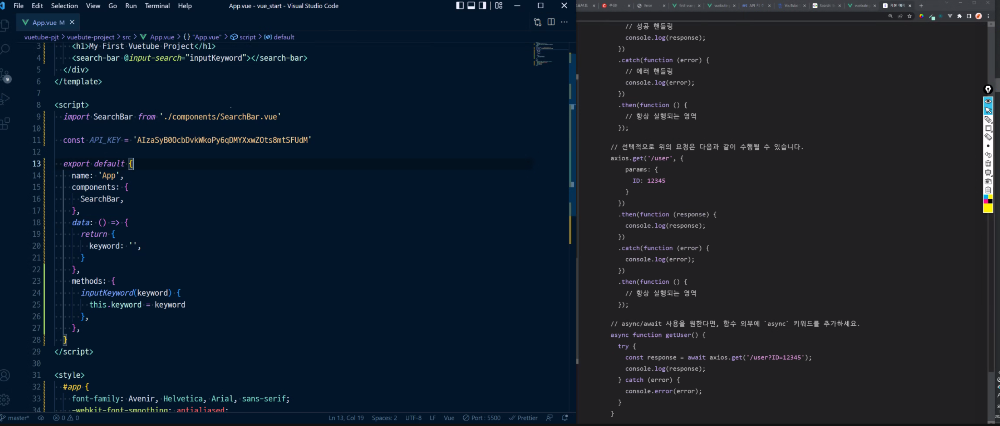
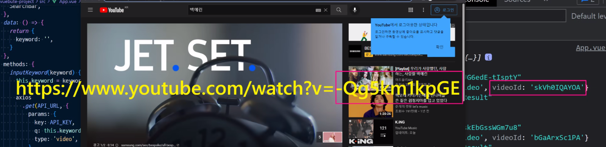
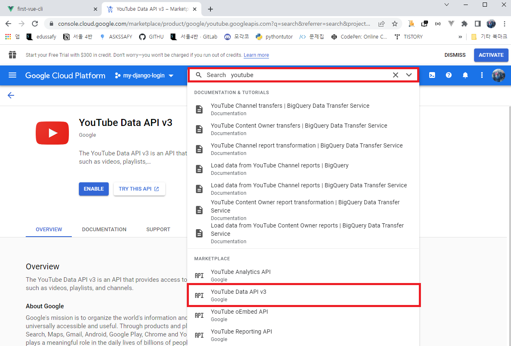
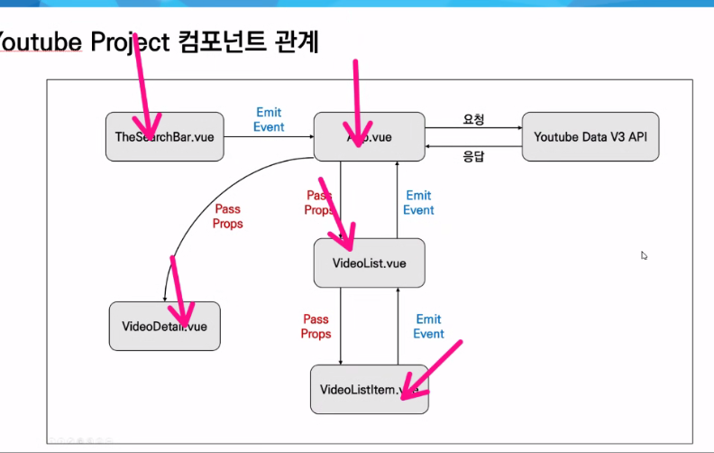

# Vue Youtube Project

### 1. Youtube Project 컴포넌트 관계

* 중요한 건 Emit Event & Pass Props

### 2. 순서 정리 (하는중....)

1. `vuetube-pjt/` 폴더 생성

2. `vue create vuetube-project`

3. `components/` 폴더 내의 HelloWorld.vue 삭제

4. `$ npm install axios lodash`

5. `App.vue`에서 노란 네모박스 친거 지우기

   

6. Google developer console 들어가기 [구글](https://console.cloud.google.com/apis/dashboard)
7. 검색 => youtube -> youtube data API
8. New Project > dashboard > APIs & Services

9. postman에 requestUrl 복붙
10. 사용자 인증 정보에 API키 

숙제

이거 다섯개 파일만

