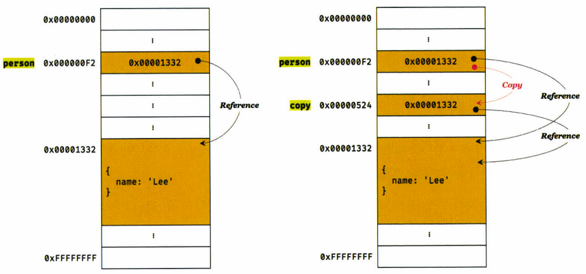

# 11장. 원시 값과 객체의 비교

> 원시 타입과 객체 타입은 근본적으로 다르다.
>
> 원시 타입의 값, 즉 원시 값은 변경 불가능한 값(immutable value)
>
> 객체 타입의 값, 즉 객체는 변경 가능한 값(mutable value)

## 11.1 원시 값

### 11.1.1 변경 불가능한 값

> 원시 타입(primitive type)의 값

- 원시 타입의 값은 변경 불가능
  - 읽기 전용 값
  - 데이터의 신뢰성 보장
- 변수 값을 변경하게 되면
  - 원시 값을 재할당하는 것이 아니라,
  - 새로운 메모리 공간 확보 > 재할당한 값 저장 > 변수가 참조하던 메모리 공간의 주소 변경


### 11.1.2. 문자열과 불변성

- C와 달리 자바스크립트는 원시 타입인 문자열 타입을 제공

  - 문자열이 저장된 주소가 변경

- 문자열은 유사 배열

  - 배열과 유사하게 인덱스를 사용해 각 문자에 **접근**할 수 있다
  - 하지만 문자열은 원시 값이므로 변경할 수 없다

  ```javascript
  var str = 'string';
  
  console.log(str[0]); // 's'
  
  str[0] = 'S';
  
  console.log(str); // 'string'
  ```


### 11.1.3 값에 의한 전달

> 변수에 변수를 할당했을 때 무엇이 전달되는가?

 ```javascript
 var score = 80;
 var copy = score;
 
 console.log(score); // 80
 console.log(copy); // 80
 ```

- 할당받는 변수(copy)에는 할당되는 변수(score)의 원시값이 **복사**되어 전달
  - 값에 의한 전달 === 참조에 의한 전달 === 공유에 의한 전달
  - score와  copy의 값 80은 다른 메모리 공간에 저장된 별개의 값

```javascript
score = 100;

console.log(score); // 100
console.log(copy); // 80
```

- 값에 의한 전달
  - 자바스크립트 용어가 아님
  - 엄격하게 표현하며 변수에는 값이 아니라 **메모리 주소가 전달**되는 것
- 두 변수의 원시 값은 서로 다른 메모리 공간에 저장된 별개의 값이 되어 어느 한쪽에서 재할당을 통해 값을 변경하더라도 서로 간섭할 수 없다는 것


## 11.2 객체

> 프로퍼티의 갯수가 정해져 있지 않음
>
> 동적으로 추가되고 삭제할 수 있음
>
> 프로퍼티 값에도 제약이 없음
>
> 따라서, 확보해야 할 메모리 공간의 크기를 사전에 정해둘 수 없다

- 자바스크립트는 클래스 없이 객체 생성이 가능하며, 객체 생성 이후에도 동적으로 프로퍼티와 메서드를 추가 가능
  - 자바, C++ 같은 클래스 기반 객체 지향 프로그래밍 언어는 사전에 정의된 클래스를 기반으로 객체를 생성
  - 사용성은 뛰어나지만, 성능 면에서는 생성과 프로퍼티 접근에 비용이 더 많이 드는 비효율적인 방식
    - 따라서, 히든 클래스(hidden class)라는 방식을 사용해 C++ 객체의 프로퍼티에 접근하는 정도의 성능을 보장


### 11.2.1 변경 가능한 값

- 객체 타입의 값은 변경 가능한 값
  - 객체는 크기가 일정하지 않고, 프로퍼티 값이 객체일 수도 있어 복사해서 생성하는 비용이 많이 듬
  - 따라서 객체가 변경 가능하게되면, 메모리의 효율적 소비가 어렵고 성능이 나빠짐

```javascript
var person = {
  name: 'Lee'
}
```

- 변경 가능한 것에서 오는 부작용
  - 여러 개의 식별자가 하나의 객체를 공유 가능


#### 얕은 복사와 깊은 복사

- 얕은 복사

  ```javascript
  const o = { x: { y: 1 }};
  
  // shallow copy
  const c1 = { ...o };
  console.log(c1 === o); // false
  console.log(c1.x === o.x); // true
  ```

  - 한 단계까지만 복사하는 것

- 깊은 복사

  ```javascript
  const o = { x: { y: 1 }};
  
  const _ = require('lodash');
  
  // deep copy
  const c2 = _.cloneDeep(o);
  console.log(c2 === o); // false
  console.log(c2.x === o.x); // false
  ```

  - 객체에 중첩되어 있는 객체까지 모두 복사하는 것


### 11.2.2 참조에 의한 전달

> 여러개의 식별자가 하나의 객체를 공유할 수 있다는 것이 무엇을 의미하는지
>
> 어떤 부작용이 발생하는지

```javascript
var person = {
  name: 'Lee'
};

// shallow copy
var copy = person;
```



- 참조에 의한 전달(두 개의 식별자가 하나의 객체를 공유)

  - 객체를 가리키는 변수를 다른 변수에 할당하면, 원본의 참조값이 복사되어 전달
  - `person`과 `copy`는 메모리 주소는 다르지만, **동일한 참조 값**을 갖는다
  - 즉, 둘 다 동일한 객체를 가리킨다

- 부작용

  - 원본 또는 사본 중 한 쪽에서 객체를 변경하면 **서로 영향을 주고받음** 

  ```javascript
  var person = {
    name: 'Lee'
  };
  
  var copy = person;
  
  console.log(copy === person); // true
  
  copy.name = 'Kim';
  person.address = 'Seoul';
  
  console.log(person); // {name: "Kim", address: "Seoul"}
  console.log(copy); // {name: "Kim", address: "Seoul"}
  ```

- 용어에 대한 고찰

  - 값에 의한 전달과 참조에 의한 전달은 식별자가 기억하는 메모리 공간에 저장되어 있는 값을 복사해서 전달한다는 면에서 동일하다. 따라서 자바스크립트에는 "참조에 의한 전달"은 존재하지 않고, "값에 의한 전달"만이 존재한다고 할 수 있다
  - 이와 같은 동작 방식을 설며하는 정확한 용어 부재
    - 따라서 "공유에 의한 전달"이라고 표현하는 경우도 있지만, 공식적인 용어는 아님
    - 자바스크립트에는 포인터가 존재하지 않기 때문에, 타 프로그래밍 언어의 참조에 의한 전달과 의미가 정확히 일치하지는 않는다


#### 퀴즈

```javascript
var person1 = {
  name: 'Lee'
};

var person2 = {
  name: 'Lee'
};

console.log(person1 === person2); // false
console.log(person1.name === person2.name); // true 
```

- `person1`과 `person2`는 내용은 같지만, 다른 메모리에 저장된 별개의 객체
- `person1.name`과 `person2.name`은 값으로 평가될 수 있는 표현식으로, 원시 값 'Lee'로 평가됨