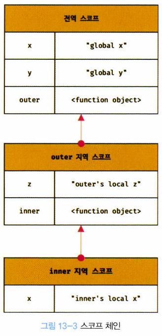

# 13장. 스코프

## 13.1 스코프란?

> 자바스크립트의 스코프는 다른 언어의 스코프와 구별된다


## 13.2 스코프의 종류

> 스코프는 전역과 지역으로 구분할 수 있다

- 변수는 자신이 선언된 위치(전역 또는 지역)에 의해 자신이 유효한 범위인 스코프가 결정된다. 
  - 전역에서 선언된 변수는 전역 스코프를 갖는 전역 변수
  - 지역에서 선언된 변수는 지역 스코프를 갖는 지역 변수


```javascript
var x = "global x"
var y = "global y"

function outer() {
  var z = "outer's local z"
  
  console.log(x) // global x
  console.log(y) // global y
  console.log(z) // outer's local z

	function inner() {
    var x = "inner's local x"
    
    console.log(x) // inner's local x
    console.log(y) // global y
    console.log(z) // outer's local z
  }  
  
  inner();
}

outer();

console.log(x); // global x
console.log(z); // referenceError: z is not defined
```


### 13.2.1 전역과 전역 스코프

- 전역이란 코드의 가장 바깥 영역이며, 전역은 전역 스코프를 만들며, 전역에 변수를 선언하면 전역 변수가 됨
- **전역 변수는 어디에서든지 참조가 가능하다**


### 13.2.2 지역과 지역 스코프

- 지역이란 함수 몸체 내부를 말한다
- 지역은 지역 스코프를 만들며, 지역에 변수를 선언하면 지역 변수가 된다
- 지역 변수는 자신의 지역 스코프와 하위 지역 스코프에서 유효
  - 지역 변수를 전역에서 참조하면 참조 에러가 발생
- 예시
  - `inner` 함수 내부에서 선언된 x 변수 이외에 이름이 같은 전역 변수 x가 존재
  - `inner` 함수 내부에서 x 변수를 참조하면, 전역변수가 아닌 지역변수를 참조하게 됨
    - 자바스크립트 엔진이 **스코프 체인**을 통해 참조할 변수를 검색(identifier resolution)했기 때문


## 13.3 스코프 체인

> 모든 스코프는 하나의 계층적 구조로 연결되며, 모든 지역 스코프의 최상위 스코프는 전역 스코프다.
>
> 이렇게 스코프가 계층적으로 연결된 것을 **스코프 체인**이라고 함



- 함수의 중첩처럼, 스코프도 중첩이 된다
  - 중첩 함수의 지역 스코프는 중첩 함수를 포함하는 외부 함수의 지역 스코프와 계층적 구조를 가짐
  - 이 때, 외부 함수의 지역 스코프를 중첩 함수의 상위 스코프라고 함
- identifier resolution
  - 변수를 참조할 때, 자바스크립트는 스코프 체인을 통해 선언된 변수를 검색
    - 변수를 참조하는 스코프 -> 상위 스코프 방향으로 이동
    - 따라서, 상위 스코프에서 선언한 변수를 하위 스코프에서도 참조 가능
- 렉시컬 환경(Lexical Environment)
  - 스코프 체인의 물리적인 실체 - 자료구조의 일종
  - 코드를 실행하기에 앞서, 렉시컬 환경을 실제로 생성
  - 변수 선언이 실행되면, 변수 식별자가 렉시컬 환경에 키(key)로 등록되고, 변수 할당이 일어나면 렉시컬 환경의 변수 식별자에 해당하는 값을 변경한다.
  - 변수 검색도 렉시컬 환경 상에서 이루어짐

