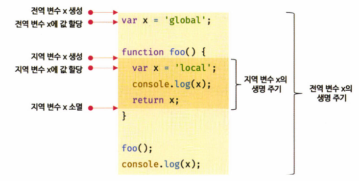

# 14장. 전역 변수의 문제점

> 전역 변수의 무분별한 사용은 위험하다 
> 전역 변수를 반드시 사용해야 할 이유를 찾지 못한다면, 지역변수를 사용해야 한다 

## 14.1 변수의 생명 주기

### 14.1.1 지역 변수의 생명주기

> 변수는 선언에 의해 생성되고, 할당을 통해 값을 갖는다. 그리고 언젠가 소멸한다.
>
> - 변수는 자신이 선언된 위치에서 생성되고 소멸
> - 전역 변수의 생명 주기 == 애플리케이션의 생명 주기

- 지역변수는 함수가 호출되면 생성되고, 함수가 종료하면 소멸

```javascript
function foo() {
  var x = 'local';
  console.log(x); // local
  return x;
}

foo();
console.log(x); // referenceError: x is not defined
```

- 지역 변수 x는 foo 함수가 호출되기 이전까지는 생성되지 않는다

- 지역변수의 경우 전역변수처럼 호이스팅이 일어나지 않는다

  - 전역변수는 선언되면 선언문이 어디에 있든, 런타임 이전 단게에서 가장 먼저 실행됨
  - 지역변수의 경우에는 함수가 호출되어야 실행됨

- **지역 변수의 생명 주기는 함수의 생명 주기와 일치**

  - 지역변수의 경우 함수가 호출된 직후에, 함수 몸체 내 코드가 실행되기 전에 먼저 실행
  - 그리고 함수가 종료하면 x변수도 소멸되어 생명 주기가 종료

- 예외적으로 지역 변수가 함수보다 오래 생존하는 경우도 존재

  - 변수의 생명 주기는 

    - 메모리 공간이 확보(allocate)된 시점부터, 메모리 공간이 해제(release)되어 가용 메모리 풀(memory pool)에 반환되는 시점까지

  - 함수 내부에 선언된 지역 변수는 함수가 생성한 스코프에 등록됨

    - 변수는 자신이 등록된 스코프가 소멸(메모리 해제)될 때까지 유효
    - 할당된 메모리 공간은 더 이상 누구도 참조하지 않을 때 가비지 콜렉터에 의해 해제
    - 즉, 누군가가 스코프를 참조하고 있으면 스코프는 소멸하지 않고 생존(클로저 참고)

    ```javascript
    var x = 'global';
    
    function foo() {
      console.log(x); // local
      var x = 'local';
    }
    
    foo();
    console.log(x); // global
    ```

- 호이스팅은 스코프를 단위로 동작


### 14.1.2 전역 변수의 생명 주기

> 전역 변수의 생명 주기는 전역 객체의 생명주기와 일치한다

- 전역 객체(global object)

  - 코드가 실행되기 이전 단계에 자바스크립트 엔진에 의해 어떤 객체보다도 먼저 생성되는 특수한 객체
  - 클라이언트 사이드 환경(브라우저)에서는 window
  - 서버사이드 환경(node.js)에서는 global 객체(`globalThis`)를 의미
  - 표준 빌트인 객체(`Object`, `String`, `Number`, `Function`, `Array`..)와 환경에 따른 호스트 객체(CLI Web API 또는 Node.js의 호스트 API), `var` 키워드로 선언한 전역 변수와 전역 함수를 프로퍼티로 가짐

- 브라우저 환경에서의 전역 객체: `window`

  - 브라우저 환경에서 `var` 키워드로 선언한 전역 변수는 전역 객체 `window`의 프로퍼티
  - 웹페이지를 닫기 전 까지 유효
  - `var` 키워드로 선언한 전역 변수의 생명 주기는 전역 객체의 생명 주기와 일치

  


## 14.2 전역 변수의 문제점

> 암묵적 결합, 긴 생명주기, 스코프 체인 상에서 종점에 존재, 네임스페이스 오염 

### 암묵적 결합

- 전역 변수를 선언한 의도는 전역에서 참조하고 할당가능한 변수를 사용하겠다는 것

- 즉, 모든 코드가 전역 변수를 참조하고 변경할 수 있는 암묵적 결합(implicit coupling)을 허용하는 것
- 코드의 가독성이 나빠지고, 의도치 않게 상태가 변경될 수 있는 위험성도 높아짐


### 긴 생명주기

- 전역 변수는 생명 주기가 길다
  - 메모리 리소스도 오랜 기간 소비
- `var` 키워드는 변수의 중복 선언을 허용한다
  - 변수 이름이 중복될 가능성이 있고, 의도치 않은 재할당이 이뤄진다


### 스코프 체인 상에서 종점에 존재

- 전역 변수의 검색 속도가 가장 느리다
  - 변수를 검색할 때 전역 변수가 가장 마지막에 검색된다


### 네임스페이스 오염

- 자바스크립트는 파일이 분리되어 있다고 해도 하나의 전역 스코프를 공유한다
- 따라서 다른 파일 내에서 동일한 이름으로 명명된 전역 변수나 전역 함수가 같은 스코프 내 존재할 경우 예상치 못한 결과를 가져올 수 있다


## 14.3 전역 변수의 사용을 억제하는 방법

> 전역 변수를 반드시 사용해야 할 이유를 찾지 못한다면 지역변수를 사용해야 한다
>
> 변수의 스코프는 좁을수록 좋다

### 14.3.1 즉시 실행 함수

- 함수 정의와 동시에 호출되는 즉시 실행 함수는 단 한번만 호출된다

- 모든 코드를 즉시 실행 함수로 감싸면 모든 변수는 즉시 실행 함수의 지역 변수가 됨

  ```javascript
  (function() {
    var foo = 10; // 즉시 실행 함수의 지역 변수
  }());
  
  console.log(foo); // ReferenceError: foo is not defined
  ```

  

### 14.3.2 네임스페이스 객체

> 네임스페이스 객체 자체가 전역 변수에 할당되므로 그다지 유용해보이지 않음

- 전역에 네임스페이스 역할을 담당할 **객체를 생성**하고, 전역 변수처럼 사용하고 싶은 변수를 프로퍼티로 추가

  ```javascript
  var MYAPP = {}; // 전역 네임스페이스 객체
  MYAPP.name = 'Lee';
  console.log(MYAPP.name); // Lee
  ```

- 네임스페이스 객체에 또 다른 네임스페이스 객체를 프로퍼티로 추가해, 네임스페이스를 계층적으로 구성 가능

  ```javascript
  var MYAPP = {}; // 전역 네임스페이스 객체
  
  MYAPP.person = {
    name: 'Lee',
    address: 'Seoul'
  };
  
  console.log(MYAPP.person.name); // Lee
  ```

  

### 14.3.3 모듈 패턴

- 클래스를 모방해, 관련이 있는 변수와 함수를 모아 즉시 실행 함수로 감싸 하나의 모듈을 만든다

  - 모듈 패턴은 자바스크립트의 클로저를 기반으로 동작
  - 전역 변수의 억제는 물론 캡슐화까지 구현 가능

- 캡슐화(encapsulation)

  - 프로퍼티(객체의 상태를 나타냄)와, 메서드(프로퍼티를 참조하고 조작하는 동작)를 하나로 묶는 것
  - 특정 프로퍼티나 메서드를 감출 목적으로 사용 - 정보 은닉(information hiding)

- 자바스크립트는 다른 프로그래밍언어와 달리 접근 제한자(`public`, `private`, `protected` 등)를 제공하지 않음

  - 타 언어는 접근 제한자로 사용하는 정보 은닉을 구현하기 위해 사용
  - private member
    - 외부로 노출하고 싶지 않는 변수나 함수는 반환하는 객체에 추가하지 않으면 외부에서 접근 불

  ```javascript
  var Counter = (function () {
    var num = 0; // private 변수
    
    return {
      increase() {
        return ++num;
      },
      decrease() {
        return --num;
      }
    };
  }());
  
  console.log(Counter.num); // undefined // private 변수는 외부로 노출되지 않는다
  ```


### 14.3.4 ES6모듈

- ES6 모듈은 파일 자체의 독자적인 모듈 스코프를 제공
- 모던 브라우저에서는 ES6 모듈 사용이 가능

```javascript
// script 태그 내 type="module" 어트리뷰트 추가시 로드된 자바스크립트 파일은 모듈로서 동작
<script type="module" src="lib.mjs"></script>
<script type="module" src="app.mjs"></script>
```


