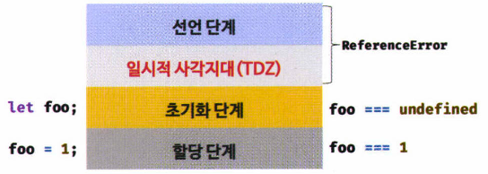

# 15장. `let`, `const` 키워드와 블록 레벨 스코프

## 15.1 `var` 키워드로 선언한 변수의 문제점

### 15.1.1 변수 중복 선언 허용

- `var` 키워드는 중복 선언이 가능

```javascript
var x = 1;
var y = 1;

var x = 100;
var y;

console.log(x); // 100
console.log(y); // 1
```

- `var` 키워드를 중복 선언하면 변수 초기화문 유무에 따라 다르게 동작
  - 초기화문 있는 경우
    -  `var` 키워드가 없는 것처럼 동작
  - 초기화문 없는 경우
    - 무시되며, 에러는 발생하지 않음


### 15.1.2 함수 레벨 스코프

- `var` 키워드로 선언한 변수는 오로지 **함수 코드블록**만을 지역 스코프로 인정
- 따라서 함수 외부에서 `var` 키워드로 선언한 변수는 코드 블록 내에서 선언해도 모두 전역 변수

```javascript
var x = 1; // x는 전역변수

if (true) {
  // 이미 선언된 전역 변수가 있으므로, x 변수는 중복 선언됨
  // 의도치 않은 변수 값 변경 발생 가능
  var x = 10;
}

console.log(x); // 10
```

- for문의 변수 선언문에서 var로 선언한 변수도 전역변수

```javascript
var i = 10;

// 이미 선언된 i가 있으므로 중복 선언됨
for (var i = 0; i < 5; i++) {
  console.log(i); // 0 1 2 3 4 
}

console.log(i); // 5
```

- 함수 레벨 스코프는 전역 변수를 남발할 가능성을 높임


### 15.1.3 변수 호이스팅

- `var` 키워드로 변수를 선언하면 변수 호이스팅에 의해 변수 선언문이 스코프의 선두로 끌어 올려진 것처럼 동작
- 할당문 이전에 변수를 참조하면 undefined를 반환

```javascript
console.log(foo); // undefined

foo = 123;

console.log(foo); // 123
```


## 15.2 `let` 키워드

> var 키워드 단점을 보완하기위해 let, const를 도입
>
> var 키워드와의 차이점을 중심으로 

### 15.2.1 변수 중복 선언 금지

- 이름이 같은 변수를 중복 선언하면 SyntaxError가 발생

```javascript
var foo = 123;
var foo = 456;

let bar = 123;
let bar = 456; // SyntaxError
```


### 15.2.2 블록 레벨 스코프

- `let` 키워드는 모든 코드 블록(함수, if, for, while, try/catch문 등)을 지역 스코프로 인정하는 블록 레벨 스코프를 따름

```javascript
let foo = 1;

{
  // 지역변수
  let foo = 2;
  let bar = 3;
}

console.log(foo); // 1
console.log(bar); // ReferenceErrror: bar is not defined
```


### 15.2.3 변수 호이스팅

- `let` 키워드로 선언한 변수는 변수 호이스팅이 발생하지 않는 것처럼 동작

```javascript
console.log(foo); // ReferenceError: foo is not defined
let foo;
```

- `var` 키워드로 선언한 변수는 런타임 이전에 "선언"과 "초기화"가 한번에 진행

- `let` 키워드로 선언한 변수는 "선언"과 "초기화"가 **분리**되어 진행

  - 런타임 이전에 "선언"이 먼저 실행
  - "초기화"는 **변수 선언문에 도달했을 때** 실행됨

- 일시적 사각지대(Temporal Dead Zone)

  - 스코프의 시작 지점부터 초기화 시작 지점까지 변수를 참조할 수 없는 구간

  

  ```javascript
  // runtime 이전에 선언 단계 실행 - 변수 초기화 이전
  // 초기화 이전의 일시적 사각지대에서는 변수 참조 불가능
  console.log(foo); // ReferenceError: foo is not defined
  	
  let foo; // 변수 선언문에서 초기화 단계 실행
  console.log(foo); // undefined
  
  foo = 1; // 할당문에서 할당 단계 실행됨
  console.log(foo); // 1
  ```

- 