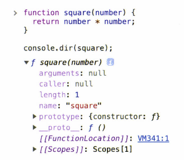

# 18장. 일급 객체

## 18.1 일급 객체

- 일급 객체의 정의
  1. 무명의 리터럴로 생성할 수 있다. 즉, 런타임에 생성이 가능하다
  2. 변수나 자료구조에 저장할 수 있다
  3. 함수의 매개변수에 전달할 수 있다
  4. 함수의 반환값으로 사용할 수 있다

- 자바스크립트는 해당 조건을 모두 만족하므로 일급 객체이다.

  ```javascript
  // 1. 함수는 무명의 리터럴로 생성할 수 있다.
  // 2. 함수는 변수에 저장할 수 있다.
  // 런타임(할당 단계)에 함수 리터럴이 평가되어 함수 객체가 생성되고, 변수에 할당된다.
  const increase = functino(num) {
    return ++num;
  };
  
  const decrease = functino(num) {
    return --num;
  };
  
  // 2. 함수는 객체(자료구조)에 저장할 수 있다.
  const predicates = { increase, decrease }
  
  // 3. 함수의 매개변수에 전달할 수 있다.
  // 4. 함수의 반환값으로 사용할 수 있다.
  function makeCounter(predicate) {
    let num = 0;
    
    return function () {
      num = predicate(num)
      return num;
    };
  }
  
  // 3. 함수는 매개변수에게 함수를 전달할 수 있다.
  const increaser = makeCounter(predicates.increase);
  console.log(increaser()); // 1
  console.log(increaser()); // 2
  
  const decreaser = makeCounter(predicates.increase);
  console.log(decreaser()); // -1
  console.log(decreaser()); // -2
  ```

- 함수가 일급 객체라는 것은, 함수를 객체와 동일하게 사용할 수 있다는 의미

  - 함수형 프로그래밍을 가능하게 하는 자바스크립트의 장점 
  - 함수는 일반 객체와는 다르게 호출할 수 있으며, 일반 객체에는 없는 함수 고유의 프로퍼티를 소유


## 18.2 함수 객체의 프로퍼티

- 함수는 객체이므로, 객체가 가지는 프로퍼티를 함수도 가진다.

- 브라우저 콘솔에서 `console.dir` 메서드를 사용해 함수 객체의 내부를 볼 수 있다.

  ```javascript
  function square(number) {
    return number * number
  }
  
  console.dir(square);
  ```

  

- `Object.getOwnPropertyDescriptors` 메서드를 사용해 함수 프로퍼티 어트리뷰트 확인

  ```javascript
  function square(number) {
    return number * number;
  }
  
  console.log(Object.getOwnPropertyDescriptors(square));
  /*
  {
  	length: {value: 1, writable: false, enumerable: false, configurable: true},
  	name: {value: "square", writable: false, enumerable: false, configurable: true},
  	arguments: {value: null, writable: false, enumerable: false, configurable: false},
  	caller: {value: null, writable: false, enumerable: false, configurable: false},
  	prototype: {value: {...}, writable: true, enumerable: false, configurable: false}
  }
  */
  
  // __proto__는 square함수의 프로퍼티가 아니다
  console.log(Object.getOwnPropertyDescriptor(square, '__proto__')); // undefined
  
  // __proto__는 Object.prototype 객체의 접근자 프로퍼티
  // square 함수는 Object.prototype 객체로부터 __proto__ 접근자 프로퍼티를 상속받는다
  console.log(Object.getOwnPropertyDescriptor(Object.prototype, '__proto__')); 
  // {get: f, set: f, enumerable: false, configurable: true}
  ```

- 일반 객체에는 없는 함수 객체 고유의 프로퍼티

  - arguments
  - caller
  - length
  - name
  - prototype


### 18.2.1 `arguments` 프로퍼티

- 함수 호출 시 전달된 인수들의 정보를 담고 있는 순회 가능한 유사 배열 객체

- 함수 내부에서 지역 변수처럼 사용됨

  - 즉, 함수 외부에서 참조가 불가능함

- 자바스크립트는 함수의 매개변수와 인수의 갯수가 일치하는지 확인하지 않음

  - 선언된 매개변수보다 인수를 적게 전달했을 경우, 인수가 전달되지 않는 매개변수는  `undefined`로 초기화된 상태 유지
  - 매개변수보다 더 많이 전달한 경우, 초과된 인수는 무시
    - 단, 초과된 인수는 암묵적으로  `arguments` 객체의 프로퍼티로 보관

  ```javascript
  function multiply(x, y) {
    console.log(arguments);
    return x * y
  }
  
  console.log(multiply()) // NaN
  console.log(multiply(1)); // NaN
  console.log(multiply(1, 2)); // 2
  console.log(multiply(1, 2, 3)); // 2
  ```

- `arguments` 객체를 사용하는 경우

  - 자바스크립트는 매개변수의 갯수와 인수의 갯수를 확인하지 않으므로, 함수 호출시 인수 개수를 확인하고 이에 따라 함수의 동작을 달리 정의할 필요가 있을 때 유용
  - 매개변수 개수를 확정할 수 없는 가변 인자 함수를 구현할 때 유용하다

  ```javascript
  function sum() {
    let res = 0;
    
    for (let i=0; i < arguments.length; i++) {
      res += arguments[i];
    }
    
    return res
  }
  
  console.log(sum()); // 0
  console.log(sum(1, 2)); // 3
  console.log(sum(1, 2, 3)); // 6
  ```

- `arguments` 객체는 유사 배열 객체이지, 배열이 아니다

  - 따라서 배열 메서드를 사용할 경우 에러가 발생한다
  - 배열 메서드를 사용하기 위해서는 `Function.prototype.call`, `Function.prototype.apply`를 사용해 간접 호출해야 한다
  - 이를 위해 ES6에서는 Rest 파라미터를 사용한다

  ```javascript
  // 객체를 배열로 전환
  function sum() {
    // Function.prototype.call
    const array = Array.prototype.slice.call(arguments);
    return array.reduce(function(pre, cur) {
      return pre + cur;
    }, 0);
  }
  
  console.log(sum(1, 2)); // 3
  console.log(sum(1, 2, 3, 4, 5)); // 15
  ```

  ```javascript
  // ES6 Rest parameter
  function sum(...args) {
    return args.reduce((pre, cur) => pre + cur, 0);
  }
  
  console.log(sum(1, 2)); // 3
  console.log(sum(1, 2, 3, 4 ,5)); // 15
  ```

  

### 18.2.2 `caller` 프로퍼티

- 비표준 프로퍼티이고, 이후 표준화될 예정도 없음(참고로만 알아두기)

- 함수 자신을 호출한 함수를 가리키는 프로퍼티

  ````javascript
  function foo(func) {
  	return func()
  }
  
  function bar() {
  	return 'caller: ' + bar.caller;
  }
  
  console.log(foo(bar)); // caller : functino foo(func) {...}
  console.log(bar()); // caller : null
  ````

  

### 18.2.3 `length` 프로퍼티

- 함수를 정의할 때 선언한 **매개변수**의 개수를 가리킴

```javascript
function foo() {}
console.log(foo.length); // 0

function bar(x) {
  return x;
}
console.log(bar.length); // 1

functino baz(x, y) {
  return x * y
}
console.log(baz.length); // 2
```

- **arguments 객체**의  length 프로퍼티는 **인자(argument)**의 개수를 가리키고
- **함수 객체**의 length 프로퍼티는 **매개변수(parameter)**의 개수를 가리킴


### 18.2.4 `name` 프로퍼티

- ES6에서 표준이 됨

- 함수 객체를 가리키는 식별자를 값으로 가짐

  - ES5에서는 name프로퍼티는 빈 문자열을 값으로 가짐

  ```javascript
  // 기명 함수 표현식
  var namedFunc = function foo() {};
  console.log(namedFunc.name); // foo
  
  // 익명 함수 표현식
  var anonymousFunc = function() {};
  console.log(anonymousFunc.name); // anonymousFunc
  
  // 함수 선언문(Function declaration)
  function bar() {}
  console.log(bar.name); // bar
  ```

  

### 18.2.5 `__proto__` 접근자 프로퍼티

- `[[Prototype]]` 내부 슬롯이 가리키는 프로토타입 객체에 접근하기 위해 사용하는 접근자 프로퍼티

  - 직접적으로 접근은 불가능하고, 간접적인 접근 방법을 제공하는 경우에 한해 접근 가능
  - `__proto__` 접근자 프로퍼티를 통해 **간접적**으로 프로토타입 객체에 접근 가능

  ```javascript
  const obj = { a: 1 };
  
  // 객체 리터럴 방식으로 생성한 객체의 프로토타입 객체는 Object.prototype
  console.log(obj.__proto__ === Object.prototype); // true
  
  // 객체 리터럴 방식으로 생성한 객체는 프로토타입 객체인 Object.prototype의 프로퍼티를 상속받음
  // hasOwnProperty 메서드는 Object.prototype의 메서드
  console.log(obj.hasOwnProperty('a')); // true
  console.log(obj.hasOwnProperty('__proto__')); // false
  ```

- `hasOwnProperty` 메서드는 인수로 전달받은 프로퍼티 키가 객체 고유의 프로퍼티 키인 경우에만 true를 반환

  - 상속받은 프로토타입의 프로퍼티 키인경우 false 반환


### 18.2.6 `prototype` 프로퍼티

- 생성자 함수로 호출할 수 있는 **함수 객체**, 즉  constructor만이 소유하는 프로퍼티

  - 일반 객체와 생성자 함수로 호출할 수 없는 non-constructor에는 prototype 프로퍼티가 없다

  ```javascript
  // 함수 객체는 소유함
  (function () {}).hasOwnProperty('prototype'); // true
  
  // 일반 객체는 소유하고 있지 않음
  ({}).hasOwnProperty('prototype'); // false
  ```

  


