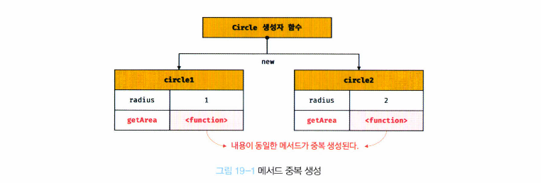
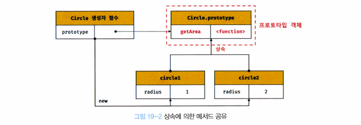
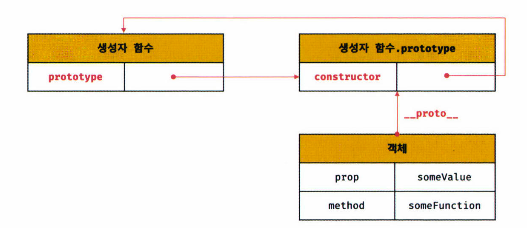
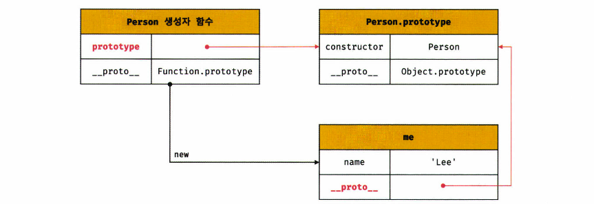

# 19장. 프로토타입

- 자바스크립트는 명령형(imperative), 함수형(functional)**, 프로토타입기반(prototype-based) 객체지향 프로그래밍(OOP: Object Oriented Programming)**을 지원하는 **멀티 패러다임 프로그래밍 언어**
- 자바스크립트 내에서 원시 타입의 값을 제외한 나머지 값들은 모두 객체.


## 19.1 객체지향 프로그래밍

> 전통적 명령형 프로그래밍의 절차지향적 관점에서 벗어나 여러 개의 독립적 단위, 객체의 집합으로 프로그램을 표현하려는 프로그래밍 패러다임을 말함

- 실세계의 실체(사물이나 개념)를 인식하는 철학적 사고를 프로그래밍에 접목하려는 시도에서 시작

- 추상화(abstraction)

  - 다양한 속성 중에서 프로그램에 필요한 속성만 간추려 내어 표현하는 것

- "이름"과 "주소"라는 속성을 갖는 person 객체

  ```javascript
  const person = {
    name: 'Lee',
    address: 'Seoul'
  };
  
  console.log(person); // {name: "Lee", address: "Seoul"}
  ```

  - 이처럼 속성을 통해 여러 개의 값을 하나의 단위로 구성한 복합적인 자료구조를 객체라고 함
  - 객체지향 프로그래밍은 독립적인 객체의 집합으로 프로그램을 표현하려는 프로그래밍 패러다임

- "원" 객체

  ```javascript
  const circle = {
    radius: 5,
    
    // 원 지름
    getDiameter() {
      return 2 * this.radius;
    }
    
    // 원 둘레
    getPerimeter() {
      return 2 * Math.PI * this.radius;
    }
  
  	// 원 면적
  	getArea() {
      return Math.PI * this.radius ** 2;
    }
  };
  
  console.log(circle);
  console.log(circle.getDiameter());
  console.log(circle.getPerimeter());
  console.log(circle.getArea()); 
  ```

- 객체지향 프로그래밍

  - 객체의 상태를 나타내는 데이터와 상태 데이터를 조작할 수 있는 동작을 묶어 생각

- 객체

  - 상태 데이터와 동작을 하나의 논리적인 단위로 묶은 복합적인 자료구조
  - 객체의 상태 데이터: 프로퍼티
  - 객체 동작: 메서드


## 19.2 상속과 프로토타입

> 상속이란 어떤 객체의 프로퍼티 또는 메서드를 다른 객체가 상속받아 그대로 사용할 수 있다는 것

- 자바스크립트는 프로토타입을 기반으로 상속을 구현해 불필요한 중복을 제거

  - 기존 코드를 재사용해 중복제거

  ```javascript
  // 생성자 함수
  function Circle(radius) {
    this.radius = radius;
    this.getArea = function () {
      return Math.PI * this.radius ** 2;
    }
  }
  
  // 반지름이 1인 인스턴스 생성
  const circle1 = new Circle(1);
  const circle2 = new Circle(2);
  
  console.log(circle1.getArea === circle2.getArea) // false // 2개의 다른 메서드
  
  // Circle 생성자 함수는 인스턴스를 생성할 때마다 getArea 메서드를 중복 생성하고, 모든 인스턴스가 중복 소유
  // getArea 메서드는 하나만 생성해 모든 인스턴스가 공유해 사용하는 것이 바람직
  ```

  

  

  ```javascript
  // 상속을 통해 불필요한 중복 제거
  
  function Circle(radius) {
    this.radius = radius;
  }
  
  // Circle 생성자 함수가 생성한 모든 인스턴스가 getArea 메서드를 공유할 수 있도록 프로토타입에 추가
  // 프로토타입은 생성자 함수의 prototype 프로퍼티에 반영되어 있음
  Circle.prototype.getArea = function() {
    return Math.PI * this.radius ** 2;
  };
  
  const circle1 = new Circle(1)
  const circle2 = new Circle(2)
  
  console.log(circle1.getArea === circle2.getArea) // true
  
  // Circle 생성자 함수가 생성하는 모든 인스턴스는 하나의 getArea 메서드를 공유
  ```

  

- 상속은 재사용 관점에서 매우 유용
- 생성자 함수가 생성할 모든 인스턴스가 공통적으로 사용할 프로퍼티, 메서드를 프로토타입에 미리 구현해 두변 생성자 함수가 생성할 모든 인스턴스는 별도의 구현 없이 상위(부모) 객체인 프로토타입의 자산을 공유하여 사용할 수 있다


## 19.3 프로토타입 객체

- 프로토타입 객체란 객체 지향 프로그래밍의 근간을 이루는 객체 간 상속을 구현하기 위해 사용됨

- 프로토타입은 어떤 객체의 상위(부모) 객체의 역할을 하는 객체로서 다른 객체에 공유 프로퍼티를 제공

  - 프로토타입을 상속받은 하위(자식) 객체는 상위 객체의 프로퍼티를 자신의 프로퍼티처럼 자유롭게 사용 가능

- 모든 객체는 `[[Prototype]]` 이라는 내부 슬롯을 가지며, 이 값은 프로토타입의 참조이다

  - `[[Prototype]]` 에 저장되는 프로토타입은 객체 생성 방식에 의해 결정되고, 저장된다.
  - 예) 객체 리터럴에 의해 생성된 객체의 프로토타입은 `Object.prototype`
  - 생성자 함수에 의해 생성된 객체의 프로토타입은 생성자 함수의 프로토타입 프로퍼티에 바인딩되어있는 객체

- 모든 객체는 하나의 프로토타입을 가지며, 모든 프로토타입은 생성자 함수와 연결되어 있음

  - `[[Prototype]]` 내부 슬롯에는 직접 접근이 불가능하지만, 아래 그림처럼 `__proto__` 접근자 프로퍼티를 통해 간접적으로 접근이 가능
  - 프로토타입은 자신의 `constructor` 프로퍼티를 통해 생성자 함수에 접근할 수 있고, 생성자 함수는 자신의 `prototype` 프로퍼티를 통해 접근이 가능

  


### 19.3.1 `__proto__` 접근자 프로퍼티

- 모든 객체는 `__proto__` 접근자 프로퍼티를 통해 자신의 프로토타입, 즉 `[[Prototype]]` 내부 슬롯에 간접적으로 접근할 수 있다

#### `__proto__` 는 접근자 프로퍼티

- 내부 슬롯은 프로퍼티가 아님
  - 따라서 직접적으로 접근/호출이 불가능
  - 간접적으로 접근가능한데, 이를 `__proto__` 접근자 프로퍼티를 통해 가능
- getter/setter 함수라고 부르는 접근자 함수를 통해 내부 슬롯의 값, 즉 프로토타입을 취득(get) 및 할당(set)한다

```javascript
const obj = {};
const parent = { x:1 };

// getter
obj.__proto__;

// setter
obj.__proto__ = parent;

console.log(obj.x); // 1
```


### `__proto__` 접근자 프로퍼티는 상속을 통해 사용된다

- `__proto__` 접근자 프로퍼티는 객체가 직접 소유하는 프로퍼티가 아니라, `Object.prototype` 의 프로퍼티
- 모든 객체는 상속을 통해 `Object.prototype.__proto__` 접근자 프로퍼티를 사용할 수 있다

```javascript
const person = { name: 'Lee' };

// person 객체는 __proto__ 프로퍼티를 소유하지 않음
console.log(person.hasOwnProperty('__proto__')); // false

console.log(Object.getOwnPropertyDescriptor(Object.prototype, '__proto__'));

// 모든 객체는 Object.prototype의 접근자 프로퍼티 __proto__를 상속받아 사용할 수 있음
console.log({}.__proto__ === Object.prototype);
```

- 프로토타입 체인의 최상위 객체는 `Object.prototype`


#### `__proto__` 접근자 프로퍼티를 통해 프로토타입에 접근하는 이유

- 상호 참조에 의해 프로토타입 체인이 생성되는 것을 방지하기 위해
- Parent 객체를 child 객체의 프로토타입으로 설정한 후, child 객체를 parent 객체의 프로토타입으로 설정
  - 이러한 코드가 에러 없이 처리되면, 서로가 자신의 프로토타입이 되는 비정상적인 프로토타입 체인이 만들어지므로 TypeError 발생시킴

```javascript
const parent = {}
const child = {}

// child의 프로토타입을 parent로 설정
child.__proto__ = parent;
// parent의 프로토타입을 child로 설정
parent.__proto__ = child; // TypeError: Cyclic __proto__ value
```

- 프로토타입 체인은 단방향 링크드 리스트로 구현되어야 함
  - 프로퍼티 검색 방향이 한쪽 방향으로만 흘러야 함
  - 위의 예제처럼 순환 참조(circular reference)하는 프로토타입 체인이 만들어지면, 무한 루프에 빠짐
  - 따라서 아무런 체크 없이 무조건적으로 프로토타입을 교체할 수 없도록, `__proto__` 접근자 프로퍼티를 통해 프로토타입에 접근하고 교체하도록 구현


#### `__proto__` 접근자 프로퍼티를 코드 내에서 직접 사용하는 것은 권장하지 않는다

- 왜냐하면 모든 객체가 `__proto__` 접근자 프로퍼티를 사용할 수 있는 것은 아님

```javascript
const obj = Object.create(null);

// obj는 Object.__proto__를 상속받을 수 없음
console.log(obj.__proto__); // undefined

// 따라서 __proto__ 보다 Object.getPrototypeOf 메서드를 사용하는 편이 좋음
console.log(Object.getPrototypeOf(obj)); // null
```

- 프로토타입의 참조를 취득하고 싶을 경우엔
  - `Object.getPrototypeOf` 메서드 사용
- 프로토타입을 교체하고 싶은 경우에는
  - `Object.setPrototypeOf` 메서드 사용

```javascript
const obj = {};
const parent = { x: 1 };

Object.getPrototypeOf(obj); // obj.__proto__;
Object.setPrototypeOf(obj, parent); // obj.__proto__ = parent;

console.log(obj.x); // 1
```


### 19.3.2 함수 객체의 `prototype` 프로퍼티

- **함수 객체**만 prototype 프로퍼티를 가지고 있다

```javascript
// 함수 객체는 prototype 프로퍼티를 소유함
(function() {}).hasOwnProperty('prototype'); // true

// 일반 객체는 prototype 프로퍼티를 소유하지 않음
({}).hasOwnProperty('prototype'); // false
```

- prototype 프로퍼티는 생성자 함수가 생성할 인스턴스의 프로토타입을 가리킴

  - 따라서 생성자 함수로서 호출할 수 없는 함수(non-constructor)인 화살표 함수 및 ES6 메서드 축약 표현으로 정의한 메서드는 prototype 프로퍼티를 소유하지 않으며, 프로토타입도 생성하지 않는다

  ```javascript
  // 화살표 함수
  // non-constructor
  const Person = name => {
    this.name = name;
  };
  
  // non-constructor는 prototype 프로퍼티를 소유하지 않음
  console.log(Person.hasOwnProperty('prototype')); // false
  
  // non-constructor는 프로토타입을 생성하지 않음
  console.log(Person.prototype); // undefined
  
  
  // 메서드 축약 표현으로 정의한 메서드
  // non-constructor
  const obj = {
    foo() {}
  };
  
  // non-constructor는 prototype 프로퍼티 소유하지 않음
  console.log(obj.foo.hasOwnProperty('prototype')); // false
  
  // non-constructor는 프로토타입 생성하지 않음
  console.log(obj.foo.prototype); // undefined
  ```

- 모든 객체가 가지고 있는 `__proto__` 접근자 프로퍼티와 함수 객체만이 가지고 있는 prototype 프로퍼티는 결국 동일한 프로토타입을 가리킨다

  - 단, 이들 프로퍼티를 사용하는 주체가 다르다

  | 구분                        | 소유        | 값                | 사용 주체   | 사용 목적                                                    |
  | --------------------------- | ----------- | ----------------- | ----------- | ------------------------------------------------------------ |
  | `__proto__` 접근자 프로퍼티 | 모든 객체   | 프로토타입의 참조 | 모든 객체   | 객체가 자신의 프로토타입에 접근 또는 교체하기 위해 사용      |
  | `prototype` 프로퍼티        | constructor | 프로토타입의 참조 | 생성자 함수 | 생성자 함수가 자신이 생성할 객체(인스턴스)의 프로토타입을 할당하기 위해 사용 |

  ```javascript
  // constructor
  function Person(name) {
    this.name = name;
  }
  
  const me = new Person('Lee');
  
  // 동일한 프로토타입을 가리킴
  console.log(Person.prototype === me.__proto__); // true
  ```

  

  

### 19.3.3 프로토타입의 `constructor` 프로퍼티와 생성자 함수

- 모든 프로토타입은 constructor 프로퍼티를 가짐

  - constructor 프로퍼티는 prototype 프로퍼티로 자신을 참조하고 있는 생성자 함수를 가리킴
  - 이 연결은 생성자 함수가 생성될 때, 즉 함수 객체가 생성될 때 이루어짐

  ```javascript
  // constructor
  function Person(name) {
    this.name = name;
  }
  
  const me = new Person('Lee');
  
  console.log(me.constructor === Person); // true
  ```

  - `me` 객체에는 `constructor` 프로퍼티가 없지만, `me` 객체의 프로토타입인 `Person.prototype` 에는 `constructor` 프로퍼티가 있음
    - 따라서 me 객체는 Person.prototype의 constructor 프로퍼티를 상속받아 사용


## 19.4 리터럴 표기법에 의해 생성된 객체의 생성자 함수와 프로토타입

- 리터럴 표기법에 의한 객체 생성 방식

```javascript
const obj = {};

const add = function (a, b) { return a + b };

const arr = [1, 2, 3];

const regexp = /is/ig;
```

- 리터럴 표기법에 의해 생성된 객체도 프로토타입이 존재함
  - 단, 프로토타입의 constructor 프로퍼티가 가리키는 생성자 함수가 반드시 객체를 생성한 생성자 함수라고 단정할 수는 없다

```javascript
const obj = {};

// 하지만 obj 객체의 생성자 함수는 Object 생성자 함수
console.log(obj.constructor === Object); // true
```

- 아니...너무어려운데요....프로토타입 노잼...진도가 안나가...어뜨케?ㅠㅠ


## 19.5 프로토타입의 생성 시점

### 19.5.1 사용자 정의 생성자 함수와 프로토타입 생성 시점

### 19.5.2 빌트인 생성자 함수와 프로토타입 생성 시점


## 19.6 객체 생성 방식과 프로토타입의 결정

### 19.6.1 객체 리터럴에 의해 생성된 객체의 프로토타입

### 19.6.2 `Object` 생성자 함수에 의해 생성된 객체의 프로토타입

### 19.6.3 생성자 함수에 의해 생성된 객체의 프로토타입


## 19.7 프로토타입 체인

## 19.8 오버라이딩과 프로퍼티 섀도잉

## 19.9 프로토타입의 교체

### 19.9.1 생성자 함수에 의한 프로토타입의 교체

### 19.9.2 인스턴스에 의한 프로토타입의 교체


## 19.10 `instanceof` 연산자

## 19.11 직접 상속

### 19.11.1 `Object.create`에 의한 직접 상속

### 19.11.2 객체 리터럴 내부에서  `__proto__`에 의한 직접 상속


## 19.12 정적 프로퍼티/메서드

## 19.13 프로퍼티 존재 확인

### 19.13.1 `in` 연산자

### 19.13.2 `Object.prototype.hasOwnProperty` 메서드


## 19.14 프로퍼티 열거

### 19.14.1 `for...in` 문

### 19.14.2 `Object.keys/values/entries` 메서드

