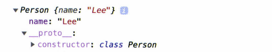
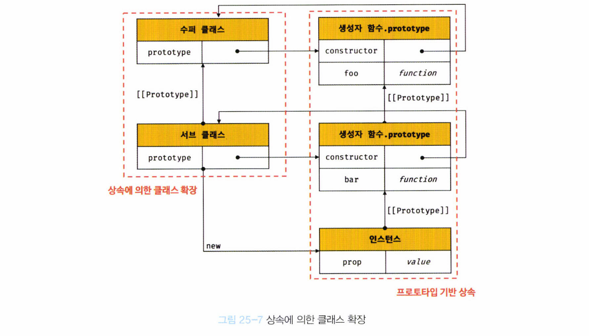

# 25. 클래스

## 25.1 클래스는 프로토타입의 문법적 설탕인가?

> **자바스크립트는 프로토타입 기반 객체지향 언어**

* 자바스크립트는 클래스가 필요 없는 객체지향 프로그래밍 언어이고, **클래스 없이도** 생성자 함수와 프로토타입을 통해 객체지향 언어의 상속을 구현할 수 있다
* 그러나, **자바와 C#과 같은 클래스 기반 객체지향 프로그래밍에 익숙한 프로그래머가 더욱 빠르게 학습할 수 있도록** 그와 매우 흡사한 새로운 객체 생성 매커니즘을 제시
* 사실 클래스는 실제 클래스가 아니라 함수이며, 문법적 설탕(syntatic sugar)이라고 볼수도 있지만 ... 
  * 클래스는 생성자 함수 기반의 객체 생성 방식보다 명료하며, `extends`와 `super` 키워드는 상속 관계 구현을 더욱 간결하고 명료하게 함
  * **새로운 객체 생성 매커니즘**이라고 보는 것이 조금 더 합당


### 클래스와 생성자 함수의 동작 차이

|                    | 클래스                                                       | 생성자 함수                                                  |
| ------------------ | ------------------------------------------------------------ | ------------------------------------------------------------ |
| new 연산자         | new 연산자 없이 호출하면 에러 발생                           | new 연산자 없이 호출하면 일반 함수로서 호출                  |
| `extends`, `super` | 상속 지원하는 `extends`, `super`키워드 제공                  | 제공하지 않음                                                |
| 호이스팅           | 호이스팅이 발생하지 않는 것처럼 동작                         | **함수 선언문**으로 정의된 생성자 함수는 **함수 호이스팅**<br />**함수 표현식**으로 정의한 생성자 함수는 **변수 호이스팅**이 발생 |
| strict mode        | 암묵적으로 지정되며, 해제 불가능                             | 암묵적으로 지정되지 않음                                     |
| 열거               | `constructor`, 프로퍼티 메서드, 정적 메서드 모두 프로퍼티 어트리뷰트 [[Enumerable]]의 값이 `false`며, 열거되지 않는다 | 프로퍼티 어트리뷰트 [[Enumerable]]의 값이 `false`며, 열거되지 않는다 |


## 25.2 클래스 정의

#### 기본

```javascript
class Person {}
```

* `class` 키워드를 사용하여 정의
* 파스칼 케이스 사용

#### 표현식으로 정의

```javascript
const Person = class {}; // 익명 클래스 표현식
const Person = class MyClass {}; // 기명 클래스 표현식
```

* 표현식으로 정의 가능하다는 것은 클래스가 일급 객체라는 것을 의미
  * 무명의 리터럴로 생성 가능(즉, 런타임에 생성가능)
  * 변수나 자료구조(객체, 배열 등)에 저장할 수 있음
  * 함수의 매개변수에 전달 가능
  * 함수의 반환값으로 사용할 수 있음

#### 생성자 

```javascript
class Person { // 클래스 선언문
  constructor(name) { // 생성자
    // 인스턴스 생성 및 초기화
    this.name = name; // name 프로퍼티는 public
  }
  
  // 프로토타입 메서드
  sayHi() {
    console.log(`Hi! My name is ${this.name}`);
  }
  
  // 정적 메서드
  static sayHello() {
    console.log(`Hello!`);
  }
  
  // 인스턴스 생성
  const me = new Person('Lee');

	// 인스턴스의 프로퍼티 참조
	console.log(me.name);
	me.sayHi(); // Hi! My name is Lee
	Person.sayHello(); // Hello!
}
```

* 클래스 몸체에는 0개 이상의 메서드만 정의 가능
  * Constructor(생성자)
  * 프로토타입 메서드
  * 정적 메서드


## 25.3 클래스 호이스팅

* 클래스는 함수로 평가된다

  * 런타임 이전에 먼저 평가되어 함수 객체 생성
  * 해당 함수 객체는 constructor
  * 프로토타입도 함께 생성

* 단 클래스는 클래스 정의 이전에 참조가 불가능

  * 호이스팅은 일어난다

    ```javascript
    const Person = '';
    {
      console.log(Person); // ReferenceError: Cannot access 'Person' before init
      // 호이스팅이 발생하지 않는다면, ''이 출력되어야 한다
      class Person {}
    }
    ```

  * `let`, `const` 키워드로 선언한 변수처럼 호이스팅 

    * **일시적 사각지대**에 빠지므로 호이스팅이 발생하지 않는 것처럼 동작


## 25.4 인스턴스 생성

* 클래스는 생성자 함수이며, **new 연산자와 함께 호출**되어 인스턴스를 생성한다

  ```javascript
  class Person {}
  
  // 인스턴스 생성
  const me = new Person();
  console.log(me) // Person{}
  
  // new 연산자 없이 호출하면 타입에러
  const me = Person();
  console.log(me) // TypeError: Class constructor Foo cannot be invoked without 'new'
  ```

  * 함수와는 달리, 클래스는 **인스턴스를 생성하는 것**이 유일한 존재 이유이므로 **반드시** `new` 연산자와 함께 호출해야 함

  ```javascript
  const Person = class MyClass {};
  
  // 클래스를 가리키는 식별자로 인스턴스를 생성해야 함
  const me = new Person();
  
  // 클래스 이름 MyClass는 함수와 동일하게 클래스 몸체 내부에서만 유효한 식별자
  console.log(MyClass) // ReferenceError: MyClass is not defined
  
  const you = new MyClass() // ReferenceError: MyClass is not defined
  ```

  * 클래스 표현식으로 정의된 클래스의 경우, 클래스를 가리키는 식별자(Person)를 사용해 인스턴스를 생성하지 않고 기명 클래스 표현식의 클래스 이름(MyClass)을 사용해 인스턴스를 생성하면 에러가 발생
  * 기명 함수 표현식과 마찬가지로, 클래스 표현식에서 사용한 클래스 이름은 외부 코드에서 접근 불가능


## 25.5 메서드

> 클래스 몸체에는 0개 이상의 메서드 선언만 가능
> 클래스 몸체에서 정의할 수 있는 메서드는 1. constructor, 2. 프로토타입 메서드, 3. 정적 메서드 세 가지이다

### 25.5.1 constructor

```javascript
class Person {
  constructor(name) { // 생성자
    this.name = name; // 인스턴스 생성 및 초기화
  }
}
```

* 인스턴스를 생성하고 초기화하기 위한 특수한 메서드

* 이름변경이 불가능

* 클래스는 평가되어 함수 객체가 된다

  * 함수 객체의 프로퍼티를 가지고 있음

    * 프로토타입과 연결되어 있고
    * 자신의 스코프체인을 구성

  * 클래스는 인스턴스를 생성하는 생성자 함수

    

    * 클래스의 프로토타입 객체의 constructor 프로퍼티는 클래스 자신을 가리키고 있음
      * 자바스크립트의 모든 객체는 자신의 부모 역할을 담당하는 객체와 연결되어있고, 이를 프로토타입 객체라고 함
      * Person 클래스 내 this에 추가한 `name` 프로퍼티가 클래스가 생성한 인스턴스의 프로퍼티로 추가된 것을 확인할 수 있음

```javascript
// 클래스
class Person {
  // 생성자
	constructor(name) {
    // 인스턴스 생성 및 초기화
		this.name = name;
	}
}

// 생성자 함수
function Person(name) {
	this.name = name;
}
```

* **`constructor`는 메서드로 해석되는 것이 아니라 클래스가 평가되어 생성한 함수 객체 코드의 일부가 됨**
  * **즉, 클래스 정의가 평가되면 constructor의 기술된 동작을 하는 함수 객체가 생성됨**
  * 위 예제에서 생성자 함수(Person)에서는 constructor  메서드가 보이지 않음
  * 그럼에도 console.log를 찍어보면 constructor가 보임


### `constructor`와 생성자 함수의 차이점

* `constructor`

  * 클래스 내 최대 한 개만 존재할 수 있다

  * 생략이 가능하다

    ```javascript
    // 이렇게 해도
    class Person {}
    
    // 이렇게 암묵적으로 정의된다
    class Person {
      constructor() {}
    }
    
    const me = new Person();
    console.log(me); // Person [}
    ```

  * 인스턴스를 생성할 때 클래스 외부에서 인스턴스 프로퍼티의 초기값을 전달하려면, constructor에 매개변수를 선언하고 인스턴스를 생성할 때 초기값을 전달한다

    * 인스턴스를 초기화하려면 constructor를 초기화하면 안됨

      ```javascript
      class Person {
        constructor(name, address) {
          this.name = name;
          this.address = address;
        }
      }
      
      const me = new Person('Lee', 'Seoul');
      console.log(me); // Person{name: 'Lee', address: 'Seoul'}
      ```

### `constructor`와 생성자 함수와의 공통점

* **별도의 반환문을 갖지 않아야 한다**

  * 클래스 호출시 생성자 함수와 동일하게 암묵적으로 this, 즉 인스턴스를 반환

  * this 아닌 다른 객체를 명시적으로 반환하면 this, 인스턴스가 반환되지 못하고 return문에 명시한 객체가 반환됨

  * 하지만 원시값을 반환하면 원시값 반환은 무시되고 암묵적으로 this가 반환됨

    ```javascript
    // 객체 반환
    class Person {
      constructor(name) {
        this.name = name;
        return {};
      }
    }
    
    const me = new Person('Lee');
    console.log(me); // {}
    
    // 원시값 반환
    class Person {
      constructor(name) {
        this.name = name;
        return 100;
      }
    }
    
    const me = new Person('Lee');
    console.log(me); // Person { name: 'Lee' }
    ```

    

### 25.5.2 프로토타입 메서드

* 프로토타입 메서드 생성을 위해서는 다음과 같이 명시적으로 프로토타입에 메서드를 추가해야 함

  ```javascript
  // 생성자 함수
  function Person(name) {
    this.name = name;
  }
  
  // 프로토타입 메서드
  Person.prototype.sayHi = function() {
    console.log(`Hi! My name is ${this.name}`);
  };
  
  const me = new Person('Lee');
  me.sayHi(); // Hi! My name is Lee
  ```

* 클래스 몸체에 정의한 메서드는 기본적으로 프로토타입 메서드가 됨

  ```javascript
  class Person {
    constructor(name) {
      this.name = name;
    }
    
    sayHi() {
    	console.log(`Hi! My name is ${this.name}`);
  	}
  }
  
  
  const me = new Person('Lee');
  me.sayHi(); // Hi! My name is Lee
  ```


### 25.5.3 정적 메서드

* 인스턴스를 생성하지 않아도 호출할 수 있는 메서드

* 정적 메서드 생성을 위해서는 다음과 같이 명시적으로 프로토타입에 메서드를 추가해야 함

  * 메서드에 `static`  키워드를 붙인다

  ```javascript
  // 클래스의 경우
  class Person(name) {
    constructor(name) {
      this.name = name;
    }
    
    static sayHi() { // static
  		console.log('Hi!')
    }
  }
  ```

  ```javascript
  // 생성자 함수의 경우
  function Person(name) {
    this.name = name;
  }
  
  // 정적 메서드
  Person.sayHi = function() {
    console.log('Hi!');
  }
  ```

* 정적 메서드는 클래스 정의 이후 인스턴스를 생성하지 않고, 클래스로 호출할 수 있다

  * 정적 메서드가 바인딩된 클래스는 인스턴스의 프로토타입체인상에 존재하지 않기 때문
  * 인스턴스의 프로토타입 체인 상에는 클래스가 존재하지 않기 때문에, 인스턴스로 메서드를 상속받을 수 없다

  ```javascript
  // 클래스로 호출
  Person.sayHi(); // Hi!
  
  // 인스턴스로 호출
  const me = new Person('Lee');
  me.sayHi(); // TypeError: me.sayHi is not a function
  ```

  

### 25.5.4 정적 메서드와 프로토타입 메서드의 차이

* 정적 메서드와 프로토타입 메서드는 자신이 속해있는 프로토타입 체인이 다르다
* 정적 메서드는 클래스로 호출하고, 프로토타입 메서드는 인스턴스로 호출한다
* 정적 메서드는 인스턴스 프로퍼티를 참조할 수 없지만, 프로토타입 메서드는 인스턴스 프로퍼티를 참조할 수 있ㄷ다

```javascript
// 정적 메서드
class Square {
  static area(width, height) {
    return width * height;
  }
}

console.log(Square.area(10, 10)) //100
```

```javascript
// 프로토타입 메서드
class Square {
  constructor(width, height) {
    this.width = width;
    this.height = height;
  }
  
  area() {
    return this.width * this.height;
  }
}

const square = new Square(10, 10);
console.log(square.area()); // 100
```

* 표준 빌트인 객체의 다양한 정적 메서드

  ```javascript
  Math.max(1, 2, 3); // 3
  Number.isNaN(NaN); // true
  JSON.stringify({ a: 1}); // "{"a": 1}"
  Object.is({}, {}); // false
  Reflect.has({ a: 1 }, 'a'); // true
  ```

  * 이와 같이 클래스 또는 생성자 함수를 하나의 네임스페이스로 사용해서 정적 메서드를 모아 놓으면
    * 이름 충돌 가능성 줄여줌
    * 관련 함수들을 메서드로 구조화 가능


### 25.5.5 클래스에서 정의한 메서드의 특징

1. function 키워드를 생략한 메서드 축약 표현을 사용한다
2. 객체 리터럴과는 다르게, 클래스에 메서드를 정의할 때는 콤마가 필요 없다
3. 암묵적으로  strict mode로 실행된다
4. `for ... in `문이나 `Object.keys` 메서드 등으로 열거할 수 없다


## 25.6 클래스의 인스턴스 생성 과정

> new 연산자와 함께 클래스 호출시, 생성자 함수와 마찬가지로 클래스 내부 메서드 `[[Construct]]` 가 호출됨

### 1. 인스턴스 생성과 this 바인딩

1. new 연산자와 함께 클래스 호출시, constructor 내부 코드 실행 전에 클래스가 생성한 인스턴스인 **빈 객체** 생성
2. 빈 객체의 프로토타입으로 클래스의 `prototype` 프로퍼티가 가리키는 객체 설정
3. 빈 객체, 즉 인스턴스는 `this`에 바인딩됨
4. constructor 내부의  this는 클래스가 생성한 인스턴스 가리킴

### 2. 인스턴스 초기화

* constructor의 내부 코드가 실행되며 this에 바인딩되어 있는 인스턴스 초기화

  - 즉, this에 바인딩 되어 있는 인스턴스에 프로퍼티를 추가하고

  - constructor가 인수로 전달받은 초기값으로 인스턴스의 프로퍼티 값을 초기화

  - 만약 constructor가 생략되었다면, 이 과정은 생략된다

### 3. 인스턴스 반환

* 클래스의 모든 처리가 끝나면, 완성된 인스턴스가 바인딩된  this가 암묵적으로 반환

```javascript
class Person {
  constructor(name) {
    // 1. 암묵적으로 인스턴스가 생성되고, this에 바인딩된다
    console.log(this); // Person {} // 빈 객체
    console.log(Object.getPrototypeOf(this) === Person.prototype); // true
    
    // 2. this에 바인딩되어 있는 인스턴스를 초기화
    this.name = name;
    
    // 3. 완성된 인스턴스가 바인딩된 this가 암묵적으로 반환
  }
}
```


## 25.7 프로퍼티

### 25.7.1 인스턴스 프로퍼티

* constructor 내부에서 정의해야 함
* constructor 내부에서 this에 추가한 프로퍼티는 언제나 클래스가 생성한 인스턴스의 프로퍼티가 됨
* 인스턴스 프로퍼티는 언제나 public

### 25.7.2 접근자 프로퍼티

* 자체적으로는 값(`[[Value]]` 내부슬롯)을 갖지 않고, 다른 데이터 프로퍼티의 값을 읽거나 사용하는 접근자 함수(getter, setter)로 구성된 프로퍼티

* getter와 setter는 인스턴스 프로퍼티처럼 사용되며, 참조 시 내부적으로 getter, setter가 호출된다

  * getter
    * 무언가를 취득할 때 사용
    * 반드시 무언가를 반환해야 함
  * setter
    * 무언가를 프로퍼티에 할당하기 위해 사용
    * 반드시 매개변수가 있어야 함

  

### 25.7.3 클래스 필드 정의 제안

* 클래스 필드란?
  * 클래스 기반 객체지향 언어에서 클래스가 생성한 인스턴스의 프로퍼티를 가리키는 용어

```javascript
class Person {
  name = 'Lee'
}

const me = new Person('Lee')
```

* 원래는 constructor 내부에서 this에 프로퍼티를 추가해야 한다 
* 위 예제를 최신 브라우저(Chrome 72 이상) 또는 최신 Node.js(버전 12 이상)에서 실행하면 **정상 동작**한다. 
* 하지만 아직 ECMAScript의 정식 표준 사양으로 승급되지 않았다. 하지만 승급이 확실시 되는 이 제안을 선제적으로 미리 구현해 놓았기 때문에 클래스 필드를 클래스 몸체에 정의할 수 있다

* TC(Technical Committee)39
  * ECMA-262사양의 관리를 담당하는 위원회
  * TC39 프로세스란?
    * 새로운 표준 사양을 추가하기 위해 공식적으로 명문화해 놓은 과정
    * stage가 0~4단계, 즉 5 단계로 나뉘어져 있음


### 25.7.4 private 필드 정의 제안

- 클래스 필드 정의 제안을 사용하더라도, 클래스 필드는 기본적으로 public하기 때문에 외부에 그대로 노출된다
  - 인스턴스 프로퍼티는 인스턴스를 통해 클래스 외부에서 언제나 참조가 가능하다
  - 자바스크립트는 완전한 캡슐화를 지원하지 않음
- TC39 프로세스에 stage3에는 private 필드를 정의할 수 있는 새로운 표준 사양이 제안되어 있다. 이 제안도 최신 브라우저와 최신 Node.js에 이미 구현되어 있다. 
- 타입스크립트는 public, private, protected를 모두 지원
- **private 필드는 클래스 내부에서만 참조가 가능하다**
  - 자식 클래스 내부에서 참조 불가능
  - 클래스 인스턴스를 통한 접근 안됨

```javascript
class Person {
  #name = ''

  constructor(name) {
    // private 필드 참조
    this.#name = name
  }
}

console.log(me.#name); // SyntaxError: Private field '#name' must be declared in an enclosing class
```

- private 필드의 선두에는 #을 붙여준다
- private 필드는 반드시 클래스 몸체에 정의해야 한다

### 25.7.5 static 필드 정의 제안

* static키워드로 정적 **메서드** 정의가 가능하지만, static 키워드를 사용하여 정적 **필드**는 불가능

* 정적 필드도 정의할 수 있도록 TC39 프로세스 stage3에 제안됨

  * static public 필드, static private 필드, static 메서드

   ```javascript
   class MyMath {
     
     // static public 필드 정의
     static PI = 22 / 7
     
     // static private 필드 정의
     static #num = 10
   
     // static 메서드
     static increment() {
       return ++MyMath.#num
     }
   }
   
   console.log(MyMath.PI) // 3.142858---
   console.log(MyMath.increment()) // 11
   ```

  


## 25.8 상속에 의한 클래스 확장

### 25.8.1 클래스 상속과 생성자 함수 상속

* 상속에 의한 클래스 확장은 **기존 클래스를 상속받아 새로운 클래스를 확장하여 정의**하는 것

  * 프로토타입체인을 통해 다른 객체의 자산을 상속받는 개념인 프로토타입 기반 상속과는 다른 개념

    

*  클래스는 상속을 통해 기존 클래스를 확장할 수 있는 문법(`extends`)이 기본적으로 제공된다

  ```javascript
  class Animal {
    constructor(age, weight) {
      this.age = age;
      this.weight = weight;
    }
    
    eat() { return 'eat'; }
    move() { return 'move'; }
  }
  
  // 상속을 통해 Animal 클래스를 확장하는 Bird 클래스
  class Bird extends Animal {
    fly() { return 'fly'; }
  }
  
  const bird = new Bird(1, 5);
  
  console.log(bird); // Bird {age: 1, weight: 5}
  console.log(bird instanceof Bird); // true
  console.log(bird instanceof Animal); // true
  
  console.log(bird.eat()); // eat
  console.log(bird.move()); // move
  console.log(bird.fly()); // fly
  ```

  * 부모 클래스 속성을 그대로 사용하며, 자신만의 고유한 속성을 추가해 확장이 가능하다
  * 따라서 코드 재사용 관점에서 유용

### 25.8.2 extends 키워드

```javascript
// super/base/parent class
class Base {}

// sub/derived/child class
class Derived extends Base {}
```

* 상속을 통해 클래스를 확장하려면 extends 키워드를 사용해 상속받을 클래스를 정의한다

  * 수퍼클래스와 서브클래스간의 상속 관계 설정하는 것
  * 클래스도 프로토타입을 통해 상속 관계를 구현

* 수퍼클래스와 서브클래스는 인스턴스의 프로토타입체인 뿐 아니라 클래스 간의 프로토타입 체인도 생성

  * 프로토타입 메서드, 정적 메서드 모두 상속 가능

* 서브클래스(subclass)/파생클래스(derived class)/자식클래스(child class)

  * 상속을 통해 확장된 클래스

* 수퍼클래스(super-class)/베이스클래스(base class)/부모클래스(parent class)

  * 서브클래스에게 상속된 클래스

  

### 25.8.3 동적 상속

*  **`extends` 키워드 앞**에는 반드시 클래스가 와야한다
  *  `extends` 키워드는 클래스 뿐만 아니라 생성자 함수도 상속받아 클래스 확장이 가능하다

```javascript
function Base(a) {
  this.a = a;
}

class Derived extends Base {}

const derived = new Derived(1);
console.log(derived); // Derived {a: 1}
```

* **`extends` 키워드 다음**에는 함수 객체로 평가될 수 있는 모든 평가식을 사용할 수 있다
  * 동적으로 상속받을 대상을 결정할 수 있다

```javascript
function Base1() {}

class Base2 {}

let condition = true;

class Derived extends (condition ? Base1 : Base2) {}

const derived = new Derived();
console.log(derived); // Derived {}

console.log(derived instanceof Base1) // true
console.log(derived instanceof Base2) // false
```


### 25.8.4 서브클래스의 constructor

```javascript
class Base {
  // 암묵적으로 정의된 constructor
  constructor() {}
}

class Derived extends Base {
  // 암묵적으로 정의된 constructor
  constructor(...args) { super(...args);}
}

const derived = new Derived();
console.log(derived); //Derived {}
```

* 클래스에서 constructor 를 생략하면, 클래스에서 비어있는 constructor가 암묵적으로 정의

* 서브클래스에서 constructor를 생략하면 클래스에 다음과 같은  constructor가 암묵적으로 정의

  * args는 new 연산자와 함께 클래스를 호출할 때 전달한 인수의 리스트

    ```javascript
    constructor(...args){ super(...args); }
    ```

* 수퍼클래스와 서브클래스 모두 constructor를 생략하면 빈 객체가 생성된다


### 25.8.5 super 키워드

* 함수처럼 호출할 수도 있고, `this`와 같이 식별자처럼 참조할 수 있는 특수한 키워드
  * `super`를 **호출**하면, 수퍼클래스의 **constructor를 호출**
  * `super`를 **참조**하면, 수퍼클래스의 **메서드를 호출**

#### super 호출

* 수퍼클래스의 constructor를 호출한다
* super클래스 constructor 내부에서 추가한 프로퍼티를 그대로 갖는 인스턴스 생성

```javascript
class Base {
  constructor(a, b) {
    this.a = a;
    this.b = b;
  }
}

class Derived extends Base {
  // constructor(...args) { super(...args);}
}

const derived = new Derived(1, 2);
console.log(derived); // Derived {a: 1, b: 2}
```

* 수퍼클래스에서 추가한 프로퍼티와 서브클래스에서 추가한 프로퍼티를 갖는 인스턴스를 생성한다면 constructor 생략이 불가능하다

```javascript
class Base {
  constructor(a, b) { // (4)
    this.a = a;
    this.b = b;
  }
}

class Derived extends Base {
  constructor(a, b, c) { // (2)
    super(a, b); // (3)
    this.c = c;
  }
}

const derived = new Derived(1, 2, 3); // (1)
console.log(derived); // Derived {a: 1, b: 2, c: 3}
```

* super 호출시 **주의사항**
  * ⭐️<u>서브클래스에서 constructor를 생략하지 않는 경우, 서브클래스의 constructor에서는 반드시 super를 호출해야 한다</u>
  * ⭐️<u>서브클래스의 constructor에서 super를 호출하기 전에는 this를 참조할 수 없다</u>
  * super는 반드시 서브클래스의 constructor에서만 호출한다. 서브클래스가 아닌 클래스의 constructor나 함수에서 super를 호출하면 에러가 발생한다


#### super 참조

* 메서드 내에서 super를 참조하면, 수퍼클래스의 메서드를 호출할 수 있다
* 서브클래스의 프로토타입 메서드 내에서 `super.sayHi()`는 수퍼클래스의 프로토타입 메서드 `sayHi()`를 가리킨다

```javascript
class Base {
  constructor(name) {
    this.name = name;
  }
	
  sayHi() {
  	return `Hi! ${this.name}`;
	}
}

class Derived extends Base {
  sayHi() {
    return `${super.sayHi()}. how are you doing?`;
  }
}

const derived = new Derived('Lee');
console.log(derived.sayHi()); // Hi! Lee. how are you doing?
```

* 서브클래스의 정적 메서드 내에서 `super.sayHi()`는 수퍼클래스의 정적 메서드 `sayHi()`를 가리킨다

```javascript
class Base {
  static sayHi() {
		return 'Hi!';
  }
}

class Derived extends Base {
  static sayHi() {
    return `${super.sayHi()} how are you doing?`;
  }
}

console.log(Derived.sayHi()); // Hi! how are you doing?
```


### 25.8.6 상속 클래스의 인스턴스 생성 과정

```javascript
class Rectangle {
  constructor(width, height) {
    this.width = width;
    this.height = height;
  }
  
  getArea() {
    return this.width * this.height;
  }
  
  toString() {
    return `width = ${this.width}, height = ${this.height}`;
  }
}

class ColorRectangle extends Rectangle {
  constructor(width, height, color) {
    super(width, height);
    this.color = color;
  }
  
  // 메서드 오버라이딩
  toString() {
    return super.toString() + `, color = ${this.color}`;
  }
}

const colorRectangle = new ColorRectangle(2, 4, 'red');
console.log(colorRectangle.getArea()); // 8
console.log(colorRectangle.toString()); // width=2, height=4, color=red
```

1. 서브클래스의 super 호출
   - 서브클래스는 자신이 직접 인스턴스를 생성하지 않고, 수퍼클래스에게 인스턴스 생성을 위임한다
     - ⭐️<u>서브클래스의 constructor에서 반드시 super를 호출해야 하는 이유</u>
     - 서브클래스에 `super` 호출이 없으면 error
2. 수퍼클래스의 인스턴스 생성과 this 바인딩
   - 수퍼클래스의 constructor 내부의 코드 실행시 생성된 빈 객체는 수퍼클래스의 this에 바인딩된다. 즉, 생성된 인스턴스는 수퍼클래스가 생성한 것이다.
   - 하지만, new 연산자와 함께 호출된 클래스는 서브클래스이다 
     - `new.target`은 서브클래스를 가리키므로, 인스턴스는 `new.target`이 가리키는 서브클래스가 생성한 것으로 처리
3. 수퍼클래스의 인스턴스 초기화
   - 수퍼클래스의 constructor가 실행되어 this에 바인딩되어있는 인스턴스를 초기화한다
4. 서브클래스 constructor로의 복귀와 this 바인딩
   - super호출이 종료되고,  서브클래스 constructor로 돌아온다.
   - 이 때, 서브클래스는 별도의 인스턴스를 생성하지 않고 super가 반환한 인스턴스를 this에 바인딩해 그대로 사용
   - 따라서, super가 호출되지 않으면 인스턴스가 생성되지 않으며, this 바인딩도 할 수 없다
     - ⭐️<u>서브클래스의 constructor 에서 super를 호출하기 전에는 this를 참조할 수 없는 이유</u>
5. 서브클래스의 인스턴스 초기화
   * this에 바인딩되어 있는 인스턴스에 프로퍼티를 추가하고, constructor가 인수로 전달받은 초기값으로 인스턴스의 프로퍼티를 초기화한다
6. 인스턴스 반환
   - 클래스의 모든 처리가 끝나면, 인스턴스가 바인딩된 this가 암묵적으로 반환됨


### 25.8.7 표준 빌트인 생성자 함수 확장

* `String`, `Number`, `Array` 같은 표준 빌트인 객체도 `[[Construct]]` 내부 메서드를 갖는 생성자 함수이므로 extends 키워드를 사용하여 확장할 수 있다
  * `Array.prototype`의 모든 메서드 사용이 가능

```javascript
// Array 생성자 함수를 상속받아 확장한 MyArray
class MyArray extends Array {
  uniq() {
		return this.filter((v, i, self) => self.indexOf(v) === i);
  }
  
  average() {
    return this.reduce((pre, cur) => pre + cur, 0) / this.length;
  }
}

const myArray = new MyArray(1, 1, 2, 3);
console.log(myArray); // MyArray(4) [1, 1, 2, 3]

console.log(myArray.uniq()); // MyArray(3) [1, 2, 3]
console.log(myArray.average()); // 1.75

```

