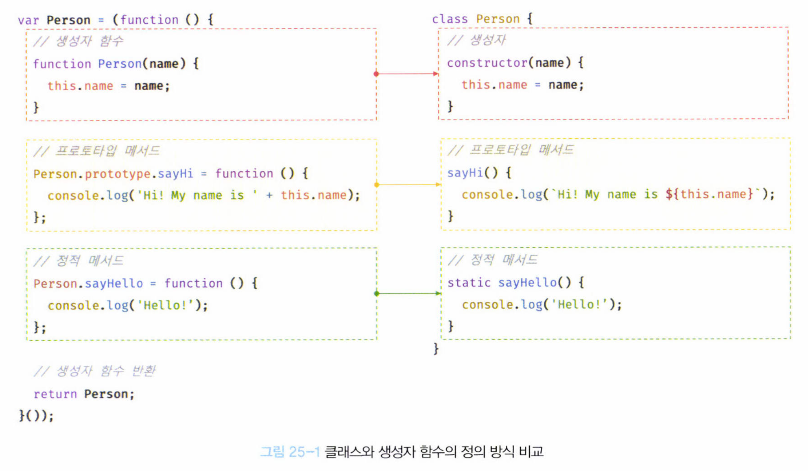

# 25. 클래스

## 25.1 클래스는 프로토타입의 문법적 설탕인가?

> **자바스크립트는 프로토타입 기반 객체지향 언어**

* 자바스크립트는 클래스가 필요 없는 객체지향 프로그래밍 언어이고, **클래스 없이도** 생성자 함수와 프로토타입을 통해 객체지향 언어의 상속을 구현할 수 있다
* 그러나, **자바와 C#과 같은 클래스 기반 객체지향 프로그래밍에 익숙한 프로그래머가 더욱 빠르게 학습할 수 있도록** 그와 매우 흡사한 새로운 객체 생성 매커니즘을 제시
* 사실 클래스는 실제 클래스가 아니라 함수이며, 문법적 설탕(syntatic sugar)이라고 볼수도 있지만 ... 
  * 클래스는 생성자 함수 기반의 객체 생성 방식보다 명료하며, `extends`와 `super` 키워드는 상속 관계 구현을 더욱 간결하고 명료하게 함
  * **새로운 객체 생성 매커니즘**이라고 보는 것이 조금 더 합당


### 클래스와 생성자 함수의 동작 차이

|                    | 클래스                                                       | 생성자 함수                                                  |
| ------------------ | ------------------------------------------------------------ | ------------------------------------------------------------ |
| new 연산자         | new 연산자 없이 호출하면 에러 발생                           | new 연산자 없이 호출하면 일반 함수로서 호출                  |
| `extends`, `super` | 상속 지원하는 `extends`, `super`키워드 제공                  | 제공하지 않음                                                |
| 호이스팅           | 호이스팅이 발생하지 않는 것처럼 동작                         | **함수 선언문**으로 정의된 생성자 함수는 **함수 호이스팅**<br />**함수 표현식**으로 정의한 생성자 함수는 **변수 호이스팅**이 발생 |
| strict mode        | 암묵적으로 지정되며, 해제 불가능                             | 암묵적으로 지정되지 않음                                     |
| 열거               | 프로퍼티 어트리뷰트 [[Enumerable]]의 값이 `false`며, 열거되지 않는다 | 프로퍼티 어트리뷰트 [[Enumerable]]의 값이 `false`며, 열거되지 않는다 |


## 25.2 클래스 정의

#### 기본

```javascript
class Person {}
```

* `class` 키워드를 사용하여 정의
* 파스칼 케이스 사용

#### 표현식으로 정의

```javascript
const Person = class {}; // 익명 클래스 표현식
const Person = class MyClass {}; // 기명 클래스 표현식
```

* 표현식으로 정의 가능하다는 것은 클래스가 일급 객체라는 것을 의미
  * 무명의 리터럴로 생성 가능(즉, 런타임에 생성가능)
  * 변수나 자료구조(객체, 배열 등)에 저장할 수 있음
  * 함수의 매개변수에 전달 가능
  * 함수의 반환값으로 사용할 수 있음

#### 생성자 

```javascript
class Person { // 클래스 선언문
  constructor(name) { // 생성자
    // 인스턴스 생성 및 초기화
    this.name = name; // name 프로퍼티는 public
  }
  
  // 프로토타입 메서드
  sayHi() {
    console.log(`Hi! My name is ${this.name}`);
  }
  
  // 정적 메서드
  static sayHello() {
    console.log(`Hello!`);
  }
  
  // 인스턴스 생성
  const me = new Person('Lee');

	// 인스턴스의 프로퍼티 참조
	console.log(me.name);
	me.sayHi(); // Hi! My name is Lee
	Person.sayHello(); // Hello!
}
```

* 클래스 몸체에는 0개 이상의 메서드만 정의 가능
  * Constructor(생성자)
  * 프로토타입 메서드
  * 정적 메서드




## 25.3 클래스 호이스팅

* 클래스는 함수로 평가된다

  * 런타임 이전에 먼저 평가되어 함수 객체 생성
  * 해당 함수 객체는 constructor
  * 프로토타입도 함께 생성

* 단 클래스는 클래스 정의 이전에 참조가 불가능

  * 호이스팅은 일어난다

    ```javascript
    const Person = '';
    {
      console.log(Person); // ReferenceError: Cannot access 'Person' before init
      // 호이스팅이 발생하지 않는다면, ''이 출력되어야 한다
      class Person {}
    }
    ```

  * `let`, `const` 키워드로 선언한 변수처럼 호이스팅 

    * **일시적 사각지대**에 빠지므로 호이스팅이 발생하지 않는 것처럼 동작


## 25.4 인스턴스 생성

* 클래스는 생성자 함수이며, **new 연산자와 함께 호출**되어 인스턴스를 생성한다

  ```javascript
  class Person {}
  
  // 인스턴스 생성
  const me = new Person();
  console.log(me) // Person{}
  
  // new 연산자 없이 호출하면 타입에러
  const me = Person();
  console.log(me) // TypeError: Class constructor Foo cannot be invoked without 'new'
  ```

  * 함수와는 달리, 클래스는 **인스턴스를 생성하는 것**이 유일한 존재 이유이므로 **반드시** `new` 연산자와 함께 호출해야 함

  ```javascript
  const Person = class MyClass {};
  
  // 클래스를 가리키는 식별자로 인스턴스를 생성해야 함
  const me = new Person();
  
  // 클래스 이름 MyClass는 함수와 동일하게 클래스 몸체 내부에서만 유효한 식별자
  console.log(MyClass) // ReferenceError: MyClass is not defined
  
  const you = new MyClass() // ReferenceError: MyClass is not defined
  ```

  * 클래스 표현식으로 정의된 클래스의 경우, 클래스를 가리키는 식별자(Person)를 사용해 인스턴스를 생성하지 않고 기명 클래스 표현식의 클래스 이름(MyClass)을 사용해 인스턴스를 생성하면 에러가 발생
  * 기명 함수 표현식과 마찬가지로, 클래스 표현식에서 사용한 클래스 이름은 외부 코드에서 접근 불가능


## 25.5 메서드

> 클래스 몸체에는 0개 이상의 메서드 선언만 가능
> 클래스 몸체에서 정의할 수 있는 메서드는 1. constructor, 2. 프로토타입 메서드, 3. 정적 메서드 세 가지이다

### 25.5.1 constructor

* 인스턴스를 생성하고 초기화하기 위한 특수한 메서드
* 이름변경이 불가능

### 25.5.2 프로토타입 메서드

### 25.5.3 정적 메서드

### 25.5.4 정적 메서드와 프로토타입 메서드의 차이

### 25.5.5 클래스에서 정의한 메서드의 특징


## 25.6 클래스의 인스턴스 생성 과정

> new 연산자와 함께 클래스 호출시, 생성자 함수와 마찬가지로 클래스 내부 메서드 `[[Construct]]` 가 호출됨

### 1. 인스턴스 생성과 this 바인딩

1. new 연산자와 함께 클래스 호출시, constructor 내부 코드 실행 전에 클래스가 생성한 인스턴스인 **빈 객체** 생성
2. 빈 객체의 프로토타입으로 클래스의 `prototype` 프로퍼티가 가리키는 객체 설정
3. 빈 객체, 즉 인스턴스는 `this`에 바인딩됨
4. constructor 내부의  this는 클래스가 생성한 인스턴스 가리킴

### 2. 인스턴스 초기화

* constructor의 내부 코드가 실행되며 this에 바인딩되어 있는 인스턴스 초기화

  - 즉, this에 바인딩 되어 있는 인스턴스에 프로퍼티를 추가하고

  - constructor가 인수로 전달받은 초기값으로 인스턴스의 프로퍼티 값을 초기화

  - 만약 constructor가 생략되었다면, 이 과정은 생략된다

### 3. 인스턴스 반환

* 클래스의 모든 처리가 끝나면, 완성된 인스턴스가 바인딩된  this가 암묵적으로 반환

```javascript
class Person {
  constructor(name) {
    // 1. 암묵적으로 인스턴스가 생성되고, this에 바인딩된다
    console.log(this); // Person {} // 빈 객체
    console.log(Object.getPrototypeOf(this) === Person.prototype); // true
    
    // 2. this에 바인딩되어 있는 인스턴스를 초기화
    this.name = name;
    
    // 3. 완성된 인스턴스가 바인딩된 this가 암묵적으로 반환
  }
}
```


## 25.7 프로퍼티

### 25.7.1 인스턴스 프로퍼티

### 25.7.2 접근자 프로퍼티

### 25.7.3 클래스 필드 정의 제안

### 25.7.4 private 필드 정의 제안

### 25.7.5 static 필드 정의 제안


## 25.8 상속에 의한 클래스 확장

### 25.8.1 클래스 상속과 생성자 함수 상속

### 25.8.2 extends 키워드

### 25.8.3 동적 상속

### 25.8.4 서브클래스의 constructor

### 25.8.5 super 키워드

### 25.8.6 상속 클래스의 인스턴스 생성 과정

### 25.8.7 표준 빌트인 생성자 함수 확장

