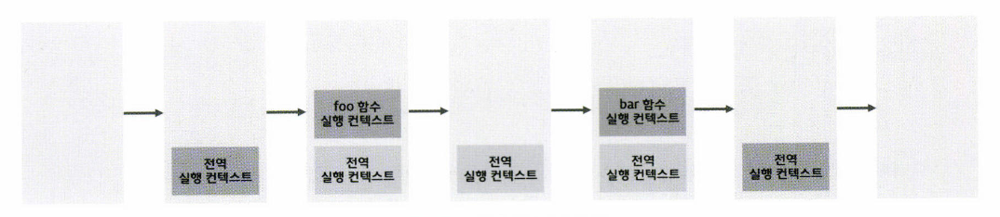

# 42. 비동기 프로그래밍

## 42.1 동기 처리와 비동기 처리

- 실행 컨텍스트 스택(콜 스택)

  - 함수 호출 > 함수 코드 평가 > 함수 실행 컨텍스트 생성 > 실행 컨텍스트 스택에 푸시 > 함수 코드 실행 > 실행 종료 > 실행 컨텍스트 스택에서 팝되어 제거됨
  - 호출된 순서대로 실행됨

  ```javascript
  const foo = () => {};
  const bar = () => {};
  
  foo();
  bar();
  ```




- 자바스크립트 엔진은 단 하나의 실행 컨텍스트 스택을 가짐

  - **싱글 스레드(single thread) 방식으로 동작**
  - 함수를 실행할 수 있는 창구가 단 하나
  - 동시에 2개 이상의 함수를 동시에 실행할 수 없다
  - 실행 컨텍스트 스택의 최상위 요소인 "실행 중인 컨텍스트"를 제외한 모든 실행 컨텍스트는 모두 **실행 대기 중인 task**
  - 실행 대기 중인 task는 현재 실행 중인 컨텍스트가 팝되어 제거되면 순차적으로 실행

- 처리에 시간이 걸리는 태스크를 실행하는 경우 **블로킹(작업중단)**이 발생

  ```javascript
  // sleep 함수는 일정 시간(delay)이 경과한 이후에 콜백함수(func)를 호출
  function sleep(func, delay) {
    // Date.now()는 현재 시간을 숫자(ms)로 반환
    const delayUntil = Date.now() + delay;
    
    // 현재 시간(Date.now())에 delay를 더한 delayUntil이 현재 시간보다 작으면 계속 반복
    while (Date.now() < delayUntil);
    // 일정 시간(delay)이 경과한 이후에 콜백함수(func)를 호출
    func();
  }
  
  function foo() {
    console.log('foo');
  }
  
  function bar() {
    console.log('bar');
  }
  
  // sleep 함수는 3초 이상 실행된다.
  sleep(foo, 3 * 1000);
  
  //  bar 함수는 sleep 함수의 실행이 종료된 이후에 호출되므로 3초 이상 블로킹된다.
  bar();
  // (3초 경과후) foo 호출 -> bar 호출
  ```

  - 동기(synchronous) 처리 방식
    - task를 순서대로 하나씩 처리하므로 실행 순서가 보장
    - 앞선 태스크가 종료할 때까지 이후 태스크들이 블로킹된다는 단점
  - `setTimeout`을 사용해 수정

  ```javascript
  function foo() {
    console.log('foo');
  }
  
  function bar() {
    console.log('bar');
  }
  
  // 타이머 함수 setTimeout은 일정 시간이 경과한 이후에 콜백 함수 foo를 호출
  // 타이머 함수 setTimeout은 bar함수를 블로킹하지 않음
  setTimeout(foo, 3 * 1000);
  bar();
  // bar 호출 -> (3초 경과 후) foo 호출
  ```

  - 비동기(asynchronous) 처리 방식
    - 실행 중인 태스크가 종료되지 않아도, 다음 태스크를 곧바로 실행
    - setTimeout 함수는 `setTimeout`함수 이후 태스크를 블로킹하지 않고 곧바로 실행

- 비동기 함수

  - 비동기 처리를 수행하는 함수
  - 전통적으로 콜백 패턴 사용
  - 비동기 처리르 위한 콜백 패턴은 콜백 지옥(callback hell)을 발생시켜 가독성을 나쁘게 하고
  - 비동기 처리 중 발생한 에러의 예외 처리가 어려움
  - 여러 개의 비동기 처리르 한 번에 처리하는데도 한계가 있음 > 이후 `promise` 에서 알아볼 것
  - 타이머 함수
    - `setTimeout`, `setInterval`, `HTTP 요청`, `이벤트 핸들러`
    - 이벤트 루프와 태스크 큐와 깊은 관계


## 42.2 이벤트 루프와 태스크 큐
