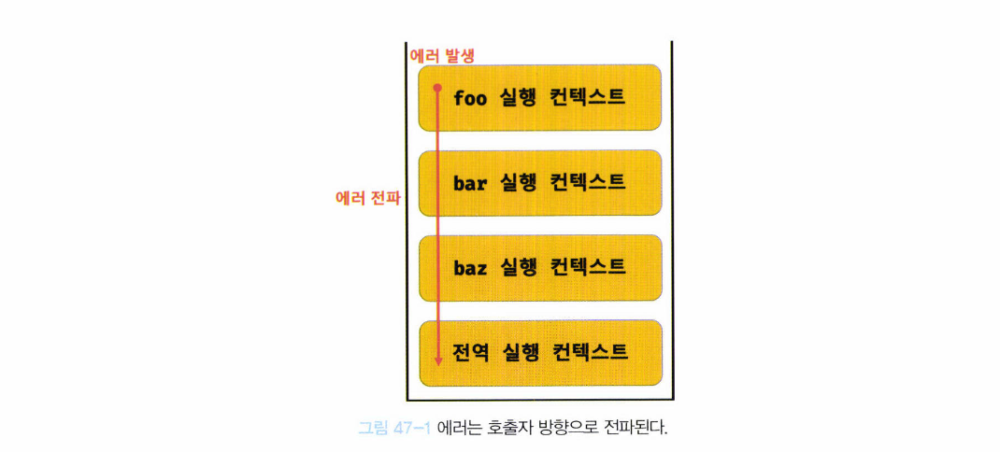

# 47장. 에러 처리

## 47.1 에러 처리의 필요성

- 에러가 발생하지 않는 코드를 작성하는 것은 불가능
- 발생한 에러에 대해 대처하지 않고 방치하면, 프로그램은 강제 종료됨

- **에러 발생**

  - `try ... catch`
  - 에러 발생시 프로그램이 강제 종료되지 않고 계속해서 코드를 실행시킬 수 있다

  ```javascript
  console.log('[Start]');
  
  try {
    foo();
  } catch (error) {
    console.error('[에러 발생]', error);
    // [에러 발생] ReferenceError: foo is not defined
  }
  ```

- **예외적인 상황 발생**
  
  - 에러를 발생시키지는 않음
  - 하지만 적절히 대응하지 않으면 에러로 이어질 가능성 높음
- 에러와 예외적인 상황이 없는 코드를 작성하는 것은 불가능하다
  - 따라서 언제나 에러나 예외적인 상황이 발생할 수 있다는 것을 전제하고 이에 대응하는 코드를 작성하는 것이 중요


## 47.2 `try .. catch ... finally` 문

- 에러 처리를 구현하는 두 가지 방법

  1. 예외적인 상황이 발생하면 반환하는 값을 if 문이나 단축 평가 또는 옵셔널 체이닝 연산자를 통해 확인해서 처리하는 방법
  2. 에러 처리 코드를 미리 등록해 두고 에러가 발생하면 에러 처리 코드로 점프하도록 하는 방법

- ###### `try ... catch ... finally` 문은 에러 처리 코드를 미리 등록하고, 에러 발생시 에러 처리 코드로 점프하도록 하는 방법

  - `catch`, `finally`는 생략 가능
  - 하지만 `catch`를 생략하면 의미가 없으므로 생략하지 않는다

  ```javascript
  try {
    // 실해할 코드(에러가 발생할 가능성이 있는 코드)
    foo();
  } catch (err) {
    // try 코드 블록에서 에러가 발생하면 이 코드 블록의 코드가 실행
    // err에는 try 코드 블록에서 발생한 Error 객체가 전달
    console.log(err); // ReferenceError: foo is not defined
  } finally {
    // 에러 발생과 상관없이 반드시 한 번 실행
    console.log('finally')
  }
  
  // try...catch...finally 문으로 에러 처리시 프로그램이 강제로 종료되지 않음
  console.log('[End]'); // [End]
  ```


## 47.3 Error 객체

```javascript
const error = new Error('invalid');
```

- `message` 프로퍼티

  - Error  생성자 함수에 인수로 전달한 에러 메시지
  - 즉 `'invalid'`

- `stack` 프로퍼티 

  - 에러를 발생시킨 콜스택의 호출 정보를 나타내는 문자열
  - 디버깅 목적으로 사용

- 7가지 Error 생성자 함수

  | 생성자 함수      | 인스턴스                                                     |
  | ---------------- | ------------------------------------------------------------ |
  | `Error`          | 일반적 에러 객체                                             |
  | `SyntaxError`    | 자바스크립트 문법에 맞지 않는 문을 해석할 때 발생하는 에러 객체 |
  | `ReferenceError` | 참조할 수 없는 식별자를 참조했을 때 발생하는 에러 객체       |
  | `TypeError`      | 피연산자 또는 인수의 데이터 타입이 유효하지 않을 때 발생하는 에러 객체 |
  | `RangeError`     | 숫자값의 허용 범위를 벗어났을 때 발생하는 에러 객체          |
  | `URIError`       | `encodeURI` 또는 `decodeURI` 함수에 부적절한 인수를 전달했을 때 발생하는 에러 객체 |
  | `EvalError`      | `eval` 함수에서 발생하는 에러 객체                           |

  ```javascript
  1 @ 1; 					// SyntaxError: Invalid or unexpected token
  foo(); 					// ReferenceError: foo is not defined
  null.foo; 			// TypeError: Cannot read property 'foo' of null
  new Array(-1); 	// RangeError: Invalid array length
  decodeURIComponent('%'); // URIError: URI malformed
  ```

  

## 47.4 `throw`문

- **에러 객체 생성**과 **에러 발생**은 의미가 다르다

- 에러 객체 생성

  ```javascript
  try {
    // 에러 객체를 생성한다고 에러가 발생하는 것은 아님
    new Error('something wrong');
  } catch (error) {
    console.log(error);
  }
  ```

- 에러 발생시키기

  ```javascript
  try {
    // 에러 객체를 던지면 catch 코드 블록이 실행되기 시작
    throw new Error('something wrong');
  } catch (error) {
    console.log(error);
  }
  ```

- 예시 

  - 외부에서 전달받은 콜백 함수를 n번만큼 반복 호출하는 `repeat` 함수
  - repeat 함수는 두 번째 인수로 반드시 콜백 함수를 전달 받아야
  - 두번째 인수가 아니면 TypeError

  ```javascript
  const repeat = (n, f) => {
    // 매개변수 f에 전달된 인수가 함수가 아니면 TypeError 발생
    if (typeof f !== 'function') throw new TypeError('f must be a function');
    
    for (var i = 0; i < n; i++) {
      f(i);
    }
  };
  
  try {
    repeat(2, 1); // 두 번째 인수가 함수가 아니므로 TypeError가 발생(throw)한다
  } catch (err) {
    console.error(err); // TypeError: f must be a function
  }
  ```

  


## 47.5 에러의 전파

- 에러는 호출자(caller) 방향으로 전파된다

  ```javascript
  const foo = () => {
    throw Error('foo에서 발생한 에러'); // 444444
  };
  
  const bar = () => {
    foo(); // 333333
  };
  
  const baz = () => {
    bar(); // 2222222
  };
  
  try {
    baz(); // 1111111
  } catch (err) {
    console.error(err)
  }
  ```

- 콜 스택의 아래 방향으로 전파됨

  