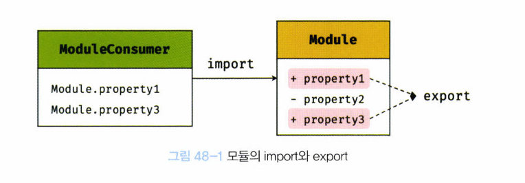

# 48장. 모듈

## 48.1 모듈의 일반적 의미

> 모듈이랑 애플리케이션을 구성하는 개별적 요소로서 재사용 가능한 코드 조각

- 기능을 기준으로 파일 단위로 분리
- 모듈이 성립하기 위해서는, 모듈은 자신만의 파일 스코프(모듈 스코프)를 가질 수 있어야 함
- 모듈의 자산
  - 모듈에 포함되어 있는 변수, 함수, 객체
  - 비공개가 기본
  - 즉, 자신만의 파일 스코프를 갖는 모듈의 모든 자산은 캡슐화되어 다른 모듈에서 접근할 수 없다. 모듈은 개별적 존재로, 애플리케이션과 분리되어 존재


#### 모듈의 `import`와 `export`



- `export`
  - 모듈은 공개가 필요한 자산에 한정해 명시적으로 선택적 공개가 가능하다
  - 모듈이 존재하는 이유: 재사용성
- `import`
  - 공개된 모듈의 자산은 다른 모듈에서 재사용 가능
  - 모듈 사용자(module consumer)
    - 공개된 모듈의 자산을 사용하는 모듈


## 48.2 자바스크립트와 모듈

- 자바스크립트는 모듈 시스템을 지원하지 않음

  - 초기 자바스크립트는 웹페이지의 단순한 보조 기능을 처리하기 위한 언어였기 때문

- 자바스크립트를 범용적으로 사용하려고 함

  - 지원하지 않는 모듈 시스템 문제를 해결해야 했음

- **자바스크립트의 모듈 시스템**

  - **CommonJS**
    - JavaScript를 범용적으로 사용하기 위해 필요한 '명세(Specification)'를 만듦. 
      - 특히 **모듈**을 정의하고, 어떻게 사용할 것인지 정의
    - Node.js
  - **AMD(Asynchronous Module Definition)**
    - AMD 그룹은 비동기 상황에서도 JavaScript 모듈을 쓰기 위해 CommonJS에서 함께 논의하다 합의점을 이루지 못하고 독립한 그룹이다.
    - 본래 CommonJS가 JavaScript를 브라우저 밖으로 꺼내기 위한 노력의 일환으로 탄생했기 때문에 **브라우저 내에서의 실행에 중점**을 두었던 AMD와는 합의를 이끌어 내지 못하고 결국 둘이 분리되었다.

  - CommonJS와 AMD에 대한 더 자세한 설명 https://d2.naver.com/helloworld/12864

- 브라우저 환경에서 모듈 사용하기 위해서는 CommonJS or AMD를 구현한 모듈 로더 라이브러리를 사용해야 함

## 48.3 ES6 모듈(ESM)

> ES6는 클라이언트 사이드 자바스크립트에서도 동작하는 모듈 기능 추가
>
> IE제외한 대부분의 브라우저에서 ES6모듈 사용 가능

- 사용법

  ```javascript
  // script 태그에 type="module" 속성 추가시 로드된 자바스크립트 파일은 모듈로서 동작
  <script type="module" src="app.mjs"></script>
  ```

  - 파일 확장자 `.mjs`
  - 일반적인 자바스크립트 파일이 아닌 ESM임을 명확히 하기위해 
  - 기본적으로 strict mode가 적용


### 48.3.1 모듈 스코프

- 독자적인 모듈 스코프 가짐

  - 일반적인 자바스크립트 파일은 `script` 태그로 분리해서 로드해도 독자적인 모듈 스코프를 가지지 않음

- `.js` 예제

  ```javascript
  // foo.js
  // x 변수는 전역 변수
  var x = 'foo';
  console.log(window.x) // foo
  ```

  ```javascript
  // bar.js
  var x = 'bar';
  console.log(window.x) // bar
  ```

  ```html
  <!DOCTYPE html>
  <html>
  <body>
    <script src="foo.js"></script>
  	<script src="bar.js"></script>
  </body>
  </html>
  ```

  - 하나의 자바스크립트 파일 내에 있는 것처럼 동작
  - `foo.js` 에서 선언한 x 변수와 `bar.js`에서 선언한 x 변수는 중복 선언되며, x변수 값은 덮어써짐

- `.mjs` 예제

  ```javascript
  // foo.mjs
  // x 변수는 전역변수도, window 객체의 프로퍼티도 아님
  var x = 'foo'
  console.log(x) // foo
  console.log(window.x) // undefined
  ```

  ```javascript
  // bar.mjs
  var x = 'bar'
  console.log(x) // bar
  consooe.log(window.x) // undefined
  ```

  ```html
  <!DOCTYPE html>
  <html>
  <body>
    <script type="module" src="foo.mjs"></script>
  	<script type="module" src="bar.mjs"></script>
  </body>
  </html>
  ```

  - `.mjs` 파일 내 x 변수는 전역변수도, window객체의 프로퍼티도 아님
  - 모듈 내에서 선언한 식별자는 모듈 내에서 참조불가능

  

  

### 48.3.2 `export` 키워드

- 내부에서 선언한 식별자를 외부에 공개해 다른 모듈들이 재사용할 수 있게 하기 위한 키워드
  - 모듈 내부에서 선언한 모든 식별자는 기본적으로 해당 모듈 내부에서만 참조가능

- 예시

  ```javascript
  // lib.mjs
  // 각각 export
  
  export const pi = Math.PI;
  
  export function square(x) {
    return x * x;
  }
  
  export class Person {
    constructor(name) {
      this.name = name;
    }
  }
  ```

  ```javascript
  // lib.mjs
  // 한번에 export
  
  const pi = Math.PI;
  
  function square(x) {
    return x * x;
  }
  
  class Person {
    constructor(name) {
      this.name = name;
    }
  }
  
  // 하나의 객체로 구성해서 공개
  export { pi, square, Person };
  ```

  

### 48.3.3 `import` 키워드

- 다른 모듈에서 export한 식별자를 자신의 모듈 스코프 내부로 로드하기 위해 사용하는 키워드

  - 다른 모듈이 export한 식별자 이름으로 import
  - ESM의 경우 파일 확장자 생략가능

- 예시

  ```javascript
  // app.mjs
  // 식별자 이름을 하나하나 import
  import { pi, square, Person } from '.lib.mjs';
  
  console.log(pi); // 3.141592653589793
  consoel.log(square(10)); // 100
  console.log(new Person('Lee')); // Person { name: 'Lee' }
  ```

  ```html
  <!DOCTYPE html>
  <html>
  <body>
    <script type="module" src="app.mjs"></script>
  </body>
  </html>
  ```

  - `app.mjs`는 앱의 진입점(entry point)이므로 반드시 <script>로 로드해야 하지만
  - `lib.mjs`는 import문에 의해 로드되는 dependency이므로 <script> 로 로드하지 않아도 됨

  

  ```javascript
  // app.mjs
  // 모든 식별자를 lib 객체의 프로퍼티로 모아서 import
  import * as lib from '.lib.mjs';
  
  console.log(lib.pi); // 3.141592653589793
  consoel.log(lib.square(10)); // 100
  console.log(new lib.Person('Lee')); // Person { name: 'Lee' }
  ```

  ```javascript
  // app.mjs
  // lib.mjs 모듈이 export한 식별자 이름을 변경해서 import
  import { pi as PI, square as sq, Person as P } from '.lib.mjs';
  
  console.log(PI); // 3.141592653589793
  consoel.log(sq(10)); // 100
  console.log(new P('Lee')); // Person { name: 'Lee' }
  ```

  - `as` 뒤에 지정한 이름의 객체에 프로퍼티로 할당됨

  

  ```javascript
  // lib.mjs
  export default x => x * x
  ```

  ```javascript
  // app.mjs
  import squre from '.lib.mjs'
  console.log(square(3)); // 9
  ```

  - `export default` 사용시 `var`, `let`, `const` 는 사용할 수 없다

    - ```javascript
      // lib.mjs
      export default const foo = () => {}; // SyntaxError: Unexpected token 'const'
      // export default () => {};
      ```

  - `default` 키워드와 함께  export한 모듈은 {} 없이 임의로 import

