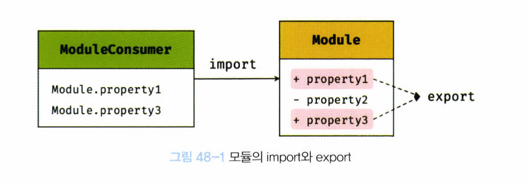

# 48장. 모듈

## 48.1 모듈의 일반적 의미

> 모듈이랑 애플리케이션을 구성하는 개별적 요소로서 재사용 가능한 코드 조각

- 기능을 기준으로 파일 단위로 분리
- 모듈이 성립하기 위해서는, 모듈은 자신만의 파일 스코프(모듈 스코프)를 가질 수 있어야 함
- 모듈의 자산
  - 모듈에 포함되어 있는 변수, 함수, 객체
  - 비공개가 기본
  - 즉, 자신만의 파일 스코프를 갖는 모듈의 모든 자산은 캡슐화되어 다른 모듈에서 접근할 수 없다. 모듈은 개별적 존재로, 애플리케이션과 분리되어 존재

- `export`
  - 모듈은 공개가 필요한 자산에 한정해 명시적으로 선택적 공개가 가능하다
  - 모듈이 존재하는 이유: 재사용성
- `import`
  - 공개된 모듈의 자산은 다른 모듈에서 재사용 가능
  - 모듈 사용자(module consumer)
    - 공개된 모듈의 자산을 사용하는 모듈

## 48.2 자바스크립트와 모듈

## 48.3 ES6 모듈(ESM)

### 48.3.1 모듈 스코프

### 48.3.2 `export` 키워드

### 48.3.3 `import` 키워드

