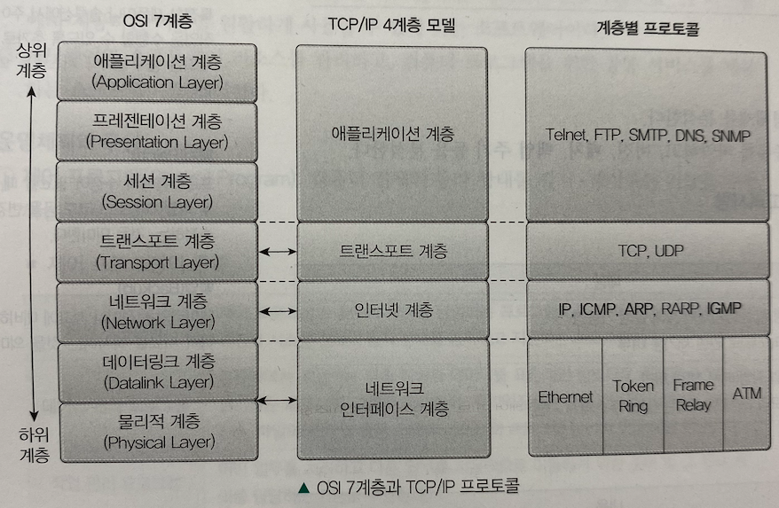
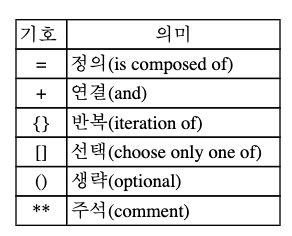

# 1️⃣ 소프트웨어 설계

# Chapter 1. 요구사항 확인

## 1. 현행 시스템 분석

### 1. 현행 시스템 파악

#### (1) 현행 시스템 파악의 개념

1. 개발 범위와 향후 개발될 시스템으로의 이행 방향성 분석 가능
2. 현행 시스템이 어떤 하위 시스템으로 구성되었는지, 제공하는 기능이 뭔지, 다른 시스템들과 어떤 정보를 주고받는지, 어떤 기술 요소를 사용하는지, 사용하고 있는 소프트웨어 및 하드웨어는 무엇인지, 네트워크는 어떻게 구성되어 있는지

#### (2) 현행 시스템 파악 절차

1. 1단계: 시스템 구성/기능/인터페이스 현황 파악
2. 2단계: 아키텍처/소프트웨어 구성 파악
3. 3단계: 하드웨어/네트워크 구성 파악

### 2. 플랫폼 기능 분석

#### (1) 플랫폼(Platform)의 개념

1. 다양한 종류의 시스템, 서비스를 제공하기 위해 **공통적이고 반복적**으로 사용하는 **기반 모듈**
2. 응용 프로그램을 구동시키는데 사용되는 하드웨어와 소프트웨어의 결합

#### (2) 플랫폼의 기능

1. 소프트웨어 개발 및 운영 **비용 감소**
2. 소프트웨어 개발 **생산성 향상**
3. 동일한 플랫폼 간 커뮤니티를 형성해 **네트워크 효과**를 유발

#### (3) 플랫폼의 종류

1. 하드웨어 플랫폼
   - 데스크톱, 메인프레임 등
2. 소프트웨어 플랫폼
   - 윈도우, 리눅스, 안드로이드
3. 서비스 플랫폼
   - 트위터, 페이스북

#### (4) 플랫폼 기능 분석 절차

1. 현행 플랫폼 자료 수집
2. 수집 자료 분석
3. 결과 산출물 작성

### 3. 플랫폼 성능 특성 분석

#### (1) 플랫폼 성능 특성 분석의 개념

1. **객관적인 성능 평가를 제시**할 수 있고, 사용자에게 **안정적 서비스**를 제공할 수 있음
2. 사용자가 서비스를 이용할 때 **처리 속도의 적정성**을 알 수 있음
3. 초기 조건과 종료 조건을 설정하고, 여러 개의 파라미터를 측정해 수행한다. 
   - 성능 평가에 사용되는 파라미터는 **서비스 응답 속도**, **응답 결과 정확도** 등이 있다

#### (2) 플랫폼 성능 특성의 분석 기법

1. 사용자 인터뷰: 응답 속도의 적정성확인
2. 성능 테스트: 성능, 부하 테스트 
3. 산출물 점검: 현행 플랫폼과 유사한 타 제품의 벤치마킹 테스트 결과서

#### (3) 플랫폼 성능 특성의 측정 항목

- 반환 시간(Turnaround Time)
  - 작업을 요청한 시간부터 처리가 완료될 때까지 걸린 시간
- 사용률(Utilization)
  - 작업을 처리하는 동안 CPU, 메로리 등의 자원 사용률
- 응답시간(Response Time)
  - 요청을 전달한 시간부터 응답이 도착할 때까지 걸린 시간
- 가용성(Availability)
  - 서비스가 다운되지 않고 정상적으로 유지되는 시간 

### 4. 운영체제 분석

#### (1) 운영체제(Operating System)의 개념

1. 사용자에게 편리성을 제공하고자 하는 **인간과 컴퓨터 사이의 인터페이스(소통)**를 위한 시스템 소프트웨어
2. 컴퓨터 시스템의 모든 부분(소프트웨어, 하드웨어)을 제어하는 프로그램 
3. 하드웨어, 소프트웨어 **리소스를 관리**하고, 컴퓨터 프로그램을 위한 공통 서비스를 제공하는 소프트웨어

#### (2) 운영체제의 구성

1. 제어 프로그램(Control Program)
   - 감시 프로그램
   - 데이터 관리 프로그램
   - 작업 관리 프로그램
   - 통신 제어 프로그램
2. 처리 프로그램(Processing Program)
   - 언어 번역 프로그램
   - 서비스 프로그램
   - 사용자 정의 프로그램

#### (3) 운영체제의 종류

1. 유닉스(Unix)
   - AT&T에서 개발하여 멀티 태스킹 가능하고, 다중 사용자 환경을 지원하는 운영체제
2. 리눅스(Linux)
   - 리누스 토발즈(Linus Torvals)에 의해 유닉스를 기반으로 만들어짐. 오픈소스
3. 윈도우(Windows)
   - 안정적이고 표준화된 GUI(Graphic User Interface)를 갖춘 운영체제
4. 모바일 운영체제
   - Android: 구글, 리눅스 기반 개방형 모바일 운영체제
   - iOS: 애플, 임베디드 운영체제

#### (4) 운영체제 분석의 특성

1. 현재 사용하는 시스템의 운영체제 분석
2. 현재 시스템의 운영체제 종류  파악. **버전**, **패치**, **백업 주기** 등 분석

#### (5) 운영체제 현행 시스템 분석 시 고려사항

1. 품질 측면
   - 신뢰도
   - 성능
2. 지원 측면
   - 기술 지원
   - 주변 기기
   - 구축 비용

### 5. 네트워크 분석

#### (1) 네트워크의 개념

1. 통신 기능을 갖춘 두 개 이상의 통신 장치 사이에서 동선이나 광섬유, 혹은 무선 링크를 포함하는 전송 미디어를 사용해 정해진 규칙으로 통신 프로토콜에 따라 데이터로 표현되는 정보를 교환하는 통신망
2. 컴퓨터 장치들이 통신 회선으로 연결되어 서로 데이터를 교환하는 기술

#### (2) OSI 7계층 참조 모델

- 서로 다른 기종이 시스템의 종류, 구현 방법 등에 제약을 받지 않고 통신이 가능하도록 통신에서 요구되는 사항을 정리해서 표준 모델로 정립한 것
- 개방형 시스템과 상호 접속을 위한 참조 모델

#### (3) 네트워크 분석의 특성

- 네트워크 구성도 작성
- **스위치, 라우터, IDC, 백본망, 방화벽, IDS** 등을 분석
  | 구분                            | 내용                                                         |
  | ------------------------------- | ------------------------------------------------------------ |
  | 스위치                          | MAC 주소를 이용해 어느 세그먼트로 패킷을 보내야 할지를 결정할 수 있으며, MAC table을 메모리에 저장해 스위칭 기능 수행 |
  | 라우터                          | 원거리에서 네트워크 간 통합을 위해 사용되는 장비 원하는 목적지로 데이터를 보낼 수 있으며, 원하는 데이터를 가져올 수도 있음 |
  | IDC(Internet Data Center)       | 서버를 한데 모아 집중시킬 필요가 있을 때 설립                |
  | 백본망                          | 다양한 네트워크를 상호 연결하는 컴퓨터 네트워크의 일부 각기 다른 LAN이나 서브 네트워크간 정보를 교환하기 위해 경로를 제공하는 망 |
  | 방화벽                          | 외부로부터 내부망을 보호하기 위한 네트워크 구성 요소 외부의 불법 침입으로부터 내부의 정보 자산 보호, 유해 정보 유입 차단을 위한 정책과 이를 지원하는 하드웨어/소프트웨어 |
  | IDS(Intrusion Detection System) | 대상 시스템(네트워크 세그먼트 탐지 영역)에 대한 인가되지 않은 행위와 비정상적인 행동을 탐지하고, 탐지된 불법 행위를 구별해 실시간으로 침입을 차단하는 기능을 가진 보안 시스템 |
- 네트워크 장애 발생의 추적 및 대응 등 다양한 용도로 활용 가능

### 6. DBMS 분석

#### (1) DBMS(DataBase Management System)의 개념

1. 응용 프로그램과 데이터베이스의 중재자
2. 데이터베이스를 효과적으로 이용할 수 있도록 하기 위해 필요한 **제어, 접근 방법, 관리** 등의 기능을 수행

#### (2) DBMS 분석의 특성

1. DBMS의 종류, 버전, 구성 방식, 백업 주기 등을 분석
2. 고려사항: 가용성, 성능, 구축 비용, 기술 지원, 상호호환성

   | 구분       | 내용                                                         |
   | ---------- | ------------------------------------------------------------ |
   | 가용성     | 장기간 시스템을 운영할 때 발생할 수 있는 장애 발생 가능성 DBMS의 결함 등으로 인한 패치 설치를 위한 재가동, 백업 및 복구 편의성, DBMS 이중화 및 복제 지원 |
   | 성능       | 대규모 데이터 처리 성능, 대량 트랜잭션 처리 성능, 다양한 튜닝 옵션 지원, 비용 기반 최적화 지원 및 설정의 최소화 |
   | 기술 지원  | 공급 벤더들의 안정적인 기술 지원 많은 사용자들간의 정보 공유 |
   | 상호호환성 | 설치 가능한 운영체제 종류,  다양한 운영체제에서 지원되는 JDBC(Java Database Connectivity), ODBC(Open Database Connectivity)와 같은 인터페이스 호환 |
   | 구축 비용  | 라이선스 정책 및 비용, 유지 및 관리 비용                     |

#### (3) DBMS의 필수 기능

* 정의 기능(Definition Facility)
  * 데이터베이스 구조를 정의
* 조작 기능(Manipulation Facility)
  * 데이터 조작어로 데이터베이스 조작
* 제어 기능(Control Facility)
  * 데이터베이스 내용의 정확성과 안정성 유지

### 7. 비즈니스 융합 분석

#### (1) 비즈니스 융합의 개념

- 산업 또는 시장 간의 경계를 허물고, **ICT(Information & Communication Technology) 등을 통한 새로운 전달 방식을 도입**함

#### (2) 비즈니스 융합 분석의 유형

- 고객 분석
- 제품 서비스 및 서비스 분석
- 사업 구조 분석

#### (3) 비즈니스 융합 유형

- 제품과 IT 융합
- 제품과 서비스 통합
- 제품 융합
- 서비스 융합

#### (4) 비즈니스 융합 분석 절차

1. 기업 전략 분석
2. 영역 및 방향 설정
3. 포트폴리오 선정
4. 융합 모델 설계 및 평가
5. 비즈니스 융합 실행 및 개선

#### (5) 효과적인 프로젝트 관리의 3P

- **People, Process, Problem**

## 2. 요구사항 확인

### 1. 요구사항의 개념

#### (1) 요구사항의 정의

- 요구사항은 **시스템에 대한 고객의 요청을 확정한 것**으로, 이해 당사자와의 의사소통과 이해가 필요
- 요구사항은 어떤 문제를 해결하기 위한 **조건이나 제약 조건**으로 소프트웨어 개발 전 과정에 필요한 **기준과 근거**를 제공

#### (2) 요구사항의 분류

- 기능적 요구사항
  - 시스템이 외형적으로 보여주는 기능과 동작
  - 사용자와 외부 요소들 간의 상호작용
  - 업무 절차나 입출력에 대한 요구
  - 사용 사례로 정리
- 비기능적 요구사항
  - 시스템이 제공하는 기능에 직접 관련되지 않는 요구
  - 시스템에 대한 다양한 제약 조건
  - 성능, 품질, 보안, 안전, 인터페이스 등의 요구사항
  - 품질 속성 시나리오로 정리

#### (3) 요구 분석 기법의 문제점 및 해결 방안

| 문제점        | 해결방안                                                     |
| ------------- | ------------------------------------------------------------ |
| 이해 부족     | 경험 있는 인력 투입, 유스케이스 모델링                       |
| 의사소통 부족 | **Work-through**, inspection, 워크숍, 의사소통 채널 단일화 - 워크스루는 **검토회의 전에 요구사항 명세서를 미리 배포하여 사전 검토**한 후 짧은 검토회의를 통해 오류를 조기에 검출 |
| 표현의 어려움 | **모델링 기법**(구조적 분석 기법, 객체지향 분석)으로 가시화  |
| 요구사항 변경 | 변경 관리 계획, 유형별 분리                                  |

### 2. 요구사항 확인 단계: 도출 > 분석 > 명세 > 검증

#### (1) 요구 도출

- 사용자들의 요구사항이 무엇인지, 기능적/비기능적 요구사항을 추출하는 과정
- 요구 도출 방법
  - 인터뷰, 설문조사, 워크숍, 프르토타이핑, 브레인스토밍, 유스케이스, JAD(Joint Application Development)
    - 유스케이스: 사용 사례 분석으로 사용자 요구사항을 기능별로 구분하여 수집
    - JAD: 개발자와 사용자가 만나서 요구사항 도출을 위한 공동 작업 수행

#### (2) 요구 분석

- 구조적 분석, 객체지향 분석으로 구분된다
- 요구 분석시 필요한 기술
  - 청취와 인터뷰
  - 분석과 중재
  - 관찰 및 모델 작성

#### (3) 요구 명세

* 요구 분석의 결과를 바탕으로 요구 모델을 작성하고 문서화 하는 활동
* 기능 요구사항은 빠짐없이, 비기능 요구사항은 필요한 것만

* 요구사항 명세 속성

  | 구분        | 내용                                              |
  | ----------- | ------------------------------------------------- |
  | 정확성      | 요구사항은 정확해야 한다                          |
  | 명확성      | **단 한 가지로 해석**되어야 한다                  |
  | 완전성      | **모든 요구사항(기능, 비기능)이 표현**되어야 한다 |
  | 일관성      | 요구사항 간 **충돌이 없어야** 한다                |
  | 수정 용이성 | 요구사항의 **변경이 가능**해야 한다               |
  | 추적성      | **제안서 등을 통해 추적이 가능**해야 한다         |

* 요구사항 명세 기법

  | 구분 | 정형 명세                            | 비정형 명세                                   |
  | ---- | ------------------------------------ | --------------------------------------------- |
  | 기법 | 수학적 기반/모델링 기반              | 상태/기능/객체 중심 명세 기법, 자연어 기반    |
  | 종류 | Z, VDM, Petri-Net, CSP, LOTOS        | FSM, Decision Table, ER 모델링, SADT, UseCase |
  | 장점 | 시스템 요구 특성의 정확, 명세 간결   | 명세 작성 이해 용이, 의사 전달 방법 다양성    |
  | 단점 | 낮은 이해도, 이해 관계자의 부담 가중 | 불충분한 명세 기능, 모호성                    |

#### (4) 요구 검증

- 요구 사항에 자원이 배정되기 전에 문제 파악을 위한 검증을 수행해야 함
- 요구 사항이 실제 요구를 반영하는지, 문서상의 요구사항은 서로 상충되지 않는지를 점검
- 일반적으로 요구사항 관리도구를 사용해 산출물에 대한 형상관리를 수행한다

### 3. 구조적 분석

#### (1) 자료 흐름도(DFD: Data Flow Diagram)

- 기능 중심의 시스템을 모델링하는데 적합

- DeMarco, Youdon에 의해 제안되었고, Gane, Sarson이 보완

- 자료 흐름도의 구성

  

  - 프로세스(Process)
  - 자료 흐름(Data Flow)
  - 자료 저장소(Data store)
  - 단말(Terminal)

#### (2) 자료 사전(DD: Data Dictionary)

#### 

- 자료 요소들의 집합이며, 저장 내용이나 중간 계산등에 관련된 용어를 이해할 수 있는 정의

#### (3) 프로세스 명세서

- 자료 흐름도의 계층상에서 최하위 단계, 즉 더 이상 분해할 수 없는 단계의 처리 절차를 기술하는 것으로 구조적 언어를 이용
- DeMarco는 프로세스 명세서를 소단위명세서(Mini-spec)라고 했다

### 4. 객체지향 분석

#### (1) 객체지향 분석(OOA: Object Oriented Analysis)의 개념

- **동적 모델링 기법**이 사용될 수 있으며, 데이터와 행위를 하나로 묶어 객체를 정의하고, **추상화**시키는 작업

#### (2) 럼바우(Rumbaugh)의 OMT(Object Modeling Technique) 기법

- 그래픽 표기법을 이용해 객체들을 모델링하는 기법

- 객체들의 연관성 강조, 조직적인 모델링 방법론을 이용해 실세계 문제들을 다른 방법보다 상세하게 나타냄

- 시스템의 분석, 설계, 구현단계 전 과정에 객체지향 개념 적용

- **객체 모델링 > 동적 모델링 > 기능 모델링** 순서로 진행

- OMT 3단계

  | 모델링                          | 내용                                                         |
  | ------------------------------- | ------------------------------------------------------------ |
  | 객체 모델링(Object Modelling)   | 객체 다이어그램으로 표시하며, 정보 모델링이라고도 함 일대다의 객체 의존 관계를 정의 시스템에서 요구되는 객체를 찾아내 속성과 연산 식별 및 객체들 간의 관계를 규정하여 다이어그램으로 표시하는 모델링 |
  | 동적 모델링(Dynamic Modelling)  | 시스템이 시간 흐름에 따라 변화하는 것을 보여주는 상태 다이어그램 작성 |
  | 기능 모델링(Function Modelling) | 시스템 내에서 데이터가 변하는 과정을 나타내며 자료 흐름도를 이용 |

  

#### (3) Booch의 OOAD(Object Oriented Analysis and Design)

- 분석보다는 설계에 더 많은 중점
- 전체 시스템의 가시화와 실시간 처리에 유용하며, 설계를 위한 문서화 기법이 강조
- 규모가 큰 프로젝트 수행 시 과정이 매우 복잡해지며, 구현 언어에 제한됨

#### (4) Coad/Yourdon 방법

- ERD를 사용해 객체의 행위를 모델링 하는데 초점을 둔 방법
- 객체 식별, 구조 식별, 주체 정의, 속성 및 관계 정의, 서비스 정의 등의 과정으로 구성

###  5. UML

#### (1) UML(Unified Modeling Language)의 정의

#### (2) UML의 특성

#### (3) UML 다이어그램의 종류

### 6. 애자일

#### (1) 애자일(Agile)의 정의

#### (2) 애자일의 특성(5가지 가치)

#### (3) 애자일의 종류

#### (4) 익스트림 프로그래밍

