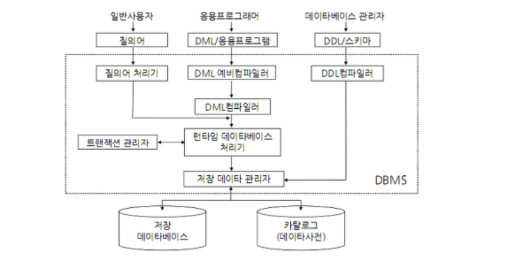
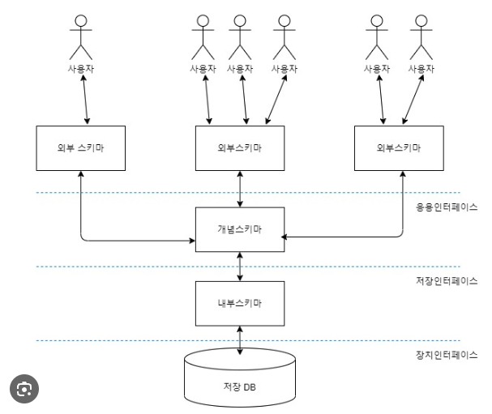
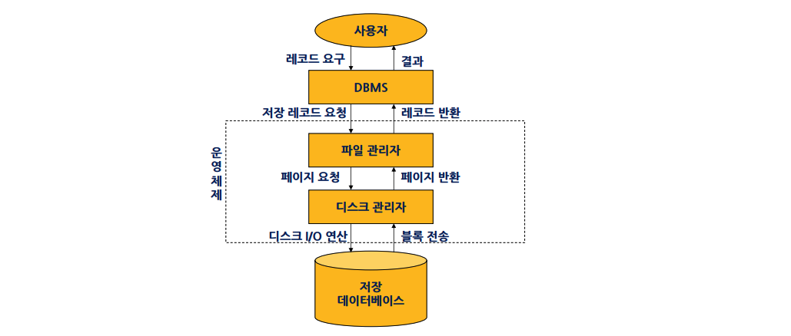

#  3️⃣ 데이터베이스 구축

# Chapter 1. 데이터베이스 개요

## 1. 데이터베이스의 개요

### 1. 정보처리 시스템

#### (1) 정보와 데이터

1. 데이터
   -  아직까지 처리되지 않은 사실이나 값
2. 정보
   - 자료를 가공하여 얻은 결과
   - 유효한 해석(interpretation)이나 상호관계(relationship)
3. 정보시스템
   - 데이터를 수집, 조작, 저장하고 정보를 생성 및 분배


### 2. 데이터베이스의 개념

#### (1) 데이터베이스의 정의

1. 통합 데이터(Integrated Data)
   - 최소한의 중복, 통제된 중복
2. 저장 데이터(Stored Data)
   - 컴퓨터가 접근 간으한 저장 매체에 저장되는 것
3. 운영 데이터(Operational Data)
   - 조직의 고유한 업무 수행을 위해 필요한 데이터
4. 공용 데이터(Shared Data)
   - 여러 사용자자 데이터를 공동으로 이용

#### (2) 데이터베이스의 특징

1. 실시간 접근성(Real Time Accessibility)
2. 계속적인 변화(Continuous Change)
3. 동시 공유(Concurrent Sharing)
4. 내용에 따른 참조(Reference by Content)
   - 데이터의 물리적 위치가 아닌, 데이터 내용에 따라 참조

#### (3) 데이터베이스 구성

1. 속성(Attribute)
   - 단독으로 존재 불가능
   - 개체의 특성이나 상태 
2. 개체(Entity)
   - 하나 이상의 속성으로 구성
   - 표현하려는 유, 무형의 정보를 대상으로 존재하며 서로 구별되는 것을 의미
3. 관계(Relationship)
   - 개체 간, 속성간의 상호작용

#### (4) 데이터베이스의 구조

1. 논리적 구조
   - 일반 사용자 관점
2. 물리적 구조
   - 저장 장치 관점

#### (5) 데이터베이스의 장점

1. 논리적 독립성
   - 응용 프로그램에 영향을 주지 않고, 데이터베이스의 논리적 구조를 변경시킬 수 있다
2. 물리적 독립성
   - 응용 프로그램이나 데이터베이스의 논리적 구조에 영향을 주지 않고, 데이터베이스의 물리적 구조를 변경시킬 수 있다
3. 무결성 유지
   - 데이터가 항상 안정적이며, 결함 없이 존재해야 함
4. 중복성 최소화
5. 불일치 제거(일관성 유지)
   - 특정 시점에 같은 값을 가져야 하는 항목들이 서로 다른 값을 갖지 않도록 불일치를 제거해야 함
   - 데이터 중복성은 불일치를 발생시킬 수 있음
6. 공유의 편리
   - 물리적 독립성과 연관
7. 표준화의 용이
8. 보안성 유지의 편리

#### (6) 데이터베이스의 3요소

1. 데이터 추상(Data Abstraction)
   - 추상화 = 개념화, 일반화
2. 데이터 독립(Data Independency)
   - 프로그램을 변경하지 않고 자료 변경 가능
3. 자기 정의(Self Definition)
   - 데이터의 구성과 내용을 데이터베이스가 기억하고 관리
   - 정의는 DBMS 시스템 카탈로그(System Catalog)에 저장


## 2. 데이터베이스 관리 시스템

### 1. 파일 시스템의 문제점

#### (1) 문제점 발생 이유

- 데이터의 종속성 및 중복성 발생

#### (2) 데이터 종속성과 중복성

* 종속성(Data Dependency)
  * 응용 프로그램과 데이터간의 상호 의존 관계
  * 데이터 구성 방법이나 접근 방법의 변경으로 관련된 응용 프로그램도 같이 변경됨
* 중복성(Data Redundancy)
  - 한 시스템 내 일부 또는 전체가 같은 내용의 데이터가 중복되어 저장 및 관리
  - 문제점
    - 내부적 일관성(Internal Consistency) 없음
    - 보안성(Security) 결여
    - 경제성(Economics) 저하
    - 무결성(Integrity) 유지 곤란


### 2. DBMS의 개요

#### (1) DBMS(데이터베이스 관리 시스템)의 정의

- 파일 시스템의 **데이터 종속성과 중복성의 문제를 해결**하기 위해 제안
- 사용자와 데이터베이스의 중재자
- 데이터베이스의 구성과 저장, 접근 방법, 유지 및 관리를 위한 소프트웨어
- **모든 응용 프로그램들의 데이터베이스 접근은 DBMS를 통해서만 접근 가능**

#### (2) DBMS의 필수 기능

1. 정의: 데이터 형태, 구조, 데이터베이스의 저장에 관한 내용 정의
   - DDL: `CREATE`, `ALTER`, `DROP`, `RENAME`
2. 조작: 사용자의 요구에 따라 검색, 갱신 등을 지원
   - DML: `SELECT`, `INSERT`, `UPDATE`, `DELETE`
3. 제어: 정확성과 안정성을 유지하는 기능(무결성 유지, 보안 검사, 병행 수행)
   - DCL: `GRANT`, `REVOKE`

#### (3) DBMS의 장단점

| 장점                                                         | 단점                                                         |
| ------------------------------------------------------------ | ------------------------------------------------------------ |
| 데이터 **중복을 최소화**해 **데이터 일관성** 유지<br />데이터 **독립성**의 최대화<br />데이터 공유<br />**무결성 유지**<br />데이터 보안 보장<br />표준화 가능<br />지속성 제공<br />백업과 회복 제공 | **고속/고용량의 메모리**나 CPU가 요구되며 **많은 운영비** 발생<br />데이터 처리의 복잡<br />파일의 백업과 회복의 어려움<br />시스템의 취약성 |

#### (4) DBMS의 구성 요소 및 특징

#### 

1. DDL 컴파일러
   - DDL로 명세된 스키마를 내부 형태로 변환해 시스템 카탈로그에 저장
   - 메타 데이터를 처리해 시스템 카탈로그에 저장
2. 질의어 처리기(Query Processor)
   - 질의문을 파싱, 분석, 컴파일하여 런타임 데이터베이스 처리기를 호출
3. 예비 컴파일러
   - 응용 프로그램에 삽입된 DML(DSL)을 추출
   - 추출된 DML은 DML 컴파일러로 전달
   - DML 선행 번역기(Precompiler)라고도 함
4. DML 컴파일러
   - DML 명령어를 목적 코드로 변환
5. 런타임 데이터베이스 처리기(Run-Time Database Processor)
   - 실행 시간에 데이터베이스 접근을 취급
   - **데이터베이스 연산**을 **저장 데이터 관리자**를 통해 디스크에 저장된 데이터베이스에 실행
6. 트랜잭션 관리자(Transaction Manager)
   - 무결성과 권한 제어
   - 병행 제어와 회복 작업 수행
7. 저장 데이터 관리자(Stored Data Manager)
   - 디스크에 있는 데이터베이스 접근 제어
   - 기본 OS 모듈을 이용(파일 관리자, 디스크 관리자)


## 3. 데이터베이스 시스템의 구성

### 1. 데이터베이스 시스템

#### (1) 데이터베이스 시스템(DBS)의 구성

```tex
DBS = DB + DBMS + USER + DL(Data Language) + DBA + DB 컴퓨터
```


### 2. 3단계 데이터베이스(스키마, Schema)



#### (1) 스키마의 정의

- **데이터베이스의 구조(개체, 속성, 관계)에 대한 정의**와 이에 대한 **제약 조건** 등을 기술한 것으로, 컴파일되어 **데이터 사전에 저장**된다

#### (2) 스키마의 종류

1. 외부 스키마
   - **전체 데이터 중 사용자가 사용하는 한 부분**에서 본 구조
   - 서브 스키마 / 뷰
   - 여러개가 존재
2. 개념 스키마
   - **논리적 관점**에서 본 구조로, 전체적인 데이터 구조
   - 데이터베이스 전체를 정의한 것으로 데이터 개체, 관계, 제약 조건, 접근 권한, 무결성 규칙 등을 명세한 것
3. 내부 스키마
   - **물리적 저장 장치 관점**에서 본 구조
   - 실제로 데이터베이스에 저장되는 내부 레코드로 형식을 정의
   - 저장 데이터 항목의 표현 방법, 인덱스 유무, 내부 레코드의 물리적 순서 나타냄

### 3. 데이터 언어

#### (1) 정의어(DDL)

#### (2) 조작어(DML)

#### (3) 제어어(DCL)


### 4. 데이터베이스 관리자

#### (1) DBA(DataBase Administrator)의 개념

- DBMS의 전체적 관리 운영에 책임을 지는 사람
  - DB 시스템과 자원에 대한 기획, 통제

#### (2) DBA의 역할

- 데이터베이스 구성 요소 결정
- 스키마 정리
- 저장 구조와 접근 방법 선정
- 보안, 권한부여, 유효성 검사
- 예방, 회복 절차 수립
- 무결성 유지 등


### 5. 데이터 사전과 데이터 디렉터리

#### (1) 데이터 사전(Data Dictionary)	

- 스키마 및 객체에 관한 정보를 포함하고 있는 시스템 데이터베이스
- **시스템 카탈로그**(System Catalog), 메타 데이터베이스, 시스템 데이터베이스, 기술자 정보 등으로 불림
- 기본 테이블, 뷰, 인덱스, 데이터베이스, 응용 계획, 패키지, 접근 권한 등의 정보를 저장
- 릴레이션, 인덱스, 사용자 등의 정보 뿐 아니라 위치 단편화 및 **중복 독립성을 제공하기 위해 필요한 모든 정보**를 포함

#### (2) 관계 데이터베이스에서 데이터 사전의 특징

- 일반 사용자 테이블과 같이 시스템 테이블로 구성
- 시스템 카탈로그에 저장되는 내용을 메타데이터라고 함
- SQL문을 이용해 테이블 내용 검색은 가능하지만, DML(`UPDATE`, `DELETE`, `INSERT`)로 직접 갱신하는것은 불가능
- SQL문을 실행하면 시스템이 자동적으로 관련 카탈로그 테이블을 갱신

#### (3) 데이터 사전 저장 내용

- 시스템이 저장해야 하는 정보의 형태
  - 릴레이션 이름, 속성의 도메인, 속성의 이름, 무결성 제약조건, 데이터베이스에 정의된 뷰의 이름과 뷰에 대한 정의
- 시스템의 **사용자에 대한 정보** 유지
  - 권한이 있는 사용자의 이름
  - 사용자를 인증하기 위해 사용하는 비밀번호
  - 사용자의 시스템 사용료에 관한 정보
- **릴레이션**에 대한 정적이고 설명적인 정보
- 릴레이션의 저장 구조와 각 릴레이션이 저장된 위치
- **인덱스**에 대한 정보
- 기타
  - 질의 최적화 정보
  - 액세스 방법에 대한 정보
  - 통계정보
  - 다단계 인덱스에 대한 블록 접근 수

#### (4) 데이터 디렉터리(Data Directory)

- 데이터 사전에 수록된 데이터를 실제로 접근하는데 필요한 정보를 관리 및 유지하는 시스템
- 데이터 사전은 사용자와 시스템이 공동으로 접근 가능하지만, **디렉터리는 시스템만 접근가능**하다


### 6. 데이터베이스의 저장과 접근



#### (1) 데이터베이스의 내부적 운영

- 데이터베이스 내부 관리를 위해 데이터를 실제로 저장하고 접근하는 작업
- 데이터베이스는 **물리적으로 직접 접근 저장장치(DASD: Direct Access Storage Device)**에 저장
- 디스크 어레이(RAID)나 광디스크와 같은 대량 저장장치가 사용되기도 하지만, **일반적으로 디스크**를 중심으로 설명

#### (2) 데이터베이스의 저장 구조

- 디스크에 데이터가 배치되어 저장되어 있는 형태를 저장 구조라고 함
- 다수의 저장 구조 지원
- 데이터베이스의 부분별로 저장
- 성능 요건 변경 시 저장 구조 변경 가능
- 데이터베이스의 물리적 설계
- 데이터베이스의 사용 방법, 응용, 응용 실행 빈도수에 따라 적절한 저장 표현을 선정하는 과정

#### (3) 데이터베이스의 접근

- DBMS는 사용자가 요구하는 정보가 **어떤 저장 파일의 레코드인가**를 결정해서 **파일 관리자에게** 검색 요구
- **파일 관리자**는 DBMS가 원하는 저장 레코드가 **어떤 페이지(Page)에 저장되어 있는가**를 결정해서 **디스크 관리자**에게 그 페이지를 요청
- **디스크 관리자**는 파일 관리자가 원하는 페이지(블록)의 **물리적 위치**를 알아내 그 **페이지 전송에 필요한 디스크 입출력 명령**을 내림

