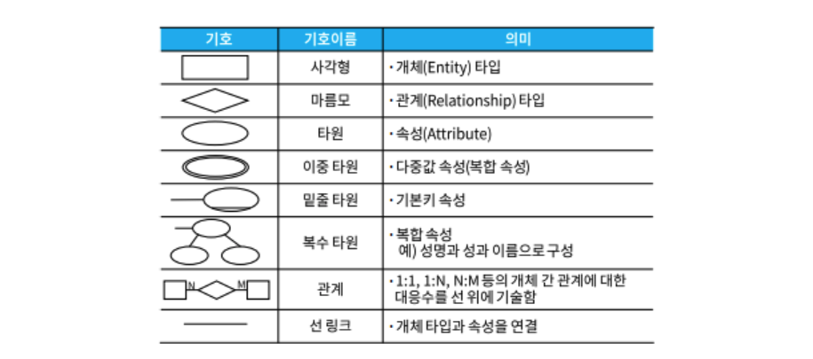
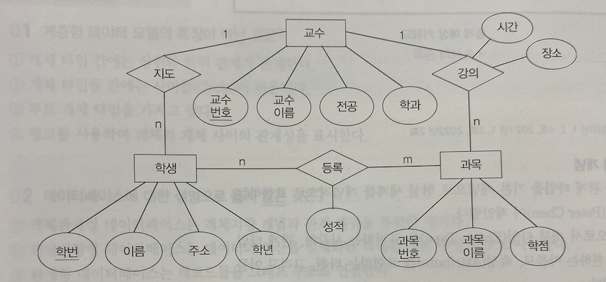

#  3️⃣ 데이터베이스 구축

# Chapter 2. 데이터 모델링

## 1. 데이터 모델의 개념

### 1. 데이터 모델

#### (1) 데이터 모델의 개념

- 현실 세계의 데이터 구조를 컴퓨터 데이터 구조로 기술하는 논리적 구조
- 현실 세계를 데이터베이스에 표현하는 중간 과정
  - 데이터베이스 설계 과정에서 현실 세계의 데이터 구조를 논리적으로 표현하기 위해 사용되는 지능적 도구
- DBMS나 컴퓨터에 맞게 데이터의 크기 및 유형을 결정하고, 레코드 타입을 결정

#### (2) 데이터 모델의 구성 요소: D = <S, O, C>

| 구성요소               | 내용                                                         |
| ---------------------- | ------------------------------------------------------------ |
| 데이터 구조(Structure) | 정적 성질(추상적 개념)로서 개체 타입과 이들 간의 관계를 명세 |
| 연산(Operation)        | 동적 성질로서 개체 인스턴스에 적용 가능한 연산에 대해 명세   |
| 제약 조건(Constraint)  | 데이터에 대한 논리적 제약으로 개체 인스턴스의 허용 조건을 의미 구조(Structure)로부터 파생되는 의미상 제약 |

#### (3) 데이터시스템 모델의 설계 순서

1. 요구 조건 분석
2. 개념적 설계
3. 논리적 설계
4. 물리적 설계
5. 데이터베이스 구현

### 2. 논리적 데이터 모델

#### (1) 정의

- 개념 구조를 컴퓨터 환경에 맞게 사상하기 위한 **논리적 구조를 기술하는 방법**

#### (2) 종류와 특징

| 종류                     | 특징                                                         |
| ------------------------ | ------------------------------------------------------------ |
| **관계 데이터 모델**     | **표 데이터 모델**, 구조가 단순하며 사용이 편리 **n:m 관계** |
| **네트워크 데이터 모델** | **망 데이터 모델**, 레코드 타입 간의 관계에 대한 도형적 표현(그래프) 오너-멤버 관계, 즉 **1:n 관계**(사이클 허용) |
| **계층 데이터 모델**     | 트리 데이터 모델 데이터 사이는 링크로 표현됨 부모 자식 관계, 즉 **1:n 관계**(사이클 허용 불가) |

#### (3) DBMS 종류

1. 관계형 DBMS(RDBMS)
   - SQL Server, Oracle, SQL/DS, DB2, Ingres, Informix, Sybase
2. 네트워크형 DBMS
   - DBTG(CODASYSL), IDMS, IDS II, Total, DMS/1100
3. 계층형 DBMS
   - IMS(IBM), System 2000
4. 객체지향형 DBMS
   - GemStone, Versant ODBMS, O2

### 3. 개체와 관계

#### (1) 개체(Entity)

- 단독으로 존재하며, 다른 것과 구분되는 개체
- 개체는 속성(attribute)들의 집합을 가짐

#### (2) 관계(Relationship)

- 개체 집합의 구성 원소인 인스턴스 사이의 대응성(Correspondence), 즉 사상(Mapping)을 의미

- 사상의 원소 수(Mapping Cardinality)

  | 종류        | 내용                                                         |
  | ----------- | ------------------------------------------------------------ |
  | 일대일(1:1) | 개체 집합 A의 각 원소가 개체 집합 B의 원소 한개와 대응       |
  | 일대다(1:N) | 개체 집합 A의 각 원소는 개체 집합 B의 원소 여러 개와 대응 하지만 개체 집합 B의 각 원소는 개체 집합 A의 원소 한개와 대응 |
  | 다대다(N:N) | 개체 집합 A의 각 원소는 개체 집합 B의 원소 여러 개와 대응하고,  개체 집합 B의 각 원소도 개체 집합 A의 원소 여러 개와 대응 |

-  관계의 구분

  | 관계                                                | 내용                                    |
  | --------------------------------------------------- | --------------------------------------- |
  | 개체 관계 (Entity Relationship)                | 개체 간의 연관(Association) 상태를 기술 |
  | 속성 관계 (Attribute Relationship)             | 개체에 속하는 속성간의 관계             |
  | 개체-속성 관계 (Entity-Attribute Relationship) | 개체의 특성을 기술                      |

  

## 2. 개체-관계 모델

### 1. 개체-관계 모델

#### (1) 개체-관계 모델(E-R Model)의 개념

- E-R 모델은 개체 타입과 관계 타입을 기본 개념으로 현실세계를 개념적으로 표현하는 방법
- Peter Chen이 제안

#### (2) E-R Diagram 표기법

- **객체 타입(Entity Type)**을 표현하는 **사각형**
- **관계 타입(Relationship Type)**을 표현하는 **마름모**
- **속성(Attribute)**을 표현하는 **타원**
- 이들을 연결하는 링크(link)로 구성

- 하나의 관계는 둘 이상의 개체 타입이 관련된 다원 관계일 수 있다
- 두 개체 타입 사이에 둘 이상의 다중 관계가 될 수도 있다
- 관계 타입은 관계를 기술하는 속성도 가질 수 있다
- 관계와 관계 사이의 관계성을 표현할 수 없다(단, 확장ER모델에서는 가능)

#### (3) ER 다이어그램의 해석 예

- 교수, 학생, 과목의 3개의 객체로 구성되어 있다(네모)
- 교수 개체의 기본키는 교수번호, 학생 개체의 기본키는 학번, 과목 개체의 기본키는 과목번호
- 교수와 학생 관계 1:N
- 교수와 과목 관계 1:N
- 학생과 과목 관계 N:M

### 2. 속성 유형

#### (1) 속성의 종류

| 속성의 종류  | 내용                                                         |
| ------------ | ------------------------------------------------------------ |
| 단순 속성    | 더 이상 의미적으로 분해될 수 없는 속성                       |
| 복합 속성    | 독립적인 의미를 가질 수 있는 **여러 기본 속성으로 구성**된 속성 |
| 단일값 속성  | 특정 개체에 대해 하나의 값을 갖는 속성 *예) 나이, 학년* |
| 다중값 속성  | 어떤 개체에 대해 특정 속성은 몇 개의 값을 가질 수 있음 *예) 취미, 전화번호* |
| 저장 속성    | 기본 속성값만 저장 *예) 주민등록번호*                   |
| 유도 속성    | 다른 관련된 속성이나 개체의 값으로부터 유도 *예) 나이*  |
| 널(Null)속성 | 개체가 속성에 값을 갖지 않을 때 사용                         |

