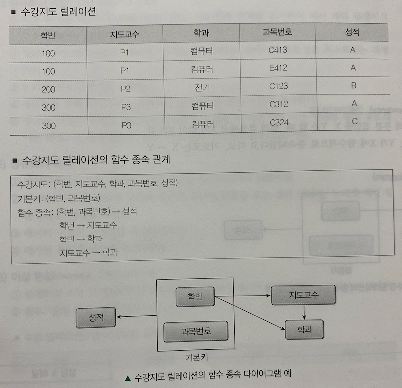
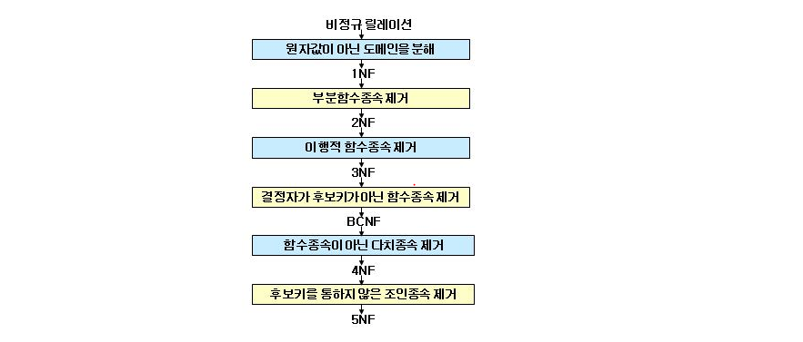

#  3️⃣ 데이터베이스 구축

# Chapter 5. 데이터베이스 설계와 정규화

## 1. 데이터베이스 설계 단계

### 1. 데이터베이스 설계

#### (1) 데이터베이스 설계의 개요

- 사용자의 요구 조건에서부터 데이터베이스 구조를 도출해 내는 과정
- 데이터베이스 설계 작업은 두 종류로 구분
  - 데이터 중심(Data-driven) DB 설계
    - DB의 내용과 구조를 설계
  - 처리 중심(Processing-driven) DB 설계
    - 데이터의 처리와 응용(트랜잭션)을 설계
- 데이터베이스 설계 시 고려사항
  - 무결성, 일관성, 회복, 보안, 효율성, 데이터베이스 확장
- 설계 프로세스
  1. 요구 조건 분석
  2. 개념적 설계: DBMS에 독립적, ER 모델링
  3. 논리적 설계: DBMS에 종속적, 스키마 설계
  4. 물리적 설계: DBMS에 종속적, 저장 구조 설계
  5. 구현

#### (2) 요구 조건 분석

- 사용자가 원하는 데이터베이스의 용도를 파악하느 ㄴ것

#### (3) 개념적 설계(Conceptual Design)

- 사용자들의 요구사항을 이해하기 쉬운 형식으로 **간단히 기술**하는 단계
- 현실 세계를 **정보 모델링을 통해 개념적으로 표현**
- 속성들로 기술된 개체 타입과, 개체 타입들 간의 관계를 이용해 현실 세계를 표현하는 방법
  - **트랜잭션 모델링**이 포함됨
  - DBMS와 하드웨어에 독립적임

#### (4) 논리적 설계(Logical Design)

- 개념적 설계에서 만들어진 구조를 **구현 가능한 데이터 모델로 변환**하는 단계
  - RDBMS에서는 테이블을 설계하는 단계
- 개념 세계를 데이터 모델링을 통해 논리적으로 표현
- 데이터 필드로 기술된 데이터 타입과 이 데이터 타입들간의 관계를 이용해 현실 세계를 표현하는 방법
- 트랜잭션 인터페이스를 설계
- DBMS에 종속적이고, 하드웨어는 독립적
- 논리적 데이터베이스 구조로 매핑
- 스키마를 평가 및 정제

#### (5) 물리적 설계(Physical Design)

- 논리적 설계 단계에서 논리적 데이터베이스 구조로 표현된 데이터를 물리적 저장 장치에 저장할 수 있는 **물리적 구조의 데이터로 변환**하는 과정
- 저장 레코드의 양식 설계, 접근 경로 설계, 레코드 집중의 분석 및 설계
- 트랜잭션 세부 설계 포함
- DBMS와 하드웨어에 종속적
- 고려사항
  - 응답 시간
  - 저장공간의 효율성
  - 트랜잭션의 처리 능력

## 2. 정규화의 개념

### 1. 정규화

#### (1) 정규화의 개요

- **이상 현상을 해결**하기 위해 애트리뷰트 간의 **종속 관계를 분석**하여 **여러 개의 릴레이션으로 분해**하는 과정
- 릴레이션의 애트리뷰트, 엔티티, 관계성을 파악하여 **데이터 중복성을 최소화**하는 과정
- **논리적 설계** 단게에서 수행
- 정규화를 통해 릴레이션을 분해하면 일반적으로 **연산 시간이 증가**
- 정규화 과정은 주어진 릴레이션 변수들의 모임을 더 **바람직한 어떤 형태로 점차 유도**해 가는 과정으로 특정지을 수 있다.
- 이 과정은 **가역적(reversible)**이다

#### (2) 정규화의 목적

- 데이터베이스 **수정, 삭제 시** 이상 현상을 최소화시키기 위함
- 데이터베이스의 물리적 구조나 물리적 처리에 영향을 주는 것이 아니라 **논리적 처리 및 품질**에 큰 영향
- **데이터 구조의 안전성을 최대화**
- **테이블 불일치 위험을 최소화**

#### (3) 이상 현상(Anomaly)

- 릴레이션 조작 시 데이터들이 불필요하게 중복되어 예기치 않게 발생하는 곤란한 현상
- 종류
  - 삽입 이상
    - 릴레이션에서 데이터를 삽입할 때, 의도와는 상관없이 **원하지 않는 값들도 함께 삽입**되는 현상
  - 삭제 이상
    - 릴레이션에서 한 튜플을 삭제할 때, 의도와는 **상관없는 값들도 함께 삭제**되는 **연쇄 삭제** 현상
  - 갱신 이상
    - 릴레이션에서 튜플에 있는 속성값을 갱신할 때, **일부 튜플의 정보만 갱신**되어 정보에 모순

#### (4) 스키마 변환의 원리

- **정보의 무손실** 표현
- 데이터 **중복성 감소**
- **분리**의 원칙
- **종속성** 보존

#### (5) 함수적 종속(FD: Functional Dependency)

- X ➡️ Y라는 것은 Y가 X에 함수적으로 종속되었다는 것

## 3. 정규화 체계

### 1. 정규화 체계

#### (1) 릴레이션과 함수 종속 관계

- 수강지도 릴레이션의 함수 종속 관계를 나타냄
- 수강지도 릴레이션은 5개 속성으로 구성되고, 기본키는 (학번, 과목번호)
- 기본키(학번, 과목번호)에 성적 속성은 완전 함수 종속되어 있지만, 지도교수 속성과 학과 속성은 학번 속성에는 종속되어 있으므로 부분 함수 종속
- 학번, 지도교수, 학과 관계는 학번이 지도교수를 종속하고, 지도교수는 학과를 종속하므로 학번(학생)이 학과에 종속되는 이행 함수 종속을 포함

#### (2) 부분 함수 종속과 이행 함수 종속

- 부분 함수 종속
  - 릴레이션을 구성하는 속성이 기본키를 구성하는 속성 중 **일부에만 종속**되는 경우
- 이행 함수 종속
  - X, Y, Z  3개의 속성이 있을 때 X가 Y를 종속(X ➡️ Y)하고, Y가 Z를 종속(Y ➡️ Z)할 때, X가 Z를 종속(X ➡️ Z)

### 2. 정규화 과정

#### (1) 제1정규형(1NF)

- 어떤 릴레이션 R에 속한 모든 도메인이 원자값(Atomic Value)만으로 되어 있다면, 제 1 정규형에 속한다
- 삽입 이상
- 삭제 이상
- 갱신 이상

#### (2) 제2정규형(2NF)

- 1NF에 속하면서 기본키가 아닌 모든 속성이 기본키에 대해 완전 함수 종속 관계를 만족할 때 제 2 정규형에 속한다
- 1NF면서 2NF가 아닌 릴레이션은 프로젝션을 하여 의미상으로 동등한 두개의 2NF로 분해할 수 있고, 자연 조인(Natural Join)을 통해 아무런 정보 손실 없이 원래의 릴레이션으로 복귀 가능
- 2NF에서는 이행적 함수 종속(Transitive FD)이 존재한다. 이는 이상 현상의 원인이 됨

#### (3) 제3정규형(3NF)

- 2NF에 속하면서, 기본키가 아닌 모든 속성이 기본키에 이행적 함수 종속이 되지 않을 때 3 정규형에 속한다

#### (4) 보이스/코드 정규형(BCNF)

- 릴레이션 R의 모든 결정자(Determinant)가 후보키(Candidate Key)이면 릴레이션 R은 보이스/코드 정규형(BCNF)에 속한다

#### (5) 제4정규형(4NF)

- 릴레이션에서 다치 종속 관계가 성립하는 경우에 다치 종속을 제거한다

#### (6) 제5정규형(5NF)

- 후보키를 통하지 않은 조인 종속을 제거한다

### 3. 반정규화

#### (1) 반정규화(De-Normalization)의 정의

- 정규화되어 있는 릴레이션을 **정규화 이전 상태**로 만드는 것
- 많은 조인에 의해 **성능이 저하**되거나, 데이터 조회 시 **디스크 I/O량이 많을 때** 부분적인 반정규화 고려

#### (2) 반정규화 절차

1. 반정규화 대상 조사

2. 반정규화 대상을 다른 방법으로 처리 유도할 수 있는지 검토

3. 반정규화 적용

   | 반정규화 대상 조사                                           | 다른 방법 유도 검토                                          | 반정규화                                                  |
   | ------------------------------------------------------------ | ------------------------------------------------------------ | --------------------------------------------------------- |
   | 범위 처리 빈도수 조사 대량의 범위 처리 조사 통계성 프로세스 조사 테이블 조인 개수 | 뷰 테이블 클러스터링 적용 인덱스 조정 애플리케이션 | 테이블 반정규화 속성의 반정규화 관계의 반정규화 |

   

#### (3) 반정규화 특징

- 시스템이 물리적으로 구현되었을 때 성능 향상 목적
- 데이터 모델링 규칙에 얽매이지 않고 수행
- 반정규화 방법
  - 테이블 통합
  - 테이블 분할
  - 중복 테이블 추가
  - 중복 속성 추가