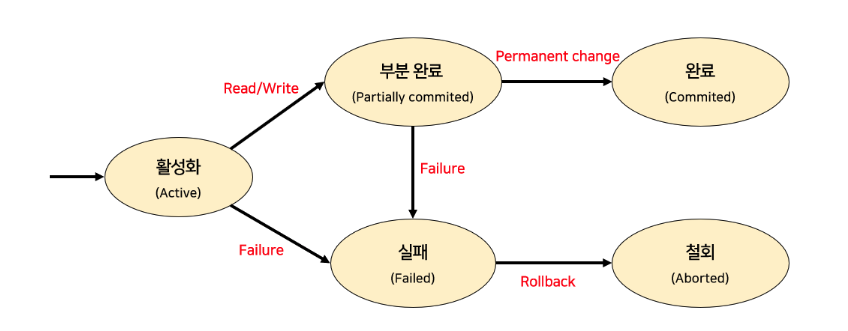

#  3️⃣ 데이터베이스 구축

# Chapter 6. 고급 데이터베이스

## 1. 트랜잭션

### 1. 트랜잭션의 특징

#### (1) 트랜잭션의 개념

- 데이터베이스에서 **하나의 논리적 기능을 수행하기 위한 작업**의 단위 
- 한꺼번에 모두 수행되어야 할 일련의 연산들을 의미
  - 응용 프로그램 = 하나 이상의 트랜잭션
  - 트랜잭션 = 하나 이상의 데이터베이스 연산(SQL 명령)
- 일반적으로 일련의 연산 집합이란 의미로 사용
- 원자성, 일관성, 격리성, 영속성을 가짐

#### (2) 트랜잭션의 성질(ACID)

- 원자성(Atomicity)
  - 트랜잭션의 연산은 데이터베이스에 모두 반영되든지, 아니면 전혀 반영되지 않아야 함
  - COMMIT과 ROLLBACK 명령어에 의해 보장받음
- 일관성(Consistency)
  - 데이터베이스 상태는 트랜잭션 수행 전과 트랜잭션 수행 후가 같아야 함
- 격리성(Isolation)
  - 둘 이상의 트랜잭션이 동시에 병행 실행 되는 경우 어느 하나의 트랜잭션 실행 중에는 다른 트랜잭션의 연산이 끼어들 수 있다
- 영속성(Durability)
  - 트랜잭션의 실행을 성공적으로 끝내면 그 결과를 어떠한 경우라도 보장

#### (3) 트랜잭션의 상태

| 상태                           | 내용                                                         |
| ------------------------------ | ------------------------------------------------------------ |
| 활동(Active)                   | 트랜잭션이 실행을 시작해 **실행 중**인 상태                  |
| 부분 완료(Partially Committed) | 트랜잭션**이 마지막 명령문을 실행한 직후**의 상태            |
| 장애(Failed)                   | 정상적 실행을 더이상 계속할 수 없어 **중단**한 상태          |
| 철회(Aborted)                  | 트랜잭션이 실행에 실패하여 **ROLLBACK 연산**을 수행한 상태   |
| 완료(Committed)                | 트랜잭션이 실행을 성공적으로 완료하여 **COMMIT 연산**을 수행한 상태 |

## 2. 회복과 병행 제어

### 1. 회복

#### (1) 회복(Recovery)의 정의

- 장애로 인해 손상된 데이터베이스를 손상되기 이전의 정상적인 상태로 복구시키는 작업

#### (2) 장애의 유형

- 트랜잭션 장애(Transaction Failure)
  - 트랜잭션 내부의 오류로 정상적 실행을 할 수 없는 상태
- 시스템 장애(System Failure)
  - 하드웨어의 오동작으로 메인 메모리에 있는 정보의 손실이나 교착상태가 발생해 더 이상 실행을 계속할 수 없는 상태
- 미디어 장애(Media Failure)
- 행동 장애

#### (3) 회복의 기본 원리: 정보의 중복(Redundancy)

- 복사 및 덤프: 아카이브
- 로그 또는 저널: 갱신된 속성의 옛 값/새 값

#### (4) 회복 연산자

- REDO
  - 장애 발생 시 로그를 이용하여 **재실행**
- UNDO
  - 장애 발생 시 모든 **실행을 취소**

#### (5) 회복 기법

- 즉시 갱신
  - 트랜잭션 실행 중 발생하는 변경내용을 데이터베이스에 즉시 반영
  - REDO와 UNDO를 모두 이용
- 지연 갱신
  - 트랜잭션이 부분 완료될 때까지 모든 OUTPUT 연산이 지연
  - UNDO는 불필요
- 체크포인트
  - 로그를 그대로 유지하며 일정 시간 간격으로 만들어 놓은 것
  - 체크포인트 이전에 COMMIT된 트랜잭션은 아무런 작업도 하지 않음
  - 체크포인트 이후에 COMMIT된 트랜잭션은 REDO 작업 수행
  - COMMIT 없는 트랜잭션은 체크포인트와 상관없이 전부 UNDO 연산 수행

### 2. 병행 제어

#### (1) 병행 제어(Concurrency Control)의 필요성

- 다중 사용자 환경에서는 여러 개의 트랜잭션이 섞여서 실행되는데, 이러한 병행 실행은 제어 방법을 사용하지 않을 경우 **갱신 손실** 등의 문제를 야기
- 병행 제어의 목적
  - 응답 시간 최소화
  - 시스템 활용도 최대화
  - 데이터베이스 일관성 유지
  - 데이터베이스 공유도 최대화

#### (2) 병행 제어를 안 할 때의 문제점

- 갱신 분실(Lost Update)
- 모순성(Inconsistency)
- 연쇄 복귀(Cascading Rollback)
-  비완료 의존성(Uncommitted Dependency)

#### (3) 직렬 가능성(Serializability)

- 트랜잭션들을 **병행 처리한 결과**가 **트랜잭션들을 순차적으로(직렬로) 수행한 결과**와 같아지는 것

#### (4) 병행 제어 기법의 종류

- 로킹(Locking) 기법

  - **데이터베이스, 파일, 레코드** 등은 로킹 단위가 될 수 있다
  - 로킹 단위(한꺼번에 로킹할 수 있는 단위)가 **작아지면**, **로킹 오버헤드**가 **증가**
  - **Lock과 Unlock 연산**을 통해 트랜잭션의 데이터 아이템을 제어
  - 하나의 트랜잭션만이 Lock을 걸고 Unlock할 수 있다
  - Lock된 데이터는 다른 트랜잭션이 접근할 수 없으며, Unlock될 때까지 대기해야 함
  - 유용하지만, 서로 다른 트랜잭션 변경이 없어 **참조만 하는 경우 시간낭비** 초래
  - 로킹 규약을 따라도, **직렬 가능성을 보장할 수 없음**

- 2단계 로킹 규약

  - 동시성 제어를 위한 직렬화 기법으로, 트랜잭션간의 처리 순서를 미리 정하는 방법
  - 확장(Growing Phase: Lock 수행): Unlock을 수행할 수 없다
  - 축소(Shrinking Phase: Unlock 수행): Lock을 수행할 수 없다
  - 2단계 로킹은 교착상태에 빠질 수 있다

- 타임 스탬프(TS: Time-Stamp)

  - 트랜잭션 타임 스탬프: 트랜잭션이 시스템에 들어오는 순서대로 실행 시작 시간을 정의

  - 데이터 항목에 대한 타임 스탬프

    - read_TS(x): Read(x)를 성공적으로 수행한 트랜잭션 중 갖아 최근에 수행된 트랜잭션의 타임스탬프
    - write_TS(x): Write(x)를 성공적으로 수행한 가장 최근에 수행된 트랜잭션의 타임스탬프

  - 수행 방식

    - **대기-소멸 방식(Wait-Die)**

      먼저 시작된 트랜잭션이 나중에 시작된 트랜잭션이 소유하고 있는 로크를 요구하는 경우 먼저 시작된 트랜잭션은 해당 락을 소유할 때 까지 **대기**. 

      나중에 시작된 트랜잭션이 먼저 시작된 트랜잭션이 소유하고 있는 로크를 요구하는 경우 **나중에 시작된 트랜잭션은 ROLLBACK**된다

    - **손해-대기 방식(Wound-Wait)**

      먼저 시작된 트랜잭션이 나중에 시작된 트랜잭션이 소유하고 있는 로크를 요구하는 경우 **먼저 시작된 트랜잭션은 나중에 시작된 트랜잭션의 실행을 ROLLBACK**하고 해당 로크를 소유

      나중에 시작된 트랜잭션이 먼저 시작된 트랜잭션이 소유하고 있는 로크를 요구하는 경우 **나중에 시작된 트랜잭션**은 해당 로크를 소유할 수 있을때까지 **대기**

  - 단점

    - 교착 상태가 발생하지 않더라도 **트랜잭션의 실행이 취소**되는 경우 발생
    - 먼저 시작된 트랜잭션이 해당 데이터에 대한 로크를 **장기간 소유**하는 경우 다른 트랜잭션은 **취소와 실행을 여러 번 반복하게 됨(Starvation)**

## 3. 고급 데이터베이스

### 1. 분산 데이터베이스

#### (1) 분산 데이터베이스의 정의

- 컴퓨터 네트워크를 기반으로, 데이터가 물리적으로 여러 시스템에 분산되어 있으나 논리적으로는 하나의 통합된 DB인 것처럼 보이도록 구성한 데이터베이스를 의미
- 데이터베이스를 관리하고 데이터의 분산을 사용자에게 투명하게 만들어주는 소프트웨어 시스템

#### (2) 등장 배경

1. 기업의 성장에 따른 조직의 분권화 및 유연한 확장성 필요
2. 컴퓨터 네트워크의 발전과 더불어, Client/Server 모델이 확산
3. 미들웨어를 도입한 3tier Client/Server 모델에서 서버의 기능 분산으로 인한 성능 향상 및 가용성 향상
4. 중앙집중형 정보시스템에서 분산 통합된 정보시스템으로 발전
5. 제품 및 기술의 개방화가 진전

#### (3) 구성 요소

- 분산 처리기(Distributed Processor)
  - 지리적으로 분산되어 있는 **컴퓨터 시스템**
- 분산 데이터베이스(Distributed Database)
  - 지리적으로 분산되어 있는 **지역 데이터베이스**
- 통신 네트워크(Communication Network)
  - 지리적으로 분산된 자치 처리기들을 **통신으로 연결**시켜 자원을 공유하게 함으로써 논리적으로 하나의 시스템 기능을 할 수 있게 하는 **망**

#### (4) 분산 데이터베이스 시스템의 목표

- 위치 투명성(Location Transparency)
  - 데이터가 저장된 위치를 사용자는 알 필요 없음
  - 위치 정보는 시스템 카탈로그에 유지
- 중복 투명성(Replication Transparency)
  - 한 논리적 데이터 객체가 여러 상이한 사이트에 중복될 수 있음
  - **중복 데이터의 일관성 유지**는 사용자와 무관하게 시스템이 수행
  - 중복의 이점은 **성능 향상과 가용성(Availability)** 증진
- 장애 투명성
  - 데이터베이스의 분산된 물리적 환경에서 특정 지역의 컴퓨터 시스템이나 네트워크에 **장애가 발생해도 데이터 무결성이 보장**
- 병행 투명성
  - 분산 데이터베이스에 관련된 다수의 트랜잭션이 **동시에 수행되어도 트랜잭션의 결과는 영향을 받지 않는다**

#### (5) 분산 데이터베이스 시스템의 장단점

| 장점                                                         | 단점                                                         |
| ------------------------------------------------------------ | ------------------------------------------------------------ |
| - 지역 자치성 - 신뢰성, 확장성 향상 - 연산 속도 향상 | - 관리비 증가 - 보안의 취약점 - 소프트웨어 개발이 복잡 |

#### (6) 분산 데이터베이스의 데이터 단편화

- 수평 단편화: 셀렉트 연산
- 수직 단편화: 프로젝션 연산
- 혼합 단편화
  - 수평과 수직 단편화의 혼용
  - 원래의 전역 릴레이션 회복을 위해서는 **자연 조인과 유니온을 적절한 순서**로 적용

### 2. 트리거

#### (1) 트리거(Trigger)의 개념

#### (2) 트리거 구성 요소

#### (3) 트리거 타입

### 3. 인덱스(Index)

#### (1) 단일 단계 인덱스

#### (2) 인덱스의 종류

#### (3) 다단계 인덱스

### 4. CRUD분석

#### (1) CRUD 분석 개념

### 5. ETL

#### (1) ETL(Extraction, Transformation, Loading)의 개념

### 6. 질의어 처리 단계

#### (1) 질의어 처리 단계 설명

#### (2) 질의어 최적화

### 7. 데이터 웨어하우스와 OLAP

#### (1) 데이터 웨어하우스(Data Warehouse)

#### (2) OLAP(On-Line Analytical Processing)

### 8. 권한 부여 기법

#### (1) 권한 부여 기법의 개념

#### (2) GRANT(권한 부여)

#### (3) REVOKE(권한 회수)