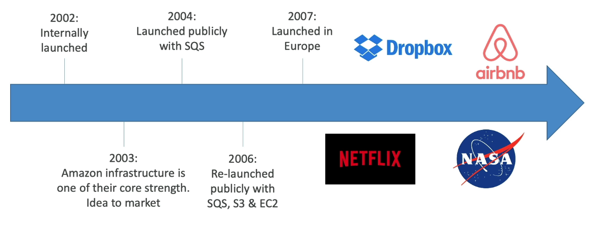

# AWS Certified Solutions Architect Associate

> 👉 [유데미 강의](https://www.udemy.com/course/best-aws-certified-solutions-architect-associate/learn/lecture/29388672#overview)
>
> SAA-C03 Certification

## What's AWS

- Amazon Web Services
  - Cloud provider
  - provides servers and services that you can use on demand and scale easily

## AWS Cloud History

## AWS Cloud Number Facts

- In 2019, $35.02 billion in annual revenue

- AWS accounts for 47% of the market in 2019 (Microsoft 22%)
- Pioneer and Leader of the AWS Cloud Market for the 9th consecutive year
- Over 1,000,000 active users

## AWS Regions

- AWS has Regions all around the world
- A region is a cluster of data centers
- Most AWS services are region-scoped

## How to choose an AWS Region?

- Compliance with data governance and legal requirements
  - Data never leaves a region without ryour explicit permission
- Proximity to customers
  - reduced latency
- Available services within a Region
  - new services and new features aren't available in every region
- Pricing

## AWS Availability Zones

- Each region has many availability zones(usually 3, min is 3, max is 6)

- Each availability zone(AZ) is one or more discrete data centers with redundant power, networking, and connectivity

- They're separate from each other, so that they're isolated from disasters

- They're connected with high bandwidth ultra-low latency networking

- example

  

## AWS Points of Presence(Edge Locations)

- Amazon has 400+ Points of Presence (400+ Edge Locations & 10+ Regional Caches) in 90+ cities across 40+ countries
- Content is delivered to end users with lower latency

## Tour of the AWS Console

- Global Services
  - Identity and Access Management(IAM)
  - Route53(DNS)
  - CloudFront(Content Delivery Network)
  - WAF(Web Application Firewall)
- Region-scoped
  - Amazon EC2(Infrastructure as a Service)
  - Elastic Beanstalk(Platform as a Service)
  - Lambda(Function as a Service)
  - Rekognition (Software as a Service)

