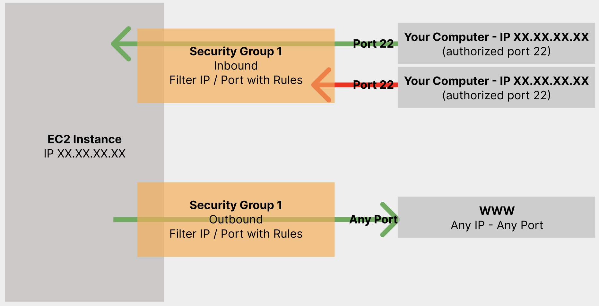
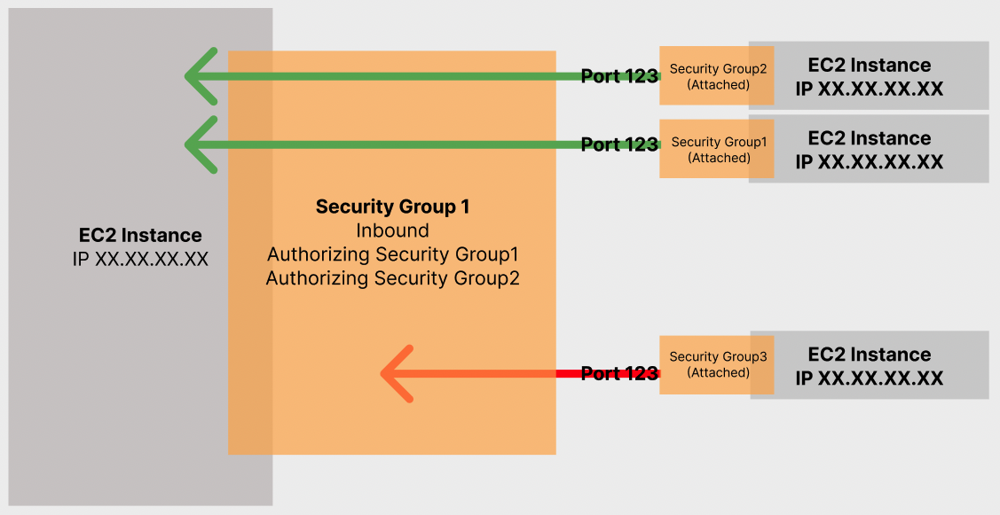

# Section5: EC2 기초

##  EC2 기초

### Amazon EC2

- One of the most popular of AWS's offering
- EC2 = Elastic Compute Cloud = Infrastructure as a Service
- It mainly consists in the capability of:
  - Renting virtual machines(EC2)
  - Storing data on virtual drvies(EBS)
  - Distributing load across machines(ELB)
  - Scaling the services using an auto-scaling group(ASG)
- Knowing EC2 is fundamental to understand how to Cloud works

### EC2 sizing & configuration options

- Operating System(OS): Linux, Windows or MacOS
- How much compute power & cores(CPU)
- How much random-access memory(RAM)
- How much storage space:
  - Network-attached(EBS & EFS)
  - Hardware(EC2 Instance Store)
- Network card: speed of the card, Public IP address
- Firewall rules: security group
- Bootstrap script(configure at first launch): EC2 User Data

### EC2 User Data

- It is possible to bootstrap our instances using an EC2 User data script
- bootstraping means **launching commands when a machine starts**
- THat script is only run once at the instance first start
- EC2 user data is used to automate boot tasks such as:
  - Installing updates
  - Installing software
  - Downloading common files from the internet
  - Anything you can think of
- The EC2 User Data Script runs with the root user
  - everything runs with `sudo` command

## 웹사이트 실습

### Hands-On: Launching an EC2 Instance running Linux

- Launching our first virtual server using the AWS Console
- High-level approach to the various parameters
- Our web server is launched using EC2 user data
- How to start / stop / terminate our instance

## EC2 인스턴스 유형 기본 사항

### EC2 Instance Types - Overview

- You can use different types of EC2 instances that are optimized for different use cases
- AWS has the following naming convention:
  - `m5.2xlarge`
  - m: instance class
  - 5: generation (AWS improves them over time)
  - 2xlarge: size within the instance class

### EC2 Instance Types (1) General Purpose

- Great for a diversity of workloads such as **web servers** or **code repositories**
- Blance between:
  - Compute
  - Memory
  - Networking

### EC2 Instance Types (2) Compute Optimized

- Great for compute-instensive tasks that require high performance processors:
  - Batch processing workloads
  - Media transcoding
  - High performance web servers
  - High performance computing(HPC)
  - Scientific modeling & machine learning
  - Dedicated gaming servers

### EC2 Instance Types (3) Memory Optimized

- Fast performance for workloads that process large data sets in memory
- Use cases:
  - High performance, relational/non-relational databases
  - Distributed web scale cache stores(Elastic cache)
  - In-memory databases optimized for BI(business intelligence)
  - Applications performing real-time processing of big unstructured data

### EC2 Instance Types (4) Storage Optimized

- Greate for storage-intensive tasks that require high, sequential read and write access to large data sets on local storage
- Use cases:
  - High frequency online transaction processing(OLTP) systems
  - Relational & NoSQL databases
  - Cache for in-memory databases(like Redis)
  - Data warehousing applications
  - Distributed file systems

## 보안 그룹 및 클래식 포트 개요

### Introduction to Security Groups

- Security Groups are the fundamental of network security in AWS
- They control how traffic is allowed into or out of our EC2 Instances
- Security groups only contain **"allow"** rules
- Security groups rules can reference by IP or by security group

### Security Groups Depper Dive

- Security groups are acting as a "firewall" on EC2 instances
- They regulate:
  - Access to Ports
  - Authorized IP ranges - IPv4 and IPv6
  - Control of inbound network (from other to the instance)
  - Control of outbound network (from the instance to other)

### Security Groups Diagram

- 기본적인 방화벽 작동방법

### Security Groups Good to know

- Can be attached to multiple instances
- Locked down to a region / VPC combination
- Does live "outside" the EC2 - if traffic is blocekd the EC2 instance won't see it
- It's good to maintain one separate security group for SSH access
- If your application is **not accessible (time out)**, then it's a **security group issue**
- If your application gives a **"connection refused"** error, then it's an **application error** or it's not launched
- All **inbound** traffic is **blocked** by default
- All **outbound** traffic is **authorized** by default

### Referencing other security groups Diagram

### Classic Ports to know

- 22 = SSH(Secure Shell) - log into a Linux instance
- 21 = FTP (File Transfer Protocol) - upload files into a file share
- 22 = SFTP(Secure File Transfer Protocol) - upload files using SSH
- 80 = HTTP - access unsecured websites
- 443 = HTTPS - access secured websites
- 3389 = RDP (Remote Desktop Protocol) - log into a Windows instance

## SSH 개요

### SSH Summary Table

|               | SSH  | Putty | EC2 Instance Connect |
| ------------- | ---- | ----- | -------------------- |
| Mac           | O    |       | O                    |
| Linux         | O    |       | O                    |
| Windows < 10  |      | O     | O                    |
| Windows >= 10 | O    | O     | O                    |

### SSH troubleshooting

- Students have the most problems with SSH
- If thing's don't work
  - Re-watch the lecture.
  - Read the troubleshooting guide
  - Try EC2 Instance Connect

### How to SSH into your EC2 Instance Linux/MacOSX

- We'll learn how to SSH into your EC2 instance using Linux/Mac
- SSH is one of the most important function. It allows you to control a remote machine, all using the command line
