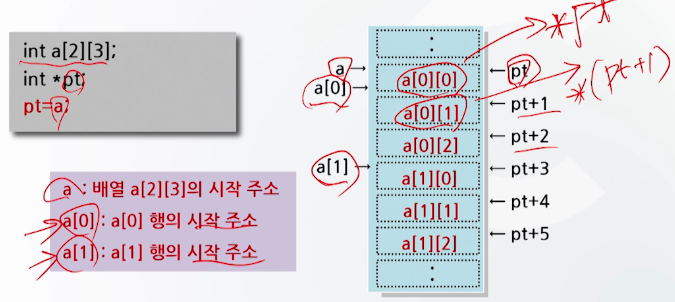

# 10강. 배열과 포인터(3)

## 1. char형 포인터

#### 포인터와 배열

- char포인터

  - 포인터는 문자열 처리에 효과적

  - 문자열 처리에 char형 포인터 사용

    ```c
    char * cp = "COMPUTER";
    ```

- char 포인터의 기억공간 표현

  ```c
  char * cp = "COMPUTER";
  ```

  - cp는 문자열의 시작주소를 갖는다
  - 따라서 값을 참조할 때와는 달리 포인터변수 cp에 주소를 치환하지 않는다

  

-  Char 포인터의 사용 예

  

  


## 2. 포인터와 배열의 관계

#### 포인터와 배열

- 포인터와 배열의 관계

  - 포인터를 이용한 1차원 배열의 참조

    

  - 포인터를 이용한 1차원 배열의 참조 예

    

- 포인터를 이용한 2차원 배열의 참조

  

  - 포인터를 이용한 2차원 배열의 참조 예

    

- 포인터와 배열의 관계

  - 포인터와 배열은 서로 호환적

    

  - 포인터와 배열의 호환 예시

    

  - 포인터와 배열의 값 변경

     

  - 배열과 포인터의 기억공간 확보
    - 배열
      - 기억공간 중 자료영역을 **고정적**으로 확보
    - 포인터
      - 기억공간 중 자료영역을 **유동적**으로 확보
        - 필요할 때만 자료용 기억 공간을 확보
        - 자료의 갯수가 가변적인 경우 효과적
    - 포인터가 배열보다 활용의 폭이 넓다


## 3. 포인터 배열

### 포인터 배열

- 포인터의 집합

- 포인터가 여러 개 사용될 때 포인터 배열로 선언

- 주로 문자열 배열 처리에 사용

  ```c
  char *name1, *name2, *name3;
  ```

  ```c
  char *name[3]; // 이러면 더 효율적으로 정의 가능
  ```


### 포인터 배열 선언과 기억공간 표현


- 포인터 배열의 사용 예

  


## 4. 이중 포인터

- 이중 포인터의 개념
  - Pointer to pointer
  - 자료가 있는 곳을 이중으로 가리키는 포인터
    - 이중 포인터가 가리키는 주소로 가보면 자료가 아닌 주소 값이 들어 있고, 그 주소에 자료가 들어 있음

- 이중 포인터의 선언

  - 형식: int **p;
  - 포인터 변수에 다시 포인터를 지정하는 곳으로서, 포인터의 포인터이다.

- 이중 포인터의 선언 예

  ```c
  int **p;
  ```

  - p: 기억 공간 주소
  -  *p: 주소 p에 수록되어 있는 값. 이 값이 주소로 사용됨
  - **p: 주소가 *p인 곳에 수록되어 있는 값. 즉 int형 자료

- 이중 포인터의 사용 예

  

  