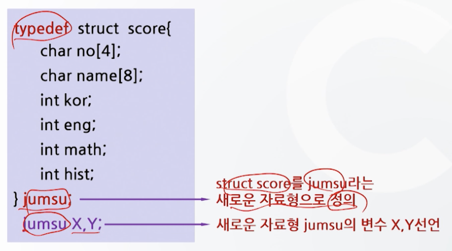
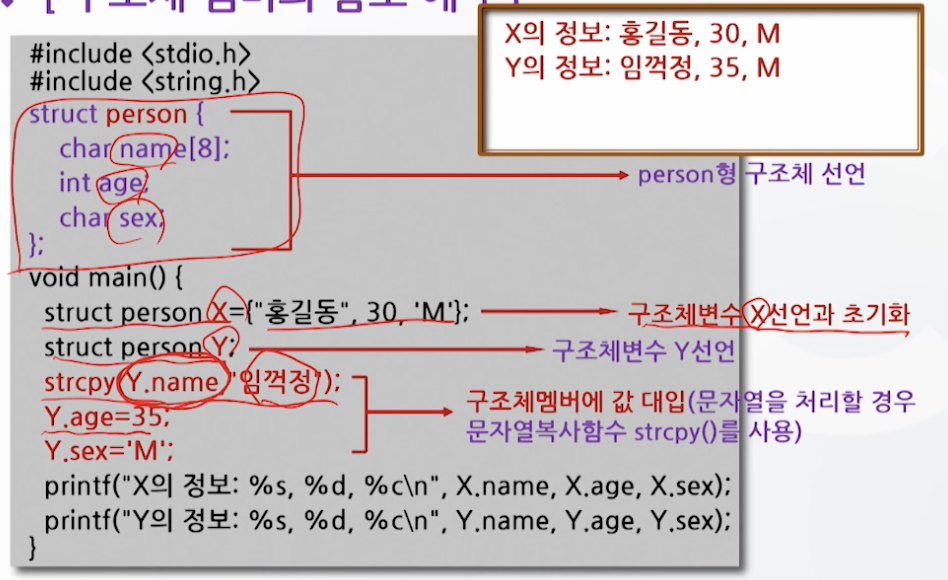
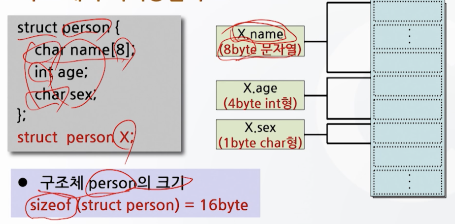
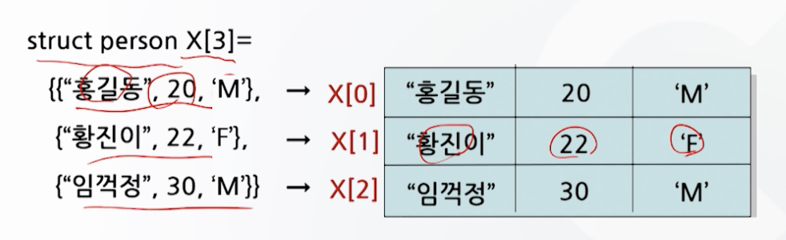

# 11강. 구조체와 공용체(1)

## 1. 구조체의 개념과 필요성

### 구조체의 개념

- 구조체(structure)란?
  - 서로 다른 자료형을 갖는 자료들의 모임을 하나의 자료형으로 정의하여 사용하는 자료형
- 구조체 > 사용자 정의 자료형
  - 다양한 형식의 자료를 간결한 형식으로 표현 가능
  - 사용자가 새로운 형식을 정의해 사용할 수 있다


### 구조체의 필요성


## 2. 구조체의 정의와 변수 선언

### 구조체의 정의와 변수 선언

- 구조체의 정의

- 형식

  ```c
  struct 구조체명 {
    멤버 1;
    멤버 2;
    ...
  }
  ```

  ```c
  struct score {
    int kor;
    int eng;
    int math;
  }
  ```

- 구조체 변수의 선언

- 형식

  ```c
  struct 구조체명 변수명1, 변수명2, 변수명3;
  ```

  ```c
  struct score x, y[10], *z;
  ```

- 구조체 정의와 변수 선언 예1

  

- 구조체 정의와 변수 선언 예2

  

- 구조체 정의와 변수 선언 예 3

  


## 3. 구조체 변수의 초기화 및 참조

### 구조체 변수의 초기화

- 데이터 초기화 예시

  ```c
  struct person {
    char name[8];
    int age;
    char sex;
  };
  
  struct person X = {"홍길동", 20, 'M'};
  ```

  ```c
  struct person {
    char name[8];
    int age;
    char sex;
  } X = {"홍길동", 20, 'M'}
  ```


### 구조체 멤버의 참조

- 형식(도트 연산자)

  ```c
  구조체변수명.멤버명
  ```

  ```c
  X.name
  X.age
  X.sex
  ```

- 구조체 멤버의 참조 예1

  

- 구조체의 기억공간 구조

  - 실제로 메모리가 할당될 때는 **구조체 멤버 중 가장 큰 자료형의 크기**로 할당됨
  - 즉, person, sex가 char형이지만, 멤버 중 가장 큰 int 형의 크기인 4byte가 할당

  

- 구조체 멤버의 참조 예 2

  

  

## 4. 구조체 배열

- 구조체 배열이란?

  - 동일한 구조를 받는 구조체 변수가 여러 개 사용될 때 그 구조체 변수들을 대표하는 배열명을 설정하여 일반 배열과 같이 사용

- 구조체 배려의 예

  - 3명의 개인 신상정보를 저장하기 위한 구조체 배열 선언

  ```c
  struct person {
    char name[8];
    int age;
    char sex;
  }
  ```

  ```c
  struct person {
    char name[8];
    int age;
    char sex;
  };
  struct person X[3];
  ```

- 구조체 배열의 기억공간 표현

  

- 구조체 배열의 초기화

  

- 구조체 배열의 멤버 참조

  ```c
  strcpy(X[1].name,"홍길동");
  X[2].sex = 'M';
  K = X[2].age;
  ```

  

- 구조체 배열의 사용 예

  


## 5. 구조체 포인터

### 구조체 포인터

- 포인터를 사용하여 구조체를 다룰 수 있게 함

  - 구조체를 보다 더 쉽게 다룰 수 있다
  - 구조체 변수 선언 시 *를 붙여 포인터로 선언
  - 구조체 포인터는 포인터와 동일하게 주소값을 갖게 되며, 자료가 있는 곳을 가르킨다

- 구조체 포인터의 선언

  - 형식

  ```c
  struct 구조체명 *포인터변수명;
  struct person *pt
  ```

- 구조체 배열의 선언 예

  

- 구조체 포인터의 기억공간 표현

  

- 구조체 포인터의 멤버 참조

  - 도트 연산자(.)를 이용

    ```c
    (*pt).name

  - 포인터 연산자(->)를 이용

    ```c
    pt->name
    ```

- 구조체 포인터의 사용 예

  

- 프로그램 실행과정(기억공간 표현)

  ```c
  struct student hs[4]={{"KIM HG", 90, 95}, {"LEE SY", 85, 90}, {"PARK GS", 70, 85}, {"CHOI HJ", 95, 75}};
  ```

  

 