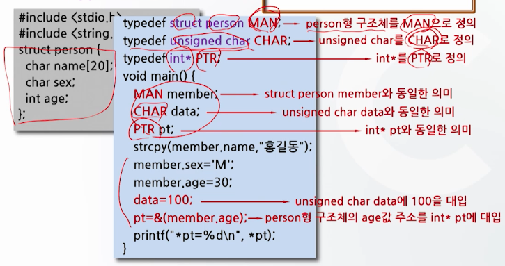
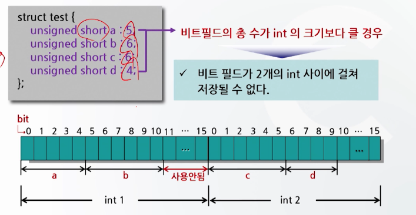

# 12강. 구조체와 공용체(2)

## 1. 함수와 구조체

### 함수에서의 구조체 사용

- 구조체를 함수의 매개변수로 사용
- 구조체 포인터를 함수의 매개변수로 사용


### 구조체를 함수의 매개변수로 사용

- 일반변수를 함수의 매개변수로 사용하는 것과 동일
- 매개변수가 구조체인 경우, 함수의 형식매개변수를 구조체로 선언
- 해당 구조체 전체가 복사되기 때문에 편리
- 구조체 전체가 복사되기 때문에 시간이 많이 걸리고, 기억공간의 낭비가 심함


#### [구조체를 함수의 매개변수로 사용 예]

- 호출함수와 피호출함수 사이 전달되는 구조체


#### 함수의 원형 정의에 대한 설명

```c
#include <stdio.h>
struct num calc(struct num number2); // 함수의 원형 정의
struct num {
  ...
}
```

- int나 char과 같은 일종의 자료형

  `int calc(int number2);`와 같은 개념

- 따라서 struct num calc(struct num number2);는 반환 자료형이 struct num형인 구조체이고, struct num형의 구조체를 매개변수로 갖는 함수 calc


### 구조체 포인터를 함수의 매개변수로 사용

- 일반적으로 구조체 포인터를 함수의 매개변수로 사용
- 구조체를 복사하지 않기 때문에 실행속도가 향상되고, 기억공간의 사용효율도 좋다


#### [구조체 포인터를 함수의 매개변수로 사용 예]

- 값에 의한 자료전달방법과, 참조에 의한 자료전달방법간 차이점과 동일


## 2. `typedef`

- 이미 존재하는 자료형에 새로운 이름을 붙이기 위한 키워드

  - 간단하거나 의미있는 이름으로 바꿀 수 있어 프로그램 이해가 쉬움
  - 구조체 형을 선언하는데 많이 사용됨

- 형식

  ```c
  typedef 기존 자료형 새로운 자료형이름;
  ```

  ```c
  typedef int INT;
  ```


#### `typedef` 사용

```c
typedef unsigned int BYTE; // unsigned int형을 BYTE라는 새로운 이름으로 정의
BYTE val; // 컴파일러가 unsigned int val 로 해석
```

```c
typedef int * PTR; // int *를 PTR로 재정의
PTR p1, p2; // int *p1, *p2를 의미
```


#### [typedef의 사용 예1]


#### typedef을 이용한 구조체 표현의 다른 방법

- 구조체 정의와 typedef 선언을 한꺼번에 표현(오른쪽)


#### [typedef의 사용 예2]

- *pt=30




## 3. 구조체 비트필드

### 구조체의 비트필드(bit field)

- 주기억장치의 기억공간을 byte 단위가 아닌 bit 단위로 사용
  - 프로그램 시 bit 단위의 연산이 필요한 경우 int형 변수를 사용
  - 이때 int 형은 4 byte(32 bit)이므로 1bit를 제외한 31bit의 기억공간이 낭비
- 구조체의 비트필드를 사용하면
  - 기억공간 절약
  - 융통성 있는 데이터 구조체 만들 수 있음


### 구조체 비트필드의 정의

```c
struct 비트필드 명 {
  자료형 비트필드 변수: 비트크기;
  :
};
```

```c
struct nibble {
  unsigned a: 1; // 1 bit
  unsigned b: 2; // 2 bit
  unsigned c: 1; // 1 bit
}
```


### 구조체 비트필드의 선언 예와 기억공간 구조

```c
struct test {
  unsigned short a: 4; // 1 bit
  unsigned short b: 2; // 2 bit
  unsigned short c: 1; // 1 bit
  unsigned short d: 7; // 7 bit
};
struct test bit; // 구조체 비트필드 변수의 선언
```


#### 구조체 비트필드의 참조 예


#### 구조체 비트필드의 사용 예


#### 구조체의 비트필드의 기억공간 구조




## 4. 공용체의 개념

### 공용체(union)란?

- 동일한 기억장소에 여러 유형을 자료를 저장하기 위해 프로그래머가 선언한 자료형
- 공용체 안에 포함된 자료들이 같은 기억장소를 공유하여 사용
- 사용될 자료의 자료형이 유동적일 경우 기억 공간을 효율적으로 사용할 수 있는 장점


#### 공용체의 예

- 공용체의 멤버들이 완전히 다른 자료형을 가질 때 기억공간을 절약하기 위해 사용
- 예시
  - 급여관리 프로그램에서
    - 원화로 월급 지급받는 사람: 정수형으로 처리
    - 달러로 월급 지급받는 사람: 실수형으로 처리
  - 이러한 경우, 공용체를 사용하면 필요에 따라 메모리의 자료형을 선택해서 값을 저장 가능


### 공용체의 정의

- 형식

  ```c
  union 공용체명 {
    멤버 1;
    멤버 2;
    ...
  };
  ```

- 사용예

  ```c
  union var {
    char a;
    int b;
    float c;
  };
  ```


#### 공용체 변수의 선언

- 형식

  ```c
  union 공용체명 변수명;
  ```

- 사용예

  ```c
  union var abc;
  ```


#### 공용체 정의와 변수 선언 예

```c
union var { // 공용체 정의
  char a; // 공용체 멤버 a, b, c
  int b;
  float c;
};

union var abc; // 공용체 변수 선언
```


#### 공용체 변수의 참조 방법

```c
union var {
  char a;
  int b;
  float c;
};

union var abc;

// 공용체 변수의 참조
abc.a = 'A';
abc.b = 133;
abc.c = 1234.5678;
```


## 5. 공용체의 사용

### 공용체의 사용

#### 공용체의 사용되면

- 공용체의 멤버 중 자료크기(byte수)가 가장 큰 멤버에 대해서만 기억공간이 할당되고
- 기억공간의 시작 위치부터 각 부분을 다른 멤버가 공용으로 사용


#### 공용체의 기억공간 표현 예


- 자료형의 크기가 큰 멤버에 대해서만 기억공간 할당됨
  - hold라는 8byte 기억공간 할당
  - 그 기억공간을 공용으로 작은 애들이 사용하는 것

```c
union hold {
  short int digit;
  double big;
  char letter;
}
```


#### 공용체 변수의 참조 예

```c
union hold {
  short int digit;
  double big;
  char letter;
}

union hold fit;
	fit.digit = 23; // 23저장 (2byte만 사용)
  fit.big = 1234.567; // 23이 지워지고, 1234.567이 저장됨(8byte)
	fit.letter = 'b'; // 1234.567이 지워지고, 'b' 저장 (1byte)
```


#### 공용체 변수의 기억공간 사용 예


#### 공용체 변수의 사용 예

```c
#include <stdio.h>

void main() {
	union test{
   	short int i;
    float f;
    double d;
  };
  
  union test u; // 공용체 변수 선언
  
  u.i = u.f = u.d = 0;
  printf("%d byte\n", sizeof(u));
  
  u.i = 100; // 공용체 멤버 참조
  printf("%d %f %f\n", u.i, u.f, u.d);
  
  u.f = 0.5; // 공용체 멤버 참조
  printf("%d %f %f\n", u.i, u.f, u.d);
  
  u.d = 0.0166667; // 공용체 멤버 참조
  printf("%f\n", u.d);
}
```

