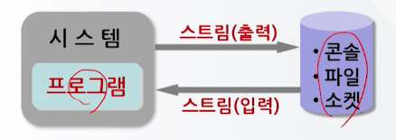
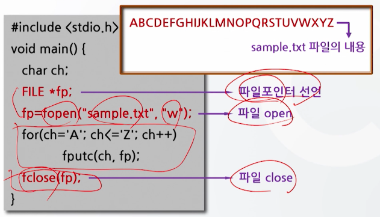
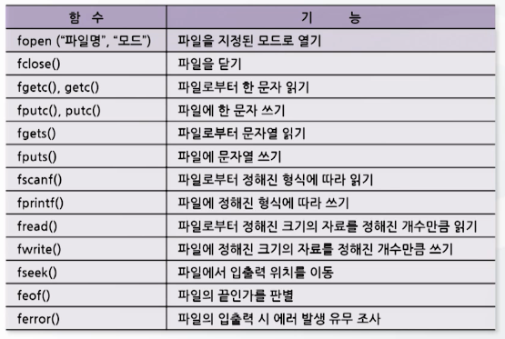
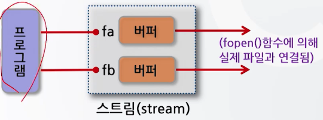
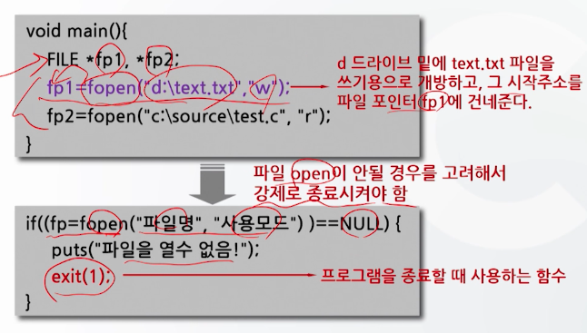

# 13강. 파일처리 함수(1)

## 01. 파일 입 출력 개념

### 1. 파일 입출력의 개념

- 파일 입출력이란?
  - 보조기억장치의 파일을 이용한 자료의 입출력
    - 파일처리 함수를 이용
    - 키보드나 모니터를 통한 자료의 입출력
    - 표준 입출력함수를 이용
- 파일처리함수
  - 보조기억장치(디스크)에 들어있는 정보들의 모임을 파일이라 하고, 이러한 팡리을 제어하는 함수
- 파일이란?
  - 보조기억장치에 저장된 데이터들의 모임
  - 일련의 바이트(byte)들로 구성
  - C 프로그램은 운영체제를 통해서 파일을 읽거나 쓰게 된다
- C 언어에서는 컴퓨터와 연결된 장치들까지도 모두 파일의 범주에 넣어 처리
- 파일의 구분
  - 텍스트 파일(text file)
    - 화면에 출력되는 문자들로 구성된 파일
  - 2진파일(binary file)
    - 텍스트 파일을 포함한 모든 종류의 자료를 다루는 파일
    - 컴파일 되어 있어 기계어에 가까우므로 내용을 이해하거나 인쇄가 불가능
- 파일에 대한 자료의 입력과 출력
  - 파일 입력
    - 디스크 상의 특정 위치(파일)에 수록되어 있는 자료를 읽어 들여 **기억공간에 수록**하는 절차
  - 파일 출력
    - 기억공간에 있는 자료를 **디스크 상의 특정 위치(파일)**에 수록하는 절차
  - **파일포인터**를 사용하여 파일 입출력 수행
- 파일처리를 위해서는 파일포인터를 사용
  - 파일포인터
    - 파일이 어디에 있는지를 가리키는 포인터
    - 모든 파일 입출력 함수는 파일 포인터를 사용
  - 파일을 입출력할 때 버퍼(buffer) 사용
    - 버퍼
      - **기억공간과 디스크 사이**에 존재하는 임시 기억 공간
      - 파일 입출력 시 디스크에 저장된 자료를 기억 공간으로 읽어 들이거나, 기억 공간에서 처리된 자료를 디스크에 저장할 때 사용


### 2. 파일포인터를 이용한 파일 입출력

- 자료의 입출력 개념

  - 프로그램과 입출력장치(콘솔, 파일, 소켓 등)와의 사이에 이루어지는 자료의 입력과 출력
  - 자료의 입출력을 위한 논리적인 통로가 필요: **스트림**

- 스트림(stream)

  

- 자료의 입출력을 위해서는 스트림이 필요함

  - 표준 입출력장치를 이용한 자료 입출력
    - 표준 입출력장치와의 스트림은 프로그램 실행 시 자동으로 생성되고, 프로그램 종료시 자동으로 소멸
  - 파일을 이용한 자료 입출력
    - 파일 입출력을 위한 스트림은 프로그램을 통해 **생성과 소멸을 시켜줘야** 함

- 파일 입출력의 수행과정

  1. 파일을 연다
     - 파일과 자료를 주고받을 수 있는 스트림을 생성
     - `fopen()` 함수 사용
  2. 입출력을 수행한다
  3. 파일을 닫는다
     - 생성된 스트림을 소멸시키기 위한 과정
     - `fclose()` 함수 사용

  - 스트림의 생성
    - 파일과 프로그램과의 통로(논리적인 접속)를 구성
    - 통로 역할을 파일포인터가 수행

- 파일 입출력 프로그램 구조

   

- 파일 입출력 프로그램의 구조 예

   

- 파일처리함수와 기능

   

- 파일포인터의 선언

  - 파일 입출력을 위해서는 맨 처음 파일포인터를 선언해야 한다

  - 이 파일포인터는 실제 파일과 프로그램ㅇ르 연결해 주는 통로가 된다

  - 형식

    ```c
    FILE * 변수명;
    ```

    ```c
    FILE *fp;
    ```

  - 기능

    - 파일형 포인터변수를 선언

- 파일포인터 변수와 버퍼의 관계

  ```c
  FILE *fa, *fb;
  ```

  - FILE형: 구조체형
  - FILE형 포인터변수: 파일에 대한 여러 가지 정보를 가진 변수

   

- 파일 열기

  - 프로그램과 디스크 상의 파일 사이에 데이터가 입출력할 수 있도록 통로를 만들어주느 ㄴ것

  - 형식

    ```c
    fopen("파일명", "사용모드");
    ```

    ```c
    fp = fopen("test.dat", "r");
    ```

  - 기능

    - 파일을 열어 사용할 수 있게 함

  - `open()` 함수

    - 입출력이 정상이면 지정된 파일의 파일포인터에 시작주소 값을 리턴
    - 파일이 개방되지 않을 때는 에러 값(NULL 값)을 리턴

  - 사용(개방)모드 = 파일 접근 모드 + 데이터 입출력 모드

    - 파일 접근 모드 (r, r+, w, w+, a, a+)
    - 데이터 입출력 모드(t, b)
      - t: 텍스트 모드(text mode)
        - 프로그램에서 파일로 자료를 입출력 할 때 변환이 일어나는 입추력모드
        - 문자 변환이 필요(\n <=> CR/LF)
      - b: 2진 모드(binary mode)
        - 변환이 일어나지 않는 입출력모드
        - 문자 변환이 불필요

  - `fopen()` 함수의 기본적인 사용모드

    

  - `fopen()` 함수의 사용모드 예

    ```c
    fopen("파일명", "w"); // 텍스트 모드 출력 개방
    fopen("파일명", "rt"); // 텍스트 모드 입력 개방
    ```

    ```c
    fopen("파일명", "wb") // 2진 모드 출력 개방
    fopen("파일명", "rb+") // 2진 모드 입력 개방
    ```

  - 파일 열기 사용 예

    

    

### 3. 


## 02. 파일 포인터를 이용한 파일 입출력


## 03. 순차파일처리

