# 14강. 파일처리 함수(2)

## 01. 순차파일 입출력함수

### 순차파일 만들기

- 순차파일 출력함수

  - 만들어진 파일에 자료를 기록하는 함수

    `putc()`, `fputc()`, `fputs()`, `fprintf()`

    

- `putc()` 함수

  - 문자 단위의 파일 출력함수

  - `fputc()` 함수와 유사

  - 형식

    ```c
    putc(문자변수, 파일포인터 변수)
    ```

    ```c
    putc(c, fp);
    ```

  - 기능: fp가 가리키는 파일에 변수 c 에 있는 문자를 출력

  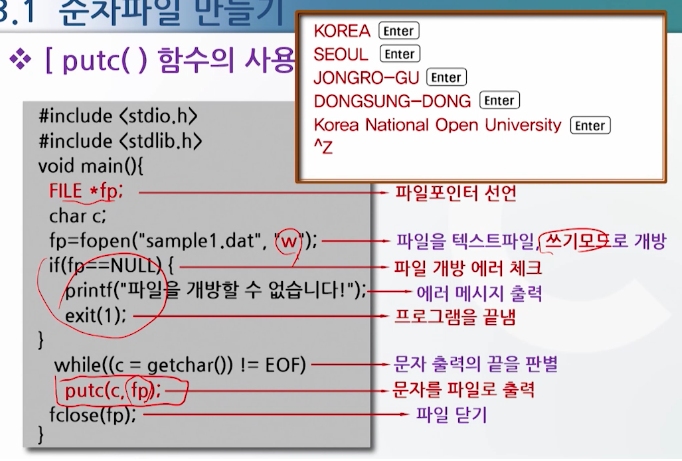

- `fputc()` 함수

  - 문자열을 파일로 출력할 때 사용

  - 형식

    ```c
    fputs(문자열변수, 파일포인터 변수);
    ```

    ```c
    fputs(s, fp);
    ```

  - 기능: 저장된 파일에 문자열(하나의 레코드)을 출력

    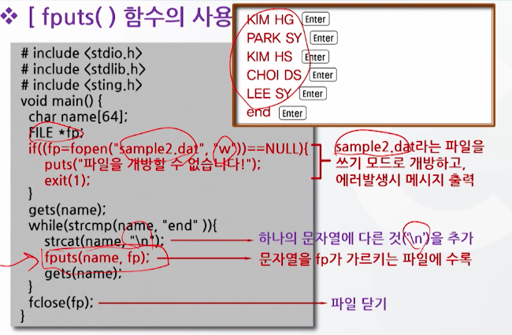

- `fprintf()` 함수

  - 지정된 형식을 가지고 파일에 차료를 출력

  - 여러 항목의 복합적인 자료로 구성된 레코드를 저장할 때 유용

  - 형식

    ```c
    fprintf(파일포인터 변수, "출력형식", 변수);
    ```

    ```c
    fprintf(fp, "%s %d\n", a, b);
    ```

  - 기능: 지정된 형식대로 자료를 파일포인터변수가 가리키는 곳에 출력

    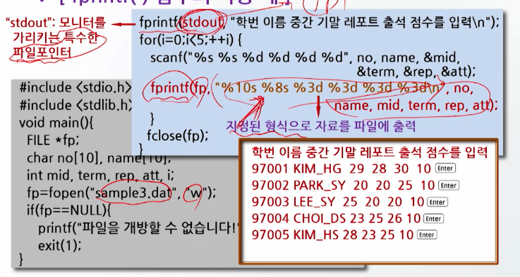

- C 언어에서는 입출력 장치를 파일 개념으로 처리

  - C 프로그램에서는 자동적으로 3개의 표준파일에 대한 포인터를 생성

  - 이러한 표준파일에 대해서는 따로 파일포인터를 선언할 필요가 없다

    


### 순차파일 읽기

- 순차파일 입력함수

  - 파일 출력함수에 의해 만들어진 순차파일의 저장된 자료를 읽어내는 함수
  - 자료를 읽을 때는 파일에 끝에 있는 EOF 신호를 만날 때 까지 읽을 수 있는 프로그램 작성
  - `getc()`, `fgetc()`, `gets()`, `fscanf()`

- `getc()` 함수

  - 문자 단위의 파일 입력함수

  - fgetc() 함수와 유사

  - 형식

    ```c
    getc(파일포인터변수);
    ```

    ```c
    c = getc(fp);
    ```

  - 기능: 지정된 파일로부터 한 문자를 읽어온다

  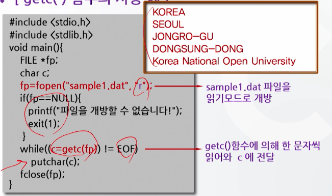

- fgets() 함수

  - 파일에 저장된 문자열 자료를 읽을 때 사용

  - 읽어낼 문자열의 길이를 반드시 명시

  - 형식

    ```c
    fgets(문자열 변수, 문자열 길이+1, 파일포인터 변수);
    ```

    ```c
    fgets(s, 40, fp);
    ```

  - 기능: 지정된 파일로부터 해당 문자열 길이 만큼의 문자를 읽어와 문자열 변수에 저장한다

    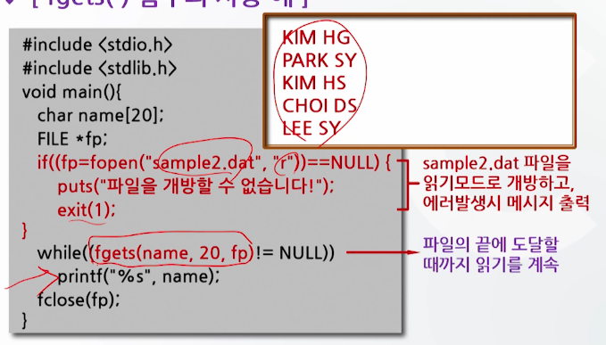

- `fscanf()` 함수

  - 숫자, 문자 등 복합적인 자료로 구성된 레코드를 읽을 때 사용

  - 일반적으로 파일의 끝을 판별하는 feof()함수와 같이 사용

  - 형식

    ```c
    fscanf(파일포인터 변수, "입력형식", 변수);
    ```

    ```c
    fscanf(fp, "%s %d", &a, &b);
    ```

  - 기능: 파일 포인터가 가리키는 곳으로부터 지정된 형식대로 자료를 읽어 온다

    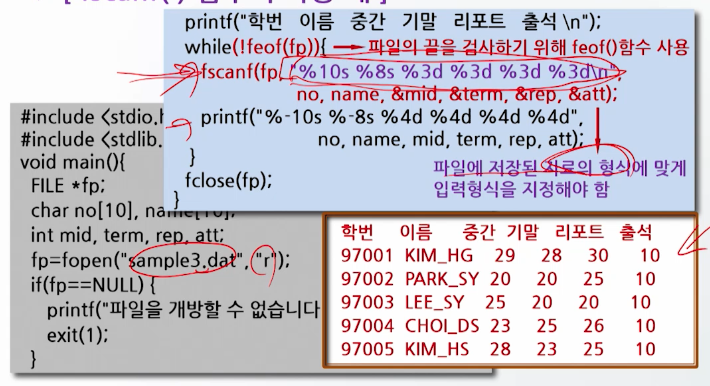

- 레코드 추가를 위한 사용 모드

  - a, a+, ab, ab+

  - 형식

    ```c
    fp = fopen("파일명", "a");
    ```

    ```c
    fp = fopen("sample.dat", "a");
    ```

  - 기능: 이미 만들어진 순차파일의 끝에 새로운 레코드 추가(append)

  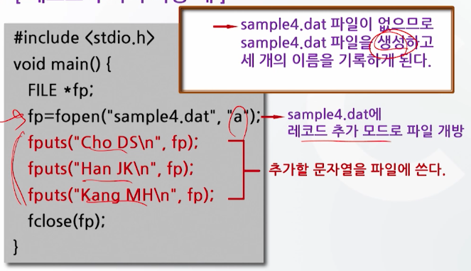


## 02. 랜덤파일처리

### 랜덤파일처리

- 랜덤파일(random file)

  - 파일의 임의의 위치에서 자료를 읽거나 쓸 수 있다.

  - 레코드의 길이가 일정

  - 순차 파일에 비해
    - 단점: 기억공간 낭비
    - 장점: 레코드 검색이 빠르고 효과적


### 랜덤파일 열기

- 일반적으로 랜덤파일을 입출력할 때는 2진 모드로 파일을 개방

  - 형식

    ```c
    fopen("파일 이름", "wb");
    fopen("파일 이름", "rb");
    ```

- 2진 모드의 특징
  - 텍스트 파일보다 적은 기억공간
  - 레코드의 길이를 프로그래머가 결정
  - 파일 포인터의 위치 변경 가능


## 03. 랜덤파일 입출력함수

### 랜덤파일 만들기

- `fwrite()` 함수

  - 형식

    ```c
    fwrite(저장자료변수, 레코드길이, 레코드개수, 파일포인터);
    ```

    ```c
    fwrite(name, 10, 1, fp);
    ```

  - 레코드의 길이를 지정

  - 자료저장 변수는 포인터 형

  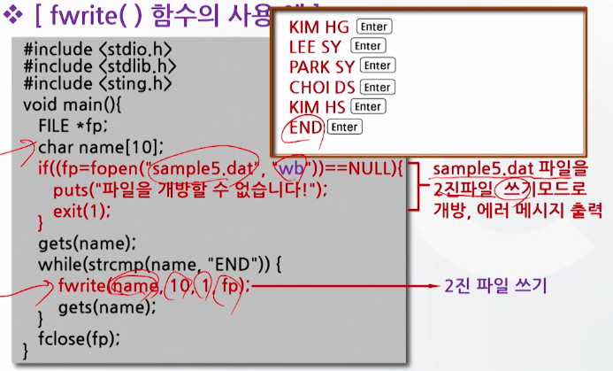

- `fread()` 함수

  - 형식

    ```c`
    fread(읽을 자료변수, 레코드 길이, 레코드 개수, 파일포인터);
    ```

    ```c
    fread(name, 10, 1, fp);
    ```

  - 기능: 읽기에 성공하면 읽은 레코드 수를 리턴

  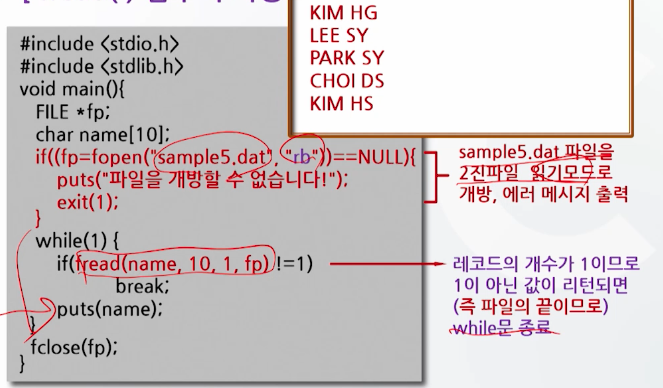


## 04. 랜덤파일의 위치 제어

- `fseek()` 함수

  - 파일 포인터를 임의의 위치로 이동시키는 함수

  - 랜덤파일의 특정 부분을 입출력할 수 있다

  - 형식

    ```c
    fseek(파일포인터 변수, 이동할 상대위치, 기준위치를 지정하는 모드);
    ```

    ```c
    fseek(fp, 2 * REC_size, SEEK_SET);
    ```

  - 기준 위치로부터 앞, 뒤로 이동하는 상대위치 개념 사용

- `fseek()` 함수의 기준위치 지정모드

  - `stdio.h`에 정의됨

     

- `fseek()` 함수에 대한 그림 표현

  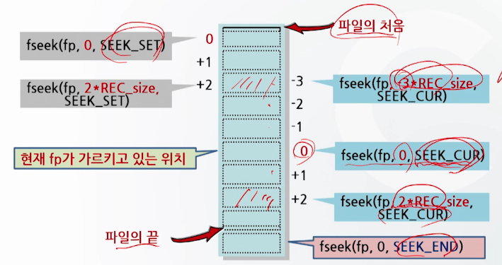

  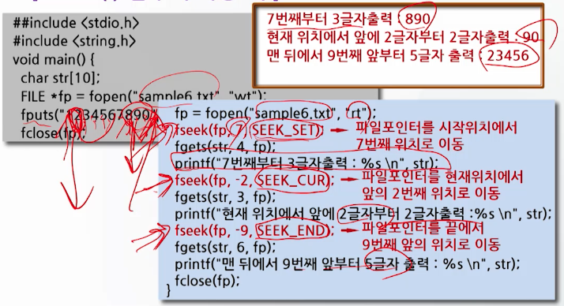

