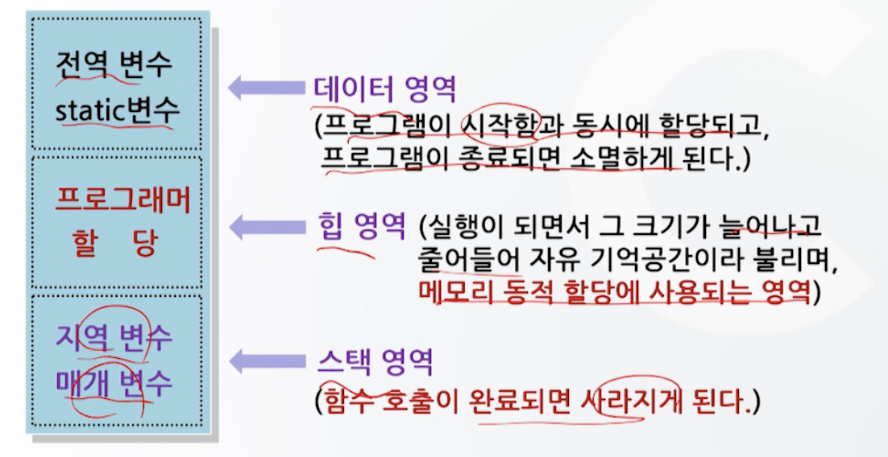
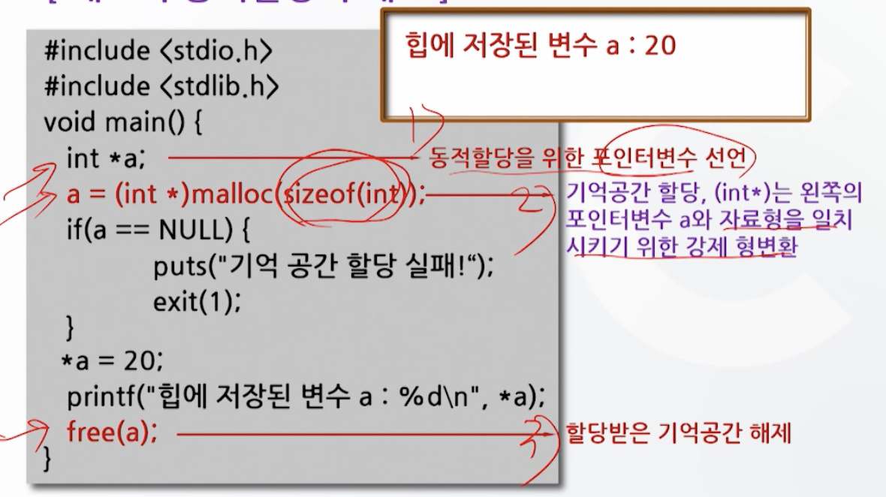
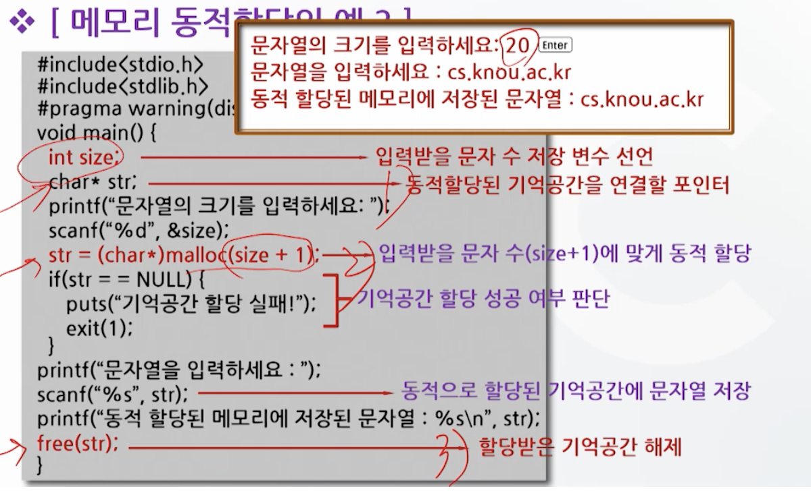
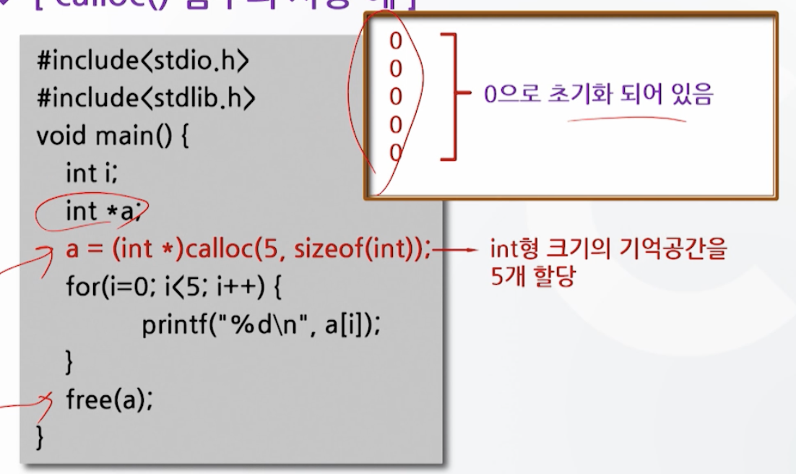
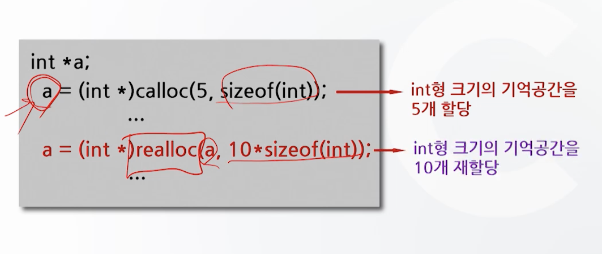
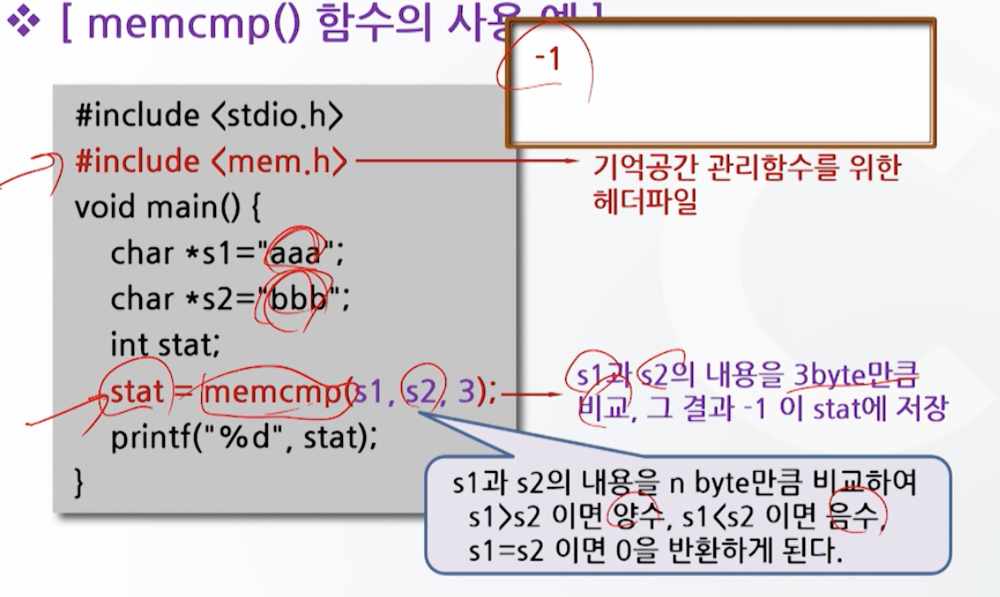
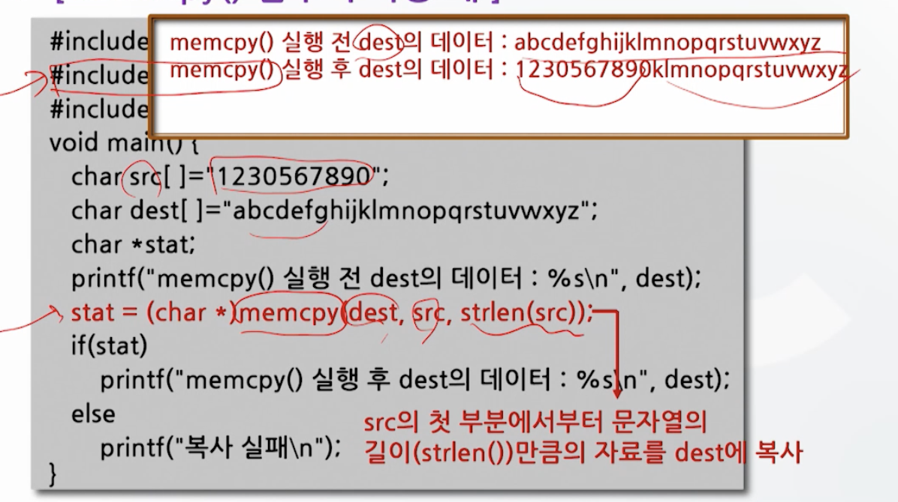
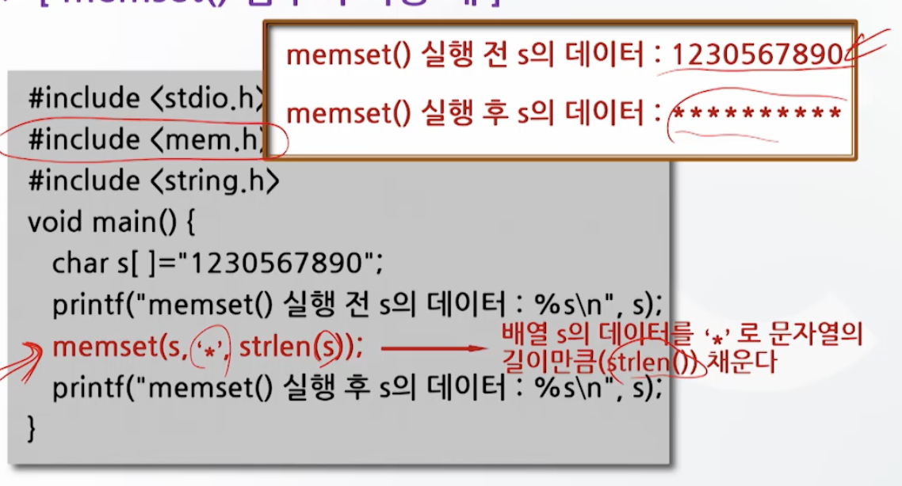

# 15강. 메모리 동적할당

## 1. 메모리 동적할당의 개념

### C 언어에서의 기억공간

#### 기억공간

- 프로그램의 실행을 위해 기억공간 필요
- 기억공간은 운영체제에서 할당
- 할당되는 기억공간의 영역
  - 데이터 영역
  - 힙 영역
  - 스택 영역


#### 기억 공간의 확보 방법

- 메모리 정적 할당(Static Allocation)
  - 기억공간의 데이터 영역과 스택 영역 이용
  - 프로그램을 작성하는 단계에서 필요한 기억공간의 크기를 결정
- 메모리 동적 할당(Dynamic Allocation)
  - 기억공간의 힙 영역 이용
  - 프로그램 실행 중에 입력되는 자료에 맞게끔 기억공간의 크기를 결정


#### 기억공간의 할당 영역



- 데이터 영역
  - 전역변수와 static 변수가 저장되는 영역
- 힙 영역
  - 프로그래머의 필요에 의해 할당/소멸이 이루어짐
- 스택 영역
  - 지역변수와 매개변수가 저장


## 2. 메모리 정적할당

### 메모리 정적할당

- 변수 선언이나 배열 선언과 같이 프로그램을 작성하는 단계에서 필요한 기억 공간의 크기를 결정
  - 변수 선언과 같이 할당시켜줘야 할 기억공간의 한계 크기를 명확히 알고 있을 경우 사용
  - 프로그램이 시작될 때 미리 기억공간의 크기를 고정해 할당


#### 메모리 정적할당의 장단점

- 장점
  - 프로그램에서 사용하게 될 변수의 기억 공간의 크기를 명확히 알 고 있다면
    - 메모리 정적할당은 쉽게 기억공간을 사용할 수 있고, 에러 발생 확률을 줄일 수 있다
- 단점
  - 사용하게 될 기억 공간의 크기를 정확히 알지 못하거나, 사용되는 자료의 크기가 각각 차이가 심하면
    - 기억 공간의 낭비를 가져오게 되는 문제점


## 3. 메모리 동적할당 함수

### 메모리 동적할당의 장단점

- 힙 영역을 이용해 프로그램 실행 중에 입력되는 자료의 크기에 맞게 기억 공간 확보
- 많은 자료를 처리하는 배열의 크기를 실행시간에 정의해야 하는 경우에 특히 유용
- 프로그램 실행 시 기억공간의 크기를 지정할 수 있고, 재조정이 가능
- 시간이 지체되는 단점


### 메모리 동적할당 순서

1. 기억공간을 동적으로 할당받을 변수를 포인터를 이용해 선언
2. `malloc()` 함수 등을 이용해 기억공간을 동적으로 할당
3. 기억공간의 사용이 끝나면 `free()` 함수를 이용해 기억공간을 해제한다


### 메모리 동적할당 함수

- malloc()
- calloc()
- realloc()
- free()


#### malloc()

- ```c
  void * malloc(size_t number_of_bytes);
  ```

  - `number_of_bytes` 에서 주어지는 크기만큼 기억 공간을 동적으로 할당

  - 예시 

    ```c
    void * malloc(sizeof(int));
    ```

  - 인자로 할당받고자 하는 기억공간의 크기를 byte 단위로 전달

  - 힙 영역에 그 크기만큼 기억 공간을 할당하고, 할당한 기억 공간에 첫 번째 주소를 반환

  - `void*`로 명시하여 어떤 형으로든 형변환 가능

  - 초기화 안됨(기억공간의 초기화를 위해서는 `memset()` 사용)


#### free()

- 힙 영역에 할당된 공간은 프로그램이 종료될 때까지 유지
- 할당된 기억 공간을 해제하지 않으면 기억 공간의 부족 현상이 발생
- 따라서 명시적인 반납이 필요


#### 메모리 동적할당의 예







#### calloc() 함수

```c
void * calloc(int n, int size);

// 예
void * calloc(n, sizeof(int));
```

- `malloc()` 함수와 동일하게 힙 영역에 기억공간 할당
- 다른 점은, 사용하는 형태와 할당된 기억 공간을 **0으로 초기화**함




####  realloc() 함수

```c
void * realloc(void *p, int size);
```

- 포인터 p가 가리키고 있는 기억공간의 크기를 지정된 size의 크기로 변경

- 이미 할당 받은 기억 공간의 크기를 변경해야 할 필요가 있을 경우에 사용




## 4. 기억공간 관리함수

### 기억공간 관리

- 기억공간 관리를 위한 함수
  - memcmp()
  - memcpy()
  - memset()


#### `memcmp()`

```c
int memcmp(void *s1, void *s2, size_t n);
```

- s1과 s2가 가리키는 기억 공간의 내용을 n byte만큼 비교

- 기억공간에 들어 있는 자료를 주어지는 크기만큼 비교해서 같은지 여부를 알 수 있게 해주는 함수




#### `memcpy()`

```c
void * memcpy(void *dest, const void *src, size_t n);
```

- 기억공간의 자료를 다른 기억 공간 영역으로 복사하기 위한 함수
- src에서 n byte만큼 dest에 복사




#### `memset()`

```c
void *memset(void *s, int c, size_t n);
```

- 포인터  s가 가리키는 곳을 c 값으로 n byte 만큼 채운다

- 기억 공간의 자료를 지정한 문자로 채우는 함수
- 할당된 기억 공간의 초기화나 내용 삭제를 위해 주로 사용

