# 2강. 자료형과 선행처리기

## 1. 상수와 변수

### 자료형

- 프로그램에서 사용하는 자료의 형태
- 상수와 변수로 구분하여 사용
- 프로그램에서 자료(data) 처리를 위해서는
  - 자료의 생성, 저장, 처리과정 필요
- C프로그램은
  - 수많은 명령어와 자료로 구성되어 있으므로, 정확한 처리와 효율적 활용 필요
- C언어는 여러가지 형태의 자료형(data type)을 지원


### 2.1.1 상수(constant)

- 항상 고정된 값을 갖는 자료
- 값이 한번 정해지면 프로그램 도중 그 값을 변경할 수 없는 수
  - 정수, 실수, 문자, 문자열 

#### 정수형 상수

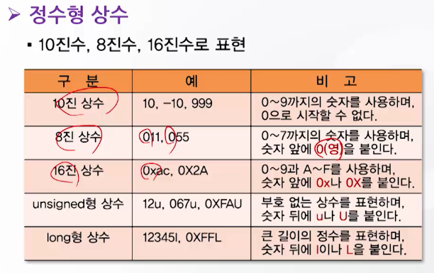

#### 실수형 상수

- 부동소수점 형 상수
- **double**형을 기본 자료형으로 사용

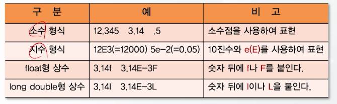

#### 문자형 상수

- 단일 인용부호(**' '**)로 묶여 있는 1개의 영문자나 숫자문자

- 내부적으로는 해당 문자의 ASCII 코드값이 사용

  - A는 내부적으로 65(ASCII 코드값)가 사용됨

- Escape 문자: 키보드에 나타나 있지 않은 문자

  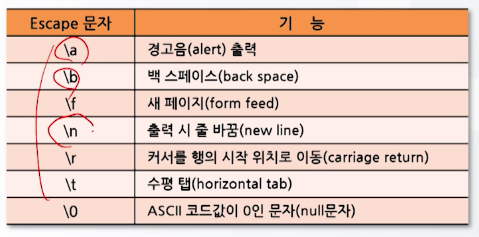

#### 문자열 상수

- 이중 인용부호(" ")로 묶여 있는 복수개의 영문자나 숫자

- 기억공간에 보관될 때는 문자열 끝에 null 문자(\0)가 추가

  - 예시

    - 11개의 문자 개수, 12개의 기억 공간 사용됨

    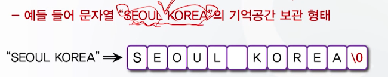


### 2.1.2 변수(variable)

- 변할 수 있는 값
- 프로그램에서 변수는 프로그램 실행 도중 변할 수 있는 **값이 저장되는 기억공간**을 의미
  - i=10;일 때, i는 변수명이고, 10이란 값을 i라는 이름으로 정의된 기억공간에 저장한다는 의미
- 이러한 변수 속에 들어가는 값은 수시로 변경될 수 있다.
- 따라서 변수는 **사용전에 반드시 선언**하여 컴파일러가 기억공간에서 일정공간을 확보할 수 있도록 해야 함


#### 변수의 특징

- 모든 변수는 **이름이** 있다(변수명)
- 정해진 **자료형**이 있다
- **할당된 값**을 갖는다


#### 변수명의 정의 규칙

- 모든 변수는 사용되기 전에 선언되어야 한다
- 변수명은 반드시 영문자나 밑줄로 시작해야 한다
- 변수명은 중간에 숫자, 밑줄을 섞어 명명할 수 없다
- 중간에 밑줄 이외의 특수문자를 섞을 수 없다
- 변수명은 대소문자를 구별한다
- 변수명에 예약어들은 사용할 수 없다


#### 변수의 사용 예

```c
#include <stdio.h>

void main() {
  int a, b; // 정수형 변수 a, b 선언
  a = 100; // 변수 a에 100 대입
  b = 50; // 변수 b에 50 대입
  
  printf("a=%d, b=%d \n", a, b); // 변수 a, b값 출력
}
```


## 2. 자료형과 변수 선언

- 변수
  - 자료를 저장할 기억공간을 확보하고 이 공간에 이름을 붙여준 것

- 변수 선언
  - 확보된 기억공간에 이름을 부여하는 것
  - 특정 공간을 확보하기 위해서는 변수 선언이 이루어져야 함
- 이러한 변수 선언을 위해 **자료형**이 필요


### 2.2.1 자료형

#### 자료형의 종류

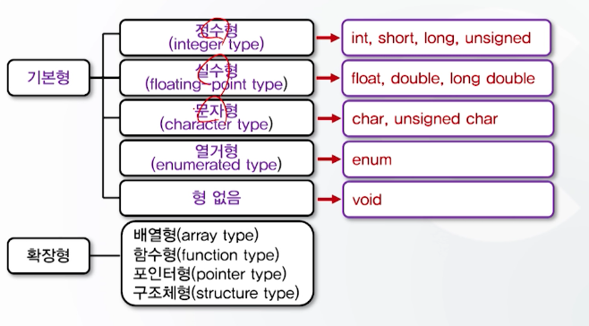

#### 정수형 자료형

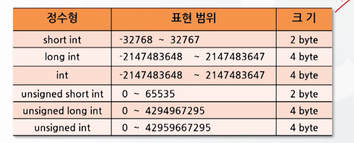

- Int, short, long, unsigned
- 운영체제에 따라 표현범위가 다름


#### 실수형 자료형

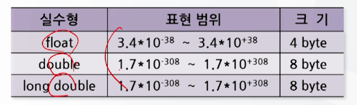

- float, double, long double

- 기본형은 double


#### 문자형 자료형

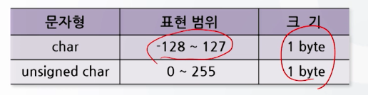

- char, unsigned char
- ASCII 코드를 사용하여 처리
  - -128 ~ 127까지의 값을 표현

- 문자형 자료형 사용 예시

  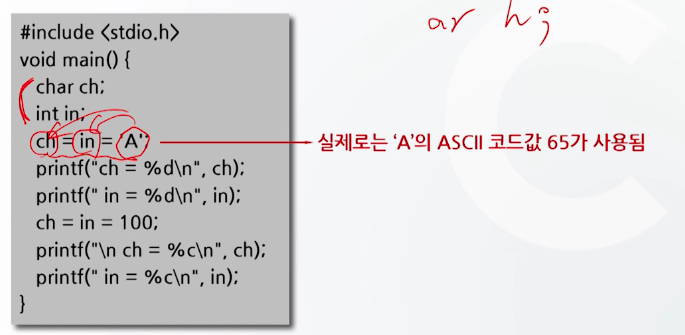

  ```c
  // 출력
  // ch = 65
  // in = 65
  
  // ch = d
  // in = d
  ```


#### 열거형 자료형

- 숫자 대신 단어를 사용

- 형식: enum 태그명 {열거자1, 열거자2, ...}

- 선언 예시 

  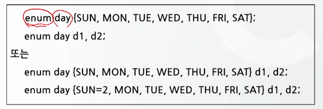

- 열거형의 사용 예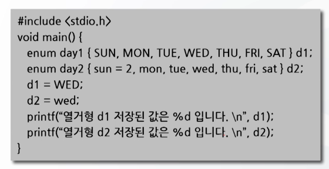

  ```
  열거형 d1 저장된 값은 3입니다.
  열거형 d2 저장된 값은 5입니다.
  ```


### 2.2.2 변수 선언

- 변수명과 변수가 가질 자료형을 지정하여 변수를 위한 **기억공간을 할당**하는 것

- 형식: 자료형 변수명

  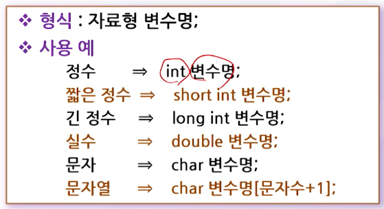

- 변수 선언 시 고려 사항

  - 변수에 저장될 값의 크기(범위)
  - 변수의 선언 위치
  - 변수의 초기화

- 변수에 저장될 값의 크기(범위)

  - short의 범위
    - \-32768 ~ 32767
    - 만약 32767+1= -32768 (looping 이됨)
    - 만약 \-32768-1 = 32767 (looping이 됨)


#### 형 없음


## 3. 선행처리기

