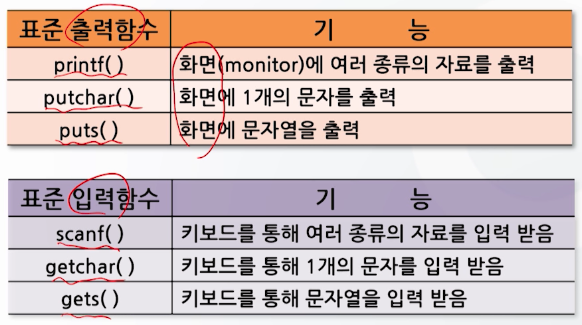

# 3강. 입출력함수와 연산자(1)

## 1. 표준 입출력 함수

### 3.1 표준 입출력 함수

#### 함수란 무엇인가?

- 함수란 특정한 작업(기능)을 수행하도록 설계된 독립적인 프로그램

- C언어에서의 함수
  - 표준함수: C언어 자체에서 제공하는 함수
  - 사용자 정의함수: 사용자가 정의하여 사용하는 함수

#### 표준 입출력 함수의 종류



### 3.1.1 자료의 입출력

#### `printf()` 함수


```c
#include <stdio.h>
void main() {
  char c = 'A';
  int i = 10, j = 20, k = 30;
  printf("간단한 출력 프로그램\n"); // 간단한 출력 프로그램
  printf("c=%c, c의 아스키 코드값은 %d\n", c, c); // c=A, c의 아스키 코드값은 65
  printf("i=%d, j=%d, k=%d", i, j, k); // i=10, j=20, k=30
}
```

- 출력양식 변환기호
  - %p: 포인터 값을 출력


- 양식변환기호 사용 예


- 출력양식의 편집 예


#### `scanf()`


- 입력양식 변환기호

  - %p: 포인터 값을 입력

  

- 사용례

  - 주의: `#pragma warning(disable:4996)`  scanf() 는 권장되지 않는 함수이므로 경고 메시지가 뜸 => 이 경고 메시지를 없애주는 선행처리기
  - `scanf_c` 사용하면 선행처리기 없어도 에러 안나올 수 있음
  - `&jsu1` `&jsu2` : 변수
    - 입력받은 변수 이름으로 처리하게 됨
    - 두 변수 데이터의 구별은 '공백'

  


### 3.1.2 문자 단위의 입출력

#### `getchar()` 함수


- 사용례

  


#### `putchar()` 함수


- `putchar()` 사용례

​	


#### `gets()` 함수

- 문자열: 2개 이상의 문자가 모여져 있는 것


- 사용례

  - scanf()와 gets()의 차이점 - 왜 다르게 들어와질까?
  - scanf()는 공백문자를 통해 데이터를 구분하므로, 첫번째로 받아들여진 문자를 저장

  


#### `puts()` 함수


- 사용례

  - `puts()`와 `printf()`의 차이점

  

  


### 1) 표준 출력함수

#### `printf()` `putchar()` `puts()`

### 2) 표준 입력함수

#### `scanf()` `getchar()` `gets()`