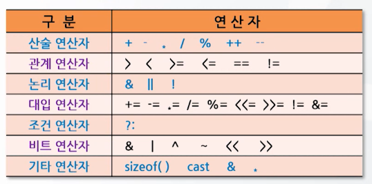

# 4강. 입출력함수와 연산자(2)

## 3.2. 연산자

- 연산자(operator)

  - 임의의 자료에 대해 각종 연산을 수행하도록 하는 기호

- 연산자의 종류

  

### 3.2.1 산술 연산자

- 피 연산자에 대해 사칙연산을 포함한 각종 산술연산을 수행하는 연산자

  

- 산술연산자의 사용 예

  

- 단항연산자의 사용 예

  - `++`, `--`

  

### 3.2.2 관계 연산자

- 피 연산자에 대한 대소관계를 비교하는 연산자

- 관계 연산자의 사용 예

  

### 3.3.3 논리 연산자

- 피연산자에 대해 논리 연산을 수행하는 연산자

  

- 논리 연산자의 사용 예

  - 1은 참, 0은 거짓

  

### 3.2.4 대입 연산자

- 연산자의 오른쪽을 왼쪽에 대입하는데 사용

  

- 대입연산자의 사용 예

  

### 3.2.5 조건 연산자

- 주어진 조건의 만족 여부에 따라 지정된 수식을 수행하는 연산자

- 조건연산자의 예

### 3.2.6 비트 연산자

- 수치에 대해 bit단위의 연산을 수행하는 연산자

- 비트 연산의 예

  

### 3.2.7 기타 연산자

- 기타 연산자
  - `&`(주소연산자)와 `*`(내용연산자)은 6강에서 포인터 배우면서 배울 것

#### `sizeof()` 연산자

- 사용례

  

#### `cast` 연산자(형변환 연산자)

- 사용례

  - b는 자동적으로 형변환

  

### 3.2.8 연산자 우선순위

- 연산자 우선순위에 따른 연산과정 예

  

- 프로그램 예시

  