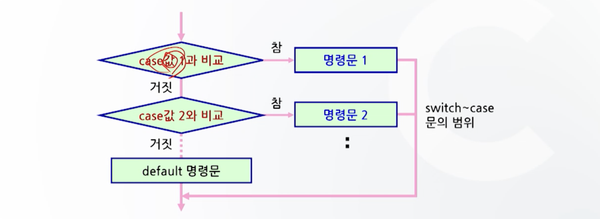
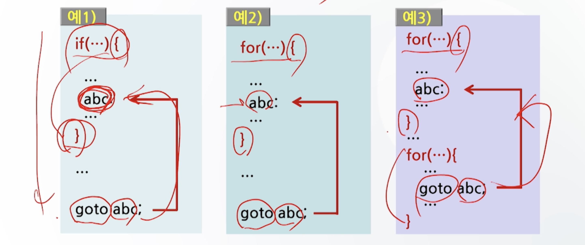
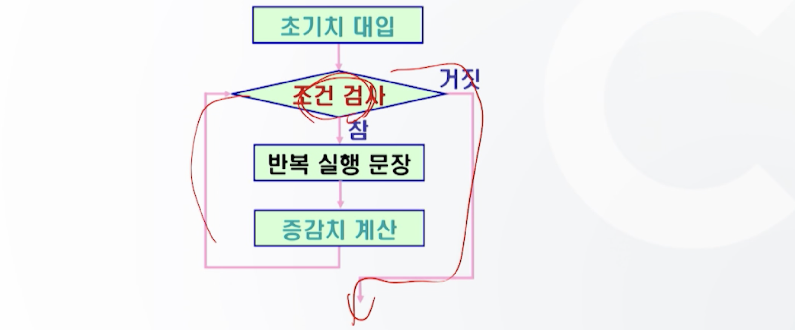
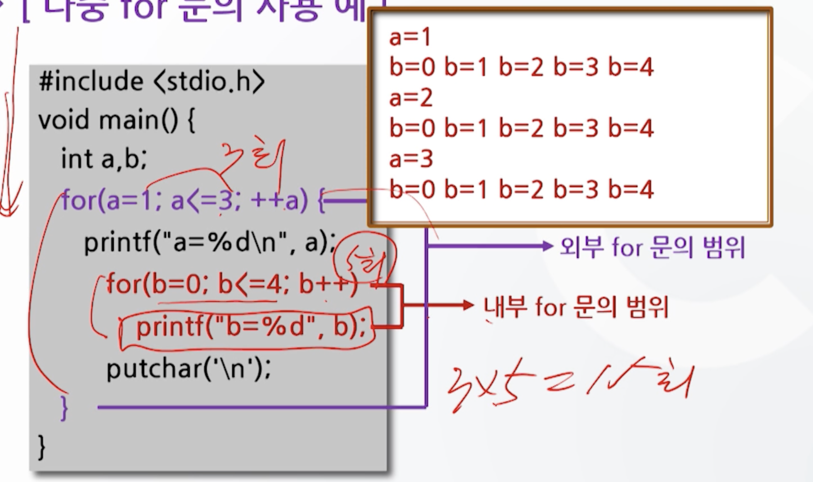
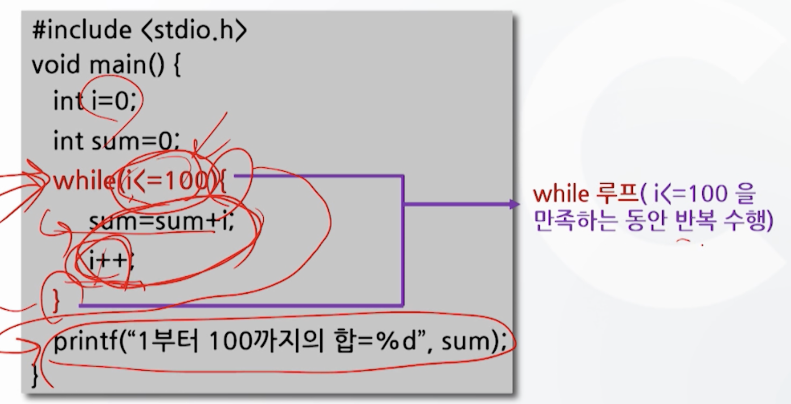
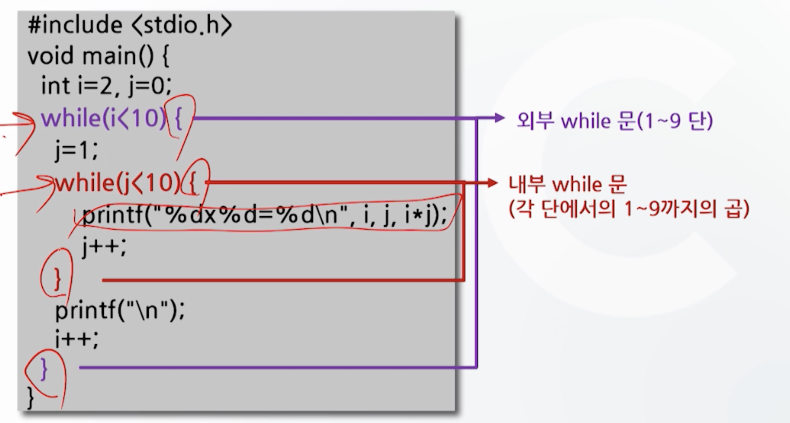
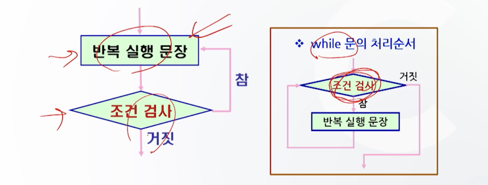
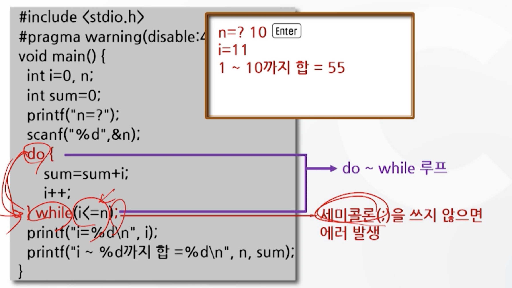
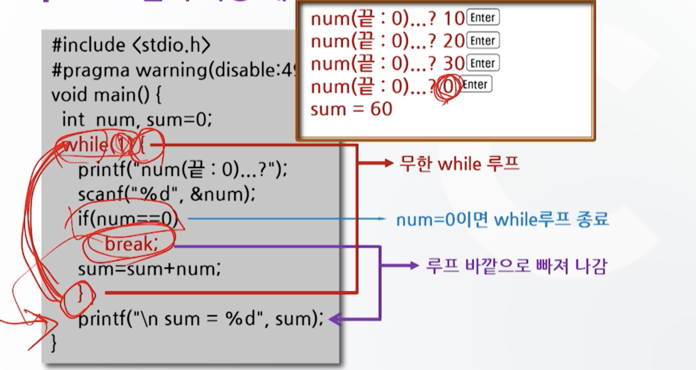
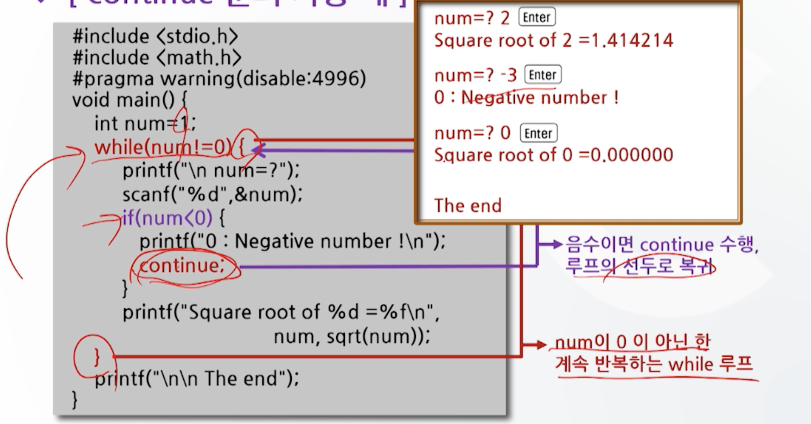

# 5강. 선택제어문과 반복제어문

### 프로그램 언어의 제어 구조

- 순차적 제어
  - 특별한 지정이 없는 한 위에서 아래로 수행되는 제어구조
- 선택적 제어
  - 주어진 주건에 따라 특정 부분으로 수행을 옮기는 분기 제어구조
- 반복적 제어
  - 특정 부분을 일정한 횟수만큼 반복 수행하는 반복 제어구조


## 5.1 선택제어문

### 선택제어문의 종류

- if 문
- switch ~ case 문
- goto 문


### 5.1.1 if문(단순제어)

#### `if`

- 형식 

  ```c
  if(조건)
    명령문 1;
  	명령문 2;
  ```

  ```c
  if(조건) {
    명령문 1;
    ...
  	명령문 n;
  }
  ```

- 단순 if문의 사용례

  ```c
  #include <stdio.h>
  
  void main() {
    int a = 10, b =20;
    if (a>b) {
      a = a+20
     	printf("a=%d\n", a);
    }
    b=b+20;
    printf("b=%d", b)
  }
  ```


#### `if ~else`

- 예제

```c
#include <stdio.h>
#pragma warning(disable:4996)
void main() {
  int a,b,max;
  scanf("%d %d", &a, &b);
  
  if (a>=b) {
    max=a;
  } else 
    max = b;
  printf("max=%d", max)
}
```


#### 다중 `if ~ else`

- 형식

```
if (조건 1) 
	if (조건 2)
		명령문 1;
	else 
		명령문 2;
else
	명령문 3;
```

- 기능: 조건1과 조건2가 참일 때 명령문 1을, 조건1이 참이고, 조건2가 거짓일 때는 명령문 2를 조건 1이 거짓을 경우 명령문 3 수행

- 사용례

```c
#include <stdio.h>
#pragma warning(disable:4996)
void main() {
  int a;
  scanf("%d", &a);
	if (a >= 0) 
    if (a == 0) 
      printf("입력된 값은 0");
  	else 
      printf("입력된 값은 양수");
  else 
    printf("입력된 값은 음수");
}
```


#### 다중 `if ~ else if ~ else`

- 형식

  ```
  if (조건 1) 
  		명령문 1;
  	else if (조건 2)
  		명령문 2;
  	else if (조건 3)
  		명령문 3;
  	else
  		명령문 4;
  ```

- 기능

  - 조건 1이 참이면 명령문 1, 거짓이면 조건2 검사해서 참이면 명령문 2...

- 사용례

  ```c
  #include <stdio.h>
  #pragma warning(disable:4996)
  void main() {
    int score=0;
    printf("성적 입력");
    scanf("%d", &score);
  	if (score >= 90)
  		printf("학점은 A\n");
    else if (score >= 80)
  		printf("학점은 B\n");
    else if (score >= 70)
  		printf("학점은 C\n");
    else if (score >= 60)
  		printf("학점은 D\n");
    else 
  		printf("학점은 F\n");
  }
  ```


### 5.1.2 switch문

#### `switch ~ case`

- if else보다 다양한 경우에 사용

- 형식

  ```
  switch(수식)
  {
  	case 값1: 명령문 1;
  	case 값2: 명령문 2;
  	...
  	default: 명령문 n
  }
  ```

- 기능

  - 주어진 값에 따라 여러곳 중 한 곳으로 분기하여 실행
  - (if else의 경우 두 군데 중 한 곳으로 분기)

- Switch ~ case 문의 처리 순서도

  

- 사용례

  - break문 미사용
    - 나머지가 0이므 case0에 해당되는 경우만 실행되었으면 좋겠지만, 이 경우 모든 경우가 실행된다!

  ```c
  #include <stdio.h>
  #pragma warning(disable:4996)
  void main() {
    int n;
    printf("n=?")
    scanf("%d", &n);
    printf("\n n %% 5 = %d\n", n%5);
    
    switch(n%5) {
      case 0: printf("나머지는 0\n");
      case 1: printf("나머지는 1\n");
      case 2: printf("나머지는 2\n");
      default: printf("나머지는 3이나 4\n");
    }
  }
  ```

  - break문 사용
    - 아까 원하던 결과 여기 나옴

  ```c
  #include <stdio.h>
  #pragma warning(disable:4996)
  void main() {
    int n;
    printf("n=?")
    scanf("%d", &n);
    printf("\n n %% 5 = %d\n", n%5);
    
    switch(n%5) {
      case 0: printf("나머지는 0\n");
      break;
      case 1: printf("나머지는 1\n");
      break;
      case 2: printf("나머지는 2\n");
      break;
      default: printf("나머지는 3이나 4\n");
      break;
    }
  }
  ```


### 5.1.3 goto 문

- 형식

  ```c
  Label :
  goto Label;
  ```

- 기능
  - 프로그램 수행 도중 원하는 곳으로 무조건적으로 옮긴다
  - 무조건적으로 분기하는 명령문

- 사용례

  ```c
  #include <stdio.h>
  #pragma warning(disable:4996)
  void main() {
    int i, n, c='A';
    while(1) {
      printf("\n 횟수는 ?");
      scanf("%d", &n);
      for (i=1; i<=n; i++) {
        printf("%c", c);
        if (c=='Q')
          goto end; // 레이블 명 end로 무조건 실행을 옮김
        c++;
      }
    }
    end: // 레이블 명 끝에는 콜론(:)을 붙임
    printf("\n\n 끝 "); 
  }
  ```

- goto문이 사용될 수 없는 경우

  - 위치를 옮겨줄 레이블이 특정 범위 안에 들어 있는 경우(if, for)
  -  범위 밖으로는 나갈 수 있지만, 다른 범위 안으로는 못들어감

  


## 5.2 반복제어문

### 반복제어문의 종류

- `for`
- `while`
- `do ~ while`


### 5.2.1 for 문

#### `for`

- 형식

  ```c
  for (초기식; 조건식; 증감식) {
    반복 실행될 문자
  }
  ```

- 기능

  - 주어진 조건이 만족되는 동안 루프문을 반복 수행한다

- 처리순서

  

- 사용례

   ```c
   #include <stdio.h>
   
   void main() {
    	int i, sum=0;
     for (i=0; i<=10; ++i)
       sum = sum+i;
     printf("1부터 %d까지의 합=%d", i=1, sum);
   }
   ```

  

#### 다중 `for`

- 형식

  ```c
  for (초기식; 조건식; 증감식) {
    for (초기식; 조건식; 증감식) {
    	for (초기식; 조건식; 증감식) {
    		반복 실행될 문자
  		}
  	}
  }
  ```

- 기능

  - 주어진 조건이 만족되는 동안 동 루프문을 반복 수행

- 사용례

  ```c
  #include <stdio.h>
  
  void main() {\
    int a, b;
  
    for (a=1; a<=3; ++a)
  	  printf("a=%d\n", a);
         for(b=0; b<=4; b++)
           printf("b=%d", b);
         putchar('\n');
    }
  }
  ```

  


#### `while`

- 형식

  ```c
  while (조건식) {
    반복 실행될 문장
  }
  ```

- 기능

  - 주어진 조건이 만족되는 동안 루프문을 반복 수행

- 사용례

  - 단순 `while`

  

  - 다중 `while`

  

#### `do ~ while`

- 형식

  ```c
  do {
    반복 실행될 문장;
  } while (조건식);
  ```

- 기능

  - 반복문 내의 명령문을 실행한 후, 주어진 조건을 검사하여 반복 수행 여부를 결정한다

- do~while 문의 처리순서

  

- 사용례

  


## 5.3 기타제어문

### 기타 제어문의 종류

- break문
- continue 문


### 4.3.1 break문

- 반복 명령의 실행 도중 강제적으로 반복문을 빠져나오는데 사용
  - For, while, do~while 루프나 switch블록 등을 강제로 종료시키고자 할 때 사용

- break문은 자신이 포함된 반복문만 빠져나옴




### continue문

- 루프 실행 중에 루프를 다시 실행하고자 할 때 사용

  - 반복구조에만 국한되어 사용
  - Switch ~ case 문에서는 사용하지 않음

- 그 루프의 선두로 제어 옮겨 다음 반복을 실행

- 예제

  

​	