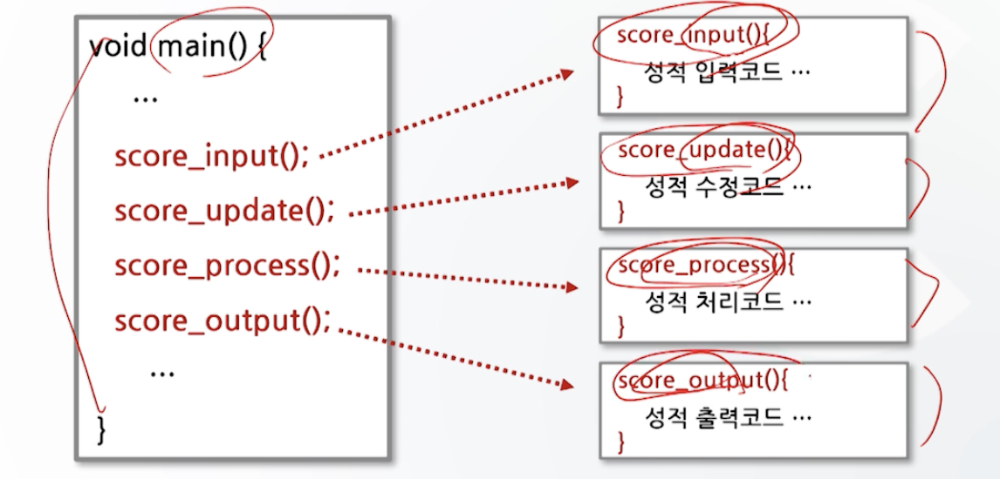

# 6강. 함수와 기억클래스(1)

## 01. 함수의 개념

### 함수의 개념

- 함수
  - 함수란 특정한 작업(기능)을 수행하도록 설계된 독립적인 프로그램
  - 이러한 함수들이 정해진 순서에 따라 실행됨으로써 프로그램의 기능을 수행
- C 프로그램은 함수들로 구성
  - 전체의 실행 내용을 몇 개의 모듈(module)로 분류
  - 각각의 모듈에 해당하는 내용을 함수로 작성
  - 실행순서에 따라 그 함수들을 차레로 호출하여 실행
- 함수의 특성
  - 함수들은 서로를 자유로이 호출 가능
  - 모든 함수는 서로 독립적
- 함수의 장점
  - 프로그램의 수정이 용이
  - 함수 재사용으로 코드 중복을 최소화한다
  - 프로그램의 기능을 한 눈에 파악할 수 있게 해줌으로써 유지관리가 쉽다

- 단위 프로그램을 하나의 함수에 기술한 경우 

  - 함수의 길이가 커짐
  - 프로그램의 가독성 문제
  - 수정 어려움
  - 일부분만 재호출 어려움

- 기능별 독립된 단위(함수)로 구성한 경우 효율적

  

## 02. 표준함수

### 표준 함수

- C언어에서의 함수

  - 표준함수: C 언어 자체에서 제공하는 함수
  - 사용자 정의 함수: 사용자가 정의해 사용하는 함수

- 표준함수

  - 표준함수의 원형은 헤더파일(`*.h`)에 정의
  - 표준함수의 실체는 라이브러리 파일에 수록
  - 표준함수를 사용하려면 원형이 선언되어있는 헤더파일을 `#include` 시켜 주어야 함

- 표준함수의 원형 예

  - `printf()`, `scanf()` 함수의 원형

    ```c
    int printf(const char * format, ...);
    int scanf(const char * format, ...);
    ```

    - 헤더파일에 정의되어 있음(stdio.h)
    - 표준함수 사용하려면 stdio.h를 #include

  - `sin()`, `cos()` 함수의 원형

    ```c
    double sin(double x);
    double cos(double x);
    ```

    - 헤더파일에 정의되어 있음(math.h)
    - 표준함수를 사용하려면 math.h를 #include

- C언어에서의 표준함수 예

  

- 표준함수의 사용 예 (1)

  

- 표준함수의 사용 예 (2)

  


## 03. 사용자 정의 함수

### 사용자 정의 함수

- C 프로그램에서의 함수 

  - main()함수 안에 표준함수를 사용하는 형태
  - 그러나 동일 브록 내의 프로그램 길이가 길어지면 전체 프로그램은 복잡해지고 이해하기 어려워짐
  - 따라서 전체 프로그램을 짧은 길이의 단위 프로그램으로 나누어 정의함으로써 프로그램의 작성과 이해를 쉽게 할 필요가 있따

- 사용자 정의 함수

  - 사용자가 단위 프로그램을 함수가 정의하여 사용

- C 프로그램에서 사용자 정의함수의 예

  

- 함수 정의의 구조

  ```c
  반환자료형 함수명 (자료형 매개변수1, 자료형 매개변수2, ...)
  {
    함수몸체
  }
  ```

- 사용 예
  ```c
  int sum(int a, int b)
  {
    int d;
    d = a+b
    return(d)
  }
  ```

  


### 함수의 정의

- 함수 헤더(반환자료형)

  ```c
  반환자료형 함수명 (자료형 매개변수1, 자료형 매개변수2, ...)
    int sum(int a, int b)
  ```

  - 반환 자료형

    - 함수에서 계산된 결과값을 호출한 함수에 되돌려 줄 떄의 자료형
    - 사용될 수 있는 자료형은 C언어에서 사용 가능한 모든 자료형
    - 생략이 가능하며, 생략할 경우 자료형은 int 형으로 간주
    - 반환값이 없는 함수인 경우는 void형으로 선언

    

- 함수 헤더(함수명, 매개변수)

  ```c
   반환자료형 함수명 (자료형 매개변수1, 자료형 매개변수2, ...)
     int sum(int a, int b)
  ```

  - 함수명
    - 변수명을 정하는 규칙과 동일한 방식으로 함수명을 정한다
    - 의미 있는 함수명을 정하는 것이 함수를 이해하는데 도움을 준다
  - 자료형과 매개변수
    - 자료형은 매개변수의 자료형을 나타냄
    - 매개변수는 호출 함수와 피호출 함수 사이에 자료를 주고받기 위해 사용
    - 매개변수는 해당 함수 내에서 변수처럼 사용
    - 매개변수가 여러 개일 경우에는 콤마(,)로 구분
    - 매개변수가 없으면 void 형으로 사용

- 함수 몸체

  ```c
  반환자료형 함수명(자료형 매개변수1, 자료형 매개변수2, ...)
  {
    함수 몸체
  }
  ```

  ```c
  int sum(int a, int b)
  {
    int d;
    d = a+b;
      return(d);
  }
  ```

  - 함수가 하는 일을 정의하는 부분
  - 중괄호(`{}`)를 이용해 함수의 시작과 끝을 나타냄
  - C언어의 기본구조와 동일

- main()함수의 예

  ```c
  int main(void) // 반환자료형이 있는 경우 return값 명시
  {
    printf("함수의정의\n")
    return(d)
  }
  ```

  ```c
  void main() // 반환자료형이 void인 경우 return 값 생략
  {
    printf("함수의정의\n")
  }
  ```

  - 반환 자료형에서 void는 반드시 명시(생략시 int)
  - 매개변수 (void)와 ( )는 동일한 의미

- 사용자 정의함수의 예

  ```c
  int sum(int a, int b)
  {
    int d; // 함수 내에서 새로 사용되는 변수 선언
    d = a+b;
    return(d); // 값을 되돌려 줄 때 사용
  } // return값 d는 sum 함수를 호출한 함수로 반환
  ```


### 함수의 사용

- 함수를 사용하기 위해서는
  1. 함수의 원형 선언
  2. 함수의 호출
  3. 함수의 정의

- 예시

  


### 함수의 원형 선언

- 함수의 원형 선언

  - 함수는 변수와 같이 사용되기 전에 미리 선언
  - 함수의 원형선언은 일반적으로 main()함수 이전에 한다
  - 원형선언은 함수 정의 부분의 헤더부분에 세미콜론(`;`)만 추가하면됨
  - 함수 원형선언은 함수와 관련된 3가지 성질을 선언
    - 함수의 반환형
    - 매개변수의 개수
    - 매개변수의 자료형

- 함수의 원형선언 예**(원형 선언이 필요한 경우)**

  - 피호출함수가 main함수 뒤에 선언되어 있는 경우 원형 선언이 그 전에 필요

  

- 함수 원형선언 예 2**(원형 선언이 필요 없는 경우)**

  


### 함수의 호출

- 함수는 일종의 부 프로그램

  - 따라서 함수의 호출이 있어야 함

- 함수의 호출 방법

  - 함수명과 매개변수의 열거

- 함수의 호출과 프로그램 실행순서

  

- 매개변수

  - 실 매개변수
    - 함수를 호출하는 함수(호출함수)에 쓰이는 매개변수
  - 형식 매개변수
    - 호출당하는 함수(피 호출함수)에 쓰이는 매개변수

  - 실 매개변수와 형식 매개변수 사이에는 자료형과 변수의 갯수가 일치해야 함

- 매개변수의 예

  - 자료형이 일치하지 않을 경우 **형 변환**이 발생
  - 변수의 갯수가 일치하지 않을 경우 **컴파일 에러** 발생

  

- 결과값 반환(return 문)

  

- return 문의 사용 예

  

- 함수의 여러 가지 사용 예

  