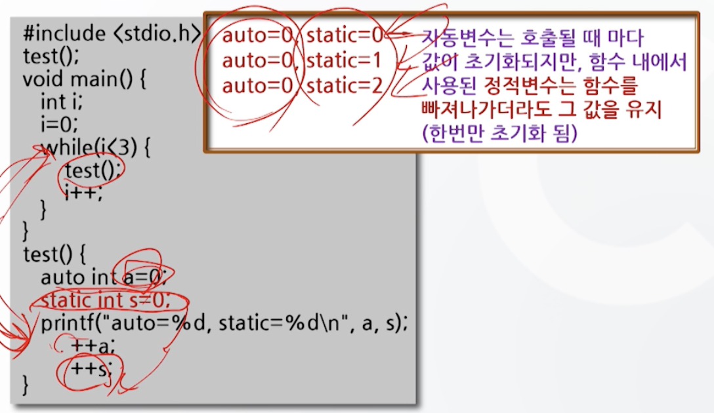

# 7강. 함수와 기억클래스(2)

## 1. 매개변수 사이의 자료전달

### 매개변수 사이의 자료전달 방법

- 값에 의한 자료전달(call by value)
  - 기본적인 자료전달 방법
  - 실 매개변수와 형식 매개변수 사이에 값의 전달
  - 호출한 함수의 실행이 끝난 다음 전달받은 값을 되돌려 받지는 못함
- 참조에 의한 자료전달(call by reference)
  - 호출함수와 피호출함수의 매개변수 값을 서로 교환할 수 있는 자료전달 방법
  - 값을 전달하는 것이 아니라 실 **매개변수의 값이 들어있는 주소 값**이 전달된다

#### 값에 의한 자료전달

- 값에 의한 자료전달 방법

- 값에 의한 자료전달 예시

  - 피호출함수에서 값에 변화를 주었다 하더라도, 실매개변수의 값에는 변화가 없음

  

- 값에 의한 자료전달 과정

  

#### 참조에 의한 자료전달

- 참조에 의한 자료전달 방법

  - 주소연산자 `&` 와 내용연산자  `*` 를 사용
  - 주소값이 전달된다!

  

- 참조에 의한 자료전달 예시

  

- 참조에 의한 자료전달 과정

  

## 2. 기억클래스

### 기억클래스(storage class)

- 변수를 기억공간의 특정 영역에 할당하는 방법
- 즉, 각 변수의 유효범위와 존속기간을 설정
  - 변수의 사용위치에 따라 정의 달라짐
    - 지역변수
    - 전역변수
  - 변수의 존속기간에 따라
    - 자동변수
    - 정적변수
    - 외부변수
    - 레지스터변수

### 지역변수와 전역변수

- 지역변수(local variable)
  - 특정 범위 내에서만 통용되는 변수
  - 선언된 블록이나 함수 내에서만 사용 가능
  - 함수에서 사용되는 매개변수도 해당

- 전역변수(global variable)

  - 함수 밖이나 외부파일에서 선언되어 프로그램 전체에 걸쳐 사용될 수 있는 변수

- 지역변수와 전역변수의 유효범위

  

#### 지역변수

- 지역변수의 사용 예 (1)

  

- 지역변수의 사용 예 (2)

  

#### 전역변수

- 전역변수의 사용 예

  

#### 전역변수와 지역변수의 비교

- 동일 범위 내에서는 지역변수가 우선
- 전역변수의 선언은 프로그램 선두에 위치
- **가급적 지역변수를 사용하는 것이 효율적**
  - 함수의 독립성 향상
  - 디버깅 효율 향상
  - 기억 공간 절약

### 기억클래스의 종류

- 변수의 기억클래스 종류
  - 변수의 초기화, 존속기간, 유효범위에 따라 구별
    - 자동변수(auto)
    - 정적변수(static)
    - 외부변수(extern)
    - 레지스터변수(register)

- 기억클래스를 이용한 변수선언

  - auto가 default(생략가능)

  

#### 자동변수

- 자동변수란

  - 함수 실행시 만들어지고, 실행이 끝나면 기억공간이 제거

  - 예약어 auto(생략 가능)

  - 통용 범위는 변수가 선언된 블록이나 함수 내로 한정

  - 지역변수에 해당

  - **초기화가 필요함**

- 자동변수의 사용 예

  

#### 정적변수

- 정적변수란
  - 기억영역이 프로그램 끝날 때 까지 유지
  - 예약어 static 사용
  - 전역 변수에 해당
  - 변수의 값은 프로그램 실행 중 계속 유지
  - **초기화가 없으면 0으로 초기화** 됨

- 정적변수의 사용 예 (1)

  - static이 main함수 안에 있지만 전역변수로 취급됨

  

- 정적변수의 사용 예 (2)

  

#### 외부변수

- 외부변수란

  - 함수의 외부에서 선언
  - 예약어 extern을 사용
  - 전역 변수에 해당
  - 초기화가 없으면 0으로 초기화 됨
  - **다른 파일**에서 외부변수로 선언된 변수의 값을 **참조**할 수 있다

- 외부변수 사용 예 (1)

  

- 외부변수 사용 예 (2)

  

#### 레지스터 변수

- 레지스터 변수란
  - CPU 내의 레지스터에 자료를 저장하고자 할 떄
  - 예약어 `register` 사용
  - 자동 변수와 동일한 속성
  - 프로그램의 **실행속도 증가를 목적**으로 사용
    - 주로 반복문에서 카운터 변수로 사용

- 레지스터변수의 사용 예

  - 반복횟수가 많아지면 많아질수록 실행속도 증가 효과 커짐

  