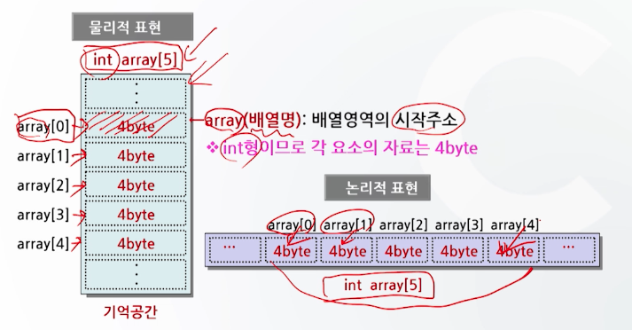
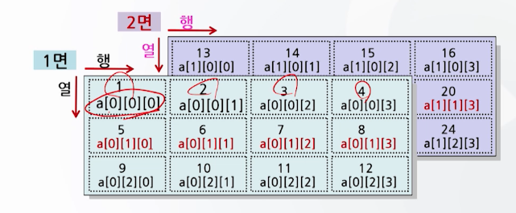
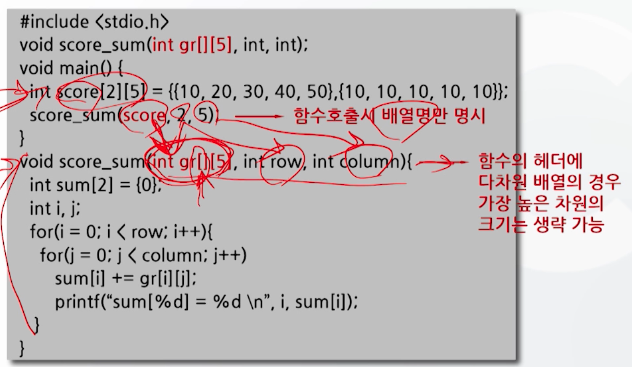

# 8강. 배열과 포인터(1)

## 배열(배열의 개념)

- 100개의 자료처리를 위해 지금까지는
  - 100개의 변수 필요
  - 모든 변수 이름 기억
  - 자료 처리 복잡
- 일관성 있고 효율적인 새로운 변수 필요
  - 하나의 변수 이름에 순서에 의한 번호 부여
  - 변수명[1], 변수명[2], ..., 변수명[100]
  - 효율적인 자료처리 가능


## 배열의 정의와 형태

- 배열의 정의
  - **동일한 자료형**을 갖는 자료들의 리스트
  - 배열의 각 요소는 하나의 변수로 취급
  - 배열은 배열명과 첨자로 구분
- 배열의 선언 형태
  - 1차원 배열
  - 2차원 배열
  - 3차원 배열


### 1차원 배열

- 1차원 배열

  - 배열의 첨자가 하나만 있는 배열
  - 첨자의 개수는 배열 전체의 구성요소의 개수를 의미
  - 배열의 각 요소는 배열명과 첨자로 구분
    - 첨자는 0부터 시작
  - 배열의 각 요소는 배열명과 첨자로 구분
    - 자료형과 기억 클래스를 갖는다

- 1차원 배열 선언

  - 형식: 자료형 배열명[개수]
  - 예시: `int a [10]`
  - 의미: 1차원 배열로서, 배열명은  a이고 배열의 크기는 10이며 정수값이 기억됨

- 1차원 배열의 기억공간 표현

  

- 1차원 배열의 초기화

  - 배열을 선언하면 기억공간을 초기화 해야 함

  - 초기화 방법

    - 배열선언 후 초기값 할당
    - 배열선언과 동시에 초기값 할당
    - 외부로부터 자료를 입력 받아 초기화

  - 배열선언 후 초기값 할당

    

  - 배열선언과 동시에 초기값 할당

    

  - 외부로부터 자료를 입력받아 초기화

    

- 1차월 배열의 초기화 후 기억공간의 표현

  ```c
  int array[5] = {10, 20, 30, 40, 50};
  ```

  

- 1차원 배열의 사용 예

  - 예시1

  

  - 예시2

    


### 다차원 배열: 2차원 배열

- 2차원 배열 선언

  - 형식: 자료형 배열명\[행의수][열의수]
  - 사용예: `int a[3][4]`
  - 의미: 2차원 배열로서, 배열명은 a이고 3행 4열로 된 12개의 요소를 가진 정수형 배열

- 2차원 배열의 선언과 초기화

  - 세 표현 다 개념은 동일하지만, 최대한 가독성이 좋은 방법을 선택한다

  ```c
  int array[3][3] = {1, 2, 3, 4, 5, 6, 7, 8, 9};
  ```

  ```c
  int array[3][3] = [{1, 2, 3}, {4, 5, 6}, {7, 8, 9}];
  ```

  ```c
  int array[3][3] = {
    {1, 2, 3},
    {4, 5, 6},
    {7, 8, 9}
  };
  ```

- 2차원 배열의 기억공간 표현

  ```c
  int a[3][4] = {1, 2, 3, 4, 5, 6, 7, 8, 9, 10, 11, 12}; // 12개 기억공간 확보
  ```

  

- 2차원배열의 사용 예

  


### 다차원 배열: 3차원 배열

- 3차원 배열 선언

  - 형식: 자료형 배열명\[면의수]\[행의수][열의수]
  - 사용예: `int a[2][3][4]`
  - 의미: 3차원 배열로서, 배열명은 a 이고 2면 3행 4열로 된 24개의 요소를 가진 정수형 배열

- 3차원 배열의 초기화와 기억공간 표현

  ```c
  int a[2][3][4]={{{1, 2, 3, 4}, {5, 6, 7, 8}, {9, 10, 11, 12}},
                  {13, 14, 15, 16}, {17, 18, 19, 20}, {21, 22, 23, 24}}};
  ```

  


## char형 배열과 문자열

- char형 배열

  - 형식: char배열명[문자열길이+1]
  - 사용예: `char str[12]`
  - 의미: 배열명의 str이고, 12문자 길이를 가진 charㅎ여 배열

- char형 배열선언과 초기화

  - 문자열이 기억공간에 저장될때 자동적으로 null문자가 추가된다는 내용과 관련

  

  ```c
  char name[] = "HONG GIL DONG"; // 문자열 단위로 초기화
  char address[] = {'S', 'E', 'O', 'U', 'L', '\0'}; // 문자 단위로 초기화. 
  // \0 (null)문자를 삽입 필수!!! 
  ```

- char형 배열의 사용 예 1

  

- char형 배열의 사용예2(scanf() 함수 이용)

  


## 함수와 배열

- 배열을 함수의 매개변수로 사용할 경우

  - 함수 호출 시 배열명만 명시하여 호출

    

  - 함수 헤더에는

    - 1차원 배열의 경우 크기 생략 가능
    - 다차원 배열의 경우 가장 높은 차원의 크기 생략 가능

- 2차원 배열이 함수의 매개변수로 사용된 예

  


