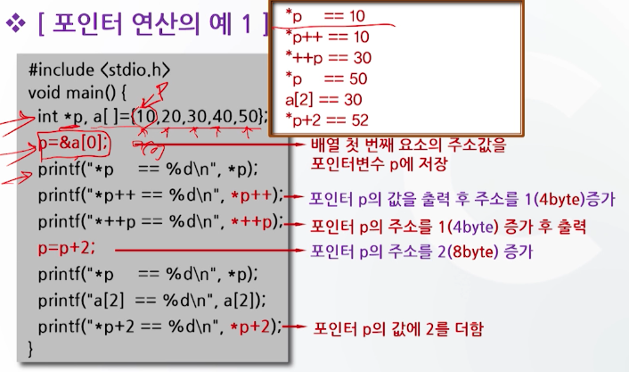
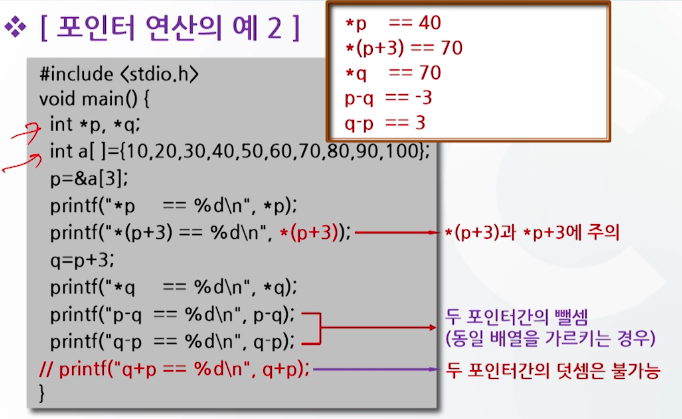

# 9강. 배열과 포인터(2)

## 1. 포인터의 개념

### 포인터의 개요

- 포인터(pointer): 변수의 일종

  - 변수: 특정 데이터 값을 가지고 있음
  - 포인터: 특정 데이터가 저장된 기억장소의 주소(번지)값을 가지고 있음

- 따라서 포인터는 기억공간을 변수명으로 접근하지 않고 주소로 접근하기 위해 사용

- 일반적인 변수의 기억공간 표현

  

  - 변수는 변수 선언에 의해 기억공간이 할당되고
  - 할당된 기억공간에 변수에 대입된 데이터가 저장
  - 이때 할당된 기억공간은 주소(번지)가 부여되어 있다

- 주소를 이용하여 변수와 같은 동일한 작업 가능

  - x의 주소 0002를 이용해 데이터를 저장할 수 있다

- 따라서 주소 값(포인터 값)을 다룰 수 있는 변수가 필요

- 포인터 변수: 변수의 주소 값을 갖는 특별한 변수

- 변수의 주소 예


## 2. 포인터변수의 선언방법

### 포인터 변수의 선언


- **p**: 포인터 변수로서 정수형자료가 수록되어 있는 **주소**를 가지고 있다
- ***p:** 해당 주소에 수록되어 있는 **정수형 자료**를 가지고 있다.

- 포인터변수의 사용 예

  

  ```c
  int a, b; // 일반 변수의 선언
  int *p;// 변수 p를 포인터 변수로 선언
  a = 5000; // 일반 변수의 사용
  p = &a; // 포인터 변수 p에 변수 a의 주소 값을 대입
  b = *p; // b == 5000 // 포인터 변수 p가 가리키는 주소의 내용을 변수 b에 저장
  ```


## 3. 포인터 변수의 참조

- 포인터 변수의 참조 => `&`, `*`연산자 사용

- 포인터 변수의 올바르지 않은 참조

  - 예시1 

  

  ```c
  int *p, i=4;
  *p = i;
  ```

  - 예시2

    

  ```c
  int *p, i=4;
  *p = 5
  ```

- **포인터 변수의 올바른 참조**

  - 예시 

  

  ```c
  int *p, i = 4;
  p = &i; // "주소"값이 치환되어 있어야지만 정상처리 가능
  *p = 10;
  ```

- 포인터 변수의 참조 예

  ```c
  #include <stdio.h>
  void main() {
    int *p, i = 3, j;
    p = &i; // 포인터변수 p는 변수 위치(주소) 를 가리킴
    j = *p; // 포인터변수 p가 가리키는 번지의 내용을 변수 j에 대입
    j++; // 변수 j의 값을 1 증가
    printf("*p = %d\n", *p) // *p = 3
    printf("p = %x\n", p") // p = fff4
    printf("j = %d\n", j") // j = 4
  }
  ```

- 포인터변수 참조의 기억공간 표현 


## 4. 기억공간의 표현

### void형 포인터

- 형식: `void * 포인터명;`
- 의미
  - 프로그램 실행시에 자료형이 결정되는 경우에 사용
  - 저장하기 전에 명시적 형변환이 필요

- 사용 예

  


### 일반 변수와 포인터 변수의 비교


## 5. 포인터 연산

### 포인터와 기억공간의 대응관계


### 포인터 연산

- 포인터 변수에 `+`, `-`, `++`, `--` 연산자를 사용하는 연산

- 예시(위치변화)

  ```c
  int a[10], *p, *q
  ```

  

  ```c
  int a[10], *p, *q
  ```

  

  ```c
  int a[10], *p, *q
  ```

  

  - 뺄셈은 가능, 덧셈은 불가능
    - 뺄셈은 거리 차를 의미하는 것이므로 가능


### 포인터 연산의 예






