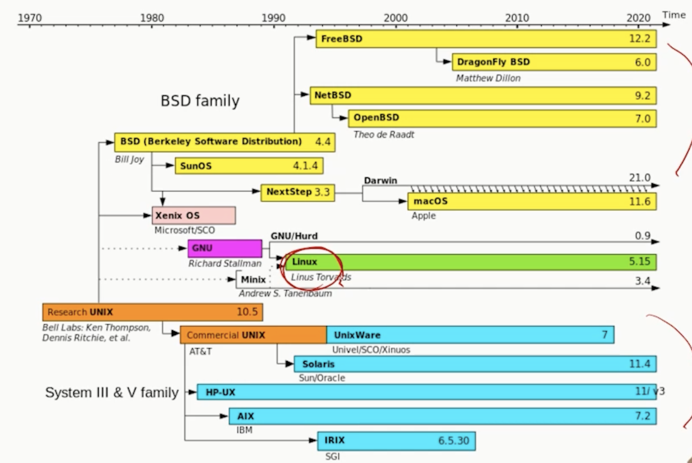

# 1강. 리눅스소개

## 1. 유닉스와 리눅스

### UNIX의 특징

- 다중 사용자, 다중 작업을 지원하는 신뢰성 높은 **시분할 운영체제**
- 뛰어난 이식성(대부분 C로 작성됨), 강력한 네트워킹 기능, 셸 스크립트, 파이프라인, 명령행 기반 인터페이스, 단순하고 모듈화된 설계

### UNIX와 리눅스

- 리눅스는 UNIX의 무료 공개 버전
- 초기에 리눅스는 PC용 운영체제로 개발되었음

### UNIX 발전사(1)

#### 최초의 UNIX

- Multics
  - 1969년, assembly 언어로 작성된 최초의 시분할 운영체제
  - MIT, AT&T Bell, General Electrics가 합작해서 만듦
  - 시분할 운영체제: CPU를 시간을 분할해서 여러 사용자가 사용할 수 있게 지원하는 운영체제
  - 매우 복잡하고 비용 문제가 많았음
- Unics -> Unixs
  - 작고 심플한 운영체제로 다시 작성됨
  - 1973년 대부분이 C언어로 다시 작성됨
  - 교육 목적으로 대학에 공짜로 공급함 > 대중적이게 됨

#### 대표적인 UNIX 시스템

- **BSD(Berkeley Software Distribution) 계열** Free BSD, SunOS, **GNU/Linux(이거 사용할것!)**
  - 자유롭고 공개된 방식으로 개발, 무료 공급
- **System V 계열**: HP-UX(HP), AIX(IBM), Solaris(Oracle)
- 리눅스

### UNIX 발전사(2)

### 리눅스의 등장(1)

- **1983년 GNU 프로젝트**
  - 리처드 스톨만이 UNIX와 유사한 공개 운영체제를 개발하기 위해 GNU 프로젝트를 시작
  - 소프트웨어 상업화에 반대하고 소스코드의 공유, 자유로운 사용과 배포를 주장
  - 1985년 GNU 선언문(Manifesto) 발표
  - 1989년 GPL(Generic Public License)을 발표
    - copyleft로도 알려짐
  - 현재 Free Software Foundation(FSF)이라는 이름으로 활동
    - 오픈 소스 소프트웨어라는 용어 많이 쓰임

- **1991년 리눅스 커널(kernel)**
  - Linus-Torvalds는 리눅스 커널을 작성해 발표
    - 커널은 하드웨어를 제어하고, 응용 프로그램과의 상호작용을 제공하는 운영체제의 핵심
  - 개발자인 Linus와 UNIX의 이름을 따서 Linux라고 함
- **1992년**
  - 최초 리눅스 배포판인 MCC Interim 리눅스가 발표됨
  - 보통 리눅스라 함은 **<u>리눅스 커널을 사용한 운영체제</u>**(리눅스 배포판)을 의미
- **1998년**
  - IBM과 Oracle이 리눅스 지원 발표

## 2. 리눅스 개요

### 리눅스의 발전상

- 전 세계 리눅스 사용자는 9160만 명 정도로 추산(2017)
- 유수의 100만 도메인 중 95% 이상이 리눅스 사용
- 스마트폰의 70% 이상이 리눅스 기반의 안드로이드에서 동작
- 슈퍼 컴퓨터의 95%가 리눅스에서 운영됨
- 주요 증권거래소, Google, Twitter, Facebook, Amazon 에서 리눅스 서버 사용
- 대다수 전자장비(폰, TV)에서 리눅스 사용중

### 리눅스의 특징

- 다중 사용자와 다중 작업 지원
- 뛰어난 이식성 제공
- 모듈화되어 있어 업그레이드 또는 업데이트가 용이
- CUI와 GUI 지원
  - Character UI: Shell을 통해 커맨드 입력
  - Graphical UI: X Window 기반의 GNOME이나 KDE등의 데스크톱 환경
- 소스코드 공개됨
  - 공개 소스로서 문제점이 빠르게 발견되고 보완됨
- 여러 종류의 파일 시스템 지원
  - Minix, ext 계열, FAT, FAT32, NTFS, NFS, ISO-9660 등
- 효율적 하드웨어의 활용
  - 저사양의 하드웨어에서도 사용 가능
- 다양한 응용 프로그램과 소프트웨어 개발 환경을 제공

## 3. 오픈소스와 라이선스

### 오픈소스 소프트웨어(OSS)

- 개발자(저작권자)가 소스코드를 공개하여 누구나 사용, 수정, 공유할 수 있도록 허가한 소프트웨어
- 반대 개념은 "proprietary(closed) 소프트웨어"라고 함

### 소프트웨어 라이선스

- 컴퓨터 프로그램은 지식재산권으로 보호받는 저작물
- 원칙적으로 저작자가 공표, 복제, 배포, 개작할 권한을 가짐
- 타인에게 일정한 대가나 조건을 전제로 권한을 부여할 수 있음(라이선스)
- OSS도 보호받는 저작물이며, OSS 라이선스가 있음
  - Https://opensource.org/licenses

### 오픈소스의 장점

- 누구나 잘못된 점을 발견하고, 알리거나 고칠 수 있음
- 배울 수 있고, 프로젝트 개발에 효율적으로 적용 가능
- 오픈 소스는 여러 사람에 의해 테스트 되어 안전
- 오픈소스 운동의 철학은 **커뮤니티를 통한 협력, 공유, 개방**이 발전을 위해 효율적이라는 것

### GNU 프로젝트와 자유 소프트웨어 운동

- 목적에 상관없이 프로그램을 실행할 수 있는 자유
- 프로그램을 복제하고 공유할 수 있는 자유
- 소스코드를 개작할 수 있는 자유
- 개작된 프로그램을 배포할 수 있는 자유
  - 소프트웨어의 소스코드는 공개

### 리눅스의 라이선스

- 리눅스는 독점되거나 배타되지 않은 자유 소프트웨어
  - 공개 라이선스에 따라 자유롭게 고치고 배포가 가능
- 주로 GPL(GNU General Public License)를 따름
- 일부는 LGPL(GNU Lesser General Public License)
  - copyleft 성격이 살짝 약한 것
- X window는 MIT 라이선스

### GNU GPL

- 자유롭게 사용, 복제, 배포 가능
- 필요에 따라 자유롭게 수정, 배포 가능
- 수정해서 배포하는 경우, 소스코드를 공개해야 함
- 수정된 소프트웨어에 저작권자를 표시하고, 똑같이 GPL 조건으로 배포해야 함

### 다양한 오픈소스 소프트웨어 라이선스

#### GPL, LGPL, MPL(Mozilla Public License)

- 소스코드를 공개해야 하는 카피레프트 라이선스
  - 기본적으로 코드를 공개하도록 함
- LGPL은 주로 오픈소스 라이브러리에 적용
- MPL 코드와 결합해 프로그램을 만들 때, MPL 코드를 포함하지 않은 파일은 공개 의무가 없음
- 소스코드의 공개 범위는 다르게 정의됨
  - 전체/파일/모듈 단위 등

#### BSD, Apache, MIT 라이선스

- 배포 시 소스코드의 **비공개**가 허용됨
- Permissive 라이센스라고 함
- 코드의 재사용을 높이려는 목적
  - 라이선스 조항만 지키면 오픈소스를 가져와 사용하고, 소스코드를 공개하지 않아도 됨

## 4. 리눅스 배포판

### 리눅스 배포판의 역사

- 리눅스 배포판은 리눅스 커널 외 시스템 유틸리티, 응용 프로그램, 설치 프로그램을 포함한 완전한 운영체제
- 리눅스 커널은 1991년 처음 개발됨
  - 1994년 커널 1.0 발표, 최신 안정 버전은 6.4임
- 1992년 최초의 배포판 MCC Interim, SLS(Softlanding Linux System) 배포판이 발표됨

- 1993년부터 주요 배포판이 나오기 시작함

### 주요 리눅스 배포판의 종류

- Debian 계열: Debian, Ubuntu
- Slackware 계열: Slackware, SUSE
- Red Hat 계열: Redhat, Fedora, CentOS, **Rocky Linux(이거 쓸 것!)**

### Debian 리눅스

- Debian 프로젝트
  - 자유 운영체제를 만들어가는 사람들의 독자적인 모임
  - Ian Murdock에 의해 1994년에 비영리 조직으로 설립
- GNU 정신에 가장 충실한 배포판
  - GNU의 공식적은 후원을 받는 유일한 배포판
- 세 가지 릴리스를 유지
  - stable(안정버전), testing(중간 성격), unstable(새로운 기능)
  - 숫자 버전외에 코드명을 가지며, unstable 버전은 항상 코드명이 sid
    - 다른 버전의 코드명은 항상 토이스토리 등장인물들 이름

### RedHat 리눅스

- 배포판 가운데 가장 널리 알려진 리눅스 배포판
- RedHat Linux
  - 2003년 지원 중단: 마지막 버전은 9
- Red Hat Enterprise Linux(RHEL)
  - Red Hat 사에 의해 지원: 최신 버전은 9
- Fedora와 CentOS라는 오픈 소스 프로젝트 지원
- RPM(Red Hat Package Manager)
  - 바이너리, 설정파일, 라이브러리, 문서 등의 일괄 관리 기능
  - RPM 데이터베이스를 검색하여 패키지나 특정 파일의 검색 기능
  - 패키지에 필요한 파일, 의존성 유무 등을 조사하는 기능

### CentOS 리눅스

- Red Hat 리눅스로부터 파생
- Red Hat Enterprise Linux(RHEL) 기반의 **무료 버전**
  - RHEL의 소스코드를 기반으로 만들어지는 무료 배포판
  - RHEL 자체는 유료로 기술지원을 제공하는 엔터프라이즈 버전
- 서버용으로 많이 사용됨
  - 안정화 되어 있기 때문
- 최근에는 RHEL의 업스트림 버전(개발 버전)인 'CentOS Stream'만 지원됨

###  Rocky 리눅스

- 기존 CentOS 리눅스의 대체 제품
  - CentOS의 릴리스 정책이 변경됨
  - CentOS Stream은 RHEL의 안정적 버전이 아닌 개발 버전
  - 기존 CentOS의 대안이 필요해짐
  - 그레고리 커처가 Rocky Linux 프로젝트 시작
- RHEL 소스 코드 기반의 **다운스트림 버전(안정화 버전)**
  - RHEL과 실행 코드가 호환됨
- 엔터프라이즈 환경에서 안정적이고 신뢰성 있는 운영 환경을 제공하는 것이 목표

### SUSE 리눅스

- Slackware 리눅스로부터 파생
- 독일에서 만든 배포판, 유럽에서 많이 사용됨
  - 가장 오래된 상용 배포판
- Software Und System Entwicklung(발전) 의 약자
- 풍부한 기능, 안정성, 보안 기능을 포함
- Novell사에 의해 지원
- 두 가지 종류
  - SUSE Linux Enterprise(유료)
  - openSUSE(무료)

### Slackware리눅스

- SLS 리눅스로부터 파생
- 가장 많이 대중화된, 현존하는 가장 오래된 배포판
- 1992년 Patrick Volkerding에 의해 시작됨
  - SLS 쓰다가 버그가 많아서 동료들과 함께 프로젝트 시작
- 간결함을 설계 철학으로 함(the KISS principle)
  - KISS: Keep it Simple and Short
  - 최초의 유닉스 철학과 맞아 떨어짐
  - 현재 GNOME desktop이 제외되어 있음(Shell만 사용가능)
- 유닉스 자체 학습에 적합

### Ubuntu 리눅스

- Debian 리눅스로부터 파생
- 영국 기업 Canonical의 지원
- 데스크톱 환경 Unity를 제공했으나, 최근 GNOME을 다시 사용
- Debian 리눅스에 비해 사용 편의성에 중점을 둠
- 개인 사용자에게 인기 있는 리눅스 배포판 중 하나
- 헐... 우분투가 인간애를 뜻하는 남아프리카 말이래 그러니까 그게 우연이 아니라 거기서 따온게 맞네? 
- Debian은 보수적이고 안정적임에 비해, Ubuntu는 사용자 친화적이고 빠른 개발주기를 가진 프로젝트 사용시 활용됨