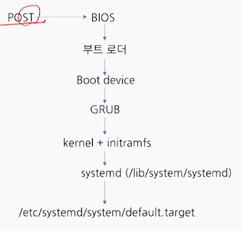
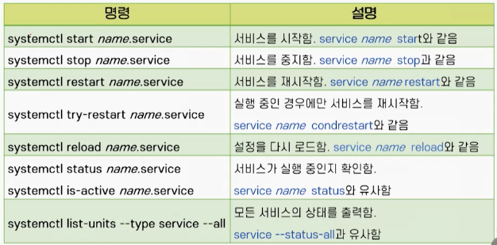
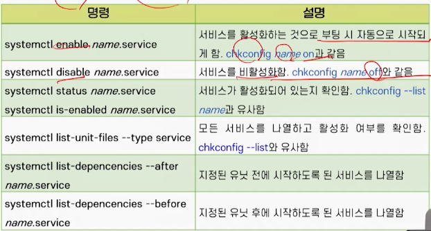
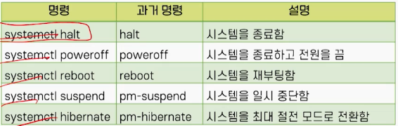

# 5강. 리눅스 시작과 종료

## 1. 운영체제의 부팅

### 부팅과정

> 전원을 켜고 로그인 프롬프트가 나올 때 까지의 과정

1. ROM BIOS의 펌웨어가 실행됨
   - BIOS 기반 x86 컴퓨터를 가정
   - 하드웨어 검사 후, 부트 로더를 적재
2. MBR에 있는 부트 로더가 실행됨
   - 파티션 테이블을 조사하여 부팅 가능한 파티션을 찾음
   - 리눅스 부트로더인 GRUB를 찾아 적재함
   - GRUB는 그래픽 인터페이스와 멀티부팅을 지원
3. 커널 이미지와 initramfs를 로드
   - 커널 이미지는 /boot/vmlinuz-<kernel-version>
   - initramfs는 부팅 과정에서 필요한 임시 파일시스템
4. 커널이 실행됨
5. 하드웨어를 점검하고 초기화함
   - 메모리, 프로세서, 저장장치, 주변장치 등
   - 디바이스를 찾고 디바이스 드라이버를 로드함
6. 루트(/) 파일 시스템을 마운트하고 검사
7. 커널은 /lib/system/systemd 프로그램을 실행시키고 제어를 넘김
   - systemd 프로세스는 시스템 운영을 위한 나머지 초기화 과정을 처리
   - systemd는 부팅이 끝난 후에도 계속 수행됨

### 부팅 과정과 초기화

## 2. 초기화 데몬

### 전통적 init 데몬

- System V init 데몬 이라고도 함
  - **런레벨(runlevel)**에 기초하여 순차적으로 서비스를 실행하는 방식
- 런레벨에 따라 실행되어야 또는 중단되어야 하는 서비스가 정해짐
- 시간이 오래 걸리며, 복잡한 초기화 스크립트로 인해 새로운 하드웨어나 서비스의 등장에 효율적 대처가 어려움

### Upstart init 데몬

- 이벤트 기반으로 서비스를 실행하는 방식
- 복잡한 스크립트가 간단한 설정 파일들로 대체됨
- Upstart는 Ubuntu에서 개발되어 2006년에 포함되었고, RHEL 6에서 채택됨
- systemd 데몬은 2011년 Fedora에서 처음 채택됨
- RHEL 7과 SUSE 및 Ubuntu 16.04 에서 systemd가 Upstart를 대체함

### systemd 프로세스

- 커널이 실행시키는 **첫 번째 사용자 프로세스**
- 모든 사용자 프로세스의 최상위 조상 프로세스(PID가 **1**)
  - `ps -e` 또는 `ps ax` 명령으로 확인
- 나머지 부팅 과정 즉**, 시스템 초기화 작업을 실행**함
  - 초기화 데몬이라고 함
  - **사용자 환경**을 준비함. 파일 시스템의 마운트, 시스템 운영을 위한 서비스 프로그램의 실행 등
  - 서비스들의 **병렬** 시작, 온디맨드 활성화, 서비스 간의 의존성 해결
- 이후 계속 수행되며 시스템 운영을 관리하고 **셧다운까지 처리**함
  - 시스템 상태 모니터링, 데몬 관리
  - 사용자 프로세스의 정리, 로그아웃 처리와 로그인 서비스의 제공 등

### 유닛

- systemd가 관린하는 시스템 자원이나 서비스와 같은 시스템 구성요소
- 유닛의 동작, 의존성, 실행 옵션 등은 '유닛 설정 파일'에서 설정 항목으로 제어됨
- 종류

- 유닛 파일이 존재하는 디렉터리

  

  - systemd 데몬의 동작에 적용되는 기본 설정은 /etc/system/system.conf 파일에 있음

### 기본 타깃과 런레벨

- **기본 타깃(부팅 모드 또는 런레벨)을 확인** 또는 변경하는 명령

  - `systemctl get-default `
  - `systemctl set-default <name.target>`

- 초기 런레벨(기본타깃)은 0 또는 6이 되어서는 안됨

- 타깃과 런레벨의 비교

  

- 현재 타깃을 다른 타깃 유닛으로 바꾸는 관리자 명령
  - `systemctl isolate <name.target>`

### telinit 명령

- 런레벨을 바꾸는 관리자 명령
- telinit runlevel
  - telinit 3은 런레벨을 변경해 텍스트 모드만 지원
  - telinit 0은 종료, telinit 6은 재부팅을 의미

### runlevel 명령

- 이전 런레벨과 현재 런레벨을 확인하는 명령

### 시스템 서비스의 관리

- 과거 서비스 수행을 위한 초기화 스크립트는 서비스 유닛으로 대체됨
- 관리자는 systemctl 명령을 사용하여 시스템 서비스의 상태보기, 시작, 멈춤, 재시작, 활성화 및 비활성화 작업을 수행할 수 있음
- `systemctl [options] command [units]`
  - 서브 명령으로 start, stop, reload, restart, status, enable, disable, is-active, is-enabled 등이 있음

### systemctl 명령

- 서비스 실행과 상태 확인을 위한 명령

  

- 서비스 활성화와 서비스 종속성 확인을 위한 명령

  

### 웹 콘솔의 사용

- 웹 브라우저를 이용해 리눅스 서버를 관리하고 모니터링 하기 위한 도구
- cockpit 패키지 설치 후, 서비스를 활성화/시작시키고, 방화벽 설정을 확인
  - `dnf install cockpit`
  - cockpit은 web interface
- 브라우저로 http://localhost:9090에 접속하여 root 사용자로 로그인함

## 3. 시스템 종료

### 전원 관리 명령

- 호환상의 이유로 shutdown 명령을 계속 사용할 수는 있음
- 가급적 systemctl 명령어를 사용하는 것이 좋음

### shutdown 명령

- 시간을 정해 시스템을 안정하게 종료하는 명령
- shutdown [options] time [message]
- 옵션
  - -r은 재부팅, -c는 예약된 셧다운의 취소(time 인수가 필요 없음)
  - -k는 실제 셧다운을 하는 것처럼 **경고 메시지**만 보냄
  - Shutdown -r +10
- time 인수
  - 종료 시간으로 23:15는 절대 시간 형식, +10은 10분 후 종료를 의미
    - `Shutdown -H 23:15` 또는 `shutdown -P + 10`
    - H - halt, P - power off
  - 인수로 now는 즉시 종료를 의미
    - `shutdown -h now`

### 시스템의 종료 절차

- 실제 systemd 프로세스를 통해 셧다운이 처리됨
  - systemd 프로세스는 모든 프로세스에게 종료를 알림
  - 각 프로세스가 스스로 종료하도록 TERM 시그널을 보냄
  - 종료하지 않은 프로세스에 강제 종료를 위한 KILL 시그널을 보냄
  - 파일 시스템을 잠그고 루트 파일 시스템을 제외한 모든 파일 시스템을 언마운트 함
  - 시스템 호출을 통해 커널에 재부팅 또는 종료를 요청함
- 종료를 위해 halt 명령을, 재부팅을 위해 reboot 명령을 사용할 수도 있음

### 시스템의 일시 중단

- `systemctl suspend`
  - 일시 중단: 시스템 상태를 RAM에 저장하고 저전력 상태로 함
- `systemctl hibernate`
  - 최대 절전모드: 시스템 상태를 하드디스크에 저장하고(RAM이 아니라) 전원을 끔
- `systemctl hybrid-sleep`
  - 하이브리드 슬립: 메모리 외에 디스크에도 시스템 상태를 저장함

## 4. 데스크톱

### 데스크톱

- GUI를 제공하는 사용자 환경
  - 그래픽 윈도우, 아이콘, 툴바, 메뉴, 위젯 등을 마우스나 키보드로 조작
- 대부분의 데스크톱은 X 윈도우 시스템에 기반을 둠
- 시각적으로 다양한 스타일의 데스크톱이 존재
  - 일반적으로 서버로 사용하는 리눅스에서는 명령 행 인터페이스만 제공

### GNOME

- Red Hat 계열 리눅스에서 기본 데스크톱임
- 단순함, 편의성, 안정성에 초점을 맞춤
  - 상단 좌측에 [현재 활동] 버튼 클릭하면 '활동 개요' 화면 등 여러 작업 공간 선택 가능
- 미니멀한 사용자 인터페이스가 특징

### KDE

- K 데스크톱이라고도 하며, MS 윈도우 환경과 유사
- 다양한 프로그램을 통합적인 모습으로 보여줌
- `yum -y groupinstall 'KDE Plasma Workspaces'` 으로 설치 가능
- 로그인 할 때, 'GNOME' 또는 'KDE'를 선택할 수 있음