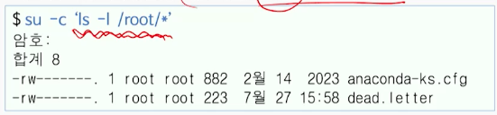
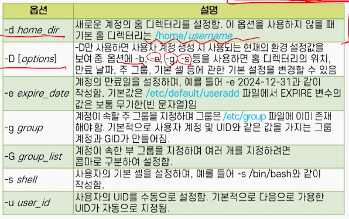

# 6강. 사용자 관리

## 1. 사용자 계정

### 사용자 관리

- 사용자 계정이 있어야 시스템을 사용할 수 있음
  - 리눅스는 다중 사용자를 지원하는 운영체제
  - 사용자명 또는 로그인 아이디라고 함
  - 사용자 계정은 유일한 UID를 가짐
- 관리자 입장에서 사용자 계정별로 접근 권한을 통제할 수 있음
  - 사용자 계정에 따라 부여된 권한이 다름
  - 일반 사용자 계정은 자신의 홈 디렉터리를 제외하면 제한된 권한을 가짐
  - 일반 사용자 계정 외에 root 계정(**UID=0**), 시스템 계정도 있음


### su 명령(1)

- 사용자를 전환시키는 명령

- `su [-[l]] [username]`

  - `su -l jjpark` 또는 `su- jjpark` 또는 `su --login jjpark`은 지정된 사용자의 로그인 셸을 시작시킴
  - root 사용자가 아니라면 지정된 사용자의 암호를 알아야 실행시킬 수 있음
  - `su jjpark`은 단순히 사용자만 바꾸며, 사용자 환경과 작업 디렉터리가 유지됨
  - `su` 또는 `su -l` 과 같이 사용자가 생략되면 root 사용자로 전환됨

  ```shell
  $su -l
  암호: 
  #
  ```


### su 명령(2)

- 1개의 셸 명령을 root 계정으로 실행하는 명령

- `su -c 'command'`

  - root 암호를 알아야 함
  - 여러 단어로 되어 있다면, 명령 부분을 따옴표로 묶어야 함

  


### sudo 명령

- root 또는 다른 사용자가 되어 명령을 실행하기 위한 명령

  - 특정 사용자나 그룹 별로 세세한 권한을 부여할 수 있음
  - 본인의 암호만 필요하며, root 계정의 암호를 요구하지 않음
  - 단, 관리자가 /etc/sudoers 파일에서 누가/어디서/어떤 명령을 수행할 수 있는지.
    즉, 권한을 설정해 둬야 가능함

- sudo [-u username] command

  - 현재 셸에서 수행되므로 명령어 부분에 따옴표가 필요 없음

  - -u 옵션을 사용하면 root 사용자가 아닌 특정 사용자로 수행함

  - sudo -l 은 자신에게 sudo를 통해 허용된 명령을 확인할 수 있음

    ```shell
    $sudo -u jjpark touch ~jjpark/abc
    ```


### /etc/sudoers 파일

- root 사용자가 visudo를 사용해 편집

  - 문법 오류를 검사하고 안전하게 편집할 수 있음

- 기본 문법은 user MACHINE=COMMANDS의 형태

- 예

  


### useradd 명령(1)

- 사용자 계정을 만드는 관리자 명령
- useradd [options] username
  - useradd -c "Jinju Park" jjpark은 jjpark이란 계정을 만듦
  - -c 옵션은 계정의 설명을 주기 위한 것
  - Passed [username] 명령으로 비밀번호를 설정할 수 있음
- useradd -D [options]
  - useradd -D 명령은 계정을 생성할 때 사용되는 홈 디렉터리, 주 그룹, 만료일, 기본 셸 등에 관한 기본 설정을 보여줌
  - 다른 옵션을 함께 사용해 기본 설정을 변경할 수 있음


## 2. 사용자 계정 만들기


### useradd 명령(2)




### 사용자 계정의 생성 절차

- `/etc/login.defs` 파일과 `/etc/default/useradd` 파일을 읽어서 사용자 계정 생성과 관련된 기본값을 확인
- `useradd` 명령어에서 주어진 옵션을 검사해 기본값을 대체할 것인지 확인
- `/etc/passwd` 파일과 `/etc/shadow` 파일에 새로운 사용자 계정에 해당하는 항목을 생성
- `/etc/group` 파일에 새로운 그룹에 해당하는 항목을 추가
- `/home/` 디렉터리에서 사용자 계정의 홈 디렉터리 `/home/username`을 생성
- `/etc/skel` 디렉터리에 있는 파일을 사용자 계정의 홈 디렉터리에 복사


### /etc/passwd 파일

- 사용자 계정에 관한 정보를 가진 텍스트 파일
  - 라인 별로 사용자 계정의 정보가 저장됨
  - 계정의 생성이나 수정을 위해 직접 수정하는 것은 좋지 않음
- 각 라인은 콜론(:)으로 구분되는 7개의 필드를 가짐
- 사용자계정:암호:UID:GID:설명:홈디렉터리:기본셸


### /etc/skel 디렉터리

- 사용자 홈 디렉터리에 복사되는 파일들을 가짐
- `.bash_profile`, `.bashrc`, `.bash_logout` 등

## 3. 사용자 계정 수정


## 4. 그룹 계정과 관리


## 5. 사용자 관리를 위한 GUI