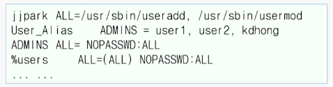

# 6강. 사용자 관리

## 1. 사용자 계정

### 사용자 관리

- 사용자 계정이 있어야 시스템을 사용할 수 있음
  - 리눅스는 다중 사용자를 지원하는 운영체제
  - 사용자명 또는 로그인 아이디라고 함
  - 사용자 계정은 유일한 UID를 가짐
- 관리자 입장에서 사용자 계정별로 접근 권한을 통제할 수 있음
  - 사용자 계정에 따라 부여된 권한이 다름
  - 일반 사용자 계정은 자신의 홈 디렉터리를 제외하면 제한된 권한을 가짐
  - 일반 사용자 계정 외에 root 계정(**UID=0**), 시스템 계정도 있음


### su 명령(1)

- 사용자를 전환시키는 명령

- `su [-[l]] [username]`

  - `su -l jjpark` 또는 `su- jjpark` 또는 `su --login jjpark`은 지정된 사용자의 로그인 셸을 시작시킴
  - root 사용자가 아니라면 지정된 사용자의 암호를 알아야 실행시킬 수 있음
  - `su jjpark`은 단순히 사용자만 바꾸며, 사용자 환경과 작업 디렉터리가 유지됨
  - `su` 또는 `su -l` 과 같이 사용자가 생략되면 root 사용자로 전환됨

  ```shell
  $su -l
  암호: 
  #
  ```


### su 명령(2)

- 1개의 셸 명령을 root 계정으로 실행하는 명령

- `su -c 'command'`

  - root 암호를 알아야 함
  - 여러 단어로 되어 있다면, 명령 부분을 따옴표로 묶어야 함

  


### sudo 명령

- root 또는 다른 사용자가 되어 명령을 실행하기 위한 명령

  - 특정 사용자나 그룹 별로 세세한 권한을 부여할 수 있음
  - 본인의 암호만 필요하며, root 계정의 암호를 요구하지 않음
  - 단, 관리자가 /etc/sudoers 파일에서 누가/어디서/어떤 명령을 수행할 수 있는지.
    즉, 권한을 설정해 둬야 가능함

- sudo [-u username] command

  - 현재 셸에서 수행되므로 명령어 부분에 따옴표가 필요 없음

  - -u 옵션을 사용하면 root 사용자가 아닌 특정 사용자로 수행함

  - sudo -l 은 자신에게 sudo를 통해 허용된 명령을 확인할 수 있음

    ```shell
    $sudo -u jjpark touch ~jjpark/abc
    ```


### /etc/sudoers 파일

- root 사용자가 visudo를 사용해 편집

  - 문법 오류를 검사하고 안전하게 편집할 수 있음

- 기본 문법은 user MACHINE=COMMANDS의 형태

- 예

  


### useradd 명령(1)

- 사용자 계정을 만드는 관리자 명령
- useradd [options] username
  - useradd -c "Jinju Park" jjpark은 jjpark이란 계정을 만듦
  - -c 옵션은 계정의 설명을 주기 위한 것
  - Passed [username] 명령으로 비밀번호를 설정할 수 있음
- useradd -D [options]
  - useradd -D 명령은 계정을 생성할 때 사용되는 홈 디렉터리, 주 그룹, 만료일, 기본 셸 등에 관한 기본 설정을 보여줌
  - 다른 옵션을 함께 사용해 기본 설정을 변경할 수 있음


## 2. 사용자 계정 만들기


### useradd 명령(2)


### 사용자 계정의 생성 절차

- `/etc/login.defs` 파일과 `/etc/default/useradd` 파일을 읽어서 사용자 계정 생성과 관련된 기본값을 확인
- `useradd` 명령어에서 주어진 옵션을 검사해 기본값을 대체할 것인지 확인
- `/etc/passwd` 파일과 `/etc/shadow` 파일에 새로운 사용자 계정에 해당하는 항목을 생성
- `/etc/group` 파일에 새로운 그룹에 해당하는 항목을 추가
- `/home/` 디렉터리에서 사용자 계정의 홈 디렉터리 `/home/username`을 생성
- `/etc/skel` 디렉터리에 있는 파일을 사용자 계정의 홈 디렉터리에 복사


### /etc/passwd 파일

- 사용자 계정에 관한 정보를 가진 텍스트 파일
  - 라인 별로 사용자 계정의 정보가 저장됨
  - 계정의 생성이나 수정을 위해 직접 수정하는 것은 좋지 않음
- 각 라인은 콜론(:)으로 구분되는 7개의 필드를 가짐
- 사용자계정:암호:UID:GID:설명:홈디렉터리:기본셸
  - gyumin​\:x:1000:1000:Gyumin Lee:/home/gyumin:/bin/bash


### /etc/skel 디렉터리

- 사용자 홈 디렉터리에 복사되는 파일들을 가짐
- `.bash_profile`, `.bashrc`, `.bash_logout` 등


### /etc/shadow 파일

- 사용자 계정의 암호 정보와 '패스워드 에이징' 정보를 가짐
- 각 라인은 아래와 같은 라인을 가짐
  - gyumin:$6$w8j<중간생략>:19585:0\:100:7:10:19722
- 필드의 의미
  - 사용자 계정:암호화된 비밀번호:최종비밀번호변경일
  - 0은 비밀번호 변경 후 바꿀 수 없는 기간(minimum password age)
  - 100은 비밀번호 변경 후 다시 변경하지 않고 사용할 수 있는 기간. 최대 기간(max password age)은 99999
  - 7은 비밀번호 만료일 전에 경고를 보내는 날짜 수(password warning period)
  - 10은 비밀번호의 만료 후 로그인이 가능한 날짜 수(password inactivity period)
  - 사용자 계정의 만료일(account expiration date)로 빈 값은 계정이 만료되지 않는다는 것
  - 예약 필드


### chage 명령

- 사용자의 비밀번호 만료에 관한 정보를 변경하는 관리자 명령

- chage [options] username

  - chage -l username으로 계쩡의 패스워드 에이징 정보를 확인함

- 옵션

  - `-l days`은 비밀번 만료 후 비활성화 되기 전까지의 날짜 수(-1은 사용하지 않음)
  - `-m days`와 `-M days`는 각각 비밀번호의 최소(0은 즉시 수정 가능)와 최대 사용 날짜 수(99999는 최대 날짜 수)
  - `-d date`는 비밀번호의 마지막 변경 날짜를 수정
  - `-E date`는 사용자 계정의 만료일을 지정(-1은 사용하지 않음)

  


### 사용자 계정의 기본 설정(1)

- 사용자 계정을 생성할 때 필요한 기본값을 정의한 파일

  - /etc/login.defs
    - 각 라인은 키워드와 값으로 구성됨
      - UID_MIN 과 UID_MAX는 UID를 자동 할당할 때 유효 범위를 지정
      - USERGROUPS_ENAB은 사용자 계정과 같은 이름의 그룹을 자동으로 만들지를 지정

  


### 사용자 계정의 기본 설정(2)

- useradd 명령이 참조하는 기본값을 설정한 파일

- /etc/default/useradd 파일

  - GROUP은 (자동 생성을 안 할 때) 사용자 계정의 주 그룹을 지정

  - 홈 디렉터리의 생성 위치와 셸의 종류 지정

  - INACTIVE가 0이면 비밀번호 만료 후 즉시 계정을 비활성화, -1이면 기능을 사용하지 않는 것

  - EXPIRE 값이 없으면 계정의 만료일이 없는 것

    


## 3. 사용자 계정 수정

### usermod 명령

- 사용자 계정의 정보를 수정하는 관리자 명령

- User mod [options] username

  - 많은 옵션이 useradd 명령과 유사함
  - usermod -g root gyumin은 주어진 사용자의 주 그룹을 root 그룹으로 변경함
  - id username 명령은 주어진 사용자의 uid와 gid 정보를 출력함

- 옵션

  


### userdel 명령

- 사용자 계정을 삭제하는 관리자 명령
- /etc/passwd 파일에서 해당 라인을 삭제함
- userdel [options] username
- 옵션
  - -r은 홈 디렉터리와 파일을 함께 삭제하고 메일 스풀도 삭제함
  - -f는 로그인 중이거나 다른 사용자가 사용 중이어도 삭제하며, 같은 이름의 그룹도 삭제함


### 사용자 게정 삭제 시 고려사항

- 홈 디렉터리도 삭제할 것인가
- 계정을 삭제하지 말고 잠금할 것인가
- 삭제될 계정이 소유하는 파일이 또 있는가
  - 삭제 전에 find / -user username -ls 로 확인해야 함
  - 삭제 후라면 find / -uid UID -ls 또는 find / -nouser -ls로 확인함


## 4. 그룹 계정과 관리

### 그룹 계정

- 사용자의 계정들을 모아서 하나의 집합을 이루는 개념

- 일반 사용자는 bin, mall, sys 등의 '시스템 그룹 계정'에는 포함될 수 없음
- 사용자 계정을 만들 때 주 그룹(기본 그룹)이 지정됨
  - 기본적으로 사용자 계정과 같은 이름으로 그룹 계정이 만들어짐
- 사용자 계정은 0개 이상의 부 그룹에 속할 수 있음


### groupadd 명령

- 그룹 계정을 만드는 관리자 명령
  - 그룹도 계정 이름과 GID 가짐
- groupadd [options] group
- 옵션
  - -g gid는 수동으로 GID를 지정
  - -r은 시스템 그룹 계정을 생성
  - -o는 -g 옵션과 함께 사용할 때 기존 그룹의 GID를 사용하는 것


### /etc/group 파일

- 그룹 계정의 정보를 가진 텍스트 파일
  - 라인마다 그룹 계정의 정보가 저장됨
- 각 라인은 콜론(:)으로 구분되는 4개의 필드를 가짐
  - 그룹이름:그룹비밀번호:GID:구성원리스트
  - Sales​\:x:1005gyumin,jjpark
- 암호화된 비밀번호는 /etc/gshadow에 저장됨
- 사용자 계정의 부 그룹을 추가하는 방법
  - usermod -G groups -a username
- 사용자가 자신의 그룹을 확인하는 방법
  - id username
  - groups username


### 사용자 계정과 그룹 및 파일의 접근권한

- 사용자가 파일이나 디렉터리를 생성하면 그것의 소유 그룹은 사용자의 주 그룹으로 지정됨
- 사용자는 0개 이상의 부 그룹에 속할 수 있음
- 사용자 스스로 다른 그룹의 구성원이 되게 할 수는 없음
  - 관리자라면 gpasswd -a user group로 구성원을 추가할 수 있음
- newgrp group을 실행하면 일시적으로 자신의 주 그룹을 변경할 수 있음
  - 자신이 속해 있는 그룹 중에서 지정해야 함
  - 그룹 계정의 비밀번호를 알고 있다면 다른 그룹으로도 지정 가능
  - 단순히 newgrp를 실행하면 원래 주그룹으로 되돌아감


### gpasswd 명령

- 그룹의 관리를 위한 명령
  - 그룹의 관리자가 사용함
- glassed [options] group
  - 옵션을 사용하지 않으면 그룹의 비밀번호를 설정하는 것
  - 옵션을 사용하면 그룹의 구성원을 변경함
- 옵션
  - -a user는 구성원 추가, -A users는 그룹의 관리자를 지정
  - -d user는 구성원 삭제, -M users는 구성원 설정
  - -r은 비밀번호 삭제


### groupmod

- 기존 그룹의 정보를 수정하기 위한 명령
  - 그룹의 관리자가 사용함
- groupmod [options] group
  - -g gid을 사용하여 GID를, -n name은 그룹 이름을 변경함

### groupdel

- 그룹을 삭제하는 관리자 명령
  - 그룹 계정 관련 파일에서 해당 라인을 삭제
  - 사용자 계정의 주 그룹으로 되어 있는 경우, 삭제할 수 없음
- groupdel group


## 5. 사용자 관리를 위한 GUI

### 사용자 관리 도구


- 데스크톱 메뉴에서 [현재 활동] > 프로그램 표시 > 설정 을 실행
- 설정 창의 왼쪽 메뉴에서 [사용자]를 선택
- [잠금 해제] 버튼을 클릭하고 root 계정의 비밀번호를 입력
- 새로운 사용자를 추가하거나 기존 사용자 계정의 등록 정보를 수정할 수 있음


