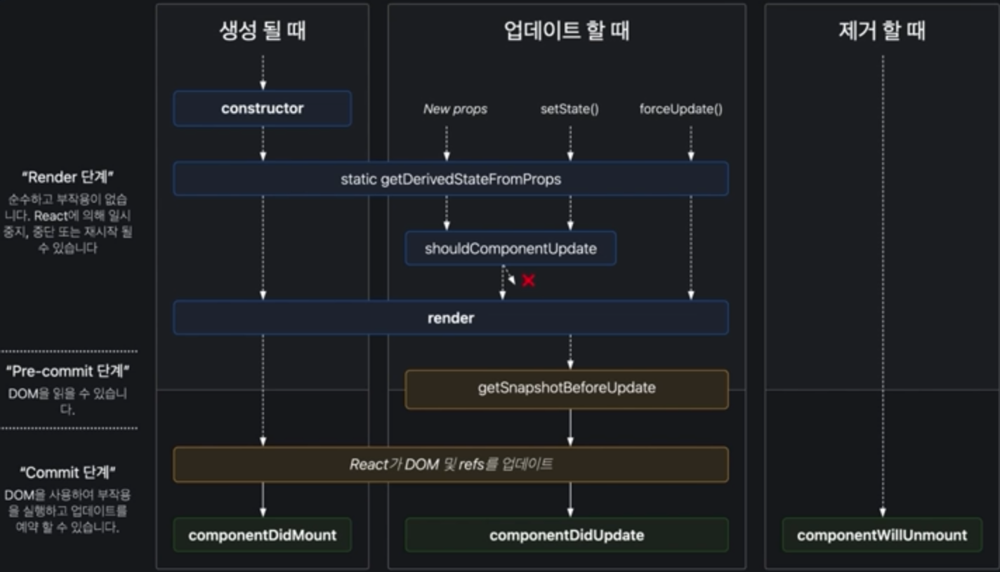
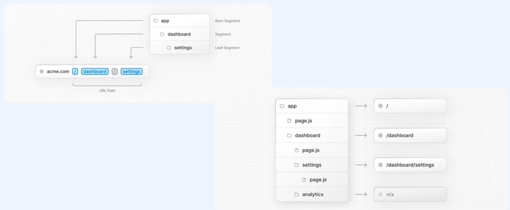

# [Course1] 프로젝트를 시작하기 전에

##  React 주요 개념 소개

### 1. React란?

> 사용자 인터페이스를 위한 라이브러리

- 라이브러리
  - 라이브러리는 주로 소프트웨어를 개발할 때 컴퓨터 프로그램이 사용하는 비휘발성 자원의 모임
  - 특정 프로그래밍에서 자주 사용되는 기능들을 묶어 놓은 것
- 사용자 인터페이스
  - 사람과 사물 또는 시스템, 기계, 컴퓨터 프로그램 사이에서 의사소통을 할 수 있도록 만들어진 가상적 매개체
  - 즉, View


### 2. 왜 React를 사용해야 하는가

- HTML + CSS + JS를 사용했을 때 보다 더 직관적이고 간결하게 표현이 가능
- 재사용성, 생산성 및 유지보수를 용이하게 함
  - 컴포넌트를 잘 활용한다면, 독립적이며 재사용가능한 개발이 가능
- 가상돔:  React의 가상돔으로 브라우저 내 발생하는 연산을 줄여 성능 개선
  - 돔을 추상화 시킨 자바스크립트 객체를 이용해 빠르게 비교할 수 있도록 도움
  - React에서 interaction이 발생시, 가상돔에 먼저 그려놓고 실제 돔과 비교해 변경된 부분만 적용
  - 따라서 속도가 빨라짐
- 단방향 데이터 흐름
  - 오직 부모에서 자식으로만 데이터가 흐름(자식이 부모 구성요소에 영향 X)
  - 따라서 안정성이 있고, 일관성 유지


### 3. React의 주요 개념 소개

#### (1) 컴포넌트

- 리액트 앱을 이루는 최소한의 단위
  - 재사용 용이


#### (2) JSX

- JavaScript의 확장 문법
  - XML과 유사

- 예시

  ```javascript
  // REACT JSX로 개발하면,
  function App() {
    return(
    <div>
      Hello <b>react</b>
    </div>
    );
  }
  ```

  ```javascript
  // 자바스크립트로 변환되어 작동
  function App() {
  	return (
  		React.createElement("div", null, "Hello")
  		React.createElement("b", null, "react")		
  	);
  }
  ```


#### (3) Lifecycle



- Lifecycle API
  - 생애주기(Lifecycle) 특정 주기마다 사용가능한 API

- 생성(Mount) / 갱신(Update) / 파기(Unmount)


#### (4) Props(Properties)

- 컴포넌트에 전달되는 읽기 전용 속성
- 부모컴포넌트에서 자식컴포넌트로 전달
- 리액트 컴포넌트는 props를 받아 element를 반환


#### (5) State

- 상태
- 컴포넌트의 속성값을 저장, 변경할 수 있는 객체
- 컴포넌트의 메모리(공식문서 설명)
  - 컴포넌트 내부에 변수처럼 선언되어 관리
  - 상태값을 효율적으로 관리하고, 상태값에 따라서 화면이 불필요하게 업데이트되지 않도록 관리하는 것이 중요


#### (6) SPA

- Single Page Application: 한 개의 페이지로 이루어진 애플리케이션

- 변화가 필요한 부분만 JS 및 데이터 API 호출로 업데이트

  - 서버에서 사용자에게 제공하는 페이지는 단 하나지만, 해당 페이지에서 로딩된 자바스크립트와 사용자의 주소에 따라 다양한 화면을 보여줄 수 있음

  


#### (7) React Hooks

- React 16.8부터 추가

- 함수형 컴포넌트에서도 클래스형 컴포넌트 기능 사용할 수 있게 한 기술

  - 함수현 컴포넌트에서는 할 수 없었던 상태값 관리(useState), 컴포넌트 생명주기 함수(useEffect)

- 규칙 2가지

  - 최상위 레벨에서만 훅을 호출해야 함(반복문, 조건문, 중첩함수 내에서는 hook 실행 불가)
  - 리액트 함수 내에서만 호출(일반 자바스크립트에서는 불가능)

- `useState`

  - 상태를 관리할 수 있는 hook

  ```javascript
  import React, { useState } from 'react';
  
  function Example() {
    const [count, setCount] = useState(0);
    
    return(
    	<div>
      	<p>You clicked {count} times</p>
  			<button onClick={() => setCount(count + 1)}>
    			Click me
    		</button>
      </div>
    );
  }
  ```

- `useEffect`

  - Side effect를 수행할 수 있는 hook
  - 리액트 컴포넌트 안에서 데이터를 가져오거나, 구독, 돔을 직접 조작하는 모든 행위

  ```javascript
  import React, { useState } from 'react';
  
  function Example() {
    const [count, setCount] = useState(0);
    
    // useEffect를 통해 component가 렌더링 이후에 어떤 행동을 해야하는지 알려줌
    useEffect(() => {
      document.title = `You clicked ${count} times`;
    });
    
    return(
    	<div>
      	<p>You clicked {count} times</p>
  			<button onClick={() => setCount(count + 1)}>
    			Click me
    		</button>
      </div>
    );
  }
  ```

- `useMemo`

  - 메모이제이션된 값을 반환하는 hook
  - 기존에 수행한 연산의 결과값을 어딘가에다 저장해 놓고, 동일한 입력이 들어오면 재활용.
  - 중복 연산을 피할 수 있으므로,  연산된 값을 재사용하느라 메모리를 조금 더 쓰더라도 어플리케이션 성능 최적화가 가능
  - 리액트에서는 컴포넌트가 여러 번 렌더링 될 수 있는데, 렌더링 될 떄마다 함수를 호출해 반복적으로 연산
    - 이 때 useMemo 사용시 재사용 가능

  ```javascript
  const memoizedValue = useMemo(
  	() => computeExpensiveValue(a, b), // function
    [a,b]); // deps
  ```

- `useContext`

  - context 값을 가져오는 hook
  - context란 부모가 자식 컴포넌트에 props를 하나하나 순서대로 넘겨주지 않고도, 컴포넌트 트리 전체에 데이터를 전달할 수 있게 하는 기능
    - 전역상태관리를 할 수 있을 때 사용
    - 단, useContext를 호출한 컴포넌트는 context값이 변경되면 항상 리렌더링이 되기 떄문에 필요한 파일에만 사용

  ```javascript
  const value = useContext(MyContext)
  ```

  


##  Next.js 주요 개념 소개

### 1. Next.js란?

>  웹을 위한 React **프레임워크**

- 프레임워크와 라이브러리의 차이

  

  - 프로그래밍 흐름에 제어 권한의 주체가 다르다
    - 프레임워크의 경우, 흐름의 제어 권한을 가지고 있음
      - 프레임워크에 따라 개발해야 하는 규칙들 존재
    - 라이브러리의 경우, 개발자가 주체가 되어 흐름 제어


### 2. 왜 Next.js를 사용해야하는가

1. 사전 렌더링(Pre-Rendering)
2. 자동 코드 분할(Code-Splitting)
3. API Routes
4. 자동 최적화(Built-in Optimization)
5. 미들웨어(Middleware)
6. Routing & Layout


#### (1) 사전 렌더링

-  미리 HTML 페이지를 만들어 놓고 클라이언트가 서버에 요청시 빠르게 화면을 그려주는 것
- 장점
  - 페이지 로딩 속도가 빨라짐
  - 검색 엔진(SEO) 최적화

#### (2) 자동 코드 분할

- 각 페이지별 필요한 코드를 작은 청크로 프로그의 번들을 분할하는 과정
- Next.js는 이러한 코드 분할을 자체적으로 지원
  - 각 파일들이 빌드하는 동안 자체적인 자바스크립트 번들로 자동코드분할 함
  - 페이지 실행할 때 꼭 필요한 코드들만 가져오도록 해 초기 로딩 시간을 향상시킴
- 지연 로딩(lazy-loading) 할 수 있도록 도와줌
  - 사용자에게 향상된 성능 제공 가능
  - 불필요한 코드가 페이지에 로드되지 않음

 #### (3) API Routes

- JavaScript만으로 API 사용 가능

#### (4) 빌트인 최적화

- Next.js는 설정을 따로 하지 않아도 자동으로 이미지, 폰트, 스크립트 등 여러 기능을 최적화 해 줌
- 개발 생산성 향상, 더 나은 유저 경험 및 성능 

#### (5) 미들웨어

- 특정 요청 하기 전 어떤 행동을 하고 싶을 때 미들웨어로 제어 가능
  - 특정 페이지는 로그인 된 사용자만 접근할 수 있도록 하고싶다면, 미들웨어에 인증이 필요한 페이지 경로만 정의해주면 요청이 끝나기 전에 검증하는 로직을 추가 가능

#### (6) Routing & Layout

- React에서는 React-router-dom 이라는 라이브러리를 따로 사용해야 함
- Next.js에서는 File system을 기반으로 라우팅을 사용
  - 폴더 경로에 따라 페이지 경로가 자동으로 설정됨
  - 관리가 편리
- Next.js 13에서 Layout 기능 내장
  - 각 페이지별 공통된 레이아웃을 설정하지 않아도, 레이아웃 파일만 이용하면 전체적으로 레이아웃 적용이 가능


### 3. Next.js 주요 개념 소개

#### (1) SSR

- Server Side Rendering(SSR)
  - 요청이 올 때마다 해당 HTML 문서를 생성해 반환. 즉, 사이트에 접속하면 미리 렌더링 된 HTML를 불러옴
  - 페이지 데이터가 항상 최신의 상태를 유지할 수 있음
  - 페이지가 동적이기 때문에, 사용자와 interactive 한 반응을 할 수 있다
- Static Site Generation(SSG)
  - 빌드 타임에 각 HTML 페이지를 미리 생성 요청하면 미리 생성된 페이지 반환
  - 공식 문서에서는 SSG를 추천
  - 요청에 따라 계속 서버에서 재생성하는 것이 아니라, 이미 생성이 완료된 스태틱한 페이지 하나를 반환 - 따라서 응답 속도가 더 빨라짐
  - SSR과 달리, 서버사이드에 계쏙 요청한다고 해서 페이지 내용이 달라지지 않음
  - 수정이 많지 않은 FAQ와 같이 정적 생성해서 각 요청에 대해서 동일한 내용과 동일한 문서를 반환하는 경우 SSG를 사용

#### (2) SEO

- Search Engine Optimization(SEO)
  - 내 사이트를 검색 엔진 결과에 잘 노출 시킬 수 있도록 최적화 하는 것
  - SSR, SSG의 경우 미리 HTML을 그려놓기 때문에 비어있지 않으므로, 검색 엔진 결과 노출에 유리

#### (3) 라우팅

- Next.js는 파일 시스템(pages) 기반 라우팅 가능

- 파일 경로가 즉 url이 되므로 관리가 편함

- NextLink라는 링크컴포넌트 사용해 client-side navigation도 사용가능

- Next.js13에서 app기반 라우팅도 추가

  

  - 공식문서 권장