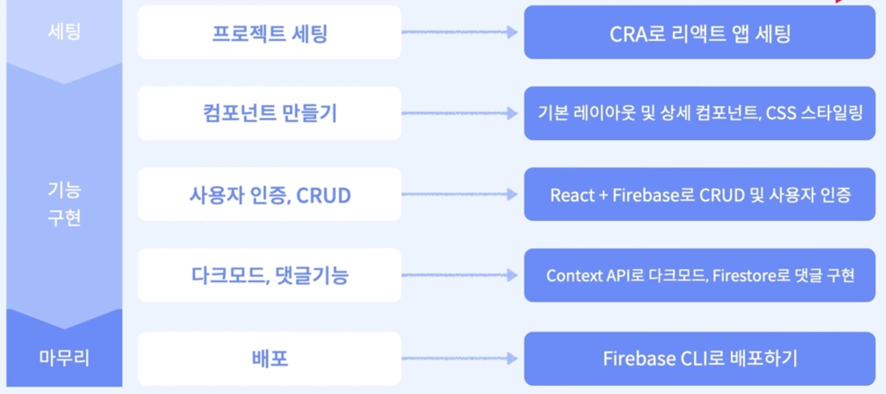
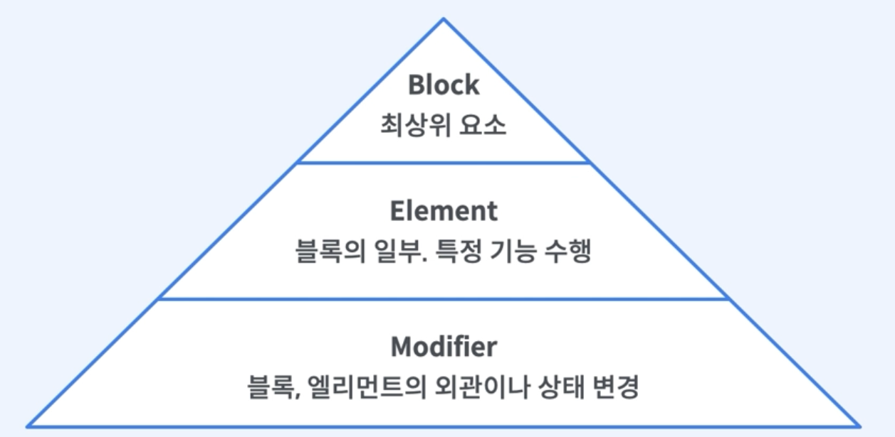

# [Course1] 블로그 앱 프로젝트

## 프로젝트 개요

### 1. 프로젝트 개요 및 목적

#### 프로젝트 개요

- React 앱의 구조와 라우팅을 이해하고, 직접 프로젝트 설계
- Firebase의 기본 개념을 익히고 CRUD 원리를 이해
- Firebase로 사용자 인증 구현, 간단한 쿼리 적용 등 심화 기능 적용
- 전역 상태 관리의 필요성과 context API 사용법 이해
- 스타일링 방법론을 알아보고, 직접 스타일링 적용


#### 사용기술

- create-react-app
- React-router-dom
- Firebase auth를 이용한 사용한 인증
- Firebase FIrestore를 이용한 CRUD
- css BEM(Block, Element, Modifier)구조
- Context API를 이용한 상태관리(다크모드, 사용자 인증)
- Firebase CLI로 배포


#### 흐름도




### 2. 완성 프로젝트 미리보기

- 서비스 주소: https://react-blog-6fd95.web.app/
- github: https://github.com/jen-frontend/fastcampus-react-blog


### 3. 프로젝트 구조

#### 라우팅

- /
- /login
- /signup
- /profile
- /posts
- /posts/[id]
- /posts/new
- /posts/edit/[id]


#### 컴포넌트

- Carousel
- Header
- Loader
- Footer
- PostFrom
- SignupForm
- LoginForm
- PostDetail
- PostList
- Profile
- Comments


#### 폴더 구조

- src안에  pages, component
- components: 공통 컴포넌트
- context: 사용자 인증, 다크모드 상태 관리
- interface: 타입 인터페이스
- pages: 페이지
- firebaseApp: 파이어베이스 설정


## 프로젝트 세팅

### 1. Create-react-app 주요 개념 설명

#### 개요

- Create React App: 한 번에 React 개발 환경을 구성해주는 환경
  - Meta에서 만든 보일러플레이트
- 장점
  - 하나의 명령어로 손쉽게 세팅 가능
  - 초기 개발 시간 단축, 갭라 생산성 향상
  - React 앱 개발에만 집중 가능(babel, webpack 등 심화된 관리 X)
- 단점
  - 빌드 설정을 커스터마이징하기 어려움
  - 리액트 앱 구조에 대해 이해하기 어려울 수 있음
  - 원하지 않는 dependencies로 앱이 무거울 수 있음


#### create-react-app 구조

- `node_modules` : 패키지 모듈 저장되는 디렉터리(커밋X)
- `package.json` : 의존 모듈 정보를 json 형태로 저장. 설치한 모듈에 대한 버전 관리
- `public` : static 파일 저장 디렉터리
  - `public/index.html` : 리액트 앱을 브라우저에 나타냄(페이지 템플릿)
  - `public/favicon.ico` : 브라우저 탭 아이콘
- `src` : 개발이 이루어지는 작업 공간(실제로 webpack은 src안의 파일만 실행. js, jsx, css 등 소스 코드)
  - `src/App.css` : 앱이 실행되는 메인 코드 및 스타일(JSX)
  - `src/App.js` 
  - `src/App.test.js`
  - `src/index.css` : index.js 컴포넌트 스타일링을 위한 css 파일
  - `src/index.js` : App.js의 App 컴포넌트와 public/index.html 연결
  - `src/log.svg`


#### react 설치 방법

(1) yarn을 사용해서 프로젝트 설치

- 자바스크립트 패키지 매니저: 프로젝트 패키지 의존성을 관리해주는 툴

- Node >= 14 필요

- node.js 및 yarn 설치 후 아래 커맨드 입력

  ```cmd
  yarn create react-app fastcampus-react-blog --template typescript
  ```

  

### 2. Create-react-app 세팅

#### Node.js 설치

- https://nodejs.org/en/download

- LTS 버전 설치

- 설치 후 버전체크

  ```cmd
  node -v
  ```


#### Yarn 설치

https://classic.yarnpkg.com/lang/en/docs/install

- 자바스크립트 패키지 매니저: 프로젝트 패키지 의존성을 관리
- npm과 비교
  - 성능, 보안 향상
  - npm은 패키지를 순서대로 설치하지만, yarn은 병렬로 설치해서 설치 속도가 빠름
- 캐싱 사용해서 두 번째 인스톨 부터는 패키지 설치 속도가 더 빨라짐 


#### CRA(create-react-app) 설치

```cmd
yarn create react-app fastcampus-blog-app --template typescript
```

```cmd
cd fastcampus-blog-app
```


### 3. Create-react-dom 설명

- React-router-dom

  - React 앱의 라우팅 처리를 위한 라이브러리

- 사용하는 이유

  - 쉬운 설치와 설정
  - 선언적인 라우팅
    - 컴포넌트 기반으로 라우팅 정의 가능
    - 코드의 가독성 및 유지보수성 높임
  - 다양한 라우팅 기능
    - 링크, 중첩된 라우팅, 동적 경로 등 복잡한 라우팅 처리 가능

- `BrowserRouter`로 App 컴포넌트 감싸서 라우팅 활성화

- `Route`로 경로와 해당 경로에 대응하는 컴포넌트 정의

- `Link`로 다른 경로로 이동하는 링크 생성

- 예제

  ```javascript
  import { BrowserRouter as Router, Route, Link } from 'react-router-dom';
  const App = () => {
    return (
    	<Router>
      	<div>
      		<Link to="/">Home</Link>
      	</div>
      	<Route exact path="/" component={Home}/>
      </Router>
    )
  }
  ```

  

### 4. react-router-dom을 이용한 라우팅 실습

- React-router-dom install

```cmd
yarn add react-router-dom
```

- Typescript

```cmd
yarn add @types/react-router-dom
```

- `index.tsx`

  ```javascript
  import { BrowserRouter as Router } from "react-router-dom";
  
  const root = ReactDOM.createRoot(
    document.getElementById("root") as HTMLElement
  );
  root.render(
    <React.StrictMode>
      <Router> // Router
        <App />
      </Router>
    </React.StrictMode>
  );
  ```

  


## 컴포넌트 만들기

### 컴포넌트란?

- 컴포넌트란?

  - 리액트 앱을 구성하는 최소한의 단위
  - 즉, 애플리케이션의 구성 요소를 담당하며, 재사용 가능하고 독립적인 단위로 구성

- 클래스 컴포넌트 vs 함수 컴포넌트

  - 클래스 컴포넌트: ES6 클래스 사용해서 정의, render() 메서드로 UI 반환, 생명주기 메서드 기능 제공, 상태관리 기능 제공
  - 함수 컴포넌트: JavaScript 함수로 정의, JSX로 반환, react-hook 사용하여 생명주기 기능 활용
    - 좀 더 간단하고 명료한 문법으로 컴포넌트 작성 가능

- 컴포넌트의 장점

  - 재사용성
    - 독립적이고 모듈화된 단위로 작성되어, 필요한 곳에서 쉽게 재사용 가능
  - 가독성과 유지보수성
    - UI구조 명확하게 파악 가능
    - 개별 컴포넌트를 수정하여 유지보수 용이
  - 효율적 업데이트
    - 가상 DOM을 활용해, 필요한 부분만 다시 렌더링해 효율적으로 업데이트 가능

- 컴포넌트 예시

  ```javascript
  import React from 'react';
  
  const HelloWorld = () => {
    return <div>Hello, World!</div>
  }
  
  export default HelloWorld
  ```

  ```javascript
  import React from 'react'
  import HelloWorld from './HelloWorld';
  
  const App = () => {
    return (
    	<div>
      	<h1>My App</h1>
      	<HelloWorld /> // component
      </div>
    )
  }
  ```


### css의  BEM모델

- BEM이란?

  - Block-Element-Modifier모델: CSS 클래스 네이밍. 가독성, 재사용성이 높음

    

- BEM모델의 장단점

  - 장점
    - 가독성: 클래스명에 구조적인 정보를 담아 코드를 읽기 쉽게 함
    - 재사용성: 모듈화된 구조로 컴포넌트의 재사용 쉬움
    - 유지보수성: 클래스간의 의존성 낮춤
  - 단점
    - 클래스명이 길어질 수 있음 
    - 요소 및 수정자 사용을 위해 추가적인 클래스 작성 필요

- BEM 모델 사용 예시

  ```html
  <div class="block"> <!-- Block -->
    <h2 class="block__title">Block Title</h2>  <!-- Element(__title) -->
      <ul class="block__list">  
        <li class="block__list-item">Item 1</li>
        <!-- Modifier(--highlighted) -->
        <li class="block__list-item block__list-item--highlighted">Item 2</li>
        <li class="block__list-item">Item 3</li>
      </ul>
  </div>
  ```

  ```css
  /* Block */
  .block {
    background-color: #f2f2f2;
    padding: 20px;
  }
  
  /* Element */
  .block__title {
    font-size: 20px;
    margin-bottom: 10px;
  }
  
  .block_list {
    list-style: none;
    padding: 0;
  }
  
  .block__list-item {
    padding: 5px 10px;
  }
  
  /* Modifier */
  .block__list-item--highlighted {
    background-color: yellow;
    font-weight: bold;
  }
  ```

  


## 사용자 인증 구현


## 게시판 CR(Create, Read) 구현


## 게시판 UD(Update, Delete) 구현


## 다크모드 구현


## 댓글 기능 구현


## 보안 확인하기


## 배포하기


