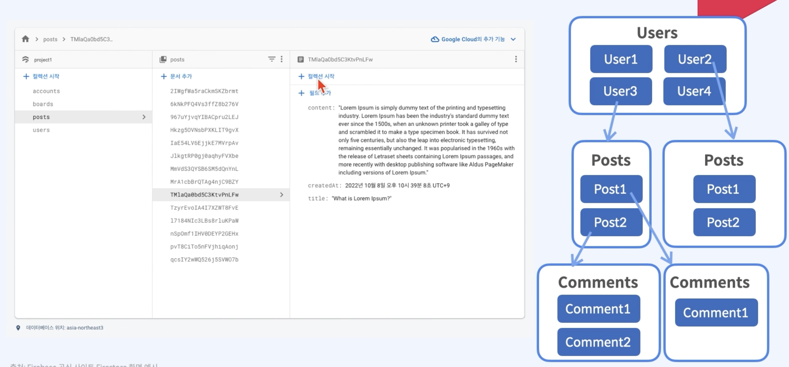

# [Course1] 블로그 앱 프로젝트

## 1️⃣ 프로젝트 개요

### 1. 프로젝트 개요 및 목적

#### 프로젝트 개요

- React 앱의 구조와 라우팅을 이해하고, 직접 프로젝트 설계
- Firebase의 기본 개념을 익히고 CRUD 원리를 이해
- Firebase로 사용자 인증 구현, 간단한 쿼리 적용 등 심화 기능 적용
- 전역 상태 관리의 필요성과 context API 사용법 이해
- 스타일링 방법론을 알아보고, 직접 스타일링 적용


#### 사용기술

- create-react-app
- React-router-dom
- Firebase auth를 이용한 사용한 인증
- Firebase FIrestore를 이용한 CRUD
- css BEM(Block, Element, Modifier)구조
- Context API를 이용한 상태관리(다크모드, 사용자 인증)
- Firebase CLI로 배포


#### 흐름도


### 2. 완성 프로젝트 미리보기

- 서비스 주소: https://react-blog-6fd95.web.app/
- github: https://github.com/jen-frontend/fastcampus-react-blog


### 3. 프로젝트 구조

#### 라우팅

- /
- /login
- /signup
- /profile
- /posts
- /posts/[id]
- /posts/new
- /posts/edit/[id]


#### 컴포넌트

- Carousel
- Header
- Loader
- Footer
- PostFrom
- SignupForm
- LoginForm
- PostDetail
- PostList
- Profile
- Comments


#### 폴더 구조

- src안에  pages, component
- components: 공통 컴포넌트
- context: 사용자 인증, 다크모드 상태 관리
- interface: 타입 인터페이스
- pages: 페이지
- firebaseApp: 파이어베이스 설정


## 2️⃣ 프로젝트 세팅

### 1. Create-react-app 주요 개념 설명

#### 개요

- Create React App: 한 번에 React 개발 환경을 구성해주는 환경
  - Meta에서 만든 보일러플레이트
- 장점
  - 하나의 명령어로 손쉽게 세팅 가능
  - 초기 개발 시간 단축, 갭라 생산성 향상
  - React 앱 개발에만 집중 가능(babel, webpack 등 심화된 관리 X)
- 단점
  - 빌드 설정을 커스터마이징하기 어려움
  - 리액트 앱 구조에 대해 이해하기 어려울 수 있음
  - 원하지 않는 dependencies로 앱이 무거울 수 있음


#### create-react-app 구조

- `node_modules` : 패키지 모듈 저장되는 디렉터리(커밋X)
- `package.json` : 의존 모듈 정보를 json 형태로 저장. 설치한 모듈에 대한 버전 관리
- `public` : static 파일 저장 디렉터리
  - `public/index.html` : 리액트 앱을 브라우저에 나타냄(페이지 템플릿)
  - `public/favicon.ico` : 브라우저 탭 아이콘
- `src` : 개발이 이루어지는 작업 공간(실제로 webpack은 src안의 파일만 실행. js, jsx, css 등 소스 코드)
  - `src/App.css` : 앱이 실행되는 메인 코드 및 스타일(JSX)
  - `src/App.js` 
  - `src/App.test.js`
  - `src/index.css` : index.js 컴포넌트 스타일링을 위한 css 파일
  - `src/index.js` : App.js의 App 컴포넌트와 public/index.html 연결
  - `src/log.svg`


#### react 설치 방법

(1) yarn을 사용해서 프로젝트 설치

- 자바스크립트 패키지 매니저: 프로젝트 패키지 의존성을 관리해주는 툴

- Node >= 14 필요

- node.js 및 yarn 설치 후 아래 커맨드 입력

  ```cmd
  yarn create react-app fastcampus-react-blog --template typescript
  ```

  

### 2. Create-react-app 세팅

#### Node.js 설치

- https://nodejs.org/en/download

- LTS 버전 설치

- 설치 후 버전체크

  ```cmd
  node -v
  ```


#### Yarn 설치

https://classic.yarnpkg.com/lang/en/docs/install

- 자바스크립트 패키지 매니저: 프로젝트 패키지 의존성을 관리
- npm과 비교
  - 성능, 보안 향상
  - npm은 패키지를 순서대로 설치하지만, yarn은 병렬로 설치해서 설치 속도가 빠름
- 캐싱 사용해서 두 번째 인스톨 부터는 패키지 설치 속도가 더 빨라짐 


#### CRA(create-react-app) 설치

```cmd
yarn create react-app fastcampus-blog-app --template typescript
```

```cmd
cd fastcampus-blog-app
```


### 3. Create-react-dom 설명

- React-router-dom

  - React 앱의 라우팅 처리를 위한 라이브러리

- 사용하는 이유

  - 쉬운 설치와 설정
  - 선언적인 라우팅
    - 컴포넌트 기반으로 라우팅 정의 가능
    - 코드의 가독성 및 유지보수성 높임
  - 다양한 라우팅 기능
    - 링크, 중첩된 라우팅, 동적 경로 등 복잡한 라우팅 처리 가능

- `BrowserRouter`로 App 컴포넌트 감싸서 라우팅 활성화

- `Route`로 경로와 해당 경로에 대응하는 컴포넌트 정의

- `Link`로 다른 경로로 이동하는 링크 생성

- 예제

  ```javascript
  import { BrowserRouter as Router, Route, Link } from 'react-router-dom';
  const App = () => {
    return (
    	<Router>
      	<div>
      		<Link to="/">Home</Link>
      	</div>
      	<Route exact path="/" component={Home}/>
      </Router>
    )
  }
  ```

  

### 4. react-router-dom을 이용한 라우팅 실습

- React-router-dom install

```cmd
yarn add react-router-dom
```

- Typescript

```cmd
yarn add @types/react-router-dom
```

- `index.tsx`

  ```javascript
  import { BrowserRouter as Router } from "react-router-dom";
  
  const root = ReactDOM.createRoot(
    document.getElementById("root") as HTMLElement
  );
  root.render(
    <React.StrictMode>
      <Router> // Router
        <App />
      </Router>
    </React.StrictMode>
  );
  ```

  


## 3️⃣ 컴포넌트 만들기

### 컴포넌트란?

- 컴포넌트란?

  - 리액트 앱을 구성하는 최소한의 단위
  - 즉, 애플리케이션의 구성 요소를 담당하며, 재사용 가능하고 독립적인 단위로 구성

- 클래스 컴포넌트 vs 함수 컴포넌트

  - 클래스 컴포넌트: ES6 클래스 사용해서 정의, render() 메서드로 UI 반환, 생명주기 메서드 기능 제공, 상태관리 기능 제공
  - 함수 컴포넌트: JavaScript 함수로 정의, JSX로 반환, react-hook 사용하여 생명주기 기능 활용
    - 좀 더 간단하고 명료한 문법으로 컴포넌트 작성 가능

- 컴포넌트의 장점

  - 재사용성
    - 독립적이고 모듈화된 단위로 작성되어, 필요한 곳에서 쉽게 재사용 가능
  - 가독성과 유지보수성
    - UI구조 명확하게 파악 가능
    - 개별 컴포넌트를 수정하여 유지보수 용이
  - 효율적 업데이트
    - 가상 DOM을 활용해, 필요한 부분만 다시 렌더링해 효율적으로 업데이트 가능

- 컴포넌트 예시

  ```javascript
  import React from 'react';
  
  const HelloWorld = () => {
    return <div>Hello, World!</div>
  }
  
  export default HelloWorld
  ```

  ```javascript
  import React from 'react'
  import HelloWorld from './HelloWorld';
  
  const App = () => {
    return (
    	<div>
      	<h1>My App</h1>
      	<HelloWorld /> // component
      </div>
    )
  }
  ```


### css의  BEM모델

- BEM이란?

  - Block-Element-Modifier모델: CSS 클래스 네이밍. 가독성, 재사용성이 높음

    

- BEM모델의 장단점

  - 장점
    - 가독성: 클래스명에 구조적인 정보를 담아 코드를 읽기 쉽게 함
    - 재사용성: 모듈화된 구조로 컴포넌트의 재사용 쉬움
    - 유지보수성: 클래스간의 의존성 낮춤
  - 단점
    - 클래스명이 길어질 수 있음 
    - 요소 및 수정자 사용을 위해 추가적인 클래스 작성 필요

- BEM 모델 사용 예시

  ```html
  <div class="block"> <!-- Block -->
    <h2 class="block__title">Block Title</h2>  <!-- Element(__title) -->
      <ul class="block__list">  
        <li class="block__list-item">Item 1</li>
        <!-- Modifier(--highlighted) -->
        <li class="block__list-item block__list-item--highlighted">Item 2</li>
        <li class="block__list-item">Item 3</li>
      </ul>
  </div>
  ```

  ```css
  /* Block */
  .block {
    background-color: #f2f2f2;
    padding: 20px;
  }
  
  /* Element */
  .block__title {
    font-size: 20px;
    margin-bottom: 10px;
  }
  
  .block_list {
    list-style: none;
    padding: 0;
  }
  
  .block__list-item {
    padding: 5px 10px;
  }
  
  /* Modifier */
  .block__list-item--highlighted {
    background-color: yellow;
    font-weight: bold;
  }
  ```


### 프로젝트 기본 구조 세팅

1.  `Router.tsx` 파일 생성 후 Route 정보 작성

   ```react
   import { Route, Routes, Navigate, Link } from "react-router-dom";
   
   export default function Router() {
     return (
       <>
         <Routes>
         <Route path="/" element={<h1>Home</h1>} />
           <Route path="/posts" element={<h1>Post List</h1>} />
           <Route path="/posts/:id" element={<h1>Post Detail Page</h1>} />
           <Route path="/posts/new" element={<h1>New Post Page</h1>} />
           <Route path="/posts/edit/:id" element={<h1>Post Edit Page</h1>} />
           <Route path="/profile" element={<h1>Profile Page</h1>} />
           <Route path="/login" element={<h1>Login Page</h1>} />
           <Route path="/signup" element={<h1>Signup Page</h1>} />
           <Route path="*" element={<Navigate replace to="/" />} />
         </Routes>
       </>
     );
   }
   ```

   

2. `App.tsx` 에는 Router 컴포넌트만 보이게 세팅

   ```react
   import Router from "./components/Router";
   
   function App() {
     return <Router />;
   }
   
   export default App;
   
   ```

3. `src` 폴더 내에 각 페이지별 폴더 생성 및 하위 파일 생성

   ```
   src
   |-- components
   |			|-- Router.tsx
   |-- pages
   			|-- home
   			|		|-- index.tsx
   			|-- login
   			|		|-- index.tsx
   			|-- posts
   			|		|-- detail.tsx
   			|		|-- edit.tsx
   			|		|-- index.tsx
   			|		|-- new.tsx
   			|-- profile
   			|		|-- index.tsx
   			|-- signup
   					|-- index.tsx
   ```

4. 생성된 파일들을 `Router.tsx` 에서 import 하여 컴포넌트로 사용

   ```react
   import { Route, Routes, Navigate, Link } from "react-router-dom";
   import Home from "../pages/home";
   import PostList from "../pages/posts";
   import PostDetail from "../pages/posts/detail";
   import PostNew from "../pages/posts/new";
   import PostEdit from "../pages/posts/edit";
   import ProfilePage from "../pages/profile";
   import LoginPage from "../pages/login";
   import SignupPage from "../pages/signup";
   
   export default function Router() {
     return (
       <>
         <Routes>
           <Route path="/" element={<Home />} />
           <Route path="/posts" element={<PostList />} />
           <Route path="/posts/:id" element={<PostDetail />} />
           <Route path="/posts/new" element={<PostNew />} />
           <Route path="/posts/edit/:id" element={<PostEdit />} />
           <Route path="/profile" element={<ProfilePage />} />
           <Route path="/login" element={<LoginPage />} />
           <Route path="/signup" element={<SignupPage />} />
           <Route path="*" element={<Navigate replace to="/" />} />
         </Routes>
       </>
     );
   }
   ```

5. `index.css` 내 간단 CSS 적용

   ```react
   /* header */
   header {
     display: flex;
     justify-content: space-between;
     flex-direction: row-reverse;
     border-bottom: 1px solid #f2f2f2;
     padding: 10px 40px;
     min-height: 40px;
     align-items: center;
   }
   
   header a {
     margin: 0px 10px;
     text-decoration: none;
     color: gray;
   }
   
   header a:focus,
   header a:hover {
     color: black;
   }
   
   /* footer */
   footer {
     background-color: #f2f2f2;
     min-height: 40px;
     padding: 20px 40px;
     font-size: 14px;
     text-align: center;
     display: flex;
     align-items: center;
     justify-content: center;
     gap: 20px;
   }
   
   /* post list */
   .post-list {
     min-height: 90vh;
     padding: 20px 40px;
     text-align: center;
   }
   ```


### 컴포넌트 작업(04~07)

- 절대경로 설정

  - `tsconfig.json` > `baseUrl` 설정
    - baseUrl: 절대경로의 기준이 되는 기본 디렉토리를 지정
    - Paths: 모듈이름과 모듈파일의 경로를 매핑하는 설정. 모듈이름을 사용해 파일을 찾을 수 있도록 해줌.

  ```javascript
  {
    "compilerOptions": {
     "baseUrl": "src" // baseUrl
    },
    "include": [
      "src"
    ],
    "paths": { // Paths
      "pages/*": ["pages/*"],
      "components/*": ["components/*"]
    }
  }
  ```

  - `tsconfig.json` 수정 이후에는 껐다 켜 줘야함


## 4️⃣ 사용자 인증 구현

### Firebase란

- Firebase란?

  - 실시간 데이터베이스, 인증, 스토리지, 분석 등 다양한 기능을 제공하는 모바일 및 웹 앱 개발 플랫폼

  - 2011년 스타티업에서 시작(실시간 채팅 기능) > 2014년 구글이 인수(백엔드 서버리스)

  - 백엔드 서버 구축하고 관리할 필요 없이, Google Cloud Platform을 이용해 빠르고 효율적인 개발이 가능

  - 특히 실시간 기능 서비스, 클라이언트 사이드 집중, 초기 프로토타입 개발에 유용

- 주요 기능 소개

  - 이번 프로젝트에서 사용할 주요 기능: Authentication, Firestore, Storage, Hosting
  - **Authentication: 간편한 다중 플랫폼 로그인**
    - 이메일 인증, 소셜 미디어 계정 인증, 전화번호 인증방식 제공
    - 보안 강화, 사용자 인증 과정 안전하게 처리
  - **Firestore: NoSQL 데이터베이스**
    - Firebase에서 제공하는 NoSQL 형식의 클라우드 데이터베이스
    - 실시간 데이터 동기화 지원(ex. 실시간 채팅)
  - **Storage: 사진 및 동영상 저장**
    - 사용자 파일 저장 및 공유. 강력한 보안
  - **Hosting: 웹 호스팅**
    - 정적 및 동적 콘텐츠 모두 호스팅 가능

- Firebase 장단점

  | 장점                                                         | 단점                                                         |
  | ------------------------------------------------------------ | ------------------------------------------------------------ |
  | 백엔드 서버 없이 개발: 개발 시간 절약, 클라이언트에 집중해서 개발 가능 | 쿼리 제한: NoSQL 데이터베이스의 간단한 쿼리만 사용 가능      |
  | 실시간 데이터베이스: 사용자 데이터 실시간 공유, 실시간 채팅 등의 기능 쉽게 개발 | 비용: 확장성이 중요한 경우, 비용이 빠르게 증가할 수 있음     |
  | Google 플랫폼 통합: Google Cloud Platform 서비스 쉽게 이용 및 분석 가능 | 마이그레이션 어려움: 타 백엔드 서비스로 전환하는 경우 추가적인 작업 필요 |

- Firebase Pricing

  - 무료 할당량으로 시작 > 이후 지불

- Firebase 설정 방법

  1. 프로젝트 생성

  2. 앱 설정

     - 생성된 Firebase 프로젝트 페이지에서, "웹"을 선택하고 앱의 별칭을 입력
     - Firebase SDK를 추가하는 과정에서, Firebase가 제공하는 구성 객체를 복사

  3. React 프로젝트에 Firebase 설치

     ```cmd
     yarn add firebase
     ```

  4. React 앱에서 Firebase 초기화

     ```javascript
     import firebase from 'firebase/app'
     
     const firebaseConfig = {
       apiKey: "YOUR_API_KEY",
       authDomain: "YOUR_AUTH_DOMAIN",
       projectId: "YOUR_PROJECT_ID",
       storageBucket: "YOUR_STORAGE_BUCKET",
       messagingSenderId: "YOUR_MESSAGING_SENDER_ID",
       appId: "YOUR_APP_ID"
     };
     
     firebase.initializeApp(firebaseConfig);
     ```

  5. React 앱에서 Firebase 사용

     ```javascript
     import 'firebase/auth'
     import 'firebase/firestore'
     
     const auth = firebase.auth()
     const db = firebase.firestore()
     ```


### Firebase Auth란?

- Firebase Authentication

  - 쉽게 사용자 인증을 구현할 수 있도록 돕는 Firebase 서비스
  - 이메일과 비밀번호 인증, 소셜 미디어 인증, 전화번호 인증
  - 인증 정보 안전하게 저장
  - 인증 정보 변경시 실시간으로 앱에 업데이트
  - 인증 이멩리 전송, 비밀번호 재설정 이메일 전송 등 가능

- 장점

  - 편의성
    - 복잡한 인증 과정을 Firebase가 대신 처리
    - 클라이언트 사이드 개발에만 집중이 가능
  - 소셜 미디어 계정 인증
    - OAuth 2.0과 OpenID Connect 지원
    - 각종 소셜 미디어 계정 이용한 인증 구현
  - 보안
    - 사용자의 비밀번호 안전하게 암호화
    -  HTTP 이용해 데이터 전송 보안

- 언제 사용할까?

  - 로그인 시스템 구현시
  - 사용자 프로필 시스템 구현시

- Firebase Auth 세팅

  1. Firebase 프로젝트 생성 & Firebase SDK 앱 추가

  2. Firebase 초기화

     ```react
     import firebase from 'firebase/app'
     import 'firebase/auth'
     
     const firebaseConfig = {
       // Firebase 프로젝트 설정 값
     }
     
     firebase.initializeApp(firebaseConfig)
     
     const auth = firebase.auth();
     ```

  3. Authentication 서비스 불러오기

     ```react
     import { getAuth, signInWithEmailAndPassword } from "firebase/auth"
     
     const onSubmit = async (e: any) => {
       e.preventDefault();
       
       try {
         // 로그인 성공
         const auth = getAuth(app)
         await signInWithEmailAndPassword(auth, email, password);
         toast("로그인이 성공했습니다")
       } catch (error: any) {
         // 로그인 실패 에러 메시지
         toast.error(error?.code)
       }
     }
     ```


### `onAuthStateChanged` 메서드

- 개념

  - Firebase Authentication 서비스에서 제공하는 메서드
  - 인증 상태가 변경될 때마다 호출되는 리스너 설정(로그인, 로그아웃)
    - 로그인을 하거나 로그아웃을 할 때 마다 실시간으로 호출이 됨
  - 사용자 객체를 인자로 받는 콜백 함수 등록
    - 사용자의 로그인 상태 확인 후 적절한 작업 수행
    - 로그인 상태일 때는 사용자의 정보를, 아니라면 null을 리턴

- 예시

  - 사용자가 로그인 하거나 로그아웃할 때 콘솔에 사용자 상태 출력
  - `onAuthStateChanged`를 사용해 사용자의 로그인 상태를 실시간으로 파악하고, 원하는 특정 작업을 수애할 수 있음
    - 동적인 사용자 경험 제공 가능
    - 현재 사용자를 가져올 때, auth객체가 초기화와 같은 중간단계를 거치지 않기 때문에 빠르고 자연스러운 사용자 경험 제공 가능

  ```react
  import { getAuth, onAuthStateChanged } from "firebase/auth";
  
  useEffect(() => {
    onAuthStateChanged(auth, (user) => {
      if (user) {
        console.log('사용자가 로그인한 상태입니다.')
      } else {
        console.log('사용자가 로그아웃한 상태입니다.')
      }
      setInit(true);
    });
  }, [auth]);
  ```

- 공식 문서: Auth 객체에 `onAuthStateChanged` 라는 관찰자 설정하는 것을 권장

  ```react
  import { getAuth, onAuthStateChanged } from "firebase/auth";
  
  const auth = getAuth()
  onAuthStateChanged(auth, (user) => {
    if (user) {
      ...
    } else {
      ...
    }
  });
  ```


### Context API

- Context API란?

  -  React가 자체적으로 제공하는 상태 관리 방법
    - 컴포넌트 트리 안에서 **전역적**으로 사용할 수 있는 값 관리
    - Props Drilling을 피하고, 컴포넌트 간 상태를 쉽게 공유 가능
    - 데이터를 공유하기 위한 방법(context)
    - ex. 로그인한 사용자의 정보, 테마, 언어 설정 등

- 장단점

  - 장점
    - Prop Drilling 문제 해결
    - 추가적인 라이브러리 설치 필요 없음
    - 중간컴포넌트를 거치지 않고도 컴포넌트에 상태를 전달할 수 있기 때문에 코드의 복잡성을 줄이고 가독성을 향상시킬 수 있음
  - 단점
    - 복잡한 상태 관리는 어려울 수 있음
      - Redux, Recoil과 같은 전역 상태관리 라이브러리가 더 적합할 수 있음
    - 너무 많은 context를 사용하면 재사용성이 떨어짐
      - 한 component가 특정 context에 너무 의존하게 되면, 그 컨텍스트 없이는 해당 컴포넌트를 재사용하기 어려움

- 사용 사례

  - 전역적으로 관리해야하는 상태가 있는 경우 사용
  - 다크모드, 사용자 세션 관리, 다국어 처리 구현 등

- 사용법

  1. Context 생성

     ```react
     import { createContext } from 'react';
     
     export const LevelContext = createContext(1);
     ```

  2. Provider 설정

     - context를 구독하고 있는 컴포넌트들에게 컨텍스트의 변화를 알려주는 역할을 함

     ```react
     import { LevelContext } from './LevelContext.js';
     
     export default function Section({ level, children }) {
       return (
       	<section className="section">
         	<LevelContext.Provider value={level}>
             {children}
           </LevelContext.Provider>
         </section>
       )
     }
     ```

  3. 변화값 받아오기: **Consumer 설정**

     ```react
     import { LevelContext } from './LevelContext.js';
     
     export default function Heading({ children }) {
         <LevelContext.Consumer>
           {({level}) => (<div>{level}</div>)}
         </LevelContext.Consumer>
     }
     ```

  4. 변화값 받아오기: **useContext 훅 사용**

     -  React 16.8 버전 이상만 가능

     ```react
     import { useContext } from 'react';
     import { LevelContext } from './LevelContext.js';
     
     export default function Heading({ children }) {
       const level = useContext(LevelContext);
       
       // 전역 상태인 level 값 사용 가능
     }
     ```

     

## 5️⃣ 게시판 CR(Create, Read) 구현

### Firestore란?

- Firebase에서 제공하는 NoSQL 형식의 클라우드 데이터베이스

  - 애플리케이션 개발을 하다보면, 데이터를 저장하고 불러오는 일이 매우 중요한데,  Cloud Firesotre는 이러한 일을 쉽게 도와줌
  - Firestore는 **실시간 데이터 동기화**를 지원하며, 웹, 안드로이드 iOS에서 데이터를 저장하고 동기화 할 수 있음
  - 데이터는 문서(document)와 컬렉션(collection)의 형태로 저장되며, 이는 효율적인 쿼리 작성을 가능하게 함
  - 오프라인 지원 제공

- 실제 화면

  - 한 프로젝트에 여러개의 콜렉션을 만들 수 있고, 하나의 콜렉션 안에는 여러 개의 문서(데이터) 를 추가 가능
  - 문서마다 새로운 컬렉션 추가도 가능하며, 해당 컬렉션에 필드도 추가/삭제 가능
    - User라는 상위 컬렉션 안에,  `User1`, `User2`, `User3`, `User4`라는 document가 존재
      - `User3` document는 Posts라는 또다른 컬렉션을 가지고
        - Posts라는 컬렉션 안에,  `Post1`, `Post2` 라는 document가 존재
        - `Post2` document는 Comments 컬렉션을 가지고, 
          - Comments 라는 컬렉션 안에,  `Comment1`, `Comment2`라는 document가 존재

  

- 장점
  - **실시간 데이터 동기화**
    - 실시간 채팅 및 데이터 분석 등 실시간 기능 애플리케이션 개발
  - 구조화된 데이터
    - 문서 - 컬렉션 형태로 데이터 저장 / 구조화된 데이터 쉽게 저장하고 불러올 수 있음
  - 보안
    - 사용자 기반의 보안규칙 설정 가능

- 사용 예시

  - 실시간 채팅 앱
  - 다양한 데이터 저장 및 불러올 수 있음
    - 게임 점수, 사용자 설정, 텍스트, 이미지
  - 사용자별 데이터 접근 권한 관리
    - 사용자 인증 정보와 함께 사용

- 사용 방법

  1. Firebase 프로젝트 생성 & Firebase SDK 앱 추가

  2. Firestore 인스턴스 가져오기

     ```react
     import { initializeApp, FirebaseApp, getApp } from "firebase/app";
     import { getFirestore } from "firebase/firestore";
     
     export let app: FirebaseApp;
     
     const firebaseConfig = {...};
     
     try {
       app = getApp("app");
     } catch (e) {
       app = initializeApp(firebaseConfig, "app");
     }
     
     export const db = getFirestore(app)
     ```

  3. Firebase 서비스 사용하기

      ```react
      import { db } from "firebaseApp";
      
      const onSubmit = async (e: any) => {
        e.preventDefault();
        
        try {
          await addDoc(collection(db, "posts"), {
            
          });
          toast.success("게시글을 생성했습니다");
        } catch (e:any) {
          console.log(e)
        }
      }
      ```

     

## 6️⃣ 게시판 UD(Update, Delete) 구현


## 7️⃣ 다크모드 구현


## 8️⃣ 댓글 기능 구현


## 9️⃣ 보안 확인하기


## 🔟 배포하기


